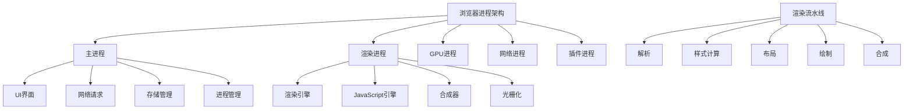

# 浏览器原理与性能优化

深入理解浏览器的工作原理是前端性能优化的基础。本模块从浏览器架构到渲染机制，全面解析现代浏览器的核心技术。

## 🎯 浏览器架构概览



## 🔧 核心模块详解

### 🏗️ 浏览器架构与进程模型

现代浏览器的多进程架构深度解析：

- **进程隔离**：安全性、稳定性、性能优化
- **进程间通信**：IPC机制、消息传递
- **内存管理**：进程内存分配、垃圾回收
- **Site Isolation**：站点隔离安全机制

```javascript
// 浏览器进程监控
class BrowserProcessMonitor {
  // 监控内存使用
  static async getMemoryInfo() {
    if ('memory' in performance) {
      return {
        usedJSHeapSize: performance.memory.usedJSHeapSize,
        totalJSHeapSize: performance.memory.totalJSHeapSize,
        jsHeapSizeLimit: performance.memory.jsHeapSizeLimit
      };
    }
    
    // 使用Memory API (需要权限)
    if ('measureUserAgentSpecificMemory' in performance) {
      try {
        const memoryInfo = await performance.measureUserAgentSpecificMemory();
        return memoryInfo;
      } catch (error) {
        console.warn('Memory measurement not available:', error);
      }
    }
    
    return null;
  }
  
  // 监控渲染性能
  static observeRenderingPerformance() {
    const observer = new PerformanceObserver((list) => {
      const entries = list.getEntries();
      
      entries.forEach(entry => {
        switch (entry.entryType) {
          case 'paint':
            console.log(`${entry.name}: ${entry.startTime}ms`);
            break;
          case 'largest-contentful-paint':
            console.log(`LCP: ${entry.startTime}ms`);
            break;
          case 'layout-shift':
            console.log(`Layout Shift: ${entry.value}`);
            break;
        }
      });
    });
    
    observer.observe({ 
      entryTypes: ['paint', 'largest-contentful-paint', 'layout-shift'] 
    });
  }
}
```

### 🎨 [渲染引擎深度解析]

浏览器渲染流水线的完整解析：

- **HTML解析**：DOM树构建、增量解析
- **CSS解析**：CSSOM构建、样式计算
- **布局计算**：Reflow机制、几何信息计算
- **绘制与合成**：Paint、Composite层优化

```javascript
// 渲染性能优化实践
class RenderingOptimizer {
  // 避免强制同步布局
  static avoidForcedReflow() {
    const elements = document.querySelectorAll('.item');
    
    // ❌ 错误做法：读写交替导致强制重排
    elements.forEach(el => {
      el.style.left = el.offsetLeft + 10 + 'px'; // 读取offsetLeft触发重排
    });
    
    // ✅ 正确做法：批量读取，批量写入
    const positions = [];
    elements.forEach(el => {
      positions.push(el.offsetLeft); // 批量读取
    });
    
    elements.forEach((el, index) => {
      el.style.left = positions[index] + 10 + 'px'; // 批量写入
    });
  }
  
  // 使用DocumentFragment优化DOM操作
  static optimizeDOMManipulation(items) {
    const fragment = document.createDocumentFragment();
    
    items.forEach(item => {
      const element = document.createElement('div');
      element.textContent = item.text;
      element.className = item.className;
      fragment.appendChild(element);
    });
    
    // 一次性插入，只触发一次重排
    document.getElementById('container').appendChild(fragment);
  }
  
  // 使用CSS containment优化
  static enableContainment(element) {
    // 告诉浏览器该元素的子元素不会影响外部布局
    element.style.contain = 'layout style paint';
  }
  
  // 虚拟滚动优化
  static createVirtualScroller(container, items, itemHeight) {
    const containerHeight = container.clientHeight;
    const visibleCount = Math.ceil(containerHeight / itemHeight);
    const totalHeight = items.length * itemHeight;
    
    let scrollTop = 0;
    let startIndex = 0;
    
    const viewport = document.createElement('div');
    viewport.style.height = totalHeight + 'px';
    viewport.style.position = 'relative';
    
    const renderVisibleItems = () => {
      startIndex = Math.floor(scrollTop / itemHeight);
      const endIndex = Math.min(startIndex + visibleCount + 1, items.length);
      
      // 清空现有内容
      viewport.innerHTML = '';
      
      // 渲染可见项
      for (let i = startIndex; i < endIndex; i++) {
        const item = document.createElement('div');
        item.style.position = 'absolute';
        item.style.top = i * itemHeight + 'px';
        item.style.height = itemHeight + 'px';
        item.textContent = items[i];
        viewport.appendChild(item);
      }
    };
    
    container.addEventListener('scroll', () => {
      scrollTop = container.scrollTop;
      renderVisibleItems();
    });
    
    container.appendChild(viewport);
    renderVisibleItems();
  }
}
```

### 🌐 [网络优化与缓存策略]

浏览器网络层的优化策略：

- **HTTP/2与HTTP/3**：多路复用、服务器推送
- **缓存机制**：强缓存、协商缓存、Service Worker
- **资源优化**：压缩、合并、CDN加速
- **预加载策略**：dns-prefetch、preload、prefetch

```javascript
// 网络优化实践
class NetworkOptimizer {
  // 资源预加载管理
  static preloadManager = {
    // DNS预解析
    prefetchDNS(domains) {
      domains.forEach(domain => {
        const link = document.createElement('link');
        link.rel = 'dns-prefetch';
        link.href = `//${domain}`;
        document.head.appendChild(link);
      });
    },
    
    // 资源预加载
    preloadResource(url, as, crossorigin = false) {
      const link = document.createElement('link');
      link.rel = 'preload';
      link.href = url;
      link.as = as;
      if (crossorigin) link.crossOrigin = 'anonymous';
      document.head.appendChild(link);
    },
    
    // 智能预加载
    intelligentPreload() {
      // 基于用户行为预测
      const observer = new IntersectionObserver((entries) => {
        entries.forEach(entry => {
          if (entry.isIntersecting) {
            const link = entry.target.getAttribute('data-preload');
            if (link) {
              this.preloadResource(link, 'fetch');
            }
          }
        });
      }, { rootMargin: '50px' });
      
      document.querySelectorAll('[data-preload]').forEach(el => {
        observer.observe(el);
      });
    }
  };
  
  // Service Worker缓存策略
  static async registerServiceWorker() {
    if ('serviceWorker' in navigator) {
      try {
        const registration = await navigator.serviceWorker.register('/sw.js');
        console.log('SW registered:', registration);
        
        // 监听更新
        registration.addEventListener('updatefound', () => {
          const newWorker = registration.installing;
          newWorker.addEventListener('statechange', () => {
            if (newWorker.state === 'installed' && navigator.serviceWorker.controller) {
              // 新版本可用
              this.showUpdateNotification();
            }
          });
        });
      } catch (error) {
        console.error('SW registration failed:', error);
      }
    }
  }
  
  // 网络状态监控
  static monitorNetworkStatus() {
    const connection = navigator.connection || navigator.mozConnection || navigator.webkitConnection;
    
    if (connection) {
      const updateConnectionStatus = () => {
        console.log('Network type:', connection.effectiveType);
        console.log('Downlink:', connection.downlink);
        console.log('RTT:', connection.rtt);
        
        // 根据网络状况调整策略
        if (connection.effectiveType === 'slow-2g' || connection.effectiveType === '2g') {
          this.enableDataSavingMode();
        } else {
          this.disableDataSavingMode();
        }
      };
      
      connection.addEventListener('change', updateConnectionStatus);
      updateConnectionStatus();
    }
    
    // 监听在线状态
    window.addEventListener('online', () => {
      console.log('Network: online');
      this.syncOfflineData();
    });
    
    window.addEventListener('offline', () => {
      console.log('Network: offline');
      this.enableOfflineMode();
    });
  }
}

// Service Worker示例
// sw.js
const CACHE_NAME = 'app-cache-v1';
const urlsToCache = [
  '/',
  '/static/css/main.css',
  '/static/js/main.js'
];

// 缓存策略：Cache First
self.addEventListener('fetch', event => {
  event.respondWith(
    caches.match(event.request)
      .then(response => {
        // 缓存命中，返回缓存
        if (response) {
          return response;
        }
        
        // 网络请求
        return fetch(event.request).then(response => {
          // 检查响应有效性
          if (!response || response.status !== 200 || response.type !== 'basic') {
            return response;
          }
          
          // 克隆响应用于缓存
          const responseToCache = response.clone();
          
          caches.open(CACHE_NAME)
            .then(cache => {
              cache.put(event.request, responseToCache);
            });
          
          return response;
        });
      })
  );
});
```

### 🔍 性能监控与调试 <!-- [性能监控与调试](./debugging.md) -->

浏览器性能监控和调试技巧：

- **Performance API**：Navigation Timing、Resource Timing
- **Web Vitals**：LCP、FID、CLS核心指标
- **DevTools深度使用**：Performance面板、Memory面板
- **自动化监控**：Lighthouse、WebPageTest集成

```javascript
// 性能监控系统
class PerformanceMonitor {
  constructor() {
    this.metrics = {};
    this.observers = [];
  }
  
  // 初始化监控
  init() {
    this.measureNavigationTiming();
    this.measureWebVitals();
    this.observeResourceTiming();
    this.setupErrorTracking();
  }
  
  // 导航时序监控
  measureNavigationTiming() {
    window.addEventListener('load', () => {
      const navigation = performance.getEntriesByType('navigation')[0];
      
      this.metrics.navigationTiming = {
        // DNS查询时间
        dnsLookup: navigation.domainLookupEnd - navigation.domainLookupStart,
        // TCP连接时间
        tcpConnect: navigation.connectEnd - navigation.connectStart,
        // 请求响应时间
        request: navigation.responseEnd - navigation.requestStart,
        // DOM解析时间
        domParse: navigation.domContentLoadedEventEnd - navigation.responseEnd,
        // 资源加载时间
        resourceLoad: navigation.loadEventEnd - navigation.domContentLoadedEventEnd,
        // 总时间
        total: navigation.loadEventEnd - navigation.navigationStart
      };
      
      this.reportMetrics('navigation', this.metrics.navigationTiming);
    });
  }
  
  // Web Vitals监控
  measureWebVitals() {
    // LCP - 最大内容绘制
    new PerformanceObserver((list) => {
      const entries = list.getEntries();
      const lastEntry = entries[entries.length - 1];
      this.metrics.lcp = lastEntry.startTime;
      this.reportMetrics('lcp', this.metrics.lcp);
    }).observe({ entryTypes: ['largest-contentful-paint'] });
    
    // FID - 首次输入延迟
    new PerformanceObserver((list) => {
      const entries = list.getEntries();
      entries.forEach(entry => {
        this.metrics.fid = entry.processingStart - entry.startTime;
        this.reportMetrics('fid', this.metrics.fid);
      });
    }).observe({ entryTypes: ['first-input'] });
    
    // CLS - 累积布局偏移
    let clsValue = 0;
    new PerformanceObserver((list) => {
      const entries = list.getEntries();
      entries.forEach(entry => {
        if (!entry.hadRecentInput) {
          clsValue += entry.value;
        }
      });
      this.metrics.cls = clsValue;
      this.reportMetrics('cls', this.metrics.cls);
    }).observe({ entryTypes: ['layout-shift'] });
  }
  
  // 资源时序监控
  observeResourceTiming() {
    new PerformanceObserver((list) => {
      const entries = list.getEntries();
      entries.forEach(entry => {
        if (entry.duration > 1000) { // 超过1秒的资源
          this.reportSlowResource({
            name: entry.name,
            duration: entry.duration,
            size: entry.transferSize,
            type: this.getResourceType(entry.name)
          });
        }
      });
    }).observe({ entryTypes: ['resource'] });
  }
  
  // 错误监控
  setupErrorTracking() {
    // JavaScript错误
    window.addEventListener('error', (event) => {
      this.reportError({
        type: 'javascript',
        message: event.message,
        filename: event.filename,
        lineno: event.lineno,
        colno: event.colno,
        stack: event.error?.stack
      });
    });
    
    // Promise未捕获错误
    window.addEventListener('unhandledrejection', (event) => {
      this.reportError({
        type: 'promise',
        message: event.reason?.message || 'Unhandled Promise Rejection',
        stack: event.reason?.stack
      });
    });
    
    // 资源加载错误
    window.addEventListener('error', (event) => {
      if (event.target !== window) {
        this.reportError({
          type: 'resource',
          message: `Failed to load ${event.target.tagName}`,
          source: event.target.src || event.target.href
        });
      }
    }, true);
  }
  
  // 上报指标
  reportMetrics(type, data) {
    // 发送到监控系统
    if (typeof gtag !== 'undefined') {
      gtag('event', 'performance_metric', {
        metric_type: type,
        metric_value: data,
        timestamp: Date.now()
      });
    }
    
    // 或发送到自定义端点
    fetch('/api/metrics', {
      method: 'POST',
      headers: { 'Content-Type': 'application/json' },
      body: JSON.stringify({ type, data, timestamp: Date.now() })
    }).catch(console.error);
  }
  
  // 生成性能报告
  generateReport() {
    return {
      timestamp: Date.now(),
      url: location.href,
      userAgent: navigator.userAgent,
      metrics: this.metrics,
      recommendations: this.generateRecommendations()
    };
  }
  
  generateRecommendations() {
    const recommendations = [];
    
    if (this.metrics.lcp > 2500) {
      recommendations.push('LCP过高，建议优化最大内容元素的加载速度');
    }
    
    if (this.metrics.fid > 100) {
      recommendations.push('FID过高，建议优化JavaScript执行时间');
    }
    
    if (this.metrics.cls > 0.1) {
      recommendations.push('CLS过高，建议为图片和广告预留空间');
    }
    
    return recommendations;
  }
}

// 使用示例
const monitor = new PerformanceMonitor();
monitor.init();

// 定期生成报告
setInterval(() => {
  const report = monitor.generateReport();
  console.log('Performance Report:', report);
}, 30000);
```
