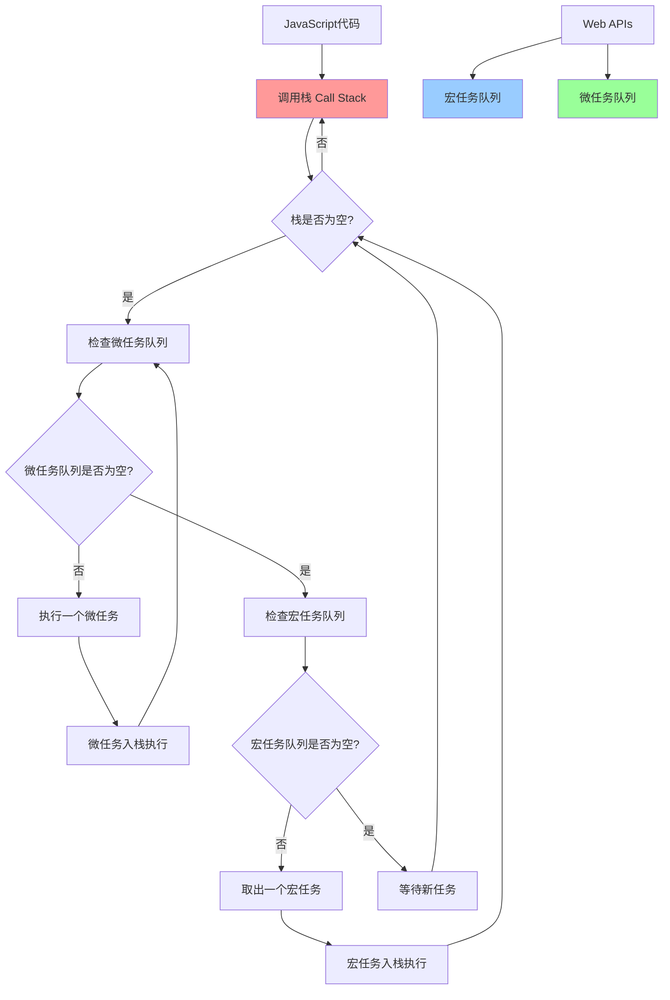

# 事件循环与异步机制

JavaScript的事件循环是理解异步编程的核心概念。详细解析事件循环的工作原理、宏任务和微任务的执行顺序。

## 🔄 事件循环基础概念

### JavaScript单线程特性

JavaScript引擎是单线程的，这意味着同一时间只能执行一个任务。但是，JavaScript可以通过事件循环机制来处理异步操作，让程序看起来像是在"同时"处理多个任务。

理解这个概念的关键在于：**同步代码会立即执行，而异步代码会被放入任务队列中等待执行**。即使setTimeout的延迟时间设置为0，它也不会立即执行，而是会等到当前同步代码执行完毕后才执行。

```javascript
// JavaScript是单线程的，但可以处理异步操作
console.log('开始执行');

setTimeout(() => {
    console.log('异步操作完成');
}, 0);

console.log('同步代码继续执行');

// 输出顺序：
// 开始执行
// 同步代码继续执行
// 异步操作完成
```

从上面的例子可以看出，尽管setTimeout的延迟时间是0毫秒，但"异步操作完成"仍然在"同步代码继续执行"之后输出。这就是事件循环机制的体现。

### 事件循环架构图

事件循环是JavaScript异步编程的核心机制。它负责协调调用栈、任务队列和Web APIs之间的工作。下面的流程图展示了事件循环的完整工作流程：

**关键组件说明：**

- **调用栈（Call Stack）**：存放当前正在执行的函数
- **宏任务队列**：存放setTimeout、setInterval等宏任务
- **微任务队列**：存放Promise.then、queueMicrotask等微任务
- **Web APIs**：浏览器提供的异步API接口



## 📋 调用栈（Call Stack）

### 调用栈工作原理

调用栈是JavaScript引擎用来跟踪函数调用的数据结构。它遵循"后进先出"（LIFO）的原则，就像一摞盘子一样，最后放上去的盘子最先被拿走。

当函数被调用时，它会被推入调用栈的顶部；当函数执行完毕时，它会从栈顶被移除。这个机制确保了函数能够按照正确的顺序执行和返回。

```javascript
// 调用栈示例
function first() {
    console.log('first函数开始');
    second();
    console.log('first函数结束');
}

function second() {
    console.log('second函数开始');
    third();
    console.log('second函数结束');
}

function third() {
    console.log('third函数执行');
}

first();

// 调用栈变化过程：
// 1. first() 入栈
// 2. second() 入栈
// 3. third() 入栈
// 4. third() 出栈
// 5. second() 出栈
// 6. first() 出栈
```

从上面的例子可以看出，函数调用的顺序是first → second → third，但执行完毕的顺序是third → second → first，这正体现了调用栈的"后进先出"特性。

### 栈溢出示例

当调用栈中的函数调用层数过多时，会导致栈溢出错误。这通常发生在无限递归或递归层数过深的情况下。

**栈溢出的原因：** 每次函数调用都会在调用栈中占用一定的内存空间，如果递归调用没有合适的终止条件，调用栈会不断增长，最终超出浏览器或JavaScript引擎的内存限制。

```javascript
// 栈溢出错误
function recursiveFunction() {
    console.log('递归调用');
    recursiveFunction(); // 无限递归
}

// recursiveFunction(); // 会导致 "Maximum call stack size exceeded"

// 正确的递归写法
function safeRecursive(count = 0) {
    if (count > 1000) return; // 设置终止条件
    console.log('安全递归:', count);
    safeRecursive(count + 1);
}

safeRecursive();
```

**避免栈溢出的方法：**

1. 确保递归函数有明确的终止条件
2. 限制递归的最大深度
3. 对于深层递归，考虑使用循环或尾递归优化

## 🔄 宏任务（Macro Tasks）

### 宏任务类型

宏任务（Macro Tasks）是事件循环中优先级较低的任务类型。它们通常由浏览器或Node.js环境提供的API产生，在微任务队列清空后才会被执行。

**常见的宏任务类型包括：**

- **setTimeout/setInterval**：定时器任务，最常见的宏任务
- **I/O操作**：文件读取、网络请求等
- **UI渲染**：浏览器的页面渲染和重绘
- **用户交互事件**：点击、键盘输入等事件回调

```javascript
// 1. setTimeout - 最常见的宏任务
setTimeout(() => {
    console.log('setTimeout 宏任务');
}, 0);

// 2. setInterval
const intervalId = setInterval(() => {
    console.log('setInterval 宏任务');
    clearInterval(intervalId); // 清除定时器
}, 100);

// 3. setImmediate (Node.js环境)
if (typeof setImmediate !== 'undefined') {
    setImmediate(() => {
        console.log('setImmediate 宏任务');
    });
}

// 4. I/O操作
// 文件读取、网络请求等

// 5. UI渲染相关
// requestAnimationFrame (浏览器环境)
if (typeof requestAnimationFrame !== 'undefined') {
    requestAnimationFrame(() => {
        console.log('requestAnimationFrame');
    });
}
```

**重要提示：** 即使setTimeout的延迟时间设置为0，它也不会立即执行，而是会被放入宏任务队列中，等待当前执行栈清空和微任务队列清空后才执行。

### 宏任务执行时机

宏任务的执行遵循严格的优先级规则：**同步代码 → 微任务 → 宏任务**。这个执行顺序是事件循环机制的核心。

**执行优先级说明：**

1. **同步代码**：立即执行，优先级最高
2. **微任务**：在当前宏任务执行完毕后立即执行
3. **宏任务**：在微任务队列清空后才执行

```javascript
console.log('=== 宏任务执行顺序测试 ===');

// 立即执行
console.log('1. 同步代码');

// 宏任务1
setTimeout(() => {
    console.log('4. setTimeout 0ms');
}, 0);

// 宏任务2
setTimeout(() => {
    console.log('5. setTimeout 10ms');
}, 10);

// 同步代码
console.log('2. 同步代码继续');

// 微任务
Promise.resolve().then(() => {
    console.log('3. Promise微任务');
});

// 输出顺序：
// 1. 同步代码
// 2. 同步代码继续
// 3. Promise微任务
// 4. setTimeout 0ms
// 5. setTimeout 10ms
```

从这个例子可以清楚地看到，即使setTimeout的延迟时间是0毫秒，它仍然在Promise微任务之后执行。这证明了微任务的优先级高于宏任务。

## ⚡ 微任务（Micro Tasks）

### 微任务类型

微任务（Micro Tasks）是事件循环中优先级最高的异步任务。它们会在当前宏任务执行完毕后立即执行，且会清空整个微任务队列后才执行下一个宏任务。

**常见的微任务类型：**

- **Promise.then/catch/finally**：最常见的微任务
- **async/await**：本质上是Promise的语法糖
- **queueMicrotask**：直接创建微任务的API
- **MutationObserver**：DOM变化监听器（浏览器环境）
- **process.nextTick**：Node.js环境中优先级最高的微任务

```javascript
// 1. Promise.then/catch/finally
Promise.resolve('Promise微任务1').then(value => {
    console.log(value);
});

// 2. async/await (本质上是Promise)
async function asyncFunction() {
    console.log('async函数开始');
    await Promise.resolve();
    console.log('await后的代码 - 微任务');
}
asyncFunction();

// 3. queueMicrotask
queueMicrotask(() => {
    console.log('queueMicrotask微任务');
});

// 4. MutationObserver (浏览器环境)
if (typeof MutationObserver !== 'undefined') {
    const observer = new MutationObserver(() => {
        console.log('MutationObserver微任务');
    });

    const div = document.createElement('div');
    observer.observe(div, { childList: true });
    div.appendChild(document.createElement('span'));
}

// 5. process.nextTick (Node.js环境，优先级最高)
if (typeof process !== 'undefined' && process.nextTick) {
    process.nextTick(() => {
        console.log('process.nextTick微任务');
    });
}
```

**重要特性：** 微任务会在当前执行栈清空后立即执行，并且会一次性清空整个微任务队列，这意味着如果微任务中又产生了新的微任务，新的微任务也会在当前轮次中执行。

### 微任务执行特点

微任务有一个非常重要的特性：**它们会在每个宏任务执行完毕后立即执行，并且会一次性清空整个微任务队列**。这意味着：

1. **立即执行**：微任务不会等待，会在当前宏任务结束后立即执行
2. **批量清空**：所有微任务会在下一个宏任务开始前全部执行完毕
3. **可以产生新微任务**：微任务执行过程中产生的新微任务也会在当前轮次中执行

```javascript
console.log('=== 微任务执行特点 ===');

// 微任务会在当前宏任务执行完毕后立即执行
setTimeout(() => {
    console.log('宏任务1开始');

    // 在宏任务中创建微任务
    Promise.resolve().then(() => {
        console.log('宏任务1中的微任务1');
    });

    Promise.resolve().then(() => {
        console.log('宏任务1中的微任务2');
    });

    console.log('宏任务1结束');
}, 0);

setTimeout(() => {
    console.log('宏任务2执行');
}, 0);

// 输出顺序：
// 宏任务1开始
// 宏任务1结束
// 宏任务1中的微任务1
// 宏任务1中的微任务2
// 宏任务2执行
```

从这个例子可以看出，宏任务1中创建的微任务会在宏任务1执行完毕后立即执行，然后才会执行宏任务2。这就是微任务的"插队"特性。

## 🔍 事件循环详细流程

### 完整执行流程

```javascript
console.log('=== 事件循环完整流程演示 ===');

// 1. 同步代码
console.log('1. 同步代码开始');

// 2. 宏任务
setTimeout(() => {
    console.log('7. 第一个setTimeout');
    
    // 在宏任务中添加微任务
    Promise.resolve().then(() => {
        console.log('8. 第一个setTimeout中的Promise');
    });
}, 0);

// 3. 微任务
Promise.resolve().then(() => {
    console.log('4. 第一个Promise');
    
    // 微任务中添加微任务
    return Promise.resolve();
}).then(() => {
    console.log('5. 第二个Promise');
});

// 4. 更多宏任务
setTimeout(() => {
    console.log('9. 第二个setTimeout');
}, 0);

// 5. 更多微任务
queueMicrotask(() => {
    console.log('6. queueMicrotask');
});

// 6. 同步代码
console.log('2. 同步代码继续');

// 7. 更多同步代码
for (let i = 0; i < 2; i++) {
    console.log(`3. 循环 ${i}`);
}

// 完整输出顺序：
// 1. 同步代码开始
// 2. 同步代码继续  
// 3. 循环 0
// 3. 循环 1
// 4. 第一个Promise
// 5. 第二个Promise
// 6. queueMicrotask
// 7. 第一个setTimeout
// 8. 第一个setTimeout中的Promise
// 9. 第二个setTimeout
```

### 事件循环步骤详解

```javascript
// 事件循环的详细步骤
function eventLoopDemo() {
    console.log('=== 事件循环步骤详解 ===');
    
    // 步骤1：执行同步代码
    console.log('步骤1: 执行同步代码');
    
    // 步骤2：将异步任务分发到对应队列
    setTimeout(() => {
        console.log('步骤4: 执行宏任务');
        
        // 步骤5：宏任务执行过程中产生的微任务
        Promise.resolve().then(() => {
            console.log('步骤5: 宏任务中的微任务');
        });
    }, 0);
    
    // 步骤3：同步代码执行完毕后，执行微任务队列
    Promise.resolve().then(() => {
        console.log('步骤3: 执行微任务队列');
    });
    
    console.log('步骤2: 同步代码执行完毕');
}

eventLoopDemo();
```

## 🎯 实际应用场景

### Promise链式调用

```javascript
console.log('=== Promise链式调用与事件循环 ===');

Promise.resolve()
    .then(() => {
        console.log('Promise 1');
        return Promise.resolve();
    })
    .then(() => {
        console.log('Promise 2');
        
        // 在Promise中添加宏任务
        setTimeout(() => {
            console.log('Promise中的setTimeout');
        }, 0);
    })
    .then(() => {
        console.log('Promise 3');
    });

setTimeout(() => {
    console.log('外部setTimeout');
}, 0);

// 输出顺序：
// Promise 1
// Promise 2  
// Promise 3
// 外部setTimeout
// Promise中的setTimeout
```

### async/await与事件循环

```javascript
console.log('=== async/await与事件循环 ===');

async function asyncDemo() {
    console.log('async函数开始');
    
    // await会暂停函数执行，将后续代码作为微任务
    await Promise.resolve();
    console.log('await后的代码1');
    
    await Promise.resolve();
    console.log('await后的代码2');
    
    // 在async函数中添加宏任务
    setTimeout(() => {
        console.log('async函数中的setTimeout');
    }, 0);
    
    console.log('async函数结束');
}

console.log('调用async函数前');
asyncDemo();
console.log('调用async函数后');

setTimeout(() => {
    console.log('外部setTimeout');
}, 0);

// 输出顺序：
// 调用async函数前
// async函数开始
// 调用async函数后
// await后的代码1
// await后的代码2
// async函数结束
// 外部setTimeout
// async函数中的setTimeout
```

### 错误处理与事件循环

```javascript
console.log('=== 错误处理与事件循环 ===');

// Promise错误处理
Promise.reject('Promise错误')
    .catch(error => {
        console.log('捕获Promise错误:', error);
        
        // 在错误处理中添加异步任务
        setTimeout(() => {
            console.log('错误处理中的setTimeout');
        }, 0);
    });

// async/await错误处理
async function errorDemo() {
    try {
        await Promise.reject('async错误');
    } catch (error) {
        console.log('捕获async错误:', error);
        
        // 错误处理后的正常流程
        await Promise.resolve();
        console.log('错误处理后继续执行');
    }
}

errorDemo();

setTimeout(() => {
    console.log('外部setTimeout');
}, 0);
```

## 🔧 调试技巧

### 可视化事件循环

```javascript
// 事件循环可视化工具函数
function visualizeEventLoop(label) {
    console.log(`\n=== ${label} ===`);
    
    console.log('📝 同步代码:', label);
    
    setTimeout(() => {
        console.log('🔄 宏任务:', label);
    }, 0);
    
    Promise.resolve().then(() => {
        console.log('⚡ 微任务:', label);
    });
    
    queueMicrotask(() => {
        console.log('🚀 queueMicrotask:', label);
    });
}

// 使用可视化工具
visualizeEventLoop('第一轮');
visualizeEventLoop('第二轮');
```

### 性能监控

```javascript
// 事件循环性能监控
function performanceMonitor() {
    const start = performance.now();
    
    // 模拟大量同步计算
    let sum = 0;
    for (let i = 0; i < 1000000; i++) {
        sum += i;
    }
    
    const syncEnd = performance.now();
    console.log(`同步代码执行时间: ${syncEnd - start}ms`);
    
    // 异步任务
    setTimeout(() => {
        const asyncEnd = performance.now();
        console.log(`异步任务执行时间: ${asyncEnd - start}ms`);
    }, 0);
    
    Promise.resolve().then(() => {
        const microEnd = performance.now();
        console.log(`微任务执行时间: ${microEnd - start}ms`);
    });
}

performanceMonitor();
```

## 🚀 最佳实践

### 避免阻塞事件循环

```javascript
// ❌ 错误做法：长时间同步操作
function badPractice() {
    console.log('开始长时间计算');
    let result = 0;
    for (let i = 0; i < 10000000; i++) {
        result += Math.random();
    }
    console.log('计算完成:', result);
}

// ✅ 正确做法：分批处理
function goodPractice(data, batchSize = 1000) {
    return new Promise((resolve) => {
        let index = 0;
        let result = 0;
        
        function processBatch() {
            const endIndex = Math.min(index + batchSize, data.length);
            
            for (let i = index; i < endIndex; i++) {
                result += data[i];
            }
            
            index = endIndex;
            
            if (index < data.length) {
                // 让出控制权，避免阻塞
                setTimeout(processBatch, 0);
            } else {
                resolve(result);
            }
        }
        
        processBatch();
    });
}

// 使用示例
const largeArray = Array.from({length: 1000000}, () => Math.random());
goodPractice(largeArray).then(result => {
    console.log('分批处理完成:', result);
});
```

### 合理使用微任务

```javascript
// 微任务使用最佳实践
class TaskScheduler {
    constructor() {
        this.tasks = [];
        this.isProcessing = false;
    }
    
    addTask(task) {
        this.tasks.push(task);
        this.processTasks();
    }
    
    processTasks() {
        if (this.isProcessing) return;
        
        this.isProcessing = true;
        
        // 使用微任务批量处理
        queueMicrotask(() => {
            while (this.tasks.length > 0) {
                const task = this.tasks.shift();
                try {
                    task();
                } catch (error) {
                    console.error('任务执行错误:', error);
                }
            }
            this.isProcessing = false;
        });
    }
}

// 使用示例
const scheduler = new TaskScheduler();
scheduler.addTask(() => console.log('任务1'));
scheduler.addTask(() => console.log('任务2'));
scheduler.addTask(() => console.log('任务3'));
```

## 📚 总结

事件循环是JavaScript异步编程的核心机制，理解它对于编写高质量的JavaScript代码至关重要：

### 🎯 核心要点

- **单线程特性**：JavaScript主线程是单线程的，但通过事件循环实现异步处理
- **任务队列**：宏任务和微任务有不同的执行优先级，微任务总是优先执行
- **执行顺序**：同步代码 → 微任务队列 → 宏任务队列 → 渲染
- **性能影响**：长时间的同步操作会阻塞事件循环，影响用户体验

### 💡 最佳实践

1. **避免阻塞**：将大量计算分批处理，使用setTimeout让出控制权
2. **合理使用微任务**：Promise和queueMicrotask适合处理高优先级的异步任务
3. **性能监控**：使用Performance API监控事件循环性能
4. **错误处理**：在异步操作中正确处理错误，避免未捕获的Promise rejection

### 🚀 实际应用

- **用户界面响应**：确保UI操作不被长时间计算阻塞
- **数据处理**：大量数据的分批处理和渐进式加载
- **动画优化**：使用requestAnimationFrame优化动画性能
- **API调用**：合理组织异步API调用的执行顺序
