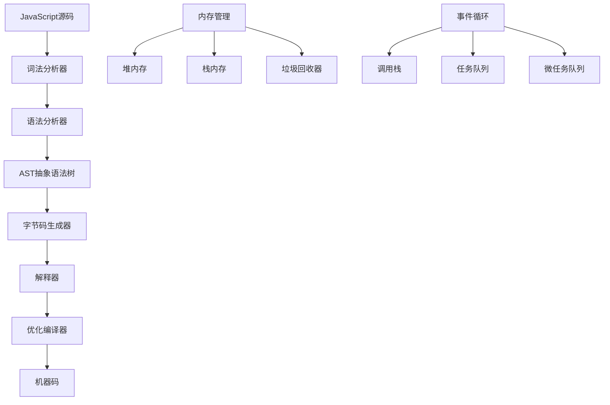

# JavaScript 核心原理深度解析

JavaScript作为现代Web开发的核心语言，其底层机制和高级特性值得深入探索。本模块从引擎原理到性能优化，全面解析JavaScript的核心技术。

## 🎯 JavaScript引擎架构



## 🔧 核心模块详解

### 🚀 JavaScript引擎机制 <!-- [JavaScript引擎机制](./engine.md) -->

深入V8引擎的工作原理：

- **编译流水线**：词法分析、语法分析、字节码生成
- **执行优化**：TurboFan优化编译器、内联缓存
- **内存布局**：对象表示、隐藏类、形状优化
- **JIT编译**：即时编译策略和性能调优

```javascript
// V8引擎优化示例
class Point {
  constructor(x, y) {
    this.x = x  // 隐藏类优化
    this.y = y  // 保持属性添加顺序
  }
}

// 优化友好的代码
function addPoints(p1, p2) {
  return new Point(p1.x + p2.x, p1.y + p2.y)
}

// 避免形状变化
const points = []
for (let i = 0; i < 1000; i++) {
  points.push(new Point(i, i * 2)) // 单态调用点
}
```

### 🧠 内存管理与垃圾回收 <!-- [内存管理与垃圾回收](./memory.md) -->

JavaScript内存管理的深度解析：

- **内存分配**：栈内存vs堆内存、对象生命周期
- **垃圾回收算法**：标记清除、引用计数、分代回收
- **内存泄漏**：常见场景、检测工具、预防策略
- **性能优化**：对象池、内存复用、WeakMap/WeakSet

```javascript
// 内存优化实践
class ObjectPool {
  constructor(createFn, resetFn, initialSize = 10) {
    this.createFn = createFn
    this.resetFn = resetFn
    this.pool = []
    
    // 预分配对象
    for (let i = 0; i < initialSize; i++) {
      this.pool.push(this.createFn())
    }
  }
  
  acquire() {
    return this.pool.length > 0 
      ? this.pool.pop() 
      : this.createFn()
  }
  
  release(obj) {
    this.resetFn(obj)
    this.pool.push(obj)
  }
}

// 使用对象池避免频繁GC
const pointPool = new ObjectPool(
  () => ({ x: 0, y: 0 }),
  (point) => { point.x = 0; point.y = 0 }
)
```

### ⚡ 异步编程深度解析 <!-- [异步编程深度解析](./async.md) -->

事件循环和异步机制的完整解析：

- **事件循环机制**：调用栈、任务队列、微任务队列
- **Promise实现原理**：状态机、链式调用、错误处理
- **async/await原理**：生成器函数、协程、异常传播
- **并发控制**：限流、批处理、取消机制

```javascript
// 手写Promise实现
class MyPromise {
  constructor(executor) {
    this.state = 'pending'
    this.value = undefined
    this.reason = undefined
    this.onFulfilledCallbacks = []
    this.onRejectedCallbacks = []
    
    const resolve = (value) => {
      if (this.state === 'pending') {
        this.state = 'fulfilled'
        this.value = value
        this.onFulfilledCallbacks.forEach(fn => fn())
      }
    }
    
    const reject = (reason) => {
      if (this.state === 'pending') {
        this.state = 'rejected'
        this.reason = reason
        this.onRejectedCallbacks.forEach(fn => fn())
      }
    }
    
    try {
      executor(resolve, reject)
    } catch (error) {
      reject(error)
    }
  }
  
  then(onFulfilled, onRejected) {
    return new MyPromise((resolve, reject) => {
      const handleFulfilled = () => {
        try {
          const result = onFulfilled(this.value)
          resolve(result)
        } catch (error) {
          reject(error)
        }
      }
      
      const handleRejected = () => {
        try {
          const result = onRejected(this.reason)
          resolve(result)
        } catch (error) {
          reject(error)
        }
      }
      
      if (this.state === 'fulfilled') {
        setTimeout(handleFulfilled, 0)
      } else if (this.state === 'rejected') {
        setTimeout(handleRejected, 0)
      } else {
        this.onFulfilledCallbacks.push(handleFulfilled)
        this.onRejectedCallbacks.push(handleRejected)
      }
    })
  }
}
```

### 🎨 函数式编程实践 <!-- [函数式编程实践](./functional.md) -->

JavaScript中的函数式编程范式：

- **纯函数与副作用**：函数式编程基础
- **高阶函数**：柯里化、偏应用、组合函数
- **不可变数据**：Immutable.js、结构共享
- **函数式工具库**：Lodash/FP、Ramda实践

```javascript
// 函数式编程工具
const curry = (fn) => {
  return function curried(...args) {
    if (args.length >= fn.length) {
      return fn.apply(this, args)
    } else {
      return function(...args2) {
        return curried.apply(this, args.concat(args2))
      }
    }
  }
}

const compose = (...fns) => (value) => 
  fns.reduceRight((acc, fn) => fn(acc), value)

const pipe = (...fns) => (value) => 
  fns.reduce((acc, fn) => fn(acc), value)

// 实际应用
const add = curry((a, b) => a + b)
const multiply = curry((a, b) => a * b)
const subtract = curry((a, b) => a - b)

const addTen = add(10)
const multiplyByTwo = multiply(2)

const transform = pipe(
  addTen,
  multiplyByTwo,
  subtract(5)
)

console.log(transform(5)) // (5 + 10) * 2 - 5 = 25
```

### 🔍 性能优化深度实践 <!-- [性能优化深度实践](./performance.md) -->

JavaScript性能优化的系统方法：

- **代码层面优化**：算法复杂度、数据结构选择
- **运行时优化**：JIT友好代码、避免去优化
- **内存优化**：减少分配、复用对象、及时释放
- **异步优化**：批处理、防抖节流、Web Workers

```javascript
// 性能优化实例
class PerformanceOptimizer {
  // 批处理优化
  static batchProcess(items, batchSize = 1000) {
    return new Promise((resolve) => {
      let index = 0
      const results = []
      
      function processBatch() {
        const endIndex = Math.min(index + batchSize, items.length)
        
        for (let i = index; i < endIndex; i++) {
          results.push(processItem(items[i]))
        }
        
        index = endIndex
        
        if (index < items.length) {
          // 让出控制权，避免阻塞UI
          setTimeout(processBatch, 0)
        } else {
          resolve(results)
        }
      }
      
      processBatch()
    })
  }
  
  // 防抖优化
  static debounce(func, wait) {
    let timeout
    return function executedFunction(...args) {
      const later = () => {
        clearTimeout(timeout)
        func(...args)
      }
      clearTimeout(timeout)
      timeout = setTimeout(later, wait)
    }
  }
  
  // 节流优化
  static throttle(func, limit) {
    let inThrottle
    return function(...args) {
      if (!inThrottle) {
        func.apply(this, args)
        inThrottle = true
        setTimeout(() => inThrottle = false, limit)
      }
    }
  }
}
```

## 🎯 高级特性解析

### ES6+现代特性

```javascript
// 代理与反射
const createObservable = (target, onChange) => {
  return new Proxy(target, {
    set(obj, prop, value) {
      const oldValue = obj[prop]
      obj[prop] = value
      onChange(prop, oldValue, value)
      return true
    },
    
    get(obj, prop) {
      if (typeof obj[prop] === 'object' && obj[prop] !== null) {
        return createObservable(obj[prop], onChange)
      }
      return obj[prop]
    }
  })
}

// 生成器与迭代器
function* fibonacci() {
  let [prev, curr] = [0, 1]
  while (true) {
    yield curr
    ;[prev, curr] = [curr, prev + curr]
  }
}

// 异步生成器
async function* fetchPages(urls) {
  for (const url of urls) {
    const response = await fetch(url)
    yield await response.json()
  }
}
```

### 模块系统深度解析

```javascript
// ES模块的循环依赖处理
// a.js
import { b } from './b.js'
export const a = 'a'
console.log('a.js:', b)

// b.js  
import { a } from './a.js'
export const b = 'b'
console.log('b.js:', a) // undefined，因为a还未初始化

// 动态导入优化
const loadModule = async (moduleName) => {
  const moduleCache = new Map()
  
  if (moduleCache.has(moduleName)) {
    return moduleCache.get(moduleName)
  }
  
  const module = await import(moduleName)
  moduleCache.set(moduleName, module)
  return module
}
```

## 🛠️ 调试与分析工具

### 性能分析

```javascript
// 性能监控工具
class PerformanceMonitor {
  static measure(name, fn) {
    const start = performance.now()
    const result = fn()
    const end = performance.now()
    
    console.log(`${name}: ${end - start}ms`)
    return result
  }
  
  static async measureAsync(name, asyncFn) {
    const start = performance.now()
    const result = await asyncFn()
    const end = performance.now()
    
    console.log(`${name}: ${end - start}ms`)
    return result
  }
  
  static profile(target, methods) {
    methods.forEach(method => {
      const original = target[method]
      target[method] = function(...args) {
        return PerformanceMonitor.measure(
          `${target.constructor.name}.${method}`,
          () => original.apply(this, args)
        )
      }
    })
  }
}

// 内存使用监控
class MemoryMonitor {
  static getMemoryUsage() {
    if (performance.memory) {
      return {
        used: Math.round(performance.memory.usedJSHeapSize / 1048576),
        total: Math.round(performance.memory.totalJSHeapSize / 1048576),
        limit: Math.round(performance.memory.jsHeapSizeLimit / 1048576)
      }
    }
    return null
  }
  
  static trackMemoryLeaks() {
    const baseline = this.getMemoryUsage()
    
    return () => {
      const current = this.getMemoryUsage()
      if (current && baseline) {
        const diff = current.used - baseline.used
        console.log(`Memory change: ${diff}MB`)
      }
    }
  }
}
```

JavaScript的深度理解需要从底层机制到高级应用的全面掌握，这些知识将帮助你写出更高效、更可维护的代码。
