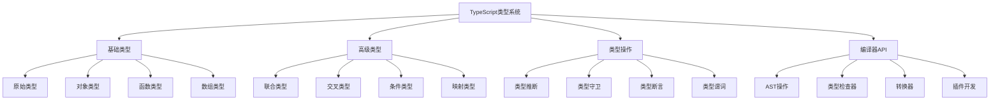

# TypeScript 高级类型编程

TypeScript不仅仅是JavaScript的类型注解，更是一门强大的类型编程语言。本模块深入探讨TypeScript的高级特性和类型体操技巧。

## 🎯 TypeScript类型系统概览



## 🔧 核心模块详解

### 🎨 [高级类型系统](./advanced-types.md)

TypeScript高级类型的深度解析：

- **条件类型**：类型级别的三元运算符
- **映射类型**：基于现有类型创建新类型
- **模板字面量类型**：字符串操作的类型化
- **递归类型**：自引用类型定义

```typescript
// 条件类型高级应用
type IsArray<T> = T extends readonly unknown[] ? true : false
type IsFunction<T> = T extends (...args: any[]) => any ? true : false
type IsPromise<T> = T extends Promise<any> ? true : false

// 分布式条件类型
type ToArray<T> = T extends any ? T[] : never
type StringOrNumberArray = ToArray<string | number> // string[] | number[]

// 条件类型推断
type GetReturnType<T> = T extends (...args: any[]) => infer R ? R : never
type GetPromiseType<T> = T extends Promise<infer U> ? U : never
type GetArrayType<T> = T extends (infer U)[] ? U : never

// 递归条件类型
type DeepReadonly<T> = {
  readonly [P in keyof T]: T[P] extends object 
    ? T[P] extends Function 
      ? T[P] 
      : DeepReadonly<T[P]>
    : T[P]
}

// 映射类型高级技巧
type Getters<T> = {
  [K in keyof T as `get${Capitalize<string & K>}`]: () => T[K]
}

type Setters<T> = {
  [K in keyof T as `set${Capitalize<string & K>}`]: (value: T[K]) => void
}

type Proxify<T> = Getters<T> & Setters<T>

// 模板字面量类型
type EventName<T extends string> = `on${Capitalize<T>}`
type HTTPMethod = 'GET' | 'POST' | 'PUT' | 'DELETE'
type APIEndpoint<T extends string> = `api/${T}`

// 字符串操作类型
type Split<S extends string, D extends string> = 
  S extends `${infer T}${D}${infer U}` 
    ? [T, ...Split<U, D>] 
    : [S]

type Join<T extends readonly string[], D extends string> = 
  T extends readonly [infer F, ...infer R]
    ? F extends string
      ? R extends readonly string[]
        ? R['length'] extends 0
          ? F
          : `${F}${D}${Join<R, D>}`
        : never
      : never
    : ''

// 实际应用示例
interface User {
  id: number
  name: string
  email: string
  profile: {
    avatar: string
    bio: string
  }
}

type UserGetters = Getters<User>
type UserSetters = Setters<User>
type ReadonlyUser = DeepReadonly<User>

// 使用示例
const userProxy: Proxify<User> = {
  getId: () => 1,
  getName: () => 'John',
  getEmail: () => 'john@example.com',
  getProfile: () => ({ avatar: '', bio: '' }),
  setId: (value: number) => {},
  setName: (value: string) => {},
  setEmail: (value: string) => {},
  setProfile: (value: { avatar: string; bio: string }) => {}
}
```

### 🧠 类型体操与工具类型 <!-- [类型体操与工具类型](./type-gymnastics.md) -->

TypeScript类型编程的高级技巧：

- **类型运算**：类型级别的逻辑运算
- **元组操作**：数组类型的高级操作
- **对象操作**：键值对的类型变换
- **函数类型操作**：参数和返回值的类型处理

```typescript
// 类型级别的数学运算
type Length<T extends readonly any[]> = T['length']
type Head<T extends readonly any[]> = T extends readonly [infer H, ...any[]] ? H : never
type Tail<T extends readonly any[]> = T extends readonly [any, ...infer T] ? T : []
type Last<T extends readonly any[]> = T extends readonly [...any[], infer L] ? L : never

// 类型级别的逻辑运算
type And<A extends boolean, B extends boolean> = A extends true 
  ? B extends true 
    ? true 
    : false 
  : false

type Or<A extends boolean, B extends boolean> = A extends true 
  ? true 
  : B extends true 
    ? true 
    : false

type Not<A extends boolean> = A extends true ? false : true

// 数组操作工具类型
type Reverse<T extends readonly any[]> = T extends readonly [...infer Rest, infer Last]
  ? [Last, ...Reverse<Rest>]
  : []

type Concat<A extends readonly any[], B extends readonly any[]> = [...A, ...B]

type Flatten<T extends readonly any[]> = T extends readonly [infer First, ...infer Rest]
  ? First extends readonly any[]
    ? [...Flatten<First>, ...Flatten<Rest>]
    : [First, ...Flatten<Rest>]
  : []

// 对象操作工具类型
type PickByType<T, U> = {
  [K in keyof T as T[K] extends U ? K : never]: T[K]
}

type OmitByType<T, U> = {
  [K in keyof T as T[K] extends U ? never : K]: T[K]
}

type RequiredKeys<T> = {
  [K in keyof T]-?: {} extends Pick<T, K> ? never : K
}[keyof T]

type OptionalKeys<T> = {
  [K in keyof T]-?: {} extends Pick<T, K> ? K : never
}[keyof T]

type Mutable<T> = {
  -readonly [P in keyof T]: T[P]
}

type DeepMutable<T> = {
  -readonly [P in keyof T]: T[P] extends object ? DeepMutable<T[P]> : T[P]
}

// 函数类型操作
type Parameters<T extends (...args: any) => any> = T extends (...args: infer P) => any ? P : never
type ReturnType<T extends (...args: any) => any> = T extends (...args: any) => infer R ? R : any

type Curry<T> = T extends (...args: infer A) => infer R
  ? A extends [infer First, ...infer Rest]
    ? (arg: First) => Rest extends []
      ? R
      : Curry<(...args: Rest) => R>
    : () => R
  : never

// 高级工具类型实现
type DeepPartial<T> = {
  [P in keyof T]?: T[P] extends object ? DeepPartial<T[P]> : T[P]
}

type DeepRequired<T> = {
  [P in keyof T]-?: T[P] extends object ? DeepRequired<T[P]> : T[P]
}

type Paths<T> = T extends object
  ? {
      [K in keyof T]: K extends string
        ? T[K] extends object
          ? K | `${K}.${Paths<T[K]>}`
          : K
        : never
    }[keyof T]
  : never

type PathValue<T, P extends string> = P extends `${infer K}.${infer Rest}`
  ? K extends keyof T
    ? PathValue<T[K], Rest>
    : never
  : P extends keyof T
    ? T[P]
    : never

// 实际应用示例
interface ComplexObject {
  user: {
    profile: {
      name: string
      age: number
      settings: {
        theme: 'light' | 'dark'
        notifications: boolean
      }
    }
    permissions: string[]
  }
  data: number[]
}

type ObjectPaths = Paths<ComplexObject>
// "user" | "data" | "user.profile" | "user.permissions" | "user.profile.name" | ...

type UserName = PathValue<ComplexObject, 'user.profile.name'> // string
type Theme = PathValue<ComplexObject, 'user.profile.settings.theme'> // 'light' | 'dark'

// 类型安全的深度访问
function get<T, P extends Paths<T>>(obj: T, path: P): PathValue<T, P> {
  return path.split('.').reduce((current: any, key) => current?.[key], obj)
}

const complexObj: ComplexObject = {
  user: {
    profile: {
      name: 'John',
      age: 30,
      settings: {
        theme: 'dark',
        notifications: true
      }
    },
    permissions: ['read', 'write']
  },
  data: [1, 2, 3]
}

const userName = get(complexObj, 'user.profile.name') // 类型为 string
const theme = get(complexObj, 'user.profile.settings.theme') // 类型为 'light' | 'dark'
```

### 🔍 编译器API与插件开发 <!-- [编译器API与插件开发](./compiler-api.md) -->

TypeScript编译器的深度应用：

- **AST操作**：抽象语法树的遍历和修改
- **类型检查器**：自定义类型检查规则
- **转换器**：代码转换和生成
- **Language Service**：编辑器集成

```typescript
// TypeScript编译器API使用
import * as ts from 'typescript'

// AST遍历器
class ASTVisitor {
  visit(node: ts.Node): ts.Node {
    switch (node.kind) {
      case ts.SyntaxKind.FunctionDeclaration:
        return this.visitFunctionDeclaration(node as ts.FunctionDeclaration)
      case ts.SyntaxKind.ClassDeclaration:
        return this.visitClassDeclaration(node as ts.ClassDeclaration)
      default:
        return ts.visitEachChild(node, child => this.visit(child), undefined)
    }
  }
  
  visitFunctionDeclaration(node: ts.FunctionDeclaration): ts.Node {
    // 为函数添加日志
    const logStatement = ts.factory.createExpressionStatement(
      ts.factory.createCallExpression(
        ts.factory.createPropertyAccessExpression(
          ts.factory.createIdentifier('console'),
          ts.factory.createIdentifier('log')
        ),
        undefined,
        [ts.factory.createStringLiteral(`Calling function: ${node.name?.text}`)]
      )
    )
    
    const newBody = ts.factory.createBlock([
      logStatement,
      ...(node.body?.statements || [])
    ])
    
    return ts.factory.updateFunctionDeclaration(
      node,
      node.decorators,
      node.modifiers,
      node.asteriskToken,
      node.name,
      node.typeParameters,
      node.parameters,
      node.type,
      newBody
    )
  }
  
  visitClassDeclaration(node: ts.ClassDeclaration): ts.Node {
    // 为类添加元数据
    const metadataProperty = ts.factory.createPropertyDeclaration(
      undefined,
      [ts.factory.createModifier(ts.SyntaxKind.StaticKeyword)],
      ts.factory.createIdentifier('__metadata'),
      undefined,
      undefined,
      ts.factory.createObjectLiteralExpression([
        ts.factory.createPropertyAssignment(
          'className',
          ts.factory.createStringLiteral(node.name?.text || 'Unknown')
        ),
        ts.factory.createPropertyAssignment(
          'createdAt',
          ts.factory.createNewExpression(
            ts.factory.createIdentifier('Date'),
            undefined,
            []
          )
        )
      ])
    )
    
    return ts.factory.updateClassDeclaration(
      node,
      node.decorators,
      node.modifiers,
      node.name,
      node.typeParameters,
      node.heritageClauses,
      [metadataProperty, ...node.members]
    )
  }
}

// 自定义转换器
const customTransformer: ts.TransformerFactory<ts.SourceFile> = (context) => {
  const visitor = new ASTVisitor()
  
  return (sourceFile) => {
    return ts.visitNode(sourceFile, node => visitor.visit(node)) as ts.SourceFile
  }
}

// 编译程序
function compile(fileNames: string[], options: ts.CompilerOptions) {
  const program = ts.createProgram(fileNames, options)
  const emitResult = program.emit(
    undefined,
    undefined,
    undefined,
    false,
    {
      before: [customTransformer]
    }
  )
  
  const allDiagnostics = ts.getPreEmitDiagnostics(program).concat(emitResult.diagnostics)
  
  allDiagnostics.forEach(diagnostic => {
    if (diagnostic.file) {
      const { line, character } = ts.getLineAndCharacterOfPosition(
        diagnostic.file,
        diagnostic.start!
      )
      const message = ts.flattenDiagnosticMessageText(diagnostic.messageText, '\n')
      console.log(`${diagnostic.file.fileName} (${line + 1},${character + 1}): ${message}`)
    } else {
      console.log(ts.flattenDiagnosticMessageText(diagnostic.messageText, '\n'))
    }
  })
  
  return emitResult.emitSkipped ? 1 : 0
}

// 类型检查器扩展
class CustomTypeChecker {
  private checker: ts.TypeChecker
  
  constructor(program: ts.Program) {
    this.checker = program.getTypeChecker()
  }
  
  // 检查函数是否有正确的JSDoc注释
  checkFunctionDocumentation(node: ts.FunctionDeclaration): ts.Diagnostic[] {
    const diagnostics: ts.Diagnostic[] = []
    
    if (!node.jsDoc || node.jsDoc.length === 0) {
      diagnostics.push({
        file: node.getSourceFile(),
        start: node.getStart(),
        length: node.getWidth(),
        messageText: 'Function must have JSDoc documentation',
        category: ts.DiagnosticCategory.Warning,
        code: 9001
      })
    }
    
    return diagnostics
  }
  
  // 检查类型安全性
  checkTypeUsage(node: ts.Node): ts.Diagnostic[] {
    const diagnostics: ts.Diagnostic[] = []
    
    if (ts.isCallExpression(node)) {
      const signature = this.checker.getResolvedSignature(node)
      if (signature) {
        const returnType = this.checker.getReturnTypeOfSignature(signature)
        if (this.checker.typeToString(returnType) === 'any') {
          diagnostics.push({
            file: node.getSourceFile(),
            start: node.getStart(),
            length: node.getWidth(),
            messageText: 'Avoid using functions that return any type',
            category: ts.DiagnosticCategory.Suggestion,
            code: 9002
          })
        }
      }
    }
    
    return diagnostics
  }
}
```

### 🎯 实战项目：类型安全的状态管理 <!-- [实战项目：类型安全的状态管理](./type-safe-state.md) -->

构建完全类型安全的状态管理系统：

```typescript
// 类型安全的状态管理系统
type StateSchema = Record<string, any>
type ActionSchema = Record<string, (...args: any[]) => any>

// 状态切片定义
interface StateSlice<S extends StateSchema, A extends ActionSchema> {
  state: S
  actions: A
}

// 动作类型推断
type InferActions<T> = T extends StateSlice<any, infer A> ? A : never
type InferState<T> = T extends StateSlice<infer S, any> ? S : never

// 组合多个切片
type CombineSlices<T extends Record<string, StateSlice<any, any>>> = {
  [K in keyof T]: {
    state: InferState<T[K]>
    actions: InferActions<T[K]>
  }
}

// 全局状态类型
type GlobalState<T extends Record<string, StateSlice<any, any>>> = {
  [K in keyof T]: InferState<T[K]>
}

// 全局动作类型
type GlobalActions<T extends Record<string, StateSlice<any, any>>> = {
  [K in keyof T]: InferActions<T[K]>
}

// 状态管理器实现
class TypeSafeStore<T extends Record<string, StateSlice<any, any>>> {
  private state: GlobalState<T>
  private actions: GlobalActions<T>
  private listeners: Set<() => void> = new Set()
  
  constructor(slices: T) {
    this.state = {} as GlobalState<T>
    this.actions = {} as GlobalActions<T>
    
    // 初始化状态和动作
    for (const [key, slice] of Object.entries(slices)) {
      this.state[key as keyof T] = slice.state
      this.actions[key as keyof T] = this.bindActions(slice.actions, key)
    }
  }
  
  private bindActions<A extends ActionSchema>(actions: A, sliceKey: string): A {
    const boundActions = {} as A
    
    for (const [actionKey, actionFn] of Object.entries(actions)) {
      boundActions[actionKey as keyof A] = ((...args: any[]) => {
        const result = actionFn(...args)
        
        if (typeof result === 'function') {
          // 处理异步动作
          return result((newState: any) => {
            this.updateState(sliceKey, newState)
          })
        } else if (result !== undefined) {
          // 处理同步动作
          this.updateState(sliceKey, result)
        }
        
        return result
      }) as A[keyof A]
    }
    
    return boundActions
  }
  
  private updateState(sliceKey: string, newState: any) {
    this.state[sliceKey as keyof T] = { ...this.state[sliceKey as keyof T], ...newState }
    this.notifyListeners()
  }
  
  private notifyListeners() {
    this.listeners.forEach(listener => listener())
  }
  
  getState(): Readonly<GlobalState<T>> {
    return this.state
  }
  
  getActions(): GlobalActions<T> {
    return this.actions
  }
  
  subscribe(listener: () => void): () => void {
    this.listeners.add(listener)
    return () => this.listeners.delete(listener)
  }
}

// 使用示例
const userSlice: StateSlice<
  { name: string; email: string; isLoggedIn: boolean },
  {
    login: (email: string, password: string) => Promise<void>
    logout: () => void
    updateProfile: (name: string, email: string) => void
  }
> = {
  state: {
    name: '',
    email: '',
    isLoggedIn: false
  },
  actions: {
    login: (email: string, password: string) => async (setState) => {
      // 模拟API调用
      await new Promise(resolve => setTimeout(resolve, 1000))
      setState({ email, isLoggedIn: true })
    },
    logout: () => ({ isLoggedIn: false, name: '', email: '' }),
    updateProfile: (name: string, email: string) => ({ name, email })
  }
}

const counterSlice: StateSlice<
  { count: number },
  {
    increment: () => void
    decrement: () => void
    reset: () => void
  }
> = {
  state: { count: 0 },
  actions: {
    increment: () => (state) => ({ count: state.count + 1 }),
    decrement: () => (state) => ({ count: state.count - 1 }),
    reset: () => ({ count: 0 })
  }
}

// 创建类型安全的store
const store = new TypeSafeStore({
  user: userSlice,
  counter: counterSlice
})

// 完全类型安全的使用
const state = store.getState()
console.log(state.user.name) // 类型安全
console.log(state.counter.count) // 类型安全

const actions = store.getActions()
actions.user.login('test@example.com', 'password') // 类型安全
actions.counter.increment() // 类型安全

// 订阅状态变化
const unsubscribe = store.subscribe(() => {
  console.log('State changed:', store.getState())
})
```

TypeScript的高级类型系统为我们提供了强大的类型编程能力，通过深入理解和应用这些特性，可以构建出类型安全、可维护的大型应用。
