# CI/CD 流程完全指南

CI/CD（持续集成/持续部署）是现代软件开发的核心实践，通过自动化流程提升开发效率、保证代码质量、加速产品交付。

## 🎯 CI/CD 概述

### 核心概念

```mermaid
graph LR
    A[代码提交] --> B[持续集成 CI]
    B --> C[自动化测试]
    C --> D[代码质量检查]
    D --> E[构建打包]
    E --> F[持续部署 CD]
    F --> G[自动化部署]
    G --> H[生产环境]
```



| 阶段 | 目标 | 主要活动 | 工具 |
|------|------|----------|------|
| **CI** | 代码集成 | 测试、检查、构建 | GitHub Actions、Jenkins |
| **CD** | 自动部署 | 部署、监控、回滚 | Docker、Kubernetes |

### CI/CD 优势

- **快速反馈**：及时发现和修复问题
- **降低风险**：小步快跑，减少部署风险
- **提升质量**：自动化测试保证代码质量
- **加速交付**：自动化流程提升部署效率

## 🔄 GitHub Actions 实践

### 基础工作流配置

#### 1. 基础 CI 流程
```yaml
# .github/workflows/ci.yml
name: CI

on:
  push:
    branches: [ main, develop ]
  pull_request:
    branches: [ main ]

jobs:
  test:
    runs-on: ubuntu-latest
    
    strategy:
      matrix:
        node-version: [16.x, 18.x, 20.x]
    
    steps:
    - name: Checkout code
      uses: actions/checkout@v4
    
    - name: Setup Node.js ${{ matrix.node-version }}
      uses: actions/setup-node@v4
      with:
        node-version: ${{ matrix.node-version }}
        cache: 'npm'
    
    - name: Install dependencies
      run: npm ci
    
    - name: Run linting
      run: npm run lint
    
    - name: Run type checking
      run: npm run type-check
    
    - name: Run tests
      run: npm run test:coverage
    
    - name: Upload coverage reports
      uses: codecov/codecov-action@v3
      with:
        file: ./coverage/lcov.info
        flags: unittests
        name: codecov-umbrella
```

#### 2. 构建和部署流程
```yaml
# .github/workflows/deploy.yml
name: Deploy

on:
  push:
    branches: [ main ]
  workflow_dispatch:

jobs:
  build:
    runs-on: ubuntu-latest
    
    steps:
    - name: Checkout code
      uses: actions/checkout@v4
    
    - name: Setup Node.js
      uses: actions/setup-node@v4
      with:
        node-version: '18'
        cache: 'npm'
    
    - name: Install dependencies
      run: npm ci
    
    - name: Build application
      run: npm run build
      env:
        NODE_ENV: production
        REACT_APP_API_URL: ${{ secrets.API_URL }}
    
    - name: Upload build artifacts
      uses: actions/upload-artifact@v3
      with:
        name: build-files
        path: dist/
        retention-days: 30

  deploy:
    needs: build
    runs-on: ubuntu-latest
    environment: production
    
    steps:
    - name: Download build artifacts
      uses: actions/download-artifact@v3
      with:
        name: build-files
        path: dist/
    
    - name: Deploy to S3
      uses: aws-actions/configure-aws-credentials@v2
      with:
        aws-access-key-id: ${{ secrets.AWS_ACCESS_KEY_ID }}
        aws-secret-access-key: ${{ secrets.AWS_SECRET_ACCESS_KEY }}
        aws-region: us-east-1
    
    - name: Sync files to S3
      run: |
        aws s3 sync dist/ s3://${{ secrets.S3_BUCKET }} --delete
        aws cloudfront create-invalidation --distribution-id ${{ secrets.CLOUDFRONT_ID }} --paths "/*"
```

### 高级工作流配置

#### 1. 多环境部署
```yaml
# .github/workflows/multi-env.yml
name: Multi-Environment Deploy

on:
  push:
    branches: [ main, develop, staging ]

jobs:
  determine-environment:
    runs-on: ubuntu-latest
    outputs:
      environment: ${{ steps.env.outputs.environment }}
      api-url: ${{ steps.env.outputs.api-url }}
    
    steps:
    - name: Determine environment
      id: env
      run: |
        if [[ ${{ github.ref }} == 'refs/heads/main' ]]; then
          echo "environment=production" >> $GITHUB_OUTPUT
          echo "api-url=${{ secrets.PROD_API_URL }}" >> $GITHUB_OUTPUT
        elif [[ ${{ github.ref }} == 'refs/heads/staging' ]]; then
          echo "environment=staging" >> $GITHUB_OUTPUT
          echo "api-url=${{ secrets.STAGING_API_URL }}" >> $GITHUB_OUTPUT
        else
          echo "environment=development" >> $GITHUB_OUTPUT
          echo "api-url=${{ secrets.DEV_API_URL }}" >> $GITHUB_OUTPUT
        fi

  deploy:
    needs: determine-environment
    runs-on: ubuntu-latest
    environment: ${{ needs.determine-environment.outputs.environment }}
    
    steps:
    - name: Deploy to ${{ needs.determine-environment.outputs.environment }}
      run: |
        echo "Deploying to ${{ needs.determine-environment.outputs.environment }}"
        echo "API URL: ${{ needs.determine-environment.outputs.api-url }}"
```

#### 2. 条件执行和缓存优化
```yaml
# .github/workflows/optimized.yml
name: Optimized CI/CD

on:
  push:
    branches: [ main, develop ]
  pull_request:
    branches: [ main ]

jobs:
  changes:
    runs-on: ubuntu-latest
    outputs:
      frontend: ${{ steps.changes.outputs.frontend }}
      backend: ${{ steps.changes.outputs.backend }}
    
    steps:
    - uses: actions/checkout@v4
    - uses: dorny/paths-filter@v2
      id: changes
      with:
        filters: |
          frontend:
            - 'src/**'
            - 'public/**'
            - 'package*.json'
          backend:
            - 'server/**'
            - 'api/**'

  frontend-test:
    needs: changes
    if: ${{ needs.changes.outputs.frontend == 'true' }}
    runs-on: ubuntu-latest
    
    steps:
    - uses: actions/checkout@v4
    
    - name: Cache node modules
      uses: actions/cache@v3
      with:
        path: ~/.npm
        key: ${{ runner.os }}-node-${{ hashFiles('**/package-lock.json') }}
        restore-keys: |
          ${{ runner.os }}-node-
    
    - name: Setup Node.js
      uses: actions/setup-node@v4
      with:
        node-version: '18'
        cache: 'npm'
    
    - name: Install dependencies
      run: npm ci
    
    - name: Run tests
      run: npm run test:coverage
```

## 🐳 Docker 容器化部署

### Dockerfile 配置

#### 1. 多阶段构建
```dockerfile
# Dockerfile
# 构建阶段
FROM node:18-alpine AS builder

WORKDIR /app

# 复制依赖文件
COPY package*.json ./
RUN npm ci --only=production

# 复制源代码
COPY . .

# 构建应用
RUN npm run build

# 生产阶段
FROM nginx:alpine AS production

# 复制构建产物
COPY --from=builder /app/dist /usr/share/nginx/html

# 复制 nginx 配置
COPY nginx.conf /etc/nginx/nginx.conf

# 暴露端口
EXPOSE 80

# 启动命令
CMD ["nginx", "-g", "daemon off;"]
```

#### 2. Nginx 配置
```nginx
# nginx.conf
events {
    worker_connections 1024;
}

http {
    include       /etc/nginx/mime.types;
    default_type  application/octet-stream;
    
    gzip on;
    gzip_types text/plain text/css application/json application/javascript text/xml application/xml application/xml+rss text/javascript;
    
    server {
        listen 80;
        server_name localhost;
        root /usr/share/nginx/html;
        index index.html;
        
        # SPA 路由支持
        location / {
            try_files $uri $uri/ /index.html;
        }
        
        # 静态资源缓存
        location ~* \.(js|css|png|jpg|jpeg|gif|ico|svg)$ {
            expires 1y;
            add_header Cache-Control "public, immutable";
        }
        
        # API 代理
        location /api/ {
            proxy_pass http://backend:3000/;
            proxy_set_header Host $host;
            proxy_set_header X-Real-IP $remote_addr;
        }
    }
}
```

### Docker Compose 配置

```yaml
# docker-compose.yml
version: '3.8'

services:
  frontend:
    build:
      context: .
      dockerfile: Dockerfile
    ports:
      - "80:80"
    environment:
      - NODE_ENV=production
    depends_on:
      - backend
    networks:
      - app-network

  backend:
    image: node:18-alpine
    working_dir: /app
    volumes:
      - ./server:/app
    command: npm start
    ports:
      - "3000:3000"
    environment:
      - NODE_ENV=production
      - DATABASE_URL=${DATABASE_URL}
    networks:
      - app-network

networks:
  app-network:
    driver: bridge
```

## ☁️ 云平台部署

### Vercel 部署

#### 1. vercel.json 配置
```json
{
  "version": 2,
  "builds": [
    {
      "src": "package.json",
      "use": "@vercel/static-build",
      "config": {
        "distDir": "dist"
      }
    }
  ],
  "routes": [
    {
      "src": "/api/(.*)",
      "dest": "/api/$1"
    },
    {
      "src": "/(.*)",
      "dest": "/index.html"
    }
  ],
  "env": {
    "NODE_ENV": "production"
  },
  "build": {
    "env": {
      "VITE_API_URL": "@api-url"
    }
  }
}
```

#### 2. GitHub Actions + Vercel
```yaml
# .github/workflows/vercel.yml
name: Vercel Deploy

on:
  push:
    branches: [ main ]

jobs:
  deploy:
    runs-on: ubuntu-latest
    
    steps:
    - uses: actions/checkout@v4
    
    - name: Install Vercel CLI
      run: npm install --global vercel@latest
    
    - name: Pull Vercel Environment Information
      run: vercel pull --yes --environment=production --token=${{ secrets.VERCEL_TOKEN }}
    
    - name: Build Project Artifacts
      run: vercel build --prod --token=${{ secrets.VERCEL_TOKEN }}
    
    - name: Deploy Project Artifacts to Vercel
      run: vercel deploy --prebuilt --prod --token=${{ secrets.VERCEL_TOKEN }}
```

### Netlify 部署

#### 1. netlify.toml 配置
```toml
[build]
  publish = "dist"
  command = "npm run build"

[build.environment]
  NODE_VERSION = "18"

[[redirects]]
  from = "/api/*"
  to = "https://api.example.com/:splat"
  status = 200

[[redirects]]
  from = "/*"
  to = "/index.html"
  status = 200

[[headers]]
  for = "/static/*"
  [headers.values]
    Cache-Control = "public, max-age=31536000, immutable"

[[headers]]
  for = "/*.js"
  [headers.values]
    Cache-Control = "public, max-age=31536000, immutable"
```

## 🔍 质量门禁

### 代码质量检查

#### 1. SonarQube 集成
```yaml
# .github/workflows/sonar.yml
name: SonarQube Analysis

on:
  push:
    branches: [ main, develop ]
  pull_request:
    branches: [ main ]

jobs:
  sonarqube:
    runs-on: ubuntu-latest
    
    steps:
    - uses: actions/checkout@v4
      with:
        fetch-depth: 0
    
    - name: Setup Node.js
      uses: actions/setup-node@v4
      with:
        node-version: '18'
        cache: 'npm'
    
    - name: Install dependencies
      run: npm ci
    
    - name: Run tests with coverage
      run: npm run test:coverage
    
    - name: SonarQube Scan
      uses: sonarqube-quality-gate-action@master
      env:
        GITHUB_TOKEN: ${{ secrets.GITHUB_TOKEN }}
        SONAR_TOKEN: ${{ secrets.SONAR_TOKEN }}
```

#### 2. 质量门禁配置
```yaml
# .github/workflows/quality-gate.yml
name: Quality Gate

on:
  pull_request:
    branches: [ main ]

jobs:
  quality-check:
    runs-on: ubuntu-latest
    
    steps:
    - uses: actions/checkout@v4
    
    - name: Setup Node.js
      uses: actions/setup-node@v4
      with:
        node-version: '18'
        cache: 'npm'
    
    - name: Install dependencies
      run: npm ci
    
    - name: Lint check
      run: npm run lint
    
    - name: Type check
      run: npm run type-check
    
    - name: Test coverage
      run: npm run test:coverage
    
    - name: Check coverage threshold
      run: |
        COVERAGE=$(cat coverage/coverage-summary.json | jq '.total.lines.pct')
        if (( $(echo "$COVERAGE < 80" | bc -l) )); then
          echo "Coverage $COVERAGE% is below threshold 80%"
          exit 1
        fi
    
    - name: Bundle size check
      run: |
        npm run build
        BUNDLE_SIZE=$(du -sk dist | cut -f1)
        if [ $BUNDLE_SIZE -gt 1024 ]; then
          echo "Bundle size ${BUNDLE_SIZE}KB exceeds limit 1MB"
          exit 1
        fi
```

## 📊 监控和告警

### 部署监控

#### 1. 健康检查
```yaml
# .github/workflows/health-check.yml
name: Health Check

on:
  schedule:
    - cron: '*/5 * * * *'  # 每5分钟检查一次
  workflow_dispatch:

jobs:
  health-check:
    runs-on: ubuntu-latest
    
    steps:
    - name: Check application health
      run: |
        response=$(curl -s -o /dev/null -w "%{http_code}" https://myapp.com/health)
        if [ $response -ne 200 ]; then
          echo "Health check failed with status $response"
          exit 1
        fi
    
    - name: Notify on failure
      if: failure()
      uses: 8398a7/action-slack@v3
      with:
        status: failure
        text: 'Application health check failed!'
      env:
        SLACK_WEBHOOK_URL: ${{ secrets.SLACK_WEBHOOK }}
```

#### 2. 性能监控
```javascript
// 性能监控脚本
const lighthouse = require('lighthouse')
const chromeLauncher = require('chrome-launcher')

async function runPerformanceTest() {
  const chrome = await chromeLauncher.launch({chromeFlags: ['--headless']})
  
  const options = {
    logLevel: 'info',
    output: 'json',
    onlyCategories: ['performance'],
    port: chrome.port
  }
  
  const runnerResult = await lighthouse('https://myapp.com', options)
  const score = runnerResult.lhr.categories.performance.score * 100
  
  console.log(`Performance score: ${score}`)
  
  if (score < 90) {
    throw new Error(`Performance score ${score} is below threshold 90`)
  }
  
  await chrome.kill()
}

runPerformanceTest().catch(console.error)
```

## 🔄 回滚策略

### 自动回滚

```yaml
# .github/workflows/rollback.yml
name: Rollback

on:
  workflow_dispatch:
    inputs:
      version:
        description: 'Version to rollback to'
        required: true
        type: string

jobs:
  rollback:
    runs-on: ubuntu-latest
    environment: production
    
    steps:
    - name: Rollback to version ${{ github.event.inputs.version }}
      run: |
        # 回滚到指定版本
        aws s3 sync s3://backup-bucket/${{ github.event.inputs.version }}/ s3://${{ secrets.S3_BUCKET }}/ --delete
        aws cloudfront create-invalidation --distribution-id ${{ secrets.CLOUDFRONT_ID }} --paths "/*"
    
    - name: Verify rollback
      run: |
        sleep 30  # 等待部署完成
        response=$(curl -s https://myapp.com/api/version)
        if [[ $response != *"${{ github.event.inputs.version }}"* ]]; then
          echo "Rollback verification failed"
          exit 1
        fi
    
    - name: Notify rollback
      uses: 8398a7/action-slack@v3
      with:
        status: success
        text: 'Successfully rolled back to version ${{ github.event.inputs.version }}'
      env:
        SLACK_WEBHOOK_URL: ${{ secrets.SLACK_WEBHOOK }}
```

## 💡 最佳实践

### 1. 流水线设计原则
- **快速反馈**：优化构建时间，提供快速反馈
- **并行执行**：合理使用并行任务提升效率
- **失败快速**：尽早发现问题，避免资源浪费
- **环境一致性**：保证各环境配置一致

### 2. 安全考虑
- **密钥管理**：使用 Secrets 管理敏感信息
- **权限控制**：最小权限原则
- **代码扫描**：集成安全扫描工具
- **依赖检查**：定期检查依赖漏洞

### 3. 性能优化
- **缓存策略**：合理使用缓存减少构建时间
- **增量构建**：只构建变更部分
- **并行测试**：并行执行测试用例
- **资源优化**：选择合适的运行环境

通过建立完善的 CI/CD 流程，可以显著提升开发效率，保证代码质量，实现快速可靠的软件交付。
