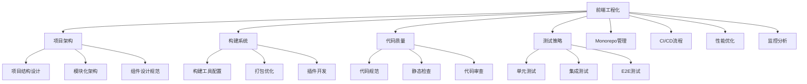

# 前端工程化完全指南

前端工程化是现代前端开发的核心，它通过系统性的解决方案提升开发效率、保证代码质量、优化团队协作。本指南涵盖企业级前端工程化的各个方面。

## 🎯 什么是前端工程化

前端工程化是指将软件工程的方法和实践应用到前端开发中，通过工具、流程、规范的标准化来解决前端开发中的效率、质量、协作等问题。

### 核心目标

- **提升开发效率**：自动化重复性工作，减少人工操作
- **保证代码质量**：建立代码规范和质量检查机制
- **优化团队协作**：统一开发环境和工作流程
- **降低维护成本**：提高代码可维护性和可扩展性

## 🏗️ 工程化体系架构



## 📋 工程化成熟度模型

### Level 1: 基础工程化
- ✅ 使用现代构建工具（Vite/Webpack）
- ✅ 配置代码规范（ESLint/Prettier）
- ✅ 使用版本控制（Git）
- ✅ 基础的项目结构

### Level 2: 标准工程化
- ✅ 自动化测试覆盖
- ✅ CI/CD 流程建立
- ✅ 代码质量门禁
- ✅ 性能监控基础设施

### Level 3: 高级工程化
- ✅ Monorepo 架构管理
- ✅ 微前端架构实施
- ✅ 全面的监控体系
- ✅ 自动化发布流程

### Level 4: 企业级工程化
- ✅ 跨团队协作规范
- ✅ 平台化工具建设
- ✅ 智能化运维体系
- ✅ 数据驱动的优化决策

## 🛠️ 技术栈选择

### 构建工具
| 工具 | 适用场景 | 优势 | 劣势 |
|------|----------|------|------|
| **Vite** | 现代前端项目 | 快速、简单 | 生态相对较新 |
| **Webpack** | 复杂企业项目 | 功能强大、生态丰富 | 配置复杂 |
| **Rollup** | 库开发 | 输出简洁 | 功能相对简单 |
| **esbuild** | 性能要求极高 | 极快的构建速度 | 功能有限 |

### 代码质量工具
```javascript
// 推荐的工具组合
{
  "linting": "ESLint + TypeScript ESLint",
  "formatting": "Prettier",
  "styleGuide": "Stylelint",
  "preCommit": "Husky + lint-staged",
  "typeChecking": "TypeScript"
}
```

### 测试框架
```javascript
// 测试金字塔
{
  "unitTest": "Jest / Vitest",
  "componentTest": "Testing Library",
  "integrationTest": "Jest + MSW",
  "e2eTest": "Cypress / Playwright",
  "visualTest": "Storybook + Chromatic"
}
```

## 🚀 实施路线图

### 阶段一：基础设施建设（1-2周）
1. **项目结构设计**
   - 确定目录结构规范
   - 建立模块化架构
   - 设计组件规范

2. **构建系统配置**
   - 选择并配置构建工具
   - 设置开发/生产环境
   - 配置代码分割策略

3. **代码质量保证**
   - 配置 ESLint 规则
   - 集成 Prettier 格式化
   - 设置 Git Hooks

### 阶段二：自动化流程（2-3周）
1. **测试体系建立**
   - 配置单元测试框架
   - 建立测试覆盖率标准
   - 集成 E2E 测试

2. **CI/CD 流程**
   - 配置 GitHub Actions
   - 建立自动化部署
   - 设置环境管理

### 阶段三：监控与优化（1-2周）
1. **性能监控**
   - 集成性能分析工具
   - 建立性能预算
   - 配置告警机制

2. **错误监控**
   - 集成错误追踪系统
   - 建立日志管理
   - 配置告警通知

### 阶段四：高级特性（持续）
1. **Monorepo 管理**
   - 评估 Monorepo 必要性
   - 选择合适的工具
   - 迁移现有项目

2. **微前端架构**
   - 设计微前端方案
   - 建立共享机制
   - 实施渐进式迁移

## 📊 效果评估指标

### 开发效率指标
- **构建速度**：开发环境启动时间 < 10s
- **热更新速度**：文件修改到页面更新 < 1s
- **部署频率**：每日部署次数 > 5次
- **代码提交频率**：每人每日提交 > 3次

### 代码质量指标
- **测试覆盖率**：单元测试覆盖率 > 80%
- **代码重复率**：重复代码比例 < 5%
- **技术债务**：SonarQube 评分 > A级
- **Bug 密度**：每千行代码 Bug 数 < 1个

### 性能指标
- **首屏加载时间**：LCP < 2.5s
- **交互响应时间**：FID < 100ms
- **视觉稳定性**：CLS < 0.1
- **Bundle 大小**：主包大小 < 200KB

## 💡 最佳实践

### 1. 渐进式实施
- 从小范围试点开始
- 逐步扩展到整个团队
- 持续收集反馈并优化

### 2. 工具选择原则
- 优先选择社区活跃的工具
- 考虑团队技术栈的一致性
- 平衡功能需求和学习成本

### 3. 团队协作
- 建立明确的工程化规范文档
- 定期进行工程化培训
- 建立工程化推进小组

### 4. 持续改进
- 定期评估工程化效果
- 关注新技术和最佳实践
- 建立工程化指标监控

## 🔗 相关资源

### 学习资源
- [前端工程化最佳实践](https://github.com/sorrycc/awesome-frontend-engineering)
- [现代前端工程化指南](https://modernjs.dev/)
- [前端工程化体系设计](https://juejin.cn/book/6844733816460804104)

### 工具推荐
- [构建工具对比](./build/)
- [代码质量工具](./quality/)
- [CI/CD 最佳实践](./cicd/)

前端工程化是一个持续演进的过程，需要根据团队规模、项目复杂度、业务需求来选择合适的方案和工具。
