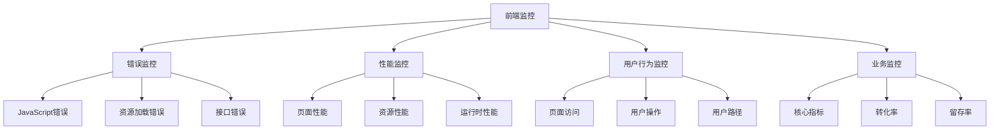

# 前端监控分析完全指南

前端监控是保障线上应用稳定运行的重要手段。通过全面的监控体系，可以及时发现问题、分析用户行为、优化产品体验。

## 🎯 监控体系架构

### 监控分类



### 监控指标体系

| 监控类型 | 核心指标 | 监控目标 | 告警阈值 |
|----------|----------|----------|----------|
| **错误监控** | 错误率、错误数量 | 系统稳定性 | 错误率 > 1% |
| **性能监控** | LCP、FID、CLS | 用户体验 | LCP > 2.5s |
| **可用性监控** | 可用率、响应时间 | 服务可用性 | 可用率 < 99.9% |
| **业务监控** | PV、UV、转化率 | 业务健康度 | 转化率下降 > 10% |

## 🚨 错误监控

### JavaScript 错误捕获

#### 1. 全局错误监控
```javascript
// 错误监控类
class ErrorMonitor {
  constructor(options = {}) {
    this.apiUrl = options.apiUrl || '/api/errors'
    this.userId = options.userId
    this.version = options.version
    this.environment = options.environment || 'production'
    
    this.init()
  }
  
  init() {
    // 捕获 JavaScript 运行时错误
    window.addEventListener('error', this.handleError.bind(this))
    
    // 捕获 Promise 未处理的 rejection
    window.addEventListener('unhandledrejection', this.handlePromiseRejection.bind(this))
    
    // 捕获资源加载错误
    window.addEventListener('error', this.handleResourceError.bind(this), true)
  }
  
  handleError(event) {
    const errorInfo = {
      type: 'javascript',
      message: event.message,
      filename: event.filename,
      lineno: event.lineno,
      colno: event.colno,
      stack: event.error?.stack,
      userAgent: navigator.userAgent,
      url: window.location.href,
      timestamp: Date.now(),
      userId: this.userId,
      version: this.version,
      environment: this.environment
    }
    
    this.reportError(errorInfo)
  }
  
  handlePromiseRejection(event) {
    const errorInfo = {
      type: 'promise',
      message: event.reason?.message || 'Unhandled Promise Rejection',
      stack: event.reason?.stack,
      userAgent: navigator.userAgent,
      url: window.location.href,
      timestamp: Date.now(),
      userId: this.userId,
      version: this.version,
      environment: this.environment
    }
    
    this.reportError(errorInfo)
  }
  
  handleResourceError(event) {
    if (event.target !== window) {
      const errorInfo = {
        type: 'resource',
        message: 'Resource loading failed',
        resourceUrl: event.target.src || event.target.href,
        tagName: event.target.tagName,
        url: window.location.href,
        timestamp: Date.now(),
        userId: this.userId,
        version: this.version,
        environment: this.environment
      }
      
      this.reportError(errorInfo)
    }
  }
  
  reportError(errorInfo) {
    // 错误去重
    const errorKey = `${errorInfo.type}-${errorInfo.message}-${errorInfo.filename}-${errorInfo.lineno}`
    if (this.reportedErrors?.has(errorKey)) {
      return
    }
    
    if (!this.reportedErrors) {
      this.reportedErrors = new Set()
    }
    this.reportedErrors.add(errorKey)
    
    // 发送错误报告
    fetch(this.apiUrl, {
      method: 'POST',
      headers: { 'Content-Type': 'application/json' },
      body: JSON.stringify(errorInfo)
    }).catch(err => {
      console.error('Failed to report error:', err)
    })
  }
  
  // 手动报告错误
  captureException(error, context = {}) {
    const errorInfo = {
      type: 'manual',
      message: error.message,
      stack: error.stack,
      context,
      userAgent: navigator.userAgent,
      url: window.location.href,
      timestamp: Date.now(),
      userId: this.userId,
      version: this.version,
      environment: this.environment
    }
    
    this.reportError(errorInfo)
  }
}

// 初始化错误监控
const errorMonitor = new ErrorMonitor({
  apiUrl: '/api/errors',
  userId: getCurrentUserId(),
  version: '1.0.0',
  environment: process.env.NODE_ENV
})

// 手动捕获错误
try {
  riskyOperation()
} catch (error) {
  errorMonitor.captureException(error, { operation: 'riskyOperation' })
}
```

### 错误边界组件

#### React 错误边界
```javascript
// ErrorBoundary.jsx
import React from 'react'

class ErrorBoundary extends React.Component {
  constructor(props) {
    super(props)
    this.state = { hasError: false, error: null, errorInfo: null }
  }
  
  static getDerivedStateFromError(error) {
    return { hasError: true }
  }
  
  componentDidCatch(error, errorInfo) {
    this.setState({
      error,
      errorInfo
    })
    
    // 报告错误到监控系统
    window.errorMonitor?.captureException(error, {
      componentStack: errorInfo.componentStack,
      errorBoundary: this.constructor.name
    })
  }
  
  render() {
    if (this.state.hasError) {
      return (
        <div className="error-boundary">
          <h2>Something went wrong.</h2>
          {process.env.NODE_ENV === 'development' && (
            <details style={{ whiteSpace: 'pre-wrap' }}>
              <summary>Error details</summary>
              {this.state.error && this.state.error.toString()}
              <br />
              {this.state.errorInfo.componentStack}
            </details>
          )}
          <button onClick={() => window.location.reload()}>
            Reload Page
          </button>
        </div>
      )
    }
    
    return this.props.children
  }
}

// 使用错误边界
function App() {
  return (
    <ErrorBoundary>
      <Header />
      <Main />
      <Footer />
    </ErrorBoundary>
  )
}
```

#### Vue 错误处理
```javascript
// Vue 3 全局错误处理
const app = createApp(App)

app.config.errorHandler = (err, instance, info) => {
  console.error('Vue error:', err)
  console.error('Component instance:', instance)
  console.error('Error info:', info)
  
  // 报告错误
  window.errorMonitor?.captureException(err, {
    componentName: instance?.$options.name,
    errorInfo: info
  })
}

// Vue 2 错误处理
Vue.config.errorHandler = function (err, vm, info) {
  console.error('Vue error:', err)
  
  window.errorMonitor?.captureException(err, {
    componentName: vm?.$options.name,
    errorInfo: info
  })
}
```

## 📈 性能监控

### 实时性能监控

```javascript
// 性能监控类
class PerformanceMonitor {
  constructor(options = {}) {
    this.apiUrl = options.apiUrl || '/api/performance'
    this.sampleRate = options.sampleRate || 0.1 // 10% 采样率
    this.metrics = new Map()
    
    this.init()
  }
  
  init() {
    // 监控页面性能
    this.observePagePerformance()
    
    // 监控资源性能
    this.observeResourcePerformance()
    
    // 监控长任务
    this.observeLongTasks()
    
    // 监控内存使用
    this.observeMemoryUsage()
  }
  
  observePagePerformance() {
    // 使用 PerformanceObserver 监控
    const observer = new PerformanceObserver((list) => {
      for (const entry of list.getEntries()) {
        if (entry.entryType === 'navigation') {
          this.reportPagePerformance(entry)
        }
      }
    })
    
    observer.observe({ entryTypes: ['navigation'] })
  }
  
  observeResourcePerformance() {
    const observer = new PerformanceObserver((list) => {
      for (const entry of list.getEntries()) {
        if (entry.transferSize > 100000) { // 大于100KB
          this.reportLargeResource(entry)
        }
      }
    })
    
    observer.observe({ entryTypes: ['resource'] })
  }
  
  observeLongTasks() {
    if ('PerformanceObserver' in window) {
      const observer = new PerformanceObserver((list) => {
        for (const entry of list.getEntries()) {
          if (entry.duration > 50) { // 长任务阈值50ms
            this.reportLongTask(entry)
          }
        }
      })
      
      observer.observe({ entryTypes: ['longtask'] })
    }
  }
  
  observeMemoryUsage() {
    if ('memory' in performance) {
      setInterval(() => {
        const memory = performance.memory
        this.reportMemoryUsage({
          usedJSHeapSize: memory.usedJSHeapSize,
          totalJSHeapSize: memory.totalJSHeapSize,
          jsHeapSizeLimit: memory.jsHeapSizeLimit
        })
      }, 30000) // 每30秒检查一次
    }
  }
  
  reportPagePerformance(entry) {
    if (Math.random() > this.sampleRate) return
    
    const performanceData = {
      type: 'page-performance',
      metrics: {
        domContentLoaded: entry.domContentLoadedEventEnd - entry.domContentLoadedEventStart,
        loadComplete: entry.loadEventEnd - entry.loadEventStart,
        firstByte: entry.responseStart - entry.requestStart,
        domInteractive: entry.domInteractive - entry.domLoading,
        domComplete: entry.domComplete - entry.domLoading
      },
      url: window.location.href,
      timestamp: Date.now()
    }
    
    this.sendMetrics(performanceData)
  }
  
  sendMetrics(data) {
    fetch(this.apiUrl, {
      method: 'POST',
      headers: { 'Content-Type': 'application/json' },
      body: JSON.stringify(data)
    }).catch(err => {
      console.error('Failed to send performance metrics:', err)
    })
  }
}

// 初始化性能监控
const performanceMonitor = new PerformanceMonitor({
  apiUrl: '/api/performance',
  sampleRate: 0.1
})
```

## 👥 用户行为监控

### 用户行为追踪

```javascript
// 用户行为监控类
class UserBehaviorTracker {
  constructor(options = {}) {
    this.apiUrl = options.apiUrl || '/api/analytics'
    this.sessionId = this.generateSessionId()
    this.userId = options.userId
    this.events = []
    this.batchSize = options.batchSize || 10
    
    this.init()
  }
  
  init() {
    // 页面访问追踪
    this.trackPageView()
    
    // 点击事件追踪
    this.trackClicks()
    
    // 滚动行为追踪
    this.trackScrolling()
    
    // 表单交互追踪
    this.trackFormInteractions()
    
    // 页面停留时间
    this.trackPageDuration()
  }
  
  trackPageView() {
    const pageData = {
      type: 'page_view',
      url: window.location.href,
      title: document.title,
      referrer: document.referrer,
      userAgent: navigator.userAgent,
      timestamp: Date.now(),
      sessionId: this.sessionId,
      userId: this.userId
    }
    
    this.addEvent(pageData)
  }
  
  trackClicks() {
    document.addEventListener('click', (event) => {
      const target = event.target
      const clickData = {
        type: 'click',
        element: target.tagName.toLowerCase(),
        className: target.className,
        id: target.id,
        text: target.textContent?.slice(0, 100),
        xpath: this.getXPath(target),
        timestamp: Date.now(),
        sessionId: this.sessionId,
        userId: this.userId
      }
      
      this.addEvent(clickData)
    })
  }
  
  trackScrolling() {
    let maxScrollDepth = 0
    
    const throttledScroll = this.throttle(() => {
      const scrollDepth = Math.round(
        (window.scrollY / (document.body.scrollHeight - window.innerHeight)) * 100
      )
      
      if (scrollDepth > maxScrollDepth) {
        maxScrollDepth = scrollDepth
        
        this.addEvent({
          type: 'scroll',
          depth: scrollDepth,
          timestamp: Date.now(),
          sessionId: this.sessionId,
          userId: this.userId
        })
      }
    }, 1000)
    
    window.addEventListener('scroll', throttledScroll)
  }
  
  trackFormInteractions() {
    document.addEventListener('submit', (event) => {
      const form = event.target
      const formData = new FormData(form)
      const fields = Array.from(formData.keys())
      
      this.addEvent({
        type: 'form_submit',
        formId: form.id,
        formClass: form.className,
        fieldCount: fields.length,
        fields: fields,
        timestamp: Date.now(),
        sessionId: this.sessionId,
        userId: this.userId
      })
    })
  }
  
  addEvent(eventData) {
    this.events.push(eventData)
    
    if (this.events.length >= this.batchSize) {
      this.sendEvents()
    }
  }
  
  sendEvents() {
    if (this.events.length === 0) return
    
    const eventsToSend = [...this.events]
    this.events = []
    
    fetch(this.apiUrl, {
      method: 'POST',
      headers: { 'Content-Type': 'application/json' },
      body: JSON.stringify({ events: eventsToSend })
    }).catch(err => {
      console.error('Failed to send analytics events:', err)
      // 失败时重新加入队列
      this.events.unshift(...eventsToSend)
    })
  }
  
  // 工具方法
  generateSessionId() {
    return 'session_' + Math.random().toString(36).substr(2, 9) + '_' + Date.now()
  }
  
  getXPath(element) {
    if (element.id) return `//*[@id="${element.id}"]`
    
    const parts = []
    while (element && element.nodeType === Node.ELEMENT_NODE) {
      let index = 0
      let sibling = element.previousSibling
      
      while (sibling) {
        if (sibling.nodeType === Node.ELEMENT_NODE && sibling.tagName === element.tagName) {
          index++
        }
        sibling = sibling.previousSibling
      }
      
      const tagName = element.tagName.toLowerCase()
      const pathIndex = index > 0 ? `[${index + 1}]` : ''
      parts.unshift(tagName + pathIndex)
      
      element = element.parentNode
    }
    
    return parts.length ? '/' + parts.join('/') : ''
  }
  
  throttle(func, limit) {
    let inThrottle
    return function(...args) {
      if (!inThrottle) {
        func.apply(this, args)
        inThrottle = true
        setTimeout(() => inThrottle = false, limit)
      }
    }
  }
}

// 初始化用户行为追踪
const behaviorTracker = new UserBehaviorTracker({
  apiUrl: '/api/analytics',
  userId: getCurrentUserId(),
  batchSize: 10
})
```

### 热力图分析

```javascript
// 热力图数据收集
class HeatmapTracker {
  constructor(options = {}) {
    this.apiUrl = options.apiUrl || '/api/heatmap'
    this.sampleRate = options.sampleRate || 0.05 // 5% 采样率
    this.clickData = []
    
    this.init()
  }
  
  init() {
    if (Math.random() > this.sampleRate) return
    
    document.addEventListener('click', this.trackClick.bind(this))
    document.addEventListener('mousemove', this.throttle(this.trackMouseMove.bind(this), 100))
  }
  
  trackClick(event) {
    const clickInfo = {
      type: 'click',
      x: event.clientX,
      y: event.clientY,
      pageX: event.pageX,
      pageY: event.pageY,
      element: event.target.tagName,
      className: event.target.className,
      viewport: {
        width: window.innerWidth,
        height: window.innerHeight
      },
      timestamp: Date.now()
    }
    
    this.clickData.push(clickInfo)
    
    if (this.clickData.length >= 50) {
      this.sendHeatmapData()
    }
  }
  
  trackMouseMove(event) {
    // 记录鼠标移动轨迹（采样）
    if (Math.random() < 0.01) { // 1% 采样率
      this.clickData.push({
        type: 'mousemove',
        x: event.clientX,
        y: event.clientY,
        timestamp: Date.now()
      })
    }
  }
  
  sendHeatmapData() {
    if (this.clickData.length === 0) return
    
    const dataToSend = [...this.clickData]
    this.clickData = []
    
    fetch(this.apiUrl, {
      method: 'POST',
      headers: { 'Content-Type': 'application/json' },
      body: JSON.stringify({
        url: window.location.href,
        data: dataToSend
      })
    }).catch(err => {
      console.error('Failed to send heatmap data:', err)
    })
  }
  
  throttle(func, limit) {
    let inThrottle
    return function(...args) {
      if (!inThrottle) {
        func.apply(this, args)
        inThrottle = true
        setTimeout(() => inThrottle = false, limit)
      }
    }
  }
}
```

## 📊 业务监控

### 关键业务指标追踪

```javascript
// 业务监控类
class BusinessMetricsTracker {
  constructor(options = {}) {
    this.apiUrl = options.apiUrl || '/api/business-metrics'
    this.userId = options.userId
    
    this.init()
  }
  
  init() {
    // 监控页面停留时间
    this.trackPageDuration()
    
    // 监控转化漏斗
    this.trackConversionFunnel()
    
    // 监控核心业务操作
    this.trackBusinessActions()
  }
  
  trackPageDuration() {
    const startTime = Date.now()
    
    const sendDuration = () => {
      const duration = Date.now() - startTime
      
      this.sendMetric({
        type: 'page_duration',
        duration,
        url: window.location.href,
        userId: this.userId,
        timestamp: Date.now()
      })
    }
    
    // 页面卸载时发送
    window.addEventListener('beforeunload', sendDuration)
    
    // 页面隐藏时发送
    document.addEventListener('visibilitychange', () => {
      if (document.hidden) {
        sendDuration()
      }
    })
  }
  
  trackConversionFunnel() {
    const funnelSteps = [
      'landing',
      'product_view',
      'add_to_cart',
      'checkout',
      'payment',
      'success'
    ]
    
    window.trackFunnelStep = (step, data = {}) => {
      if (funnelSteps.includes(step)) {
        this.sendMetric({
          type: 'funnel_step',
          step,
          data,
          userId: this.userId,
          sessionId: this.sessionId,
          timestamp: Date.now()
        })
      }
    }
  }
  
  trackBusinessActions() {
    // 监控关键业务操作
    window.trackBusinessAction = (action, data = {}) => {
      this.sendMetric({
        type: 'business_action',
        action,
        data,
        userId: this.userId,
        url: window.location.href,
        timestamp: Date.now()
      })
    }
  }
  
  sendMetric(metricData) {
    fetch(this.apiUrl, {
      method: 'POST',
      headers: { 'Content-Type': 'application/json' },
      body: JSON.stringify(metricData)
    }).catch(err => {
      console.error('Failed to send business metric:', err)
    })
  }
}

// 使用示例
const businessTracker = new BusinessMetricsTracker({
  apiUrl: '/api/business-metrics',
  userId: getCurrentUserId()
})

// 在关键业务节点调用
function addToCart(product) {
  // 业务逻辑
  addProductToCart(product)
  
  // 追踪业务指标
  window.trackBusinessAction('add_to_cart', {
    productId: product.id,
    price: product.price,
    category: product.category
  })
}
```

## 🔔 告警系统

### 实时告警配置

```javascript
// 告警规则配置
const alertRules = {
  errorRate: {
    threshold: 0.01, // 1%
    window: 300,     // 5分钟窗口
    action: 'immediate'
  },
  performanceScore: {
    threshold: 70,
    window: 600,     // 10分钟窗口
    action: 'delayed'
  },
  availability: {
    threshold: 0.999, // 99.9%
    window: 900,      // 15分钟窗口
    action: 'immediate'
  }
}

// 告警处理
class AlertManager {
  constructor(rules) {
    this.rules = rules
    this.alertHistory = new Map()
  }
  
  checkMetric(metricName, value, timestamp) {
    const rule = this.rules[metricName]
    if (!rule) return
    
    const shouldAlert = this.evaluateRule(rule, value, timestamp)
    
    if (shouldAlert && !this.isAlertSuppressed(metricName)) {
      this.sendAlert(metricName, value, rule)
      this.recordAlert(metricName, timestamp)
    }
  }
  
  evaluateRule(rule, value, timestamp) {
    switch (rule.action) {
      case 'immediate':
        return value > rule.threshold
      case 'delayed':
        return this.checkWindowAverage(rule, value, timestamp)
      default:
        return false
    }
  }
  
  sendAlert(metricName, value, rule) {
    const alertData = {
      metric: metricName,
      value,
      threshold: rule.threshold,
      severity: this.getSeverity(metricName),
      timestamp: Date.now(),
      environment: process.env.NODE_ENV
    }
    
    // 发送到告警系统
    fetch('/api/alerts', {
      method: 'POST',
      headers: { 'Content-Type': 'application/json' },
      body: JSON.stringify(alertData)
    })
    
    // 发送到 Slack
    this.sendSlackAlert(alertData)
  }
  
  sendSlackAlert(alertData) {
    const message = {
      text: `🚨 Alert: ${alertData.metric}`,
      attachments: [{
        color: 'danger',
        fields: [
          { title: 'Metric', value: alertData.metric, short: true },
          { title: 'Value', value: alertData.value, short: true },
          { title: 'Threshold', value: alertData.threshold, short: true },
          { title: 'Environment', value: alertData.environment, short: true }
        ]
      }]
    }
    
    fetch(process.env.SLACK_WEBHOOK_URL, {
      method: 'POST',
      headers: { 'Content-Type': 'application/json' },
      body: JSON.stringify(message)
    })
  }
}
```

## 📊 数据分析和可视化

### 监控仪表板

```javascript
// 实时监控仪表板
class MonitoringDashboard {
  constructor() {
    this.metrics = new Map()
    this.charts = new Map()
    
    this.init()
  }
  
  init() {
    this.setupWebSocket()
    this.createCharts()
    this.startDataRefresh()
  }
  
  setupWebSocket() {
    this.ws = new WebSocket('wss://monitoring.example.com/realtime')
    
    this.ws.onmessage = (event) => {
      const data = JSON.parse(event.data)
      this.updateMetrics(data)
    }
  }
  
  updateMetrics(data) {
    this.metrics.set(data.metric, data.value)
    this.updateChart(data.metric, data.value, data.timestamp)
    
    // 检查告警条件
    this.checkAlerts(data.metric, data.value)
  }
  
  createCharts() {
    // 错误率图表
    this.charts.set('errorRate', new Chart('errorRateChart', {
      type: 'line',
      data: {
        labels: [],
        datasets: [{
          label: 'Error Rate (%)',
          data: [],
          borderColor: 'rgb(255, 99, 132)',
          tension: 0.1
        }]
      },
      options: {
        responsive: true,
        scales: {
          y: {
            beginAtZero: true,
            max: 5
          }
        }
      }
    }))
    
    // 性能指标图表
    this.charts.set('performance', new Chart('performanceChart', {
      type: 'bar',
      data: {
        labels: ['LCP', 'FID', 'CLS'],
        datasets: [{
          label: 'Performance Metrics',
          data: [0, 0, 0],
          backgroundColor: [
            'rgba(255, 99, 132, 0.2)',
            'rgba(54, 162, 235, 0.2)',
            'rgba(255, 205, 86, 0.2)'
          ]
        }]
      }
    }))
  }
}
```

## 💡 最佳实践

### 1. 监控策略
- **分层监控**：从基础设施到业务层面的全面监控
- **主动监控**：预防性监控，而非被动响应
- **智能告警**：避免告警疲劳，设置合理的告警阈值
- **数据驱动**：基于监控数据进行决策和优化

### 2. 性能预算
```javascript
// 性能预算配置
const performanceBudget = {
  // 时间预算
  timing: {
    FCP: 1800,  // 首次内容绘制 < 1.8s
    LCP: 2500,  // 最大内容绘制 < 2.5s
    FID: 100,   // 首次输入延迟 < 100ms
    CLS: 0.1    // 累积布局偏移 < 0.1
  },
  
  // 资源预算
  resources: {
    javascript: 200 * 1024,  // JS 总大小 < 200KB
    css: 50 * 1024,          // CSS 总大小 < 50KB
    images: 500 * 1024,      // 图片总大小 < 500KB
    fonts: 100 * 1024        // 字体总大小 < 100KB
  }
}
```

### 3. 隐私保护
- **数据脱敏**：敏感信息不记录或脱敏处理
- **用户同意**：遵循 GDPR 等隐私法规
- **数据最小化**：只收集必要的数据
- **安全传输**：使用 HTTPS 传输监控数据

### 4. 监控成本控制
- **采样策略**：合理设置采样率
- **数据压缩**：压缩传输的监控数据
- **批量发送**：批量发送减少网络请求
- **存储优化**：设置合理的数据保留期

通过建立完善的监控分析体系，可以及时发现和解决问题，持续优化用户体验，提升产品质量。
