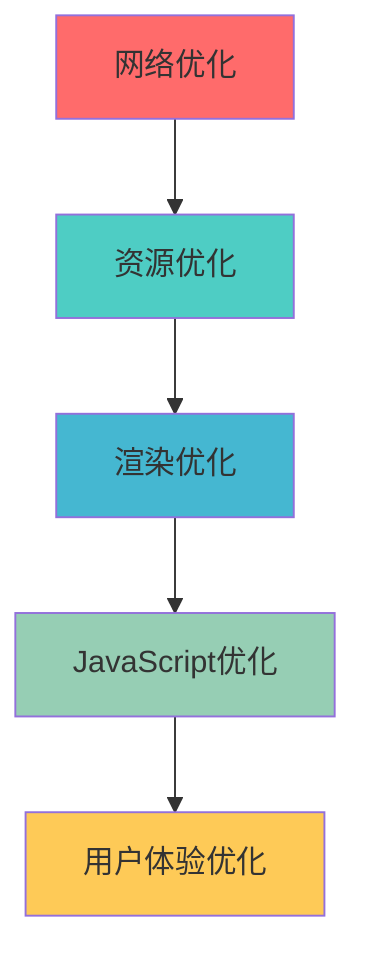

# 前端性能优化完全指南

前端性能优化是提升用户体验的关键。本指南将从多个维度介绍现代前端性能优化的策略、工具和最佳实践。

## 🎯 性能优化概述

### 性能指标体系

#### Core Web Vitals
```javascript
// 核心性能指标
const webVitals = {
  LCP: 'Largest Contentful Paint',    // 最大内容绘制 < 2.5s
  FID: 'First Input Delay',           // 首次输入延迟 < 100ms
  CLS: 'Cumulative Layout Shift'      // 累积布局偏移 < 0.1
}

// 其他重要指标
const otherMetrics = {
  FCP: 'First Contentful Paint',      // 首次内容绘制 < 1.8s
  TTI: 'Time to Interactive',         // 可交互时间 < 3.8s
  TBT: 'Total Blocking Time',         // 总阻塞时间 < 200ms
  SI: 'Speed Index'                   // 速度指数 < 3.4s
}
```

### 性能优化金字塔



## 🌐 网络优化

### HTTP 缓存策略

#### 1. 强缓存配置
```javascript
// Nginx 配置
server {
    # 静态资源强缓存
    location ~* \.(js|css|png|jpg|jpeg|gif|ico|svg|woff2)$ {
        expires 1y;
        add_header Cache-Control "public, immutable";
        add_header Vary "Accept-Encoding";
    }
    
    # HTML 文件不缓存
    location ~* \.html$ {
        expires -1;
        add_header Cache-Control "no-cache, no-store, must-revalidate";
    }
}

// Express.js 配置
app.use('/static', express.static('public', {
  maxAge: '1y',
  immutable: true
}))
```

#### 2. 协商缓存
```javascript
// 设置 ETag
app.get('/api/data', (req, res) => {
  const data = getData()
  const etag = generateETag(data)
  
  res.set('ETag', etag)
  
  if (req.get('If-None-Match') === etag) {
    return res.status(304).end()
  }
  
  res.json(data)
})

// 设置 Last-Modified
app.get('/api/file', (req, res) => {
  const filePath = getFilePath()
  const stats = fs.statSync(filePath)
  const lastModified = stats.mtime.toUTCString()
  
  res.set('Last-Modified', lastModified)
  
  if (req.get('If-Modified-Since') === lastModified) {
    return res.status(304).end()
  }
  
  res.sendFile(filePath)
})
```

### CDN 和资源分发

#### 1. CDN 配置
```javascript
// 多 CDN 配置
const cdnConfig = {
  primary: 'https://cdn1.example.com',
  fallback: 'https://cdn2.example.com',
  local: '/static'
}

function getAssetUrl(path) {
  try {
    return `${cdnConfig.primary}${path}`
  } catch (error) {
    console.warn('Primary CDN failed, using fallback')
    return `${cdnConfig.fallback}${path}`
  }
}

// 预连接优化
const preconnectLinks = [
  '<link rel="preconnect" href="https://fonts.googleapis.com">',
  '<link rel="preconnect" href="https://api.example.com">',
  '<link rel="dns-prefetch" href="https://cdn.example.com">'
]
```

#### 2. 资源预加载
```html
<!-- 关键资源预加载 -->
<link rel="preload" href="/fonts/main.woff2" as="font" type="font/woff2" crossorigin>
<link rel="preload" href="/css/critical.css" as="style">
<link rel="preload" href="/js/main.js" as="script">

<!-- 预获取下一页资源 -->
<link rel="prefetch" href="/js/page2.js">
<link rel="prefetch" href="/css/page2.css">

<!-- 预渲染下一页 -->
<link rel="prerender" href="/next-page">
```

## 📦 资源优化

### 代码分割策略

#### 1. 路由级分割
```javascript
// React Router 懒加载
import { lazy, Suspense } from 'react'
import { Routes, Route } from 'react-router-dom'

const Home = lazy(() => import('./pages/Home'))
const About = lazy(() => import('./pages/About'))
const Contact = lazy(() => import('./pages/Contact'))

function App() {
  return (
    <Suspense fallback={<div>Loading...</div>}>
      <Routes>
        <Route path="/" element={<Home />} />
        <Route path="/about" element={<About />} />
        <Route path="/contact" element={<Contact />} />
      </Routes>
    </Suspense>
  )
}

// Vue Router 懒加载
const routes = [
  {
    path: '/',
    component: () => import('./views/Home.vue')
  },
  {
    path: '/about',
    component: () => import('./views/About.vue')
  }
]
```

#### 2. 组件级分割
```javascript
// React 动态导入
import { useState, lazy, Suspense } from 'react'

const HeavyComponent = lazy(() => import('./HeavyComponent'))

function App() {
  const [showHeavy, setShowHeavy] = useState(false)
  
  return (
    <div>
      <button onClick={() => setShowHeavy(true)}>
        Load Heavy Component
      </button>
      
      {showHeavy && (
        <Suspense fallback={<div>Loading heavy component...</div>}>
          <HeavyComponent />
        </Suspense>
      )}
    </div>
  )
}

// Vue 3 异步组件
import { defineAsyncComponent } from 'vue'

const AsyncComponent = defineAsyncComponent({
  loader: () => import('./HeavyComponent.vue'),
  loadingComponent: LoadingComponent,
  errorComponent: ErrorComponent,
  delay: 200,
  timeout: 3000
})
```

### Bundle 优化

#### 1. Webpack 配置优化
```javascript
// webpack.config.js
const path = require('path')
const { BundleAnalyzerPlugin } = require('webpack-bundle-analyzer')

module.exports = {
  optimization: {
    splitChunks: {
      chunks: 'all',
      cacheGroups: {
        vendor: {
          test: /[\\/]node_modules[\\/]/,
          name: 'vendors',
          chunks: 'all',
          priority: 10
        },
        common: {
          name: 'common',
          minChunks: 2,
          chunks: 'all',
          priority: 5
        }
      }
    },
    usedExports: true,
    sideEffects: false
  },
  
  plugins: [
    new BundleAnalyzerPlugin({
      analyzerMode: process.env.ANALYZE ? 'server' : 'disabled'
    })
  ]
}
```

#### 2. Vite 配置优化
```javascript
// vite.config.js
import { defineConfig } from 'vite'
import { visualizer } from 'rollup-plugin-visualizer'

export default defineConfig({
  build: {
    rollupOptions: {
      output: {
        manualChunks: {
          vendor: ['react', 'react-dom'],
          ui: ['antd', '@ant-design/icons'],
          utils: ['lodash', 'dayjs']
        }
      }
    },
    chunkSizeWarningLimit: 1000
  },
  
  plugins: [
    visualizer({
      filename: 'dist/stats.html',
      open: true,
      gzipSize: true
    })
  ]
})
```

### 图片优化

#### 1. 现代图片格式
```html
<!-- WebP 格式支持 -->
<picture>
  <source srcset="image.webp" type="image/webp">
  <source srcset="image.avif" type="image/avif">
  
</picture>

<!-- 响应式图片 -->

```

#### 2. 图片懒加载
```javascript
// Intersection Observer 懒加载
class LazyImageLoader {
  constructor() {
    this.imageObserver = new IntersectionObserver(
      this.handleIntersection.bind(this),
      { rootMargin: '50px' }
    )
    
    this.init()
  }
  
  init() {
    const lazyImages = document.querySelectorAll('img[data-src]')
    lazyImages.forEach(img => this.imageObserver.observe(img))
  }
  
  handleIntersection(entries) {
    entries.forEach(entry => {
      if (entry.isIntersecting) {
        const img = entry.target
        img.src = img.dataset.src
        img.removeAttribute('data-src')
        this.imageObserver.unobserve(img)
      }
    })
  }
}

new LazyImageLoader()
```

## ⚡ 渲染优化

### 关键渲染路径优化

#### 1. CSS 优化
```css
/* 关键 CSS 内联 */
<style>
  /* 首屏关键样式 */
  .header { display: flex; }
  .main { min-height: 100vh; }
</style>

/* 非关键 CSS 异步加载 */
<link rel="preload" href="styles.css" as="style" onload="this.onload=null;this.rel='stylesheet'">
<noscript><link rel="stylesheet" href="styles.css"></noscript>
```

```javascript
// CSS-in-JS 优化
import styled from 'styled-components'

// 避免在渲染函数中创建样式组件
const StyledButton = styled.button`
  background: ${props => props.primary ? 'blue' : 'gray'};
  color: white;
  padding: 10px 20px;
`

// 使用 CSS 变量减少重新计算
const DynamicComponent = styled.div`
  --primary-color: ${props => props.color};
  background: var(--primary-color);
`
```

#### 2. JavaScript 优化
```javascript
// 避免长任务阻塞
function processLargeData(data) {
  return new Promise(resolve => {
    const chunks = chunkArray(data, 1000)
    let result = []
    
    function processChunk(index) {
      if (index >= chunks.length) {
        resolve(result)
        return
      }
      
      // 处理当前块
      result = result.concat(processChunk(chunks[index]))
      
      // 让出控制权给浏览器
      setTimeout(() => processChunk(index + 1), 0)
    }
    
    processChunk(0)
  })
}

// 使用 requestIdleCallback
function performWork(deadline) {
  while (deadline.timeRemaining() > 0 && tasks.length > 0) {
    const task = tasks.shift()
    task()
  }
  
  if (tasks.length > 0) {
    requestIdleCallback(performWork)
  }
}

requestIdleCallback(performWork)
```

### 虚拟滚动

```javascript
// React 虚拟滚动实现
import { useState, useEffect, useMemo } from 'react'

function VirtualList({ items, itemHeight, containerHeight }) {
  const [scrollTop, setScrollTop] = useState(0)
  
  const visibleItems = useMemo(() => {
    const startIndex = Math.floor(scrollTop / itemHeight)
    const endIndex = Math.min(
      startIndex + Math.ceil(containerHeight / itemHeight) + 1,
      items.length
    )
    
    return items.slice(startIndex, endIndex).map((item, index) => ({
      ...item,
      index: startIndex + index
    }))
  }, [items, itemHeight, containerHeight, scrollTop])
  
  const totalHeight = items.length * itemHeight
  const offsetY = Math.floor(scrollTop / itemHeight) * itemHeight
  
  return (
    <div
      style={{ height: containerHeight, overflow: 'auto' }}
      onScroll={e => setScrollTop(e.target.scrollTop)}
    >
      <div style={{ height: totalHeight, position: 'relative' }}>
        <div style={{ transform: `translateY(${offsetY}px)` }}>
          {visibleItems.map(item => (
            <div
              key={item.id}
              style={{ height: itemHeight }}
            >
              {item.content}
            </div>
          ))}
        </div>
      </div>
    </div>
  )
}
```

## 🔧 JavaScript 优化

### 内存管理

#### 1. 内存泄漏预防
```javascript
// 正确清理事件监听器
class Component {
  constructor() {
    this.handleResize = this.handleResize.bind(this)
  }
  
  componentDidMount() {
    window.addEventListener('resize', this.handleResize)
  }
  
  componentWillUnmount() {
    window.removeEventListener('resize', this.handleResize)
  }
  
  handleResize() {
    // 处理逻辑
  }
}

// 清理定时器
class Timer {
  constructor() {
    this.timerId = null
  }
  
  start() {
    this.timerId = setInterval(() => {
      // 定时任务
    }, 1000)
  }
  
  stop() {
    if (this.timerId) {
      clearInterval(this.timerId)
      this.timerId = null
    }
  }
}

// 使用 WeakMap 避免内存泄漏
const componentData = new WeakMap()

class Component {
  constructor() {
    componentData.set(this, { data: 'some data' })
  }
  
  getData() {
    return componentData.get(this)
  }
}
```

#### 2. 对象池模式
```javascript
// 对象池减少 GC 压力
class ObjectPool {
  constructor(createFn, resetFn, initialSize = 10) {
    this.createFn = createFn
    this.resetFn = resetFn
    this.pool = []
    
    // 预创建对象
    for (let i = 0; i < initialSize; i++) {
      this.pool.push(this.createFn())
    }
  }
  
  acquire() {
    return this.pool.length > 0 ? this.pool.pop() : this.createFn()
  }
  
  release(obj) {
    this.resetFn(obj)
    this.pool.push(obj)
  }
}

// 使用示例
const particlePool = new ObjectPool(
  () => ({ x: 0, y: 0, vx: 0, vy: 0 }),
  (particle) => {
    particle.x = 0
    particle.y = 0
    particle.vx = 0
    particle.vy = 0
  }
)
```

### 计算优化

#### 1. 防抖和节流
```javascript
// 防抖函数
function debounce(func, wait, immediate = false) {
  let timeout
  
  return function executedFunction(...args) {
    const later = () => {
      timeout = null
      if (!immediate) func.apply(this, args)
    }
    
    const callNow = immediate && !timeout
    clearTimeout(timeout)
    timeout = setTimeout(later, wait)
    
    if (callNow) func.apply(this, args)
  }
}

// 节流函数
function throttle(func, limit) {
  let inThrottle
  
  return function(...args) {
    if (!inThrottle) {
      func.apply(this, args)
      inThrottle = true
      setTimeout(() => inThrottle = false, limit)
    }
  }
}

// 使用示例
const debouncedSearch = debounce(searchFunction, 300)
const throttledScroll = throttle(scrollHandler, 100)
```

#### 2. Web Workers
```javascript
// main.js
const worker = new Worker('worker.js')

worker.postMessage({ data: largeDataSet, operation: 'process' })

worker.onmessage = function(e) {
  const result = e.data
  updateUI(result)
}

// worker.js
self.onmessage = function(e) {
  const { data, operation } = e.data
  
  if (operation === 'process') {
    const result = processLargeData(data)
    self.postMessage(result)
  }
}

function processLargeData(data) {
  // 耗时计算
  return data.map(item => heavyComputation(item))
}
```

## 📊 性能监控

### 性能指标收集

```javascript
// Web Vitals 监控
import { getCLS, getFID, getFCP, getLCP, getTTFB } from 'web-vitals'

function sendToAnalytics(metric) {
  // 发送到分析服务
  fetch('/analytics', {
    method: 'POST',
    headers: { 'Content-Type': 'application/json' },
    body: JSON.stringify({
      name: metric.name,
      value: metric.value,
      id: metric.id,
      delta: metric.delta,
      url: window.location.href,
      timestamp: Date.now()
    })
  })
}

// 监控所有核心指标
getCLS(sendToAnalytics)
getFID(sendToAnalytics)
getFCP(sendToAnalytics)
getLCP(sendToAnalytics)
getTTFB(sendToAnalytics)

// 自定义性能监控
class PerformanceMonitor {
  constructor() {
    this.metrics = new Map()
    this.observer = new PerformanceObserver(this.handleEntries.bind(this))
    this.observer.observe({ entryTypes: ['navigation', 'resource', 'paint'] })
  }
  
  handleEntries(list) {
    for (const entry of list.getEntries()) {
      this.processEntry(entry)
    }
  }
  
  processEntry(entry) {
    switch (entry.entryType) {
      case 'navigation':
        this.metrics.set('domContentLoaded', entry.domContentLoadedEventEnd)
        this.metrics.set('loadComplete', entry.loadEventEnd)
        break
      case 'paint':
        this.metrics.set(entry.name, entry.startTime)
        break
      case 'resource':
        if (entry.transferSize > 100000) { // 大于100KB的资源
          console.warn(`Large resource: ${entry.name} (${entry.transferSize} bytes)`)
        }
        break
    }
  }
  
  getMetrics() {
    return Object.fromEntries(this.metrics)
  }
}

const monitor = new PerformanceMonitor()
```

### 性能预算

```javascript
// 性能预算配置
const performanceBudget = {
  // 时间预算 (毫秒)
  timing: {
    FCP: 1800,
    LCP: 2500,
    FID: 100,
    CLS: 0.1
  },
  
  // 资源预算 (字节)
  resources: {
    javascript: 200 * 1024,  // 200KB
    css: 50 * 1024,          // 50KB
    images: 500 * 1024,      // 500KB
    fonts: 100 * 1024        // 100KB
  }
}

// 预算检查
function checkPerformanceBudget() {
  const entries = performance.getEntriesByType('resource')
  const budgetReport = {}
  
  entries.forEach(entry => {
    const type = getResourceType(entry.name)
    if (!budgetReport[type]) {
      budgetReport[type] = 0
    }
    budgetReport[type] += entry.transferSize
  })
  
  Object.keys(budgetReport).forEach(type => {
    const budget = performanceBudget.resources[type]
    const actual = budgetReport[type]
    
    if (budget && actual > budget) {
      console.warn(`${type} budget exceeded: ${actual} > ${budget}`)
    }
  })
}
```

## 💡 最佳实践

### 1. 性能优化策略
- **测量优先**：先测量再优化，避免过早优化
- **用户体验导向**：关注用户感知的性能指标
- **渐进增强**：确保基础功能在所有设备上可用
- **持续监控**：建立性能监控和告警机制

### 2. 优化优先级
1. **关键渲染路径**：优先优化首屏渲染
2. **JavaScript 执行**：减少主线程阻塞
3. **网络请求**：优化资源加载策略
4. **用户交互**：提升交互响应速度

### 3. 团队协作
- **性能文化**：建立团队性能意识
- **工具集成**：在开发流程中集成性能工具
- **知识分享**：定期分享性能优化经验
- **持续改进**：建立性能优化的持续改进机制

通过系统性的性能优化策略，可以显著提升用户体验，提高产品竞争力。
