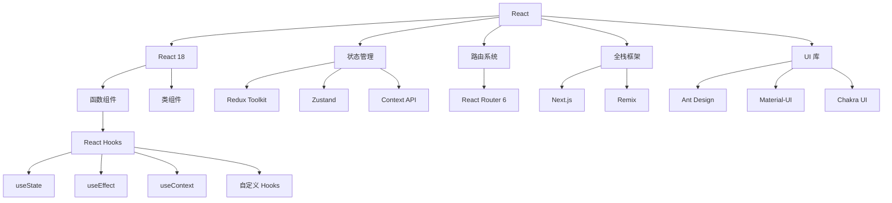

# React 生态系统

React 是由 Facebook 开发的用于构建用户界面的 JavaScript 库，以其组件化思想和虚拟 DOM 技术著称。

## 🎯 React 技术栈概览



## 📚 学习路径

### 🔰 React18 核心概念

React18 引入了并发特性，提升了用户体验：

- **JSX 语法**：声明式 UI 描述语言
- **组件基础**：函数组件与类组件
- **Props & State**：组件数据传递与状态管理
- **事件处理**：合成事件系统

### 🪝 React Hooks

Hooks 让函数组件拥有状态和生命周期：

- **基础 Hooks**：useState、useEffect、useContext
- **高级 Hooks**：useReducer、useMemo、useCallback
- **自定义 Hooks**：逻辑复用的最佳实践
- **Hooks 规则**：使用规范与最佳实践

### 🗂️ 状态管理

选择合适的状态管理方案：

- **Redux Toolkit**：官方推荐的 Redux 工具集
- **Zustand**：轻量级状态管理库
- **Context API**：React 内置状态共享方案

### 🛣️ 路由系统

构建单页面应用的导航：

- **React Router 6**：声明式路由配置
- **嵌套路由**：复杂页面结构管理
- **路由守卫**：权限控制与导航拦截

### 🚀 Next.js 全栈开发

现代 React 全栈框架：

- **App Router**：基于文件系统的路由
- **Server Components**：服务端组件渲染
- **API Routes**：全栈 API 开发

## 🛠️ 开发工具

### 创建 React 应用

```bash
# Create React App (传统方式)
npx create-react-app my-app

# Vite (推荐，更快的构建)
npm create vite@latest my-app -- --template react

# Next.js (全栈应用)
npx create-next-app@latest my-app
```

### 开发环境配置

```json
{
  "scripts": {
    "dev": "vite",
    "build": "vite build",
    "preview": "vite preview",
    "lint": "eslint src --ext js,jsx,ts,tsx",
    "test": "vitest"
  }
}
```

## 🎨 UI 组件库对比

| 库名 | 特点 | 适用场景 |
|------|------|----------|
| Ant Design | 企业级设计语言 | 后台管理系统 |
| Material-UI | Google 设计规范 | 现代 Web 应用 |
| Chakra UI | 简单模块化 | 快速原型开发 |
| React Bootstrap | Bootstrap 生态 | 传统 Web 项目 |

### Ant Design 示例

```jsx
import { Button, Space } from 'antd';

const App = () => (
  <Space wrap>
    <Button type="primary">Primary Button</Button>
    <Button>Default Button</Button>
    <Button type="dashed">Dashed Button</Button>
    <Button type="text">Text Button</Button>
    <Button type="link">Link Button</Button>
  </Space>
);

export default App;
```

## 🔧 React 18 新特性

### 并发特性

```jsx
import { Suspense, lazy } from 'react';

// 代码分割
const LazyComponent = lazy(() => import('./LazyComponent'));

function App() {
  return (
    <Suspense fallback={<div>Loading...</div>}>
      <LazyComponent />
    </Suspense>
  );
}
```

### 自动批处理

```jsx
import { useState } from 'react';

function App() {
  const [count, setCount] = useState(0);
  const [flag, setFlag] = useState(false);

  function handleClick() {
    // React 18 会自动批处理这些更新
    setCount(c => c + 1);
    setFlag(f => !f);
    // 只会触发一次重新渲染
  }

  return (
    <div>
      <button onClick={handleClick}>Next</button>
      <h1 style={{ color: flag ? "blue" : "black" }}>{count}</h1>
    </div>
  );
}
```

## 📈 学习建议

### 初学者路径
1. **JavaScript 基础** → ES6+、异步编程
2. **React 基础** → JSX、组件、Props
3. **Hooks 入门** → useState、useEffect
4. **状态管理** → Context API 或 Zustand
5. **路由导航** → React Router 基础
6. **项目实战** → Todo 应用、博客系统

### 进阶开发者
1. **性能优化** → memo、useMemo、useCallback
2. **TypeScript 集成** → 类型安全开发
3. **测试策略** → Jest、React Testing Library
4. **状态管理进阶** → Redux Toolkit
5. **全栈开发** → Next.js、API 设计
6. **部署优化** → 构建优化、CDN 部署

## 🔗 官方资源

- [React 官方文档](https://react.dev/)
- [React Router 文档](https://reactrouter.com/)
- [Redux Toolkit 文档](https://redux-toolkit.js.org/)
- [Next.js 文档](https://nextjs.org/docs)
- [Create React App 文档](https://create-react-app.dev/)

## 🎯 实战项目推荐

1. **计数器应用**：掌握 useState 基础
2. **待办事项**：学习列表渲染和事件处理
3. **天气应用**：练习 API 调用和 useEffect
4. **购物车**：复杂状态管理实践
5. **博客平台**：全栈开发综合练习

---

选择左侧导航开始你的 React 学习之旅！
