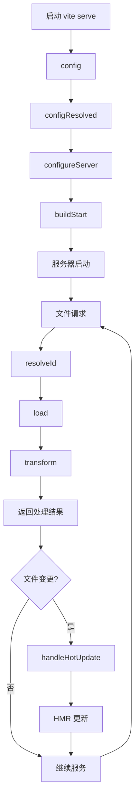
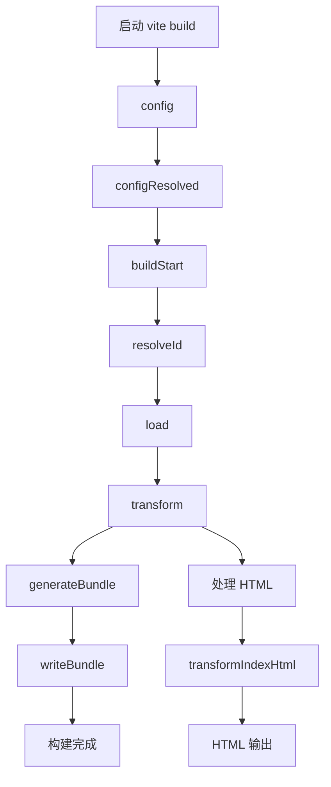
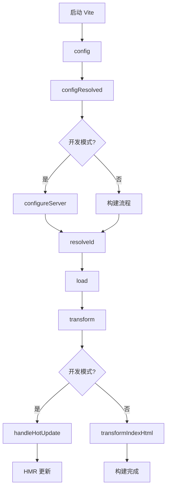
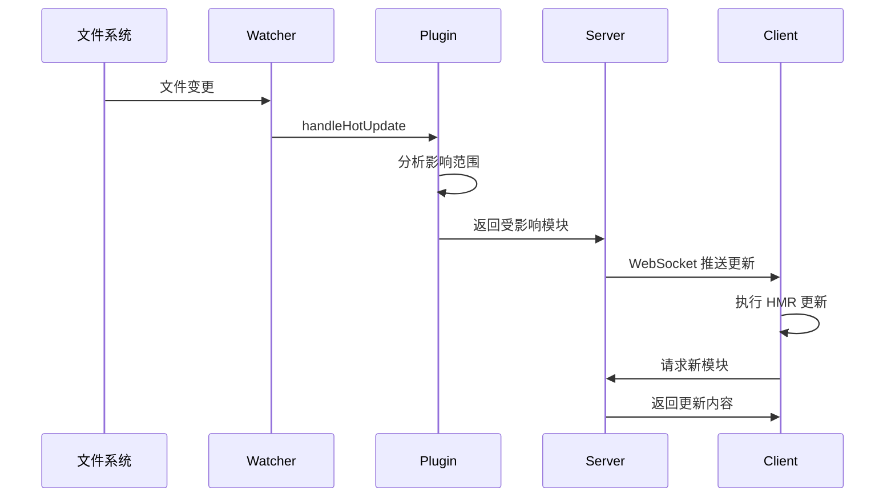

# Vite 插件开发指南

从基础概念到实战应用的完整 Vite 插件开发教程。

## 1. 基础概念

### 1.1 什么是 Vite 插件

Vite 插件是基于 Rollup 插件架构的扩展系统，用于在构建过程中执行自定义逻辑。插件可以：

- **修改配置**：在构建开始前调整 Vite 配置
- **处理文件**：转换、加载、解析各种类型的文件
- **注入代码**：在构建过程中动态添加代码
- **优化构建**：压缩、分析、缓存等构建优化
- **开发增强**：热更新、代理、中间件等开发体验优化

### 1.2 插件基本结构

```typescript
import type { Plugin } from "vite";

export function myPlugin(options = {}): Plugin {
  return {
    // 插件名称（必需）
    name: "my-plugin",

    // 执行时机控制
    enforce: "pre", // 'pre' | 'post' | undefined

    // 应用条件
    apply: "build", // 'build' | 'serve' | function

    // 钩子函数
    configResolved(config) {
      // 配置解析完成后执行
    },

    transform(code, id) {
      // 代码转换时执行
      return code;
    },
  };
}
```

### 1.3 插件配置选项

| 配置项     | 类型                             | 说明                          | 示例                 |
| ---------- | -------------------------------- | ----------------------------- | -------------------- |
| `name`     | `string`                         | 插件名称，用于调试和错误提示  | `'vite-plugin-demo'` |
| `enforce`  | `'pre' \| 'post'`                | 执行顺序，pre 最先，post 最后 | `'pre'`              |
| `apply`    | `'build' \| 'serve' \| function` | 应用场景限制                  | `'build'`            |
| `external` | `string[]`                       | 外部依赖，不打包进 bundle     | `['lodash']`         |

## 2. 钩子函数详解

### 2.1 配置阶段钩子

#### `config(config, { command })`

- **触发时机**：配置文件解析之前
- **用途**：修改用户配置
- **参数**：
  - `config`: 用户配置对象
  - `command`: `'build' | 'serve'`
- **返回值**：`UserConfig | void`

```typescript
config(config, { command }) {
  if (command === 'serve') {
    // 开发模式配置
    config.server = config.server || {}
    config.server.port = 3000
  }
}
```

#### `configResolved(resolvedConfig)`

- **触发时机**：配置解析完成后
- **用途**：获取最终配置，不能修改
- **参数**：`resolvedConfig` - 最终配置对象
- **返回值**：`void`

```typescript
configResolved(resolvedConfig) {
  this.isProduction = resolvedConfig.command === 'build'
  this.root = resolvedConfig.root
}
```

#### `configureServer(server)`

- **触发时机**：开发服务器创建时
- **用途**：配置开发服务器，添加中间件
- **参数**：`server` - Vite 开发服务器实例
- **返回值**：`void`

```typescript
configureServer(server) {
  // 添加 API 路由
  server.middlewares.use('/api/hello', (req, res) => {
    res.end('Hello from plugin!')
  })
}
```

### 2.2 构建阶段钩子

#### `buildStart(options)`

- **触发时机**：构建开始时
- **用途**：初始化构建状态
- **参数**：`options` - 构建选项
- **返回值**：`void`

#### `resolveId(id, importer)`

- **触发时机**：解析模块 ID 时
- **用途**：自定义模块解析逻辑
- **参数**：
  - `id`: 模块标识符
  - `importer`: 导入该模块的文件路径
- **返回值**：`string | void`

```typescript
resolveId(id) {
  if (id === 'virtual:my-module') {
    return id // 返回虚拟模块 ID
  }
}
```

#### `load(id)`

- **触发时机**：加载模块内容时
- **用途**：提供模块内容
- **参数**：`id` - 模块 ID
- **返回值**：`string | void`

```typescript
load(id) {
  if (id === 'virtual:my-module') {
    return 'export const msg = "Hello from virtual module!"'
  }
}
```

#### `transform(code, id)`

- **触发时机**：转换模块代码时
- **用途**：修改源代码
- **参数**：
  - `code`: 源代码字符串
  - `id`: 文件路径
- **返回值**：`string | TransformResult | void`

```typescript
transform(code, id) {
  if (id.endsWith('.vue')) {
    // 转换 Vue 文件
    return transformVueCode(code)
  }
}
```

### 2.3 生成阶段钩子

#### `generateBundle(options, bundle)`

- **触发时机**：生成 bundle 时
- **用途**：修改最终输出
- **参数**：
  - `options`: 输出选项
  - `bundle`: 打包结果对象

#### `writeBundle(options, bundle)`

- **触发时机**：写入文件后
- **用途**：后处理操作

### 2.4 开发专用钩子

#### `handleHotUpdate(ctx)`

- **触发时机**：文件变更时（仅开发模式）
- **用途**：自定义热更新逻辑
- **参数**：`ctx` - 热更新上下文
- **返回值**：`ModuleNode[] | void`

```typescript
handleHotUpdate({ file, modules }) {
  if (file.endsWith('.data.json')) {
    // 自定义文件类型的热更新
    console.log('Data file updated:', file)
    return modules
  }
}
```

#### `transformIndexHtml(html, context)`

- **触发时机**：处理 HTML 文件时
- **用途**：修改 HTML 内容
- **返回值**：`string | HtmlTagDescriptor[]`

```typescript
transformIndexHtml(html) {
  return html.replace(
    '<head>',
    '<head>\n  <meta name="generator" content="my-plugin">'
  )
}
```

## 3. 钩子执行流程

### 3.1 开发模式流程图



### 3.2 构建模式流程图



### 3.3 钩子执行顺序

| 阶段           | 钩子执行顺序                                    | 说明                       |
| -------------- | ----------------------------------------------- | -------------------------- |
| **配置阶段**   | `config` → `configResolved` → `configureServer` | 配置解析和服务器设置       |
| **构建初始化** | `buildStart`                                    | 构建开始                   |
| **模块处理**   | `resolveId` → `load` → `transform`              | 按需执行，每个模块都会经历 |
| **代码生成**   | `generateBundle` → `writeBundle`                | 仅构建模式                 |
| **开发特殊**   | `handleHotUpdate`                               | 仅开发模式，文件变更时     |
| **HTML 处理**  | `transformIndexHtml`                            | HTML 文件处理时            |

## 4. 简单示例入门

### 4.1 最简单的插件

让我们从一个最基础的插件开始，理解插件的工作原理：

```typescript
// 最简单的插件 - 只打印信息
import type { Plugin } from "vite";

export function helloPlugin(): Plugin {
  return {
    name: "hello-plugin",

    configResolved() {
      console.log("👋 Hello! Plugin is loaded!");
    },
  };
}
```

### 4.2 带配置的插件

```typescript
// 带选项配置的插件
export interface HelloPluginOptions {
  message?: string;
  showTime?: boolean;
}

export function helloPlugin(options: HelloPluginOptions = {}): Plugin {
  const { message = "Hello", showTime = false } = options;

  return {
    name: "hello-plugin",

    configResolved() {
      const time = showTime ? ` at ${new Date().toLocaleTimeString()}` : "";
      console.log(`👋 ${message}! Plugin is loaded${time}`);
    },
  };
}
```

### 4.3 代码转换插件

```typescript
// 简单的代码转换插件
export function commentPlugin(): Plugin {
  return {
    name: "comment-plugin",

    transform(code, id) {
      // 只处理 .js 和 .ts 文件
      if (id.endsWith(".js") || id.endsWith(".ts")) {
        // 在文件开头添加注释
        return `/* 由 comment-plugin 处理 */\n${code}`;
      }
      // 不处理其他文件
      return null;
    },
  };
}
```

### 4.4 虚拟模块插件

```typescript
// 创建虚拟模块的插件
export function virtualPlugin(): Plugin {
  return {
    name: "virtual-plugin",

    resolveId(id) {
      if (id === "virtual:config") {
        return id; // 告诉 Vite 这是一个虚拟模块
      }
    },

    load(id) {
      if (id === "virtual:config") {
        // 返回虚拟模块的内容
        return `
          export const appName = 'My App'
          export const version = '1.0.0'
          export const buildTime = '${new Date().toISOString()}'
        `;
      }
    },
  };
}
```

### 4.5 使用插件

```typescript
// vite.config.ts
import { defineConfig } from "vite";
import { helloPlugin, commentPlugin, virtualPlugin } from "./plugins";

export default defineConfig({
  plugins: [
    helloPlugin({
      message: "Welcome to Vite",
      showTime: true,
    }),
    commentPlugin(),
    virtualPlugin(),
  ],
});
```

```typescript
// 在代码中使用虚拟模块
import { appName, version, buildTime } from "virtual:config";

console.log(`${appName} v${version} built at ${buildTime}`);
```

## 5. 实战应用场景

| `transform` | 代码转换时 | 转换源码 | `TransformResult \| void` |
| `handleHotUpdate` | 文件变更时 | 自定义 HMR | `HmrContext[] \| void` |
| `transformIndexHtml` | HTML 转换时 | 修改 HTML | `string \| HtmlTagDescriptor[]` |

### 生命周期流程图



### 核心 Hook 示例

```typescript
// 完整的 Hook 示例
export function fullDemoPlugin(): Plugin {
  return {
    name: "full-demo-plugin",

    // 1. 修改配置
    config(config, { command }) {
      if (command === "serve") {
        config.server = config.server || {};
        config.server.port = 3000;
      }
    },

    // 2. 配置确定后执行
    configResolved(resolvedConfig) {
      this.isProduction = resolvedConfig.command === "build";
    },

    // 3. 配置开发服务器
    configureServer(server) {
      server.middlewares.use("/api/hello", (req, res) => {
        res.end("Hello from plugin middleware!");
      });
    },

    // 4. 解析模块 ID
    resolveId(id) {
      if (id === "virtual:my-plugin") {
        return id; // 返回虚拟模块 ID
      }
    },

    // 5. 加载模块内容
    load(id) {
      if (id === "virtual:my-plugin") {
        return 'export const msg = "Hello from virtual module!"';
      }
    },

    // 6. 转换代码
    transform(code, id) {
      if (id.includes("main.ts")) {
        return `// Transformed by plugin\n${code}`;
      }
    },

    // 7. 处理 HMR 更新
    handleHotUpdate({ file, modules }) {
      if (file.endsWith(".special")) {
        // 返回需要更新的模块
        return modules;
      }
    },

    // 8. 转换 HTML
    transformIndexHtml(html) {
      return html.replace(
        "<head>",
        '<head>\n  <meta name="plugin" content="demo-plugin">'
      );
    },
  };
}
```

**注意事项**：Hook 执行顺序固定，`enforce: 'pre'` 可提前执行。

## 3. 开发态能力（Dev/HMR）

### 中间件与 WebSocket

```typescript
export function devPlugin(): Plugin {
  return {
    name: "dev-plugin",

    configureServer(server) {
      // 添加 API 中间件
      server.middlewares.use("/api/status", (req, res) => {
        res.setHeader("Content-Type", "application/json");
        res.end(JSON.stringify({ status: "ok", timestamp: Date.now() }));
      });

      // 监听文件变化并通知客户端
      const { ws } = server;
      server.watcher.on("change", (file) => {
        if (file.endsWith(".config.json")) {
          ws.send({
            type: "full-reload",
            path: "*",
          });
        }
      });
    },
  };
}
```

### HMR 自定义更新

```typescript
export function hmrPlugin(): Plugin {
  return {
    name: "hmr-plugin",

    handleHotUpdate({ file, modules, server }) {
      // 自定义文件类型的 HMR 处理
      if (file.endsWith(".data.json")) {
        console.log("Data file changed:", file);

        // 通知客户端自定义更新
        server.ws.send({
          type: "custom",
          event: "data-update",
          data: { file },
        });

        // 返回空数组阻止默认 HMR
        return [];
      }

      // 返回受影响的模块
      return modules;
    },
  };
}
```

### HMR 时序图



**预期现象**：文件变更时控制台显示自定义日志，浏览器接收到自定义事件。

## 4. 构建态能力（Rollup 流水线）

### 完整构建流程示例

```typescript
export function buildPlugin(): Plugin {
  return {
    name: "build-plugin",

    // 解析虚拟模块
    resolveId(id) {
      if (id === "virtual:build-info") {
        return "\0virtual:build-info"; // \0 前缀标记虚拟模块
      }
    },

    // 加载构建信息
    load(id) {
      if (id === "\0virtual:build-info") {
        return `export const buildTime = "${new Date().toISOString()}";
export const version = "${process.env.npm_package_version || "1.0.0"}";`;
      }
    },

    // 转换代码并生成 SourceMap
    transform(code, id) {
      if (id.endsWith(".banner.js")) {
        const banner = "/* Build by Custom Plugin */\n";
        return {
          code: banner + code,
          map: null, // 简单示例，实际应生成正确的 SourceMap
        };
      }
    },

    // 生成额外资源
    generateBundle(options, bundle) {
      // 生成构建报告
      const report = {
        timestamp: new Date().toISOString(),
        chunks: Object.keys(bundle).length,
        assets: Object.values(bundle).filter((item) => item.type === "asset")
          .length,
      };

      // 输出 JSON 文件
      this.emitFile({
        type: "asset",
        fileName: "build-report.json",
        source: JSON.stringify(report, null, 2),
      });

      // 为每个 chunk 添加 banner
      for (const chunk of Object.values(bundle)) {
        if (chunk.type === "chunk") {
          chunk.code = `/* Built at ${new Date().toISOString()} */\n${
            chunk.code
          }`;
        }
      }
    },
  };
}
```

### 使用示例

```typescript
// playground/src/main.ts
import { buildTime, version } from "virtual:build-info";

console.log(`App version: ${version}, built at: ${buildTime}`);
```

**预期现象**：构建产物包含时间戳 banner，生成 `build-report.json` 文件。

## 5. 常见场景范式

### 5.1 虚拟模块

```typescript
export function virtualModulePlugin(): Plugin {
  const virtualModules = new Map<string, string>();

  return {
    name: "virtual-module-plugin",

    resolveId(id) {
      if (id.startsWith("virtual:")) {
        return "\0" + id; // \0 前缀避免与真实文件冲突
      }
    },

    load(id) {
      if (id.startsWith("\0virtual:")) {
        const moduleId = id.slice(1); // 移除 \0 前缀
        return virtualModules.get(moduleId) || `export default {}`;
      }
    },

    configureServer(server) {
      // 动态更新虚拟模块
      server.middlewares.use("/api/update-virtual", (req, res) => {
        virtualModules.set(
          "virtual:config",
          `export const config = ${JSON.stringify({ updated: Date.now() })}`
        );

        // 触发 HMR 更新
        const module = server.moduleGraph.getModuleById("\0virtual:config");
        if (module) {
          server.reloadModule(module);
        }

        res.end("Updated");
      });
    },
  };
}
```

### 5.2 源码注入与 SourceMap

```typescript
import { createFilter } from "@rollup/pluginutils";
import MagicString from "magic-string";

export function injectPlugin(
  options: { include?: string[]; exclude?: string[] } = {}
): Plugin {
  const filter = createFilter(
    options.include || ["**/*.js", "**/*.ts"],
    options.exclude
  );

  return {
    name: "inject-plugin",

    transform(code, id) {
      if (!filter(id)) return;

      const s = new MagicString(code);

      // 在文件开头注入代码
      s.prepend('console.log("File loaded:", import.meta.url);\n');

      // 在函数调用前注入代码
      const functionCallRegex = /console\.log\(/g;
      let match;
      while ((match = functionCallRegex.exec(code)) !== null) {
        s.appendLeft(match.index, "/* Enhanced */ ");
      }

      return {
        code: s.toString(),
        map: s.generateMap({ hires: true }),
      };
    },
  };
}
```

### 5.3 HTML 标签注入

```typescript
export function htmlInjectPlugin(): Plugin {
  return {
    name: "html-inject-plugin",

    transformIndexHtml: {
      enforce: "pre",
      transform(html, context) {
        // 方式1：字符串替换
        if (context.server) {
          html = html.replace(
            "<head>",
            "<head>\n  <script>window.__DEV__ = true</script>"
          );
        }

        // 方式2：返回标签描述符数组
        return [
          {
            tag: "meta",
            attrs: { name: "generator", content: "Vite Plugin" },
            injectTo: "head",
          },
          {
            tag: "script",
            attrs: { type: "module" },
            children: 'console.log("Injected by plugin")',
            injectTo: "body",
          },
        ];
      },
    },
  };
}
```

### 5.4 文件过滤器

```typescript
import { createFilter } from "@rollup/pluginutils";

export function filterPlugin(
  options: {
    include?: string | string[];
    exclude?: string | string[];
    extensions?: string[];
  } = {}
): Plugin {
  const {
    include = ["**/*.js", "**/*.ts"],
    exclude = ["node_modules/**"],
    extensions = [".js", ".ts", ".vue"],
  } = options;

  const filter = createFilter(include, exclude);

  return {
    name: "filter-plugin",

    transform(code, id) {
      // 基础过滤
      if (!filter(id)) return;

      // 扩展名过滤
      if (!extensions.some((ext) => id.endsWith(ext))) return;

      // 自定义过滤逻辑
      if (id.includes("test") || id.includes("spec")) return;

      return `// Processed by filter plugin\n${code}`;
    },
  };
}
```

**运行命令**：

```bash
cd playground && npx vite build --mode production
```

## 6. 测试与发布

### 6.1 单元测试

```typescript
// tests/plugin.test.ts
import { describe, it, expect } from "vitest";
import { demoPlugin } from "../src/index";

describe("demoPlugin", () => {
  it("should transform code correctly", async () => {
    const plugin = demoPlugin({ message: "Test Message" });
    const result = plugin.transform?.call(
      {} as any,
      'console.log("hello")',
      "test.js"
    );

    expect(result).toContain("/* Test Message */");
    expect(result).toContain('console.log("hello")');
  });

  it("should resolve virtual modules", () => {
    const plugin = demoPlugin();
    const resolved = plugin.resolveId?.call({} as any, "virtual:test");

    expect(resolved).toBe("virtual:test");
  });
});
```

### 6.2 集成测试

```typescript
// tests/integration.test.ts
import { createServer } from "vite";
import { demoPlugin } from "../src/index";

describe("Integration Tests", () => {
  it("should work with Vite dev server", async () => {
    const server = await createServer({
      plugins: [demoPlugin()],
      logLevel: "silent",
    });

    await server.listen();

    // 测试插件是否正常加载
    expect(
      server.config.plugins.some((p) => p.name === "vite-plugin-demo")
    ).toBe(true);

    await server.close();
  });
});
```

### 6.3 打包配置

```typescript
// tsup.config.ts
import { defineConfig } from "tsup";

export default defineConfig({
  entry: ["src/index.ts"],
  format: ["cjs", "esm"],
  dts: true,
  clean: true,
  external: ["vite"],
});
```

### 6.4 Package.json 配置

```json
{
  "name": "vite-plugin-demo",
  "version": "1.0.0",
  "type": "module",
  "exports": {
    ".": {
      "import": "./dist/index.js",
      "require": "./dist/index.cjs",
      "types": "./dist/index.d.ts"
    }
  },
  "main": "./dist/index.cjs",
  "module": "./dist/index.js",
  "types": "./dist/index.d.ts",
  "files": ["dist"],
  "scripts": {
    "build": "tsup",
    "test": "vitest",
    "dev": "cd playground && vite",
    "build:playground": "cd playground && vite build"
  },
  "peerDependencies": {
    "vite": "^4.0.0 || ^5.0.0"
  },
  "keywords": ["vite", "plugin", "vite-plugin"]
}
```

### 6.5 发布流程

```bash
# 构建插件
npm run build

# 运行测试
npm test

# 发布到 npm（需要 2FA）
npm login
npm publish --access public

# 或使用 changeset 管理版本
npx changeset
npx changeset version
npx changeset publish
```

## 7. 常见坑速查

| 症状                     | 原因                         | 解法                                      |
| ------------------------ | ---------------------------- | ----------------------------------------- |
| 插件不执行               | `enforce` 顺序问题           | 设置 `enforce: 'pre'` 或调整插件顺序      |
| SourceMap 丢失           | `transform` 未返回 `map`     | 使用 `MagicString` 生成正确的 SourceMap   |
| HMR 不生效               | `handleHotUpdate` 返回值错误 | 返回正确的 `modules` 数组或空数组         |
| 虚拟模块冲突             | 未使用 `\0` 前缀             | 在 `resolveId` 返回时添加 `\0` 前缀       |
| 只在 dev 生效            | Hook 仅在开发模式触发        | 检查 Hook 的适用阶段，使用 `apply` 配置   |
| 只在 build 生效          | 使用了构建专用 Hook          | 区分开发和构建 Hook，或使用通用 Hook      |
| SSR 报错 `window` 未定义 | 服务端执行了客户端代码       | 添加 `typeof window !== 'undefined'` 判断 |
| 缓存未失效               | Vite 缓存了转换结果          | 删除 `node_modules/.vite` 目录            |
| 过滤规则不生效           | `createFilter` 配置错误      | 检查 `include/exclude` 模式匹配           |
| 与其他插件冲突           | 执行顺序问题                 | 调整 `enforce` 或插件数组位置             |
| `emitFile` 路径错误      | `fileName` 包含非法字符      | 使用相对路径，避免 `../` 等               |
| TypeScript 类型错误      | 缺少类型定义                 | 安装 `@types/node` 和正确的 Vite 类型     |
| 插件选项不生效           | 选项合并逻辑错误             | 使用解构赋值设置默认值                    |
| 开发服务器中间件 404     | 路径匹配问题                 | 检查中间件路径是否正确                    |

**排错技巧**：

- 使用 `console.log` 确认 Hook 执行
- 检查 `this.isProduction` 区分环境
- 查看 `vite --debug` 详细日志

---

**完成清单**：
✅ 最小插件模板  
✅ Playground 演示环境  
✅ 单元测试与集成测试  
✅ 构建与发布脚本  
✅ 常见问题解决方案
