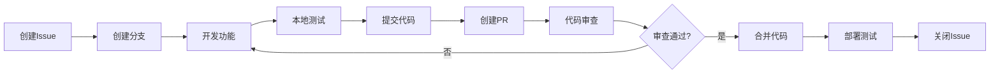

# Git 最佳实践指南

掌握 Git 最佳实践对现代前端开发团队至关重要。本指南涵盖提交规范、代码审查、团队协作等核心实践。

## 📝 提交规范最佳实践

### Conventional Commits 标准

```bash
# 基本格式
<type>(<scope>): <description>

[optional body]

[optional footer(s)]
```

### 提交类型详解

```bash
# ✨ 新功能
feat: 添加用户登录功能
feat(auth): 实现JWT令牌刷新机制
feat(ui): 添加暗黑模式支持

# 🐛 问题修复
fix: 修复移动端布局问题
fix(api): 解决用户数据获取失败
fix(router): 修复路由守卫逻辑错误

# 📝 文档更新
docs: 更新API文档
docs(readme): 添加项目安装说明
docs(contributing): 完善贡献指南

# 💄 代码格式
style: 统一代码缩进格式
style(components): 调整组件样式结构

# ♻️ 代码重构
refactor: 重构用户服务模块
refactor(utils): 优化工具函数性能
refactor(store): 简化状态管理逻辑

# ⚡ 性能优化
perf: 优化图片懒加载性能
perf(bundle): 减少打包体积30%
perf(render): 优化组件渲染性能

# ✅ 测试相关
test: 添加用户登录测试用例
test(e2e): 完善端到端测试覆盖
test(unit): 增加工具函数单元测试

# 🔧 构建/工具
build: 升级webpack到5.0
build(deps): 更新依赖包版本
chore: 配置ESLint规则
ci: 优化GitHub Actions流程
```

### 提交信息最佳实践

```bash
# ✅ 好的提交信息
feat(auth): add OAuth2 login integration

- Implement Google OAuth2 authentication
- Add user profile data synchronization
- Include error handling for failed logins

Closes #123

# ❌ 不好的提交信息
fix bug
update code
changes
```

### 原子性提交原则

```bash
# ✅ 原子性提交 - 每个提交只做一件事
git add src/components/LoginForm.vue
git commit -m "feat(auth): add login form component"

git add src/api/auth.js
git commit -m "feat(auth): add authentication API service"

git add tests/auth.spec.js
git commit -m "test(auth): add authentication tests"

# ❌ 混合提交 - 一个提交做多件事
git add .
git commit -m "add login feature and fix bugs and update docs"
```

## 🔍 代码审查最佳实践

### Pull Request 规范

```markdown
## 📋 变更描述
简要描述本次变更的内容和目的

## 🎯 变更类型
- [ ] 新功能 (feature)
- [ ] 问题修复 (bugfix)
- [ ] 性能优化 (performance)
- [ ] 代码重构 (refactor)
- [ ] 文档更新 (docs)
- [ ] 测试相关 (test)

## 🧪 测试情况
- [ ] 单元测试已通过
- [ ] 集成测试已通过
- [ ] 手动测试已完成
- [ ] 浏览器兼容性测试

## 📸 截图/演示
如有UI变更，请提供截图或GIF演示

## 🔗 相关链接
- 相关Issue: #123
- 设计稿: [Figma链接]
- 文档: [文档链接]

## ✅ 检查清单
- [ ] 代码符合项目规范
- [ ] 已添加必要的测试
- [ ] 文档已更新
- [ ] 无控制台错误
- [ ] 性能影响已评估
```

### 代码审查检查点

```javascript
// ✅ 代码质量检查
// 1. 命名规范
const getUserProfile = async (userId) => {
  // 清晰的函数命名
}

// 2. 错误处理
try {
  const response = await api.getUserData(userId)
  return response.data
} catch (error) {
  console.error('Failed to fetch user data:', error)
  throw new Error('用户数据获取失败')
}

// 3. 类型安全 (TypeScript)
interface UserProfile {
  id: string
  name: string
  email: string
  avatar?: string
}

// 4. 性能考虑
const MemoizedComponent = React.memo(({ data }) => {
  return <div>{data.name}</div>
})
```

### 审查反馈规范

```markdown
# 🔍 审查反馈示例

## 必须修改 (Must Fix)
**问题**: 缺少错误处理
**位置**: `src/api/user.js:15`
**建议**: 添加try-catch块处理API调用失败的情况

## 建议优化 (Suggestion)
**问题**: 可以使用更简洁的写法
**位置**: `src/utils/format.js:8`
**建议**: 考虑使用可选链操作符 `?.` 简化代码

## 疑问 (Question)
**问题**: 这个逻辑的业务场景是什么？
**位置**: `src/components/UserCard.vue:25`
**说明**: 希望了解这段代码的具体用途

## 赞扬 (Praise)
**优点**: 测试覆盖很全面
**位置**: `tests/user.spec.js`
**说明**: 测试用例考虑了各种边界情况，很棒！
```

## 👥 团队协作最佳实践

### 分支管理协作

```bash
# 1. 同步主分支
git checkout main
git pull origin main

# 2. 创建功能分支
git checkout -b feature/user-dashboard

# 3. 定期同步主分支变更
git checkout main
git pull origin main
git checkout feature/user-dashboard
git rebase main  # 或者 git merge main

# 4. 推送前整理提交历史
git rebase -i HEAD~3  # 交互式变基整理提交

# 5. 推送到远程
git push origin feature/user-dashboard
```

### 冲突解决策略

```bash
# 1. 预防冲突
# 频繁同步主分支
git fetch origin
git rebase origin/main

# 2. 解决合并冲突
git merge main
# 手动解决冲突后
git add .
git commit -m "resolve: merge conflicts with main"

# 3. 解决变基冲突
git rebase main
# 解决冲突后
git add .
git rebase --continue

# 4. 使用工具辅助
git config --global merge.tool vscode
git mergetool
```

### 团队工作流程



## 🔧 Git 配置优化

### 全局配置优化

```bash
# 用户信息
git config --global user.name "Your Name"
git config --global user.email "your.email@company.com"

# 编辑器配置
git config --global core.editor "code --wait"

# 默认分支
git config --global init.defaultBranch main

# 自动换行处理
git config --global core.autocrlf input  # macOS/Linux
git config --global core.autocrlf true   # Windows

# 颜色输出
git config --global color.ui auto
git config --global color.branch auto
git config --global color.diff auto
git config --global color.status auto

# 推送策略
git config --global push.default simple

# 拉取策略
git config --global pull.rebase true

# 自动修剪远程分支
git config --global fetch.prune true
```

### 实用别名配置

```bash
# 状态和日志
git config --global alias.st status
git config --global alias.lg "log --oneline --graph --decorate"
git config --global alias.lga "log --oneline --graph --decorate --all"

# 分支操作
git config --global alias.co checkout
git config --global alias.br branch
git config --global alias.sw switch

# 提交操作
git config --global alias.ci commit
git config --global alias.ca "commit --amend"
git config --global alias.unstage "reset HEAD --"

# 差异比较
git config --global alias.df diff
git config --global alias.dfs "diff --staged"

# 远程操作
git config --global alias.pu "push -u origin HEAD"
git config --global alias.pf "push --force-with-lease"

# 清理操作
git config --global alias.cleanup "!git branch --merged | grep -v '\\*\\|main\\|develop' | xargs -n 1 git branch -d"
```

### .gitignore 最佳实践

```bash
# 前端项目 .gitignore 模板

# 依赖目录
node_modules/
bower_components/
jspm_packages/

# 构建输出
dist/
build/
out/
.next/
.nuxt/
.vuepress/dist/

# 缓存目录
.cache/
.parcel-cache/
.vite/
.turbo/

# 环境配置
.env
.env.local
.env.development.local
.env.test.local
.env.production.local

# 日志文件
*.log
logs/
npm-debug.log*
yarn-debug.log*
yarn-error.log*

# 运行时数据
pids/
*.pid
*.seed
*.pid.lock

# IDE 和编辑器
.vscode/
.idea/
*.swp
*.swo
*~

# 操作系统文件
.DS_Store
.DS_Store?
._*
.Spotlight-V100
.Trashes
ehthumbs.db
Thumbs.db

# 测试覆盖率
coverage/
.nyc_output/

# 临时文件
*.tmp
*.temp
.temp/
```

## 📊 Git 工作流监控

### 提交质量指标

```bash
# 查看提交频率
git log --since="1 month ago" --pretty=format:"%ad" --date=short | sort | uniq -c

# 查看作者贡献
git shortlog -sn --since="1 month ago"

# 查看文件修改频率
git log --pretty=format: --name-only --since="1 month ago" | sort | uniq -c | sort -rg

# 查看提交信息规范性
git log --oneline --since="1 month ago" | grep -E "^[a-f0-9]+ (feat|fix|docs|style|refactor|perf|test|chore)"
```

### 分支健康度检查

```bash
#!/bin/bash
# branch-health-check.sh

echo "🔍 检查分支健康度..."

# 检查长期存在的分支
echo "📅 长期存在的分支 (超过30天):"
git for-each-ref --format='%(refname:short) %(committerdate)' refs/heads | \
  awk '$2 < "'$(date -d '30 days ago' '+%Y-%m-%d')'"'

# 检查未合并的分支
echo "🔀 未合并到main的分支:"
git branch --no-merged main

# 检查远程已删除的本地分支
echo "🗑️ 可以清理的本地分支:"
git remote prune origin --dry-run
```

## 💡 高级技巧

### 交互式变基技巧

```bash
# 整理最近3个提交
git rebase -i HEAD~3

# 在交互式编辑器中：
# pick abc1234 feat: add user login
# squash def5678 fix: login validation
# reword ghi9012 docs: update login docs

# 修改历史提交信息
git rebase -i --root  # 从第一个提交开始
```

### 高级搜索技巧

```bash
# 搜索提交内容
git log -S "function_name" --source --all

# 搜索提交信息
git log --grep="login" --oneline

# 搜索作者
git log --author="John Doe" --since="2024-01-01"

# 搜索文件历史
git log --follow -- src/components/LoginForm.vue

# 查找引入bug的提交
git bisect start
git bisect bad HEAD
git bisect good v1.0.0
```

### 工作流自动化

```bash
# 自动化脚本示例
#!/bin/bash
# quick-commit.sh

# 检查工作区状态
if [[ -n $(git status --porcelain) ]]; then
  echo "📝 发现未提交的更改"
  
  # 运行代码检查
  npm run lint:fix
  npm run test:unit
  
  # 提交更改
  git add .
  echo "请输入提交信息:"
  read commit_message
  git commit -m "$commit_message"
  
  echo "✅ 提交完成"
else
  echo "✨ 工作区干净，无需提交"
fi
```

遵循这些最佳实践将显著提升团队的开发效率和代码质量，建议团队制定统一的Git规范并严格执行。
