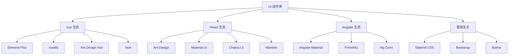
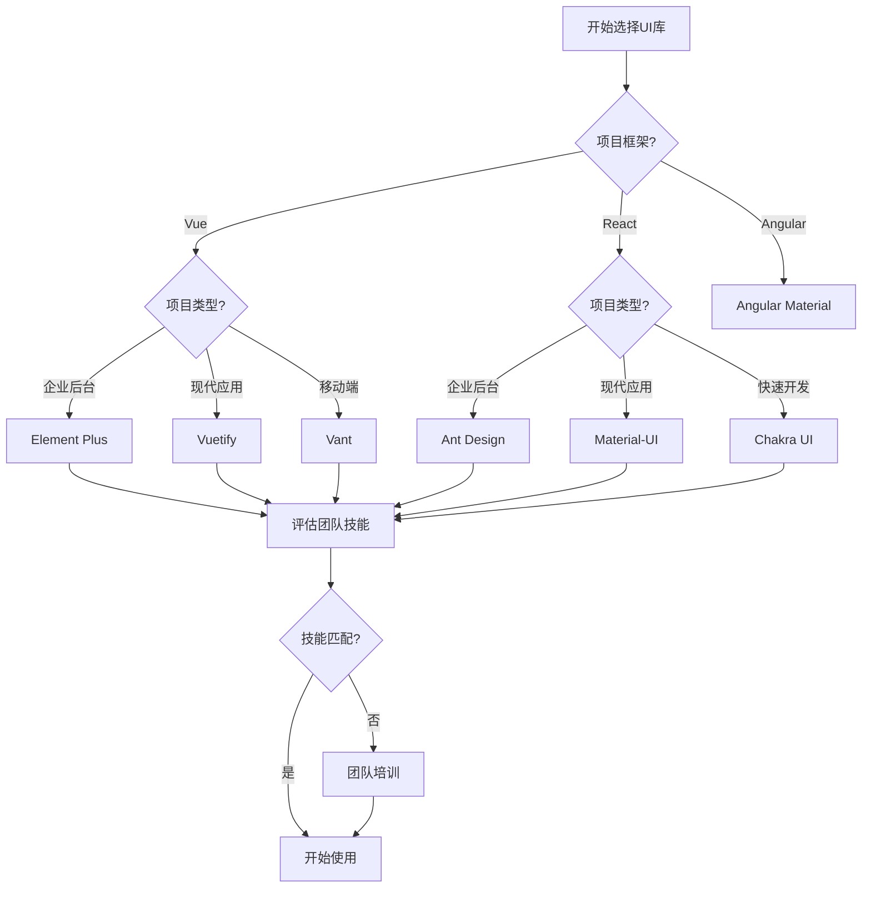

# UI 组件库

UI 组件库是现代前端开发的重要组成部分，它们提供了预构建的界面组件，帮助开发者快速构建美观、一致的用户界面。

## 🎨 组件库生态概览

### 按框架分类



### 按应用场景分类

| 场景类型 | Vue 推荐 | React 推荐 | 特点 |
|----------|----------|------------|------|
| **企业后台** | Element Plus | Ant Design | 组件丰富、表格表单强大 |
| **现代Web** | Vuetify | Material-UI | 设计美观、动效丰富 |
| **移动端H5** | Vant | Ant Design Mobile | 移动优化、触摸友好 |
| **快速原型** | Quasar | Chakra UI | 开箱即用、配置简单 |
| **设计系统** | 自定义 | 自定义 | 品牌一致、高度定制 |

## 🚀 选择指南

### 技术考量因素

#### 1. 框架兼容性
- **Vue 项目**：Element Plus、Vuetify、Ant Design Vue
- **React 项目**：Ant Design、Material-UI、Chakra UI
- **多框架**：考虑Web Components或CSS框架

#### 2. 项目需求匹配
```javascript
// 需求评估清单
const requirements = {
  // 功能需求
  components: ['表格', '表单', '图表', '导航'],
  features: ['国际化', '主题定制', '响应式', '无障碍'],
  
  // 技术需求
  framework: 'Vue 3',
  typescript: true,
  ssr: false,
  
  // 团队需求
  learningCurve: 'low', // low, medium, high
  documentation: 'excellent',
  community: 'active'
}
```

#### 3. 性能考虑
- **包大小**：影响首屏加载时间
- **Tree Shaking**：是否支持按需引入
- **运行时性能**：组件渲染效率
- **构建时间**：开发体验影响

### 决策流程图



## 🛠️ 集成最佳实践

### 1. 按需引入配置

**Vue + Element Plus**
```javascript
// vite.config.js
import { defineConfig } from 'vite'
import vue from '@vitejs/plugin-vue'
import AutoImport from 'unplugin-auto-import/vite'
import Components from 'unplugin-vue-components/vite'
import { ElementPlusResolver } from 'unplugin-vue-components/resolvers'

export default defineConfig({
  plugins: [
    vue(),
    AutoImport({
      resolvers: [ElementPlusResolver()],
    }),
    Components({
      resolvers: [ElementPlusResolver()],
    }),
  ],
})
```

**React + Ant Design**
```javascript
// babel.config.js
module.exports = {
  plugins: [
    ['import', {
      libraryName: 'antd',
      libraryDirectory: 'es',
      style: 'css',
    }]
  ]
}
```

### 2. 主题定制

**CSS 变量方式**
```css
:root {
  --primary-color: #1890ff;
  --success-color: #52c41a;
  --warning-color: #faad14;
  --error-color: #f5222d;
  
  --font-size-base: 14px;
  --border-radius-base: 6px;
  --box-shadow-base: 0 3px 6px -4px rgba(0, 0, 0, 0.12);
}
```

**SCSS 变量方式**
```scss
// 自定义主题变量
$--color-primary: #409eff;
$--color-success: #67c23a;
$--color-warning: #e6a23c;
$--color-danger: #f56c6c;

// 导入组件库样式
@import '~element-plus/theme-chalk/index.scss';
```

### 3. 全局配置

```javascript
// main.js
import { createApp } from 'vue'
import ElementPlus from 'element-plus'
import zhCn from 'element-plus/dist/locale/zh-cn.mjs'

const app = createApp(App)

app.use(ElementPlus, {
  locale: zhCn,
  size: 'default', // large, default, small
  zIndex: 3000,
})
```

## 📊 性能优化

### 1. 包大小优化
```javascript
// 分析包大小
import { BundleAnalyzerPlugin } from 'webpack-bundle-analyzer'

module.exports = {
  plugins: [
    new BundleAnalyzerPlugin({
      analyzerMode: 'static',
      openAnalyzer: false,
    })
  ]
}
```

### 2. 懒加载组件
```javascript
// 路由级懒加载
const routes = [
  {
    path: '/admin',
    component: () => import('./views/Admin.vue')
  }
]

// 组件级懒加载
const HeavyComponent = defineAsyncComponent(() =>
  import('./components/HeavyComponent.vue')
)
```

### 3. CDN 优化
```html
<!-- 使用CDN加载组件库 -->
<link rel="stylesheet" href="https://unpkg.com/element-plus/dist/index.css">
<script src="https://unpkg.com/vue@next"></script>
<script src="https://unpkg.com/element-plus"></script>
```

## 🎯 实战建议

### 新项目选择
1. **评估项目需求**：功能复杂度、设计要求、性能需求
2. **考虑团队技能**：学习成本、维护能力
3. **查看社区活跃度**：更新频率、问题响应、生态发展
4. **进行小规模试用**：搭建demo验证可行性

### 现有项目迁移
1. **渐进式迁移**：新功能使用新组件库
2. **兼容性处理**：保证现有功能不受影响
3. **样式隔离**：避免样式冲突
4. **团队培训**：确保团队掌握新工具

### 长期维护
1. **版本管理**：及时更新、测试兼容性
2. **定制组件**：基于组件库封装业务组件
3. **文档维护**：记录定制内容和使用规范
4. **性能监控**：定期检查包大小和性能指标

---

选择合适的UI组件库是前端项目成功的重要因素。建议根据项目特点、团队情况和长期规划来做决策！

🎨 **探索适合你项目的UI组件库吧！**

## 📚 深入学习

- [Vue UI 组件库详解](/frontend/ui/vue/) - Element Plus、Vuetify等详细介绍
- [React UI 组件库对比](/frontend/ui/react/) - Ant Design、Material-UI等深入分析
