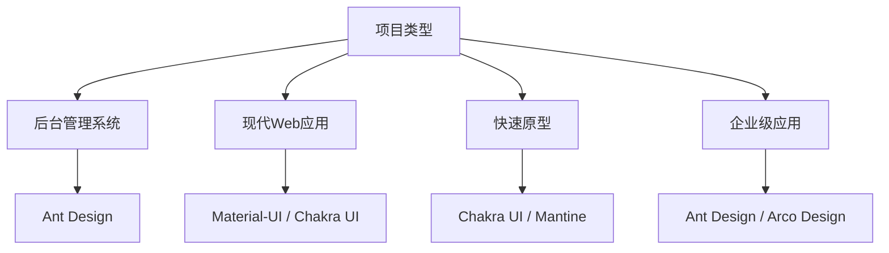

# React UI 组件库

React 生态系统拥有最丰富的 UI 组件库生态，从企业级到设计系统，应有尽有。

## 🎨 主流 React UI 库

### Ant Design
**企业级 UI 设计语言**

- **特点**：设计规范完善、组件质量高、企业级特性
- **适用场景**：后台管理系统、企业应用、数据展示
- **安装**：`npm install antd`

```jsx
import { Button, Space, Table } from 'antd'

const App = () => (
  <Space direction="vertical">
    <Space wrap>
      <Button type="primary">Primary Button</Button>
      <Button>Default Button</Button>
      <Button type="dashed">Dashed Button</Button>
    </Space>
    <Table 
      dataSource={data} 
      columns={columns} 
      pagination={false}
    />
  </Space>
)
```

### Material-UI (MUI)
**React 版 Material Design**

- **特点**：Google Material Design、主题系统强大
- **适用场景**：现代 Web 应用、移动端适配
- **安装**：`npm install @mui/material @emotion/react @emotion/styled`

```jsx
import { Button, Stack, Card, CardContent } from '@mui/material'

function App() {
  return (
    <Stack spacing={2} direction="row">
      <Button variant="contained">Contained</Button>
      <Button variant="outlined">Outlined</Button>
      <Button variant="text">Text</Button>
    </Stack>
  )
}
```

### Chakra UI
**简单、模块化和易用的组件库**

- **特点**：API 简洁、主题定制灵活、TypeScript 友好
- **适用场景**：快速原型、现代应用、设计系统
- **安装**：`npm install @chakra-ui/react @emotion/react @emotion/styled framer-motion`

```jsx
import { Button, Stack, Box } from '@chakra-ui/react'

function App() {
  return (
    <Stack direction="row" spacing={4}>
      <Button colorScheme="blue">Button</Button>
      <Button colorScheme="green">Button</Button>
      <Button colorScheme="red">Button</Button>
    </Stack>
  )
}
```

### React Bootstrap
**Bootstrap 的 React 实现**

- **特点**：Bootstrap 生态、响应式设计
- **适用场景**：传统 Web 项目、快速开发
- **安装**：`npm install react-bootstrap bootstrap`

## 🚀 新兴优秀组件库

### Mantine
**功能丰富的现代 React 组件库**

- **特点**：组件丰富、Hooks 生态、深色模式
- **适用场景**：现代应用、复杂交互
- **安装**：`npm install @mantine/core @mantine/hooks`

### Arco Design
**字节跳动企业级设计语言**

- **特点**：设计精美、性能优秀、国际化
- **适用场景**：企业应用、设计系统
- **安装**：`npm install @arco-design/web-react`

### Semi Design
**抖音前端团队设计系统**

- **特点**：设计系统完整、组件现代化
- **适用场景**：企业级应用、设计驱动开发

## 📊 组件库对比分析

### 功能特性对比

| 特性 | Ant Design | Material-UI | Chakra UI | Mantine |
|------|------------|-------------|-----------|---------|
| **组件数量** | 60+ | 50+ | 40+ | 100+ |
| **TypeScript** | ✅ | ✅ | ✅ | ✅ |
| **主题定制** | ✅ | ✅ | ✅ | ✅ |
| **深色模式** | ✅ | ✅ | ✅ | ✅ |
| **国际化** | ✅ | ✅ | ⚠️ | ✅ |
| **移动端** | ⚠️ | ✅ | ✅ | ✅ |
| **包大小** | 大 | 中等 | 小 | 中等 |

### 使用场景推荐



## 🎯 快速上手示例

### Ant Design 完整示例

```jsx
import React, { useState } from 'react'
import {
  Layout, Menu, Table, Form, Input, Button, 
  Space, Popconfirm, message
} from 'antd'
import {
  UserOutlined, SettingOutlined, DeleteOutlined, EditOutlined
} from '@ant-design/icons'

const { Header, Sider, Content } = Layout

const App = () => {
  const [data, setData] = useState([
    { key: '1', name: '张三', age: 32, address: '北京' },
    { key: '2', name: '李四', age: 42, address: '上海' }
  ])

  const columns = [
    { title: '姓名', dataIndex: 'name', key: 'name' },
    { title: '年龄', dataIndex: 'age', key: 'age' },
    { title: '地址', dataIndex: 'address', key: 'address' },
    {
      title: '操作',
      key: 'action',
      render: (_, record) => (
        <Space size="middle">
          <Button icon={<EditOutlined />} size="small">编辑</Button>
          <Popconfirm
            title="确定删除吗？"
            onConfirm={() => handleDelete(record.key)}
          >
            <Button icon={<DeleteOutlined />} size="small" danger>删除</Button>
          </Popconfirm>
        </Space>
      ),
    },
  ]

  const handleDelete = (key) => {
    setData(data.filter(item => item.key !== key))
    message.success('删除成功')
  }

  return (
    <Layout style={{ minHeight: '100vh' }}>
      <Sider>
        <Menu theme="dark" mode="inline" defaultSelectedKeys={['1']}>
          <Menu.Item key="1" icon={<UserOutlined />}>
            用户管理
          </Menu.Item>
          <Menu.Item key="2" icon={<SettingOutlined />}>
            系统设置
          </Menu.Item>
        </Menu>
      </Sider>
      <Layout>
        <Header style={{ background: '#fff', padding: '0 16px' }}>
          <h2>管理后台</h2>
        </Header>
        <Content style={{ margin: '16px' }}>
          <div style={{ background: '#fff', padding: 24 }}>
            <Table columns={columns} dataSource={data} />
          </div>
        </Content>
      </Layout>
    </Layout>
  )
}

export default App
```

### Material-UI 主题定制

```jsx
import { createTheme, ThemeProvider } from '@mui/material/styles'
import { CssBaseline, Button, Box } from '@mui/material'

const theme = createTheme({
  palette: {
    primary: {
      main: '#1976d2',
    },
    secondary: {
      main: '#dc004e',
    },
    background: {
      default: '#f5f5f5',
    },
  },
  typography: {
    h1: {
      fontSize: '2rem',
      fontWeight: 600,
    },
  },
  components: {
    MuiButton: {
      styleOverrides: {
        root: {
          borderRadius: 8,
        },
      },
    },
  },
})

function App() {
  return (
    <ThemeProvider theme={theme}>
      <CssBaseline />
      <Box sx={{ p: 3 }}>
        <Button variant="contained" color="primary">
          自定义主题按钮
        </Button>
      </Box>
    </ThemeProvider>
  )
}
```

### Chakra UI 响应式设计

```jsx
import { 
  Box, Stack, Button, useColorMode, 
  useColorModeValue, IconButton 
} from '@chakra-ui/react'
import { SunIcon, MoonIcon } from '@chakra-ui/icons'

function App() {
  const { colorMode, toggleColorMode } = useColorMode()
  const bg = useColorModeValue('white', 'gray.800')
  const color = useColorModeValue('black', 'white')

  return (
    <Box bg={bg} color={color} minH="100vh" p={4}>
      <Stack direction="row" spacing={4} align="center">
        <Button
          size={{ base: 'sm', md: 'md' }}
          colorScheme="blue"
          variant="solid"
        >
          响应式按钮
        </Button>
        <IconButton
          aria-label="Toggle color mode"
          icon={colorMode === 'light' ? <MoonIcon /> : <SunIcon />}
          onClick={toggleColorMode}
        />
      </Stack>
    </Box>
  )
}
```

## 🔧 最佳实践

### 按需引入优化

```javascript
// babel-plugin-import 配置 (Ant Design)
{
  "plugins": [
    ["import", {
      "libraryName": "antd",
      "libraryDirectory": "es",
      "style": "css"
    }]
  ]
}

// Tree shaking (Material-UI)
import Button from '@mui/material/Button'
import TextField from '@mui/material/TextField'
```

### 主题系统设计

```javascript
// 设计令牌系统
const tokens = {
  colors: {
    primary: {
      50: '#e3f2fd',
      500: '#2196f3',
      900: '#0d47a1'
    }
  },
  spacing: {
    xs: '4px',
    sm: '8px',
    md: '16px',
    lg: '24px',
    xl: '32px'
  },
  typography: {
    fontFamily: 'Roboto, sans-serif',
    fontSize: {
      sm: '14px',
      md: '16px',
      lg: '18px'
    }
  }
}
```

### 组件封装策略

```jsx
// 业务组件封装
import { Button as AntButton } from 'antd'
import { LoadingOutlined } from '@ant-design/icons'

const Button = ({ loading, children, ...props }) => {
  return (
    <AntButton
      {...props}
      loading={loading}
      icon={loading ? <LoadingOutlined /> : props.icon}
    >
      {children}
    </AntButton>
  )
}

export default Button
```

## 📚 学习资源

### 官方文档
- [Ant Design](https://ant.design/)
- [Material-UI](https://mui.com/)
- [Chakra UI](https://chakra-ui.com/)
- [Mantine](https://mantine.dev/)
- [React Bootstrap](https://react-bootstrap.github.io/)

### 设计系统
- Ant Design 设计语言
- Material Design 规范
- 设计令牌系统

### 实战项目
- 管理后台模板
- 电商网站界面
- 数据可视化大屏
- 移动端应用界面

---

选择合适的 React UI 组件库是项目成功的关键，建议根据项目需求、设计要求和团队技术栈来选择！

🎨 **开始构建优秀的 React 应用界面吧！**
