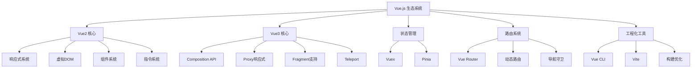

# Vue.js 深度学习指南

Vue.js 是一套用于构建用户界面的渐进式框架，以其简洁的API、强大的功能和优秀的开发体验而广受欢迎。本指南深入解析Vue的核心原理和最佳实践。

## 🎯 核心架构概览



## 📚 深度学习路径

### 🔥 [Vue2 核心原理](./vue2/)

深入理解Vue2的核心实现机制：

- **[响应式系统](./vue2/reactivity.md)**：Object.defineProperty实现原理
- **[虚拟DOM与Diff算法](./vue2/virtual-dom.md)**：高效更新机制
- **[双向绑定机制](./vue2/two-way-binding.md)**：v-model实现原理
- **[生命周期深度解析](./vue2/lifecycle.md)**：组件生命周期钩子

```javascript
// Vue2响应式核心
function defineReactive(obj, key, val) {
  const dep = new Dep()
  Object.defineProperty(obj, key, {
    get() {
      if (Dep.target) {
        dep.depend() // 依赖收集
      }
      return val
    },
    set(newVal) {
      if (newVal === val) return
      val = newVal
      dep.notify() // 派发更新
    }
  })
}
```

### ⚡ [Vue3 现代化特性](./vue3/)

探索Vue3的革命性改进：

- **[Proxy响应式系统](./vue3/reactivity.md)**：更强大的数据劫持
- **[Composition API深度解析](./vue3/composition-api.md)**：逻辑复用新范式
- **[性能优化机制](./vue3/performance.md)**：编译时和运行时优化

```javascript
// Vue3 Composition API
export default {
  setup() {
    const count = ref(0)
    const doubled = computed(() => count.value * 2)

    const increment = () => {
      count.value++
    }

    onMounted(() => {
      console.log('组件已挂载')
    })

    return {
      count,
      doubled,
      increment
    }
  }
}
```

### 🗂️ [状态管理深度解析](./state/)

掌握Vue应用的状态管理：

- **[Vuex深度解析](./state/vuex.md)**：集中式状态管理
- **[Pinia现代化方案](./state/pinia.md)**：Vue3官方推荐
- **状态管理模式对比**：选择最适合的方案

```javascript
// Pinia Store
export const useUserStore = defineStore('user', () => {
  const user = ref(null)
  const isLoggedIn = computed(() => !!user.value)

  async function login(credentials) {
    const response = await api.login(credentials)
    user.value = response.data.user
  }

  return { user, isLoggedIn, login }
})
```

### 🛣️ [Vue Router路由系统](./router/)

构建单页面应用的路由解决方案：

- **[核心原理深度解析](./router/core.md)**：路由匹配与导航机制
- **[导航守卫与权限控制](./router/guards.md)**：路由级权限管理
- **[动态路由实现](./router/dynamic.md)**：灵活的路由配置

```javascript
// 路由守卫权限控制
router.beforeEach(async (to, from) => {
  if (to.meta.requiresAuth && !isAuthenticated()) {
    return '/login'
  }

  if (to.meta.roles && !hasAnyRole(to.meta.roles)) {
    return '/forbidden'
  }
})
```

### 🚀 [性能优化与工程化](./optimization/)

打造高性能的Vue应用：

- **[构建优化深度解析](./optimization/build.md)**：Webpack/Vite优化策略
- **[SSR服务端渲染](./optimization/ssr.md)**：首屏性能与SEO优化

```javascript
// 构建优化配置
export default defineConfig({
  build: {
    rollupOptions: {
      output: {
        manualChunks: {
          vue: ['vue', 'vue-router'],
          vendor: ['lodash-es', 'axios']
        }
      }
    }
  }
})
```

## 🎨 核心特性对比

### Vue2 vs Vue3 关键差异

| 特性 | Vue2 | Vue3 |
|------|------|------|
| **响应式实现** | Object.defineProperty | Proxy |
| **API风格** | Options API | Composition API |
| **TypeScript支持** | 需要额外配置 | 原生支持 |
| **包体积** | ~34KB | ~10KB (tree-shakable) |
| **性能** | 基准性能 | 快20%-40% |
| **IE支持** | 支持IE9+ | 不支持IE |

### 状态管理方案对比

| 特性 | Vuex | Pinia |
|------|------|-------|
| **API设计** | Options风格 | Composition风格 |
| **TypeScript** | 需要复杂类型声明 | 原生支持 |
| **DevTools** | 完整支持 | 更好的集成 |
| **包大小** | ~2.6KB | ~1.3KB |
| **学习曲线** | 相对陡峭 | 更加直观 |

## 🛠️ 开发工具生态

### 构建工具
- **[Vue CLI](https://cli.vuejs.org/)**：Vue2项目脚手架
- **[Vite](https://vitejs.dev/)**：Vue3推荐构建工具
- **[Nuxt.js](https://nuxtjs.org/)**：Vue全栈框架

### 开发工具
- **[Vue DevTools](https://devtools.vuejs.org/)**：官方调试工具
- **[Volar](https://marketplace.visualstudio.com/items?itemName=Vue.volar)**：VS Code语言支持
- **[Vue Language Features](https://marketplace.visualstudio.com/items?itemName=Vue.vscode-typescript-vue-plugin)**：TypeScript支持

### UI组件库
- **[Element Plus](https://element-plus.org/)**：Vue3企业级组件库
- **[Ant Design Vue](https://antdv.com/)**：企业级UI设计语言
- **[Vuetify](https://vuetifyjs.com/)**：Material Design组件库

## 🎯 学习建议

### 初学者路径

1. **Vue基础概念** → 理解响应式、组件、指令
2. **项目实践** → 构建简单的Todo应用
3. **生态系统** → 学习Vue Router和状态管理
4. **工程化实践** → 掌握构建工具和最佳实践

### 进阶开发者

1. **源码阅读** → 深入理解Vue内部机制
2. **性能优化** → 掌握各种优化技巧
3. **架构设计** → 大型应用架构实践
4. **生态贡献** → 参与开源项目

### 企业级应用

1. **技术选型** → Vue2/Vue3选择策略
2. **架构设计** → 微前端、SSR等方案
3. **团队协作** → 代码规范、工程化流程
4. **性能监控** → 应用性能监控与优化

## � 推荐学习资源

### 官方资源
- [Vue.js 官方文档](https://vuejs.org/)
- [Vue.js 官方教程](https://vuejs.org/tutorial/)
- [Vue.js 官方示例](https://github.com/vuejs/vue-next/tree/master/packages/vue/examples)

### 社区资源
- [Vue Mastery](https://www.vuemastery.com/)：高质量Vue课程
- [Vue School](https://vueschool.io/)：Vue学习平台
- [Vue.js 中文社区](https://vue-js.com/)：中文学习资源

### 实践项目
- [Vue HackerNews Clone](https://github.com/vuejs/vue-hackernews-2.0)
- [Vue TodoMVC](https://github.com/vuejs/vue-todomvc)
- [Vue Admin Template](https://github.com/PanJiaChen/vue-admin-template)

---

🚀 **开始你的Vue.js深度学习之旅！** 从核心原理到工程实践，从Vue2到Vue3，全面掌握现代前端开发技能。
