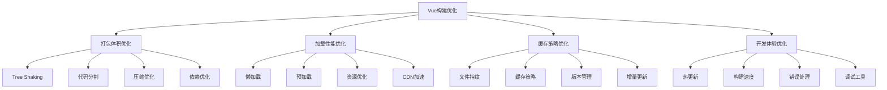

# Vue 构建优化深度解析

Vue应用的构建优化是提升用户体验和开发效率的关键环节，涉及打包体积、加载速度、缓存策略等多个方面。

## 🎯 构建优化概览



## 🔧 Webpack构建优化

### 1. 基础配置优化

```javascript
// vue.config.js
const path = require('path')
const CompressionPlugin = require('compression-webpack-plugin')
const BundleAnalyzerPlugin = require('webpack-bundle-analyzer').BundleAnalyzerPlugin

module.exports = {
  // 生产环境关闭source map
  productionSourceMap: false,
  
  // 配置webpack
  configureWebpack: config => {
    if (process.env.NODE_ENV === 'production') {
      // 生产环境优化
      config.plugins.push(
        // Gzip压缩
        new CompressionPlugin({
          algorithm: 'gzip',
          test: /\.(js|css|html|svg)$/,
          threshold: 8192,
          minRatio: 0.8
        })
      )
      
      // 打包分析
      if (process.env.ANALYZE) {
        config.plugins.push(new BundleAnalyzerPlugin())
      }
      
      // 优化配置
      config.optimization = {
        ...config.optimization,
        // 代码分割
        splitChunks: {
          chunks: 'all',
          cacheGroups: {
            // 第三方库
            vendor: {
              name: 'chunk-vendors',
              test: /[\\/]node_modules[\\/]/,
              priority: 10,
              chunks: 'initial'
            },
            // 公共模块
            common: {
              name: 'chunk-common',
              minChunks: 2,
              priority: 5,
              chunks: 'initial',
              reuseExistingChunk: true
            },
            // UI库单独打包
            elementUI: {
              name: 'chunk-elementUI',
              priority: 20,
              test: /[\\/]node_modules[\\/]_?element-ui(.*)/
            }
          }
        },
        // 运行时代码单独打包
        runtimeChunk: {
          name: 'runtime'
        }
      }
    }
  },
  
  // 链式配置
  chainWebpack: config => {
    // 别名配置
    config.resolve.alias
      .set('@', path.resolve(__dirname, 'src'))
      .set('components', path.resolve(__dirname, 'src/components'))
      .set('assets', path.resolve(__dirname, 'src/assets'))
    
    // 图片优化
    config.module
      .rule('images')
      .test(/\.(png|jpe?g|gif|svg)(\?.*)?$/)
      .use('image-webpack-loader')
      .loader('image-webpack-loader')
      .options({
        mozjpeg: { progressive: true, quality: 80 },
        optipng: { enabled: false },
        pngquant: { quality: [0.65, 0.8], speed: 4 },
        gifsicle: { interlaced: false }
      })
    
    // 预加载优化
    config.plugin('preload').tap(options => {
      options[0] = {
        rel: 'preload',
        include: 'initial',
        fileBlacklist: [/\.map$/, /hot-update\.js$/]
      }
      return options
    })
    
    // 预获取优化
    config.plugin('prefetch').tap(options => {
      options[0].fileBlacklist = options[0].fileBlacklist || []
      options[0].fileBlacklist.push(/runtime\..*\.js$/)
      return options
    })
  }
}
```

### 2. 代码分割策略

```javascript
// 路由级代码分割
const routes = [
  {
    path: '/home',
    component: () => import(/* webpackChunkName: "home" */ '@/views/Home.vue')
  },
  {
    path: '/about',
    component: () => import(/* webpackChunkName: "about" */ '@/views/About.vue')
  },
  {
    path: '/admin',
    component: () => import(/* webpackChunkName: "admin" */ '@/views/admin/Index.vue')
  }
]

// 组件级代码分割
export default {
  components: {
    // 异步组件
    AsyncComponent: () => import('./AsyncComponent.vue'),
    
    // 带加载状态的异步组件
    AsyncComponentWithLoading: () => ({
      component: import('./AsyncComponent.vue'),
      loading: LoadingComponent,
      error: ErrorComponent,
      delay: 200,
      timeout: 3000
    })
  }
}

// 第三方库按需加载
// babel.config.js
module.exports = {
  plugins: [
    [
      'import',
      {
        libraryName: 'element-ui',
        libraryDirectory: 'lib',
        styleLibraryName: 'theme-chalk'
      },
      'element-ui'
    ],
    [
      'import',
      {
        libraryName: 'lodash',
        libraryDirectory: '',
        camel2DashComponentName: false
      },
      'lodash'
    ]
  ]
}
```

### 3. Tree Shaking优化

```javascript
// package.json
{
  "sideEffects": [
    "*.css",
    "*.scss",
    "*.vue",
    "./src/utils/polyfills.js"
  ]
}

// 工具函数模块化
// utils/index.js
export { default as debounce } from './debounce'
export { default as throttle } from './throttle'
export { default as deepClone } from './deepClone'

// 使用具名导入
import { debounce, throttle } from '@/utils'

// 避免导入整个库
// ❌ 错误方式
import _ from 'lodash'

// ✅ 正确方式
import debounce from 'lodash/debounce'
import throttle from 'lodash/throttle'

// 或使用babel-plugin-import
import { debounce, throttle } from 'lodash'
```

### 4. 依赖优化

```javascript
// webpack.config.js
module.exports = {
  resolve: {
    // 优化模块解析
    modules: [
      path.resolve(__dirname, 'src'),
      'node_modules'
    ],
    
    // 优化扩展名解析
    extensions: ['.js', '.vue', '.json'],
    
    // 优化别名
    alias: {
      'vue$': 'vue/dist/vue.runtime.esm.js',
      '@': path.resolve(__dirname, 'src')
    }
  },
  
  // 外部依赖
  externals: {
    vue: 'Vue',
    'vue-router': 'VueRouter',
    vuex: 'Vuex',
    axios: 'axios'
  },
  
  // DLL优化
  plugins: [
    new webpack.DllReferencePlugin({
      context: __dirname,
      manifest: require('./dll/vendor-manifest.json')
    })
  ]
}

// DLL配置 webpack.dll.config.js
const webpack = require('webpack')
const path = require('path')

module.exports = {
  entry: {
    vendor: [
      'vue',
      'vue-router',
      'vuex',
      'axios',
      'element-ui'
    ]
  },
  output: {
    path: path.resolve(__dirname, 'dll'),
    filename: '[name].dll.js',
    library: '[name]_library'
  },
  plugins: [
    new webpack.DllPlugin({
      path: path.resolve(__dirname, 'dll/[name]-manifest.json'),
      name: '[name]_library'
    })
  ]
}
```

## ⚡ Vite构建优化

### 1. Vite配置优化

```javascript
// vite.config.js
import { defineConfig } from 'vite'
import vue from '@vitejs/plugin-vue'
import { resolve } from 'path'
import { visualizer } from 'rollup-plugin-visualizer'
import viteCompression from 'vite-plugin-compression'

export default defineConfig({
  plugins: [
    vue(),
    
    // Gzip压缩
    viteCompression({
      verbose: true,
      disable: false,
      threshold: 10240,
      algorithm: 'gzip',
      ext: '.gz'
    }),
    
    // 打包分析
    visualizer({
      filename: 'dist/stats.html',
      open: true,
      gzipSize: true
    })
  ],
  
  // 别名配置
  resolve: {
    alias: {
      '@': resolve(__dirname, 'src'),
      'components': resolve(__dirname, 'src/components'),
      'utils': resolve(__dirname, 'src/utils')
    }
  },
  
  // 构建配置
  build: {
    // 目标浏览器
    target: 'es2015',
    
    // 输出目录
    outDir: 'dist',
    
    // 静态资源目录
    assetsDir: 'assets',
    
    // 小于此阈值的导入或引用资源将内联为base64编码
    assetsInlineLimit: 4096,
    
    // 启用CSS代码拆分
    cssCodeSplit: true,
    
    // 构建后是否生成source map文件
    sourcemap: false,
    
    // 自定义底层的Rollup打包配置
    rollupOptions: {
      input: {
        main: resolve(__dirname, 'index.html')
      },
      output: {
        // 分包策略
        manualChunks: {
          // 将React相关库打包成单独的chunk
          vue: ['vue', 'vue-router'],
          
          // 将组件库的代码打包
          'element-plus': ['element-plus'],
          
          // 将工具库打包
          utils: ['lodash-es', 'dayjs']
        },
        
        // 用于从入口点创建的块的打包输出格式
        entryFileNames: 'js/[name]-[hash].js',
        
        // 用于命名代码拆分时创建的共享块的输出命名
        chunkFileNames: 'js/[name]-[hash].js',
        
        // 用于输出静态资源的命名
        assetFileNames: (assetInfo) => {
          const info = assetInfo.name.split('.')
          let extType = info[info.length - 1]
          
          if (/\.(mp4|webm|ogg|mp3|wav|flac|aac)(\?.*)?$/i.test(assetInfo.name)) {
            extType = 'media'
          } else if (/\.(png|jpe?g|gif|svg)(\?.*)?$/.test(assetInfo.name)) {
            extType = 'img'
          } else if (/\.(woff2?|eot|ttf|otf)(\?.*)?$/i.test(assetInfo.name)) {
            extType = 'fonts'
          }
          
          return `${extType}/[name]-[hash].[ext]`
        }
      }
    },
    
    // 压缩配置
    minify: 'terser',
    terserOptions: {
      compress: {
        drop_console: true,
        drop_debugger: true
      }
    }
  },
  
  // 开发服务器配置
  server: {
    host: '0.0.0.0',
    port: 3000,
    open: true,
    cors: true,
    
    // 代理配置
    proxy: {
      '/api': {
        target: 'http://localhost:8080',
        changeOrigin: true,
        rewrite: path => path.replace(/^\/api/, '')
      }
    }
  },
  
  // 预构建配置
  optimizeDeps: {
    include: [
      'vue',
      'vue-router',
      'pinia',
      'axios',
      'element-plus'
    ],
    exclude: ['@iconify/iconify']
  }
})
```

### 2. 预构建优化

```javascript
// vite.config.js
export default defineConfig({
  optimizeDeps: {
    // 强制预构建链接的包
    include: [
      'vue',
      'vue-router',
      'pinia',
      'axios',
      'lodash-es',
      'element-plus/es',
      'element-plus/es/components/button/style/css',
      'element-plus/es/components/input/style/css'
    ],
    
    // 排除预构建
    exclude: [
      '@iconify/iconify',
      'virtual:pwa-register'
    ],
    
    // 自定义esbuild选项
    esbuildOptions: {
      target: 'es2020',
      supported: {
        'top-level-await': true
      }
    }
  }
})
```

## 📦 资源优化

### 1. 图片优化

```javascript
// 图片压缩和格式转换
// vite.config.js
import { defineConfig } from 'vite'
import { createSvgIconsPlugin } from 'vite-plugin-svg-icons'
import viteImageOptimize from 'vite-plugin-imagemin'

export default defineConfig({
  plugins: [
    // SVG图标优化
    createSvgIconsPlugin({
      iconDirs: [resolve(process.cwd(), 'src/assets/icons')],
      symbolId: 'icon-[dir]-[name]'
    }),
    
    // 图片压缩
    viteImageOptimize({
      gifsicle: { optimizationLevel: 7, interlaced: false },
      mozjpeg: { quality: 80 },
      optipng: { optimizationLevel: 7 },
      pngquant: { quality: [0.65, 0.8], speed: 4 },
      svgo: {
        plugins: [
          { name: 'removeViewBox', active: false },
          { name: 'removeEmptyAttrs', active: false }
        ]
      }
    })
  ]
})

// 响应式图片组件
<template>
  <picture>
    <source 
      :srcset="webpSrcset" 
      type="image/webp"
      v-if="supportsWebp"
    >
    <source :srcset="jpegSrcset" type="image/jpeg">
    
  </picture>
</template>

<script>
export default {
  name: 'OptimizedImage',
  props: {
    src: String,
    alt: String,
    sizes: String,
    lazy: { type: Boolean, default: true }
  },
  
  computed: {
    supportsWebp() {
      return this.checkWebpSupport()
    },
    
    webpSrcset() {
      return this.generateSrcset(this.src, 'webp')
    },
    
    jpegSrcset() {
      return this.generateSrcset(this.src, 'jpeg')
    },
    
    fallbackSrc() {
      return this.src
    }
  },
  
  methods: {
    checkWebpSupport() {
      const canvas = document.createElement('canvas')
      return canvas.toDataURL('image/webp').indexOf('data:image/webp') === 0
    },
    
    generateSrcset(src, format) {
      const sizes = [320, 640, 960, 1280, 1920]
      return sizes.map(size => 
        `${this.getOptimizedUrl(src, size, format)} ${size}w`
      ).join(', ')
    },
    
    getOptimizedUrl(src, width, format) {
      // 根据CDN或图片服务生成优化后的URL
      return `${src}?w=${width}&f=${format}&q=80`
    }
  }
}
</script>
```

### 2. 字体优化

```css
/* 字体预加载 */
<link rel="preload" href="/fonts/main.woff2" as="font" type="font/woff2" crossorigin>

/* 字体显示策略 */
@font-face {
  font-family: 'CustomFont';
  src: url('/fonts/custom.woff2') format('woff2'),
       url('/fonts/custom.woff') format('woff');
  font-display: swap; /* 字体交换策略 */
  font-weight: 400;
  font-style: normal;
}

/* 字体子集化 */
@font-face {
  font-family: 'ChineseFont';
  src: url('/fonts/chinese-subset.woff2') format('woff2');
  unicode-range: U+4E00-9FFF; /* 中文字符范围 */
}
```

### 3. CSS优化

```javascript
// PostCSS配置
// postcss.config.js
module.exports = {
  plugins: [
    require('autoprefixer'),
    require('cssnano')({
      preset: ['default', {
        discardComments: { removeAll: true },
        normalizeWhitespace: false
      }]
    }),
    require('@fullhuman/postcss-purgecss')({
      content: ['./src/**/*.vue', './src/**/*.js', './public/index.html'],
      defaultExtractor: content => content.match(/[\w-/:]+(?<!:)/g) || [],
      safelist: [
        /-(leave|enter|appear)(|-(to|from|active))$/,
        /^(?!(|.*?:)cursor-move).+-move$/,
        /^router-link(|-exact)-active$/
      ]
    })
  ]
}

// CSS-in-JS优化
// 使用CSS变量减少重复
:root {
  --primary-color: #409eff;
  --success-color: #67c23a;
  --warning-color: #e6a23c;
  --danger-color: #f56c6c;
  
  --font-size-small: 12px;
  --font-size-base: 14px;
  --font-size-large: 16px;
  
  --border-radius: 4px;
  --box-shadow: 0 2px 12px 0 rgba(0, 0, 0, 0.1);
}

// 关键CSS内联
// build/inline-critical-css.js
const critical = require('critical')

critical.generate({
  inline: true,
  base: 'dist/',
  src: 'index.html',
  dest: 'index.html',
  width: 1300,
  height: 900,
  minify: true
})
```

## 🚀 加载性能优化

### 1. 资源预加载策略

```html
<!-- DNS预解析 -->
<link rel="dns-prefetch" href="//cdn.example.com">

<!-- 预连接 -->
<link rel="preconnect" href="https://fonts.googleapis.com" crossorigin>

<!-- 资源预加载 -->
<link rel="preload" href="/critical.css" as="style">
<link rel="preload" href="/hero-image.jpg" as="image">

<!-- 资源预获取 -->
<link rel="prefetch" href="/next-page.js">

<!-- 模块预加载 -->
<link rel="modulepreload" href="/modules/app.js">
```

### 2. 智能预加载

```javascript
// 智能预加载服务
class IntelligentPreloader {
  constructor() {
    this.observer = null
    this.preloadedResources = new Set()
    this.preloadQueue = []
    this.isPreloading = false
  }
  
  init() {
    this.setupIntersectionObserver()
    this.setupIdleCallback()
    this.setupNetworkAwarePreloading()
  }
  
  // 视口预加载
  setupIntersectionObserver() {
    this.observer = new IntersectionObserver((entries) => {
      entries.forEach(entry => {
        if (entry.isIntersecting) {
          const link = entry.target
          const href = link.getAttribute('data-preload')
          if (href) {
            this.preloadResource(href)
          }
        }
      })
    }, { rootMargin: '50px' })
  }
  
  // 空闲时预加载
  setupIdleCallback() {
    if ('requestIdleCallback' in window) {
      requestIdleCallback(() => {
        this.processPreloadQueue()
      })
    }
  }
  
  // 网络感知预加载
  setupNetworkAwarePreloading() {
    if ('connection' in navigator) {
      const connection = navigator.connection
      
      // 根据网络状况调整预加载策略
      if (connection.effectiveType === '4g') {
        this.enableAggressivePreloading()
      } else if (connection.effectiveType === '3g') {
        this.enableConservativePreloading()
      } else {
        this.disablePreloading()
      }
    }
  }
  
  preloadResource(url) {
    if (this.preloadedResources.has(url)) return
    
    const link = document.createElement('link')
    link.rel = 'prefetch'
    link.href = url
    document.head.appendChild(link)
    
    this.preloadedResources.add(url)
  }
  
  // 预加载路由组件
  preloadRouteComponent(routeName) {
    const route = router.resolve({ name: routeName })
    const component = route.matched[route.matched.length - 1]?.components?.default
    
    if (typeof component === 'function') {
      component().catch(() => {
        // 预加载失败，忽略错误
      })
    }
  }
}

const preloader = new IntelligentPreloader()
preloader.init()
```

### 3. Service Worker缓存

```javascript
// sw.js
const CACHE_NAME = 'vue-app-v1.0.0'
const urlsToCache = [
  '/',
  '/static/css/main.css',
  '/static/js/main.js',
  '/static/js/vendor.js'
]

// 安装事件
self.addEventListener('install', event => {
  event.waitUntil(
    caches.open(CACHE_NAME)
      .then(cache => cache.addAll(urlsToCache))
  )
})

// 获取事件
self.addEventListener('fetch', event => {
  event.respondWith(
    caches.match(event.request)
      .then(response => {
        // 缓存命中，返回缓存
        if (response) {
          return response
        }
        
        // 网络请求
        return fetch(event.request).then(response => {
          // 检查是否是有效响应
          if (!response || response.status !== 200 || response.type !== 'basic') {
            return response
          }
          
          // 克隆响应
          const responseToCache = response.clone()
          
          caches.open(CACHE_NAME)
            .then(cache => {
              cache.put(event.request, responseToCache)
            })
          
          return response
        })
      })
  )
})

// 激活事件
self.addEventListener('activate', event => {
  event.waitUntil(
    caches.keys().then(cacheNames => {
      return Promise.all(
        cacheNames.map(cacheName => {
          if (cacheName !== CACHE_NAME) {
            return caches.delete(cacheName)
          }
        })
      )
    })
  )
})
```

## 📊 性能监控

### 1. 构建性能分析

```javascript
// 构建时间分析
const SpeedMeasurePlugin = require('speed-measure-webpack-plugin')
const smp = new SpeedMeasurePlugin()

module.exports = smp.wrap({
  // webpack配置
})

// 打包体积分析
const BundleAnalyzerPlugin = require('webpack-bundle-analyzer').BundleAnalyzerPlugin

module.exports = {
  plugins: [
    new BundleAnalyzerPlugin({
      analyzerMode: 'static',
      openAnalyzer: false,
      reportFilename: 'bundle-report.html'
    })
  ]
}
```

### 2. 运行时性能监控

```javascript
// 性能监控服务
class PerformanceMonitor {
  constructor() {
    this.metrics = {}
    this.observer = null
  }
  
  init() {
    this.measurePageLoad()
    this.measureResourceTiming()
    this.measureUserTiming()
    this.setupPerformanceObserver()
  }
  
  measurePageLoad() {
    window.addEventListener('load', () => {
      const navigation = performance.getEntriesByType('navigation')[0]
      
      this.metrics.pageLoad = {
        dns: navigation.domainLookupEnd - navigation.domainLookupStart,
        tcp: navigation.connectEnd - navigation.connectStart,
        request: navigation.responseStart - navigation.requestStart,
        response: navigation.responseEnd - navigation.responseStart,
        dom: navigation.domContentLoadedEventEnd - navigation.responseEnd,
        load: navigation.loadEventEnd - navigation.loadEventStart,
        total: navigation.loadEventEnd - navigation.navigationStart
      }
      
      this.reportMetrics('pageLoad', this.metrics.pageLoad)
    })
  }
  
  measureResourceTiming() {
    const resources = performance.getEntriesByType('resource')
    
    this.metrics.resources = resources.map(resource => ({
      name: resource.name,
      duration: resource.duration,
      size: resource.transferSize,
      type: this.getResourceType(resource.name)
    }))
    
    this.reportMetrics('resources', this.metrics.resources)
  }
  
  setupPerformanceObserver() {
    if ('PerformanceObserver' in window) {
      // 监控LCP
      const lcpObserver = new PerformanceObserver((list) => {
        const entries = list.getEntries()
        const lastEntry = entries[entries.length - 1]
        this.metrics.lcp = lastEntry.startTime
        this.reportMetrics('lcp', this.metrics.lcp)
      })
      lcpObserver.observe({ entryTypes: ['largest-contentful-paint'] })
      
      // 监控FID
      const fidObserver = new PerformanceObserver((list) => {
        const entries = list.getEntries()
        entries.forEach(entry => {
          this.metrics.fid = entry.processingStart - entry.startTime
          this.reportMetrics('fid', this.metrics.fid)
        })
      })
      fidObserver.observe({ entryTypes: ['first-input'] })
      
      // 监控CLS
      let clsValue = 0
      const clsObserver = new PerformanceObserver((list) => {
        const entries = list.getEntries()
        entries.forEach(entry => {
          if (!entry.hadRecentInput) {
            clsValue += entry.value
          }
        })
        this.metrics.cls = clsValue
        this.reportMetrics('cls', this.metrics.cls)
      })
      clsObserver.observe({ entryTypes: ['layout-shift'] })
    }
  }
  
  reportMetrics(type, data) {
    // 发送到监控系统
    if (typeof gtag !== 'undefined') {
      gtag('event', 'performance_metric', {
        metric_type: type,
        metric_value: data,
        timestamp: Date.now()
      })
    }
  }
}

const monitor = new PerformanceMonitor()
monitor.init()
```

Vue构建优化是一个系统性工程，需要从多个维度进行优化，包括打包配置、资源处理、加载策略和性能监控等方面。
