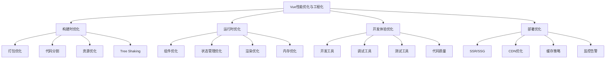

# Vue 性能优化与工程化实践

Vue应用的性能优化和工程化是现代前端开发的重要组成部分，涵盖构建优化、运行时性能、开发体验等多个方面。

## 🎯 优化体系概览



## 🔧 [构建优化](./build.md)

构建优化是性能优化的基础，通过优化打包配置和构建流程来减少包体积和提升加载速度。

### 核心优化策略

**代码分割与懒加载**：
```javascript
// 路由级代码分割
const routes = [
  {
    path: '/admin',
    component: () => import(/* webpackChunkName: "admin" */ '@/views/Admin.vue')
  }
]

// 组件级懒加载
export default {
  components: {
    AsyncComponent: () => import('./AsyncComponent.vue')
  }
}
```

**Tree Shaking优化**：
```javascript
// 按需导入
import { debounce, throttle } from 'lodash-es'

// 工具函数模块化
export { default as debounce } from './debounce'
export { default as throttle } from './throttle'
```

**打包体积分析**：
```javascript
// webpack-bundle-analyzer
const BundleAnalyzerPlugin = require('webpack-bundle-analyzer').BundleAnalyzerPlugin

module.exports = {
  plugins: [
    new BundleAnalyzerPlugin({
      analyzerMode: 'static',
      openAnalyzer: false
    })
  ]
}
```

### Vite构建优化

```javascript
// vite.config.js
export default defineConfig({
  build: {
    rollupOptions: {
      output: {
        manualChunks: {
          vue: ['vue', 'vue-router'],
          'element-plus': ['element-plus'],
          utils: ['lodash-es', 'dayjs']
        }
      }
    },
    
    // 压缩配置
    minify: 'terser',
    terserOptions: {
      compress: {
        drop_console: true,
        drop_debugger: true
      }
    }
  }
})
```

## ⚡ 运行时性能优化

### 1. 组件优化

```javascript
// 函数式组件
const FunctionalComponent = {
  functional: true,
  render(h, { props, children }) {
    return h('div', props, children)
  }
}

// 异步组件
const AsyncComponent = defineAsyncComponent({
  loader: () => import('./HeavyComponent.vue'),
  loadingComponent: LoadingComponent,
  errorComponent: ErrorComponent,
  delay: 200,
  timeout: 3000
})

// 组件缓存
<template>
  <keep-alive :include="cachedComponents">
    <router-view />
  </keep-alive>
</template>

// v-memo优化
<template>
  <div v-memo="[valueA, valueB]">
    <ExpensiveChild :value="valueA" />
    <AnotherChild :value="valueB" />
  </div>
</template>
```

### 2. 列表渲染优化

```javascript
// 虚拟滚动
<template>
  <VirtualList
    :items="largeList"
    :item-height="50"
    :container-height="400"
  >
    <template #default="{ item }">
      <div>{{ item.name }}</div>
    </template>
  </VirtualList>
</template>

// 分页加载
export default {
  data() {
    return {
      items: [],
      page: 1,
      pageSize: 20,
      loading: false
    }
  },
  
  async mounted() {
    await this.loadMore()
    this.setupInfiniteScroll()
  },
  
  methods: {
    async loadMore() {
      if (this.loading) return
      
      this.loading = true
      try {
        const newItems = await api.getItems({
          page: this.page,
          size: this.pageSize
        })
        this.items.push(...newItems)
        this.page++
      } finally {
        this.loading = false
      }
    },
    
    setupInfiniteScroll() {
      const observer = new IntersectionObserver((entries) => {
        if (entries[0].isIntersecting) {
          this.loadMore()
        }
      })
      observer.observe(this.$refs.loadTrigger)
    }
  }
}
```

### 3. 状态管理优化

```javascript
// 状态规范化
const state = {
  entities: {
    users: {
      1: { id: 1, name: 'Alice' },
      2: { id: 2, name: 'Bob' }
    },
    posts: {
      1: { id: 1, title: 'Post 1', authorId: 1 }
    }
  },
  ui: {
    selectedUserId: null,
    loading: false
  }
}

// 计算属性缓存
const getters = {
  expensiveGetter: (state) => {
    // 利用Vue的计算属性缓存
    return state.items.map(item => {
      return processItem(item) // 昂贵的计算
    })
  }
}

// 异步action优化
const actions = {
  async fetchUserData({ commit, state }, userId) {
    // 避免重复请求
    if (state.loading[userId]) return
    
    commit('SET_LOADING', { userId, loading: true })
    
    try {
      const user = await api.getUser(userId)
      commit('SET_USER', user)
    } finally {
      commit('SET_LOADING', { userId, loading: false })
    }
  }
}
```

## 🚀 [SSR服务端渲染](./ssr.md)

SSR通过服务端预渲染提升首屏加载速度和SEO效果。

### SSR核心实现

```javascript
// 服务端渲染
import { renderToString } from '@vue/server-renderer'

export async function render(url) {
  const { app, router, store } = createApp()
  
  await router.push(url)
  await router.isReady()
  
  // 数据预取
  const matchedComponents = router.currentRoute.value.matched
  await Promise.all(
    matchedComponents.map(async (record) => {
      if (record.meta.prefetch) {
        await record.meta.prefetch({ route: router.currentRoute.value, store })
      }
    })
  )
  
  const html = await renderToString(app)
  const state = JSON.stringify(store.state)
  
  return { html, state }
}
```

### 同构应用架构

```javascript
// 通用应用入口
export function createApp() {
  const app = createSSRApp(App)
  
  const router = createRouter({
    history: import.meta.env.SSR 
      ? createMemoryHistory() 
      : createWebHistory(),
    routes
  })
  
  const store = createStore()
  
  app.use(router)
  app.use(store)
  
  return { app, router, store }
}
```

### 缓存策略

```javascript
// 多级缓存
const pageCache = new LRU({ max: 1000, ttl: 15 * 60 * 1000 })
const componentCache = new LRU({ max: 10000, ttl: 60 * 60 * 1000 })

// 智能缓存失效
class SmartCache {
  invalidate(dependency) {
    const affectedKeys = this.dependencies.get(dependency)
    if (affectedKeys) {
      affectedKeys.forEach(key => this.cache.delete(key))
    }
  }
}
```

## 🛠️ 开发体验优化

### 1. 开发工具配置

```javascript
// vite.config.js
export default defineConfig({
  server: {
    hmr: {
      overlay: false // 关闭错误遮罩
    }
  },
  
  plugins: [
    vue(),
    
    // 自动导入
    AutoImport({
      imports: ['vue', 'vue-router', 'pinia'],
      dts: true
    }),
    
    // 组件自动导入
    Components({
      dts: true,
      resolvers: [ElementPlusResolver()]
    })
  ]
})
```

### 2. 代码质量工具

```javascript
// .eslintrc.js
module.exports = {
  extends: [
    '@vue/typescript/recommended',
    '@vue/prettier',
    '@vue/prettier/@typescript-eslint'
  ],
  rules: {
    'vue/component-name-in-template-casing': ['error', 'PascalCase'],
    'vue/no-unused-vars': 'error',
    'vue/no-unused-components': 'error'
  }
}

// prettier.config.js
module.exports = {
  semi: false,
  singleQuote: true,
  trailingComma: 'none',
  printWidth: 100
}
```

### 3. 测试工具集成

```javascript
// vitest.config.js
export default defineConfig({
  test: {
    environment: 'jsdom',
    setupFiles: ['./tests/setup.js']
  }
})

// 组件测试
import { mount } from '@vue/test-utils'
import { describe, it, expect } from 'vitest'

describe('MyComponent', () => {
  it('renders correctly', () => {
    const wrapper = mount(MyComponent, {
      props: { message: 'Hello' }
    })
    expect(wrapper.text()).toContain('Hello')
  })
})
```

## 📊 性能监控

### 1. 性能指标监控

```javascript
// 性能监控服务
class PerformanceMonitor {
  constructor() {
    this.metrics = {}
  }
  
  init() {
    this.measureWebVitals()
    this.measureCustomMetrics()
    this.setupErrorTracking()
  }
  
  measureWebVitals() {
    // LCP - 最大内容绘制
    new PerformanceObserver((list) => {
      const entries = list.getEntries()
      const lastEntry = entries[entries.length - 1]
      this.reportMetric('LCP', lastEntry.startTime)
    }).observe({ entryTypes: ['largest-contentful-paint'] })
    
    // FID - 首次输入延迟
    new PerformanceObserver((list) => {
      const entries = list.getEntries()
      entries.forEach(entry => {
        const fid = entry.processingStart - entry.startTime
        this.reportMetric('FID', fid)
      })
    }).observe({ entryTypes: ['first-input'] })
    
    // CLS - 累积布局偏移
    let clsValue = 0
    new PerformanceObserver((list) => {
      const entries = list.getEntries()
      entries.forEach(entry => {
        if (!entry.hadRecentInput) {
          clsValue += entry.value
        }
      })
      this.reportMetric('CLS', clsValue)
    }).observe({ entryTypes: ['layout-shift'] })
  }
  
  reportMetric(name, value) {
    // 发送到监控系统
    analytics.track('performance_metric', {
      metric: name,
      value,
      timestamp: Date.now(),
      url: location.href
    })
  }
}
```

### 2. 错误监控

```javascript
// 全局错误处理
const app = createApp(App)

app.config.errorHandler = (error, instance, info) => {
  console.error('Vue Error:', error)
  
  // 发送错误报告
  errorReporter.captureException(error, {
    extra: {
      componentName: instance?.$options.name,
      errorInfo: info,
      props: instance?.$props,
      route: instance?.$route
    }
  })
}

// 路由错误处理
router.onError((error) => {
  console.error('Router Error:', error)
  errorReporter.captureException(error)
})
```

## 🎯 最佳实践总结

### 1. 性能优化清单

**构建优化**：
- ✅ 启用Tree Shaking
- ✅ 配置代码分割
- ✅ 优化图片资源
- ✅ 启用Gzip压缩
- ✅ 分析打包体积

**运行时优化**：
- ✅ 使用v-memo缓存
- ✅ 合理使用keep-alive
- ✅ 实现虚拟滚动
- ✅ 优化计算属性
- ✅ 避免内存泄漏

**用户体验**：
- ✅ 实现骨架屏
- ✅ 添加加载状态
- ✅ 优化错误处理
- ✅ 支持离线访问
- ✅ 响应式设计

### 2. 工程化规范

**代码规范**：
```javascript
// 组件命名规范
// ✅ 好的命名
UserProfile.vue
ProductCard.vue
NavigationMenu.vue

// ❌ 避免的命名
user.vue
card.vue
menu.vue
```

**目录结构**：
```
src/
├── components/          # 通用组件
│   ├── base/           # 基础组件
│   ├── business/       # 业务组件
│   └── layout/         # 布局组件
├── views/              # 页面组件
├── composables/        # 组合式函数
├── utils/              # 工具函数
├── stores/             # 状态管理
├── router/             # 路由配置
└── assets/             # 静态资源
```

**性能预算**：
```javascript
// 性能预算配置
module.exports = {
  budgets: [
    {
      type: 'initial',
      maximumWarning: '500kb',
      maximumError: '1mb'
    },
    {
      type: 'anyComponentStyle',
      maximumWarning: '2kb',
      maximumError: '4kb'
    }
  ]
}
```

Vue性能优化与工程化是一个持续的过程，需要在开发的各个阶段都保持关注，通过合理的架构设计、优化策略和监控手段来确保应用的高性能和可维护性。
