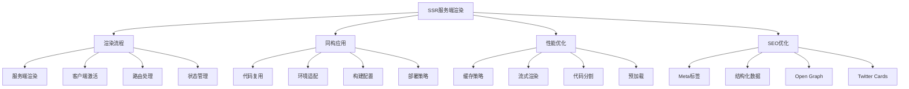

# Vue SSR 服务端渲染深度解析

服务端渲染（SSR）是提升Vue应用首屏加载速度和SEO效果的重要技术，通过在服务器端预渲染页面来改善用户体验。

## 🎯 SSR概览



## 🏗️ SSR基础实现

### 1. Vue SSR核心原理

```javascript
// server.js - 基础SSR服务器
const express = require('express')
const { createSSRApp } = require('vue')
const { renderToString } = require('@vue/server-renderer')
const { createMemoryHistory, createRouter } = require('vue-router')

const app = express()

// 创建应用工厂函数
function createApp() {
  const app = createSSRApp({
    template: `
      <div id="app">
        <h1>{{ message }}</h1>
        <router-view />
      </div>
    `,
    data() {
      return {
        message: 'Hello SSR!'
      }
    }
  })
  
  const router = createRouter({
    history: createMemoryHistory(),
    routes: [
      { path: '/', component: { template: '<div>Home</div>' } },
      { path: '/about', component: { template: '<div>About</div>' } }
    ]
  })
  
  app.use(router)
  
  return { app, router }
}

// SSR路由处理
app.get('*', async (req, res) => {
  const { app, router } = createApp()
  
  // 设置服务器端路由位置
  await router.push(req.url)
  await router.isReady()
  
  // 渲染应用为字符串
  const html = await renderToString(app)
  
  // 发送完整的HTML页面
  res.send(`
    <!DOCTYPE html>
    <html>
      <head>
        <title>Vue SSR App</title>
        <meta charset="utf-8">
      </head>
      <body>
        <div id="app">${html}</div>
        <script src="/client.js"></script>
      </body>
    </html>
  `)
})

app.listen(3000, () => {
  console.log('SSR server running on http://localhost:3000')
})
```

### 2. 客户端激活

```javascript
// client.js - 客户端激活
import { createSSRApp } from 'vue'
import { createWebHistory, createRouter } from 'vue-router'
import { createPinia } from 'pinia'

// 创建应用实例
function createApp() {
  const app = createSSRApp({
    // 应用配置
  })
  
  const router = createRouter({
    history: createWebHistory(),
    routes: [
      // 路由配置
    ]
  })
  
  const pinia = createPinia()
  
  app.use(router)
  app.use(pinia)
  
  return { app, router, pinia }
}

// 客户端激活
const { app, router, pinia } = createApp()

// 等待路由准备就绪
router.isReady().then(() => {
  // 激活应用
  app.mount('#app')
})
```

### 3. 同构应用架构

```javascript
// app.js - 通用应用入口
import { createSSRApp } from 'vue'
import { createRouter } from 'vue-router'
import { createPinia } from 'pinia'
import { createHead } from '@vueuse/head'
import App from './App.vue'
import { routes } from './router'

// 应用工厂函数
export function createApp() {
  const app = createSSRApp(App)
  
  const router = createRouter({
    history: import.meta.env.SSR 
      ? createMemoryHistory() 
      : createWebHistory(),
    routes
  })
  
  const pinia = createPinia()
  const head = createHead()
  
  app.use(router)
  app.use(pinia)
  app.use(head)
  
  return { app, router, pinia, head }
}

// entry-server.js - 服务端入口
import { renderToString } from '@vue/server-renderer'
import { renderHeadToString } from '@vueuse/head'
import { createApp } from './app.js'

export async function render(url, manifest) {
  const { app, router, head } = createApp()
  
  // 设置服务器端路由位置
  await router.push(url)
  await router.isReady()
  
  // 渲染应用
  const html = await renderToString(app)
  
  // 渲染head标签
  const { headTags, htmlAttrs, bodyAttrs } = renderHeadToString(head)
  
  return {
    html,
    headTags,
    htmlAttrs,
    bodyAttrs
  }
}

// entry-client.js - 客户端入口
import { createApp } from './app.js'

const { app, router } = createApp()

// 等待路由准备就绪后激活
router.isReady().then(() => {
  app.mount('#app')
})
```

## 🔧 高级SSR特性

### 1. 数据预取

```javascript
// 组件数据预取
export default {
  name: 'UserProfile',
  
  // 服务端数据预取
  async serverPrefetch() {
    const userId = this.$route.params.id
    await this.fetchUser(userId)
  },
  
  // 客户端数据预取
  async created() {
    // 如果数据还没有获取（客户端路由）
    if (!this.user) {
      await this.fetchUser(this.$route.params.id)
    }
  },
  
  methods: {
    async fetchUser(id) {
      try {
        this.user = await api.getUser(id)
      } catch (error) {
        this.error = error.message
      }
    }
  }
}

// 路由级数据预取
// router/index.js
const routes = [
  {
    path: '/user/:id',
    component: UserProfile,
    meta: {
      // 路由级数据预取
      async prefetch({ route, store }) {
        const userId = route.params.id
        await store.dispatch('user/fetchUser', userId)
      }
    }
  }
]

// 服务端路由处理
app.get('*', async (req, res) => {
  const { app, router, store } = createApp()
  
  await router.push(req.url)
  await router.isReady()
  
  // 执行路由级数据预取
  const matchedComponents = router.currentRoute.value.matched
  
  await Promise.all(
    matchedComponents.map(async (record) => {
      if (record.meta.prefetch) {
        await record.meta.prefetch({
          route: router.currentRoute.value,
          store
        })
      }
    })
  )
  
  // 渲染应用
  const html = await renderToString(app)
  
  // 序列化状态
  const state = JSON.stringify(store.state).replace(/</g, '\\u003c')
  
  res.send(`
    <!DOCTYPE html>
    <html>
      <head>
        <title>Vue SSR App</title>
      </head>
      <body>
        <div id="app">${html}</div>
        <script>window.__INITIAL_STATE__ = ${state}</script>
        <script src="/client.js"></script>
      </body>
    </html>
  `)
})
```

### 2. 状态管理同步

```javascript
// store/index.js - Pinia状态管理
import { defineStore } from 'pinia'

export const useUserStore = defineStore('user', () => {
  const user = ref(null)
  const loading = ref(false)
  const error = ref(null)
  
  const fetchUser = async (id) => {
    loading.value = true
    error.value = null
    
    try {
      const response = await api.getUser(id)
      user.value = response.data
    } catch (err) {
      error.value = err.message
    } finally {
      loading.value = false
    }
  }
  
  return {
    user: readonly(user),
    loading: readonly(loading),
    error: readonly(error),
    fetchUser
  }
})

// 服务端状态序列化
// entry-server.js
export async function render(url) {
  const { app, router, pinia } = createApp()
  
  await router.push(url)
  await router.isReady()
  
  // 执行数据预取
  const userStore = useUserStore(pinia)
  if (url.includes('/user/')) {
    const userId = url.split('/user/')[1]
    await userStore.fetchUser(userId)
  }
  
  const html = await renderToString(app)
  
  // 序列化Pinia状态
  const state = JSON.stringify(pinia.state.value)
  
  return { html, state }
}

// 客户端状态恢复
// entry-client.js
const { app, router, pinia } = createApp()

// 恢复服务端状态
if (window.__PINIA_STATE__) {
  pinia.state.value = window.__PINIA_STATE__
}

router.isReady().then(() => {
  app.mount('#app')
})
```

### 3. 流式渲染

```javascript
// 流式SSR实现
import { renderToNodeStream } from '@vue/server-renderer'
import { Transform } from 'stream'

app.get('*', async (req, res) => {
  const { app, router } = createApp()
  
  await router.push(req.url)
  await router.isReady()
  
  res.setHeader('Content-Type', 'text/html')
  
  // HTML头部
  res.write(`
    <!DOCTYPE html>
    <html>
      <head>
        <title>Vue SSR App</title>
        <link rel="stylesheet" href="/style.css">
      </head>
      <body>
        <div id="app">
  `)
  
  // 创建渲染流
  const stream = renderToNodeStream(app)
  
  // 错误处理
  stream.on('error', (error) => {
    console.error('SSR Error:', error)
    res.status(500).end('Internal Server Error')
  })
  
  // 流式传输
  stream.pipe(res, { end: false })
  
  stream.on('end', () => {
    res.write(`
        </div>
        <script src="/client.js"></script>
      </body>
    </html>
    `)
    res.end()
  })
})

// 带缓存的流式渲染
class CachedStream extends Transform {
  constructor(key, ttl = 60000) {
    super()
    this.key = key
    this.ttl = ttl
    this.chunks = []
  }
  
  _transform(chunk, encoding, callback) {
    this.chunks.push(chunk)
    this.push(chunk)
    callback()
  }
  
  _flush(callback) {
    // 缓存渲染结果
    const content = Buffer.concat(this.chunks)
    cache.set(this.key, content, this.ttl)
    callback()
  }
}
```

### 4. 缓存策略

```javascript
// 多级缓存策略
const LRU = require('lru-cache')

// 页面级缓存
const pageCache = new LRU({
  max: 1000,
  ttl: 1000 * 60 * 15 // 15分钟
})

// 组件级缓存
const componentCache = new LRU({
  max: 10000,
  ttl: 1000 * 60 * 60 // 1小时
})

// 缓存中间件
function createCacheMiddleware() {
  return (req, res, next) => {
    const key = req.url
    
    // 检查页面缓存
    const cached = pageCache.get(key)
    if (cached) {
      return res.send(cached)
    }
    
    // 拦截响应
    const originalSend = res.send
    res.send = function(body) {
      // 缓存响应
      if (res.statusCode === 200) {
        pageCache.set(key, body)
      }
      originalSend.call(this, body)
    }
    
    next()
  }
}

// 组件缓存装饰器
function withCache(component, cacheKey) {
  return {
    ...component,
    serverCacheKey: (props) => {
      return `${cacheKey}:${JSON.stringify(props)}`
    }
  }
}

// 使用组件缓存
const CachedUserCard = withCache(UserCard, 'user-card')

// 智能缓存失效
class SmartCache {
  constructor() {
    this.cache = new Map()
    this.dependencies = new Map()
  }
  
  set(key, value, deps = []) {
    this.cache.set(key, value)
    
    // 记录依赖关系
    deps.forEach(dep => {
      if (!this.dependencies.has(dep)) {
        this.dependencies.set(dep, new Set())
      }
      this.dependencies.get(dep).add(key)
    })
  }
  
  get(key) {
    return this.cache.get(key)
  }
  
  invalidate(dep) {
    const keys = this.dependencies.get(dep)
    if (keys) {
      keys.forEach(key => {
        this.cache.delete(key)
      })
      this.dependencies.delete(dep)
    }
  }
}
```

## 🎨 SEO优化

### 1. Meta标签管理

```javascript
// composables/useMeta.js
import { useHead } from '@vueuse/head'

export function useMeta(meta) {
  const head = useHead({
    title: computed(() => meta.title),
    meta: computed(() => [
      { name: 'description', content: meta.description },
      { name: 'keywords', content: meta.keywords },
      
      // Open Graph
      { property: 'og:title', content: meta.title },
      { property: 'og:description', content: meta.description },
      { property: 'og:image', content: meta.image },
      { property: 'og:url', content: meta.url },
      { property: 'og:type', content: meta.type || 'website' },
      
      // Twitter Cards
      { name: 'twitter:card', content: 'summary_large_image' },
      { name: 'twitter:title', content: meta.title },
      { name: 'twitter:description', content: meta.description },
      { name: 'twitter:image', content: meta.image }
    ]),
    link: computed(() => [
      { rel: 'canonical', href: meta.canonical || meta.url }
    ])
  })
  
  return head
}

// 在组件中使用
export default {
  setup() {
    const route = useRoute()
    const user = ref(null)
    
    // 动态Meta标签
    const meta = computed(() => ({
      title: user.value ? `${user.value.name} - 用户资料` : '用户资料',
      description: user.value ? `查看${user.value.name}的个人资料和动态` : '用户个人资料页面',
      image: user.value?.avatar || '/default-avatar.jpg',
      url: `https://example.com${route.fullPath}`
    }))
    
    useMeta(meta)
    
    return { user }
  }
}
```

### 2. 结构化数据

```javascript
// composables/useStructuredData.js
export function useStructuredData(data) {
  const structuredData = computed(() => {
    return JSON.stringify({
      '@context': 'https://schema.org',
      ...data
    })
  })
  
  useHead({
    script: [
      {
        type: 'application/ld+json',
        innerHTML: structuredData
      }
    ]
  })
}

// 使用示例
export default {
  setup() {
    const article = ref(null)
    
    // 文章结构化数据
    const articleSchema = computed(() => ({
      '@type': 'Article',
      headline: article.value?.title,
      author: {
        '@type': 'Person',
        name: article.value?.author.name
      },
      datePublished: article.value?.publishedAt,
      dateModified: article.value?.updatedAt,
      image: article.value?.coverImage,
      publisher: {
        '@type': 'Organization',
        name: 'Example Blog',
        logo: {
          '@type': 'ImageObject',
          url: 'https://example.com/logo.png'
        }
      }
    }))
    
    useStructuredData(articleSchema)
    
    return { article }
  }
}
```

## 🚀 性能优化

### 1. 预渲染优化

```javascript
// 预渲染配置
// prerender.config.js
const { PrerenderSPAPlugin } = require('prerender-spa-plugin')
const Renderer = PrerenderSPAPlugin.PuppeteerRenderer

module.exports = {
  plugins: [
    new PrerenderSPAPlugin({
      staticDir: path.join(__dirname, 'dist'),
      routes: [
        '/',
        '/about',
        '/contact',
        '/products',
        '/blog'
      ],
      renderer: new Renderer({
        inject: {
          foo: 'bar'
        },
        headless: false,
        renderAfterDocumentEvent: 'render-event'
      })
    })
  ]
}

// 触发预渲染完成事件
// main.js
new Vue({
  router,
  store,
  render: h => h(App),
  mounted() {
    // 通知预渲染器页面已准备就绪
    document.dispatchEvent(new Event('render-event'))
  }
}).$mount('#app')
```

### 2. 增量静态生成

```javascript
// ISG实现
class IncrementalStaticGenerator {
  constructor(options) {
    this.cache = new Map()
    this.revalidateTime = options.revalidate || 60
    this.buildQueue = new Set()
  }
  
  async getPage(path) {
    const cached = this.cache.get(path)
    const now = Date.now()
    
    // 检查缓存是否有效
    if (cached && (now - cached.timestamp) < this.revalidateTime * 1000) {
      return cached.html
    }
    
    // 如果正在构建，返回旧缓存
    if (this.buildQueue.has(path)) {
      return cached ? cached.html : null
    }
    
    // 后台重新生成
    this.buildQueue.add(path)
    this.regeneratePage(path).finally(() => {
      this.buildQueue.delete(path)
    })
    
    // 返回旧缓存或立即生成
    return cached ? cached.html : await this.generatePage(path)
  }
  
  async generatePage(path) {
    const { app, router } = createApp()
    
    await router.push(path)
    await router.isReady()
    
    const html = await renderToString(app)
    
    // 缓存结果
    this.cache.set(path, {
      html,
      timestamp: Date.now()
    })
    
    return html
  }
  
  async regeneratePage(path) {
    try {
      await this.generatePage(path)
    } catch (error) {
      console.error(`Failed to regenerate ${path}:`, error)
    }
  }
}
```

### 3. 边缘渲染

```javascript
// Cloudflare Workers边缘SSR
addEventListener('fetch', event => {
  event.respondWith(handleRequest(event.request))
})

async function handleRequest(request) {
  const url = new URL(request.url)
  
  // 检查边缘缓存
  const cache = caches.default
  const cacheKey = new Request(url.toString(), request)
  const cachedResponse = await cache.match(cacheKey)
  
  if (cachedResponse) {
    return cachedResponse
  }
  
  // 边缘SSR渲染
  const html = await renderAtEdge(url.pathname)
  
  const response = new Response(html, {
    headers: {
      'Content-Type': 'text/html',
      'Cache-Control': 'public, max-age=300'
    }
  })
  
  // 缓存响应
  event.waitUntil(cache.put(cacheKey, response.clone()))
  
  return response
}

async function renderAtEdge(path) {
  // 轻量级SSR实现
  const { app, router } = createApp()
  
  await router.push(path)
  await router.isReady()
  
  return await renderToString(app)
}
```

Vue SSR通过服务端预渲染提升了首屏加载速度和SEO效果，但也带来了复杂性。合理的架构设计和优化策略是成功实施SSR的关键。
