# Vue Router 核心原理深度解析

Vue Router是Vue.js的官方路由管理器，它和Vue.js深度集成，让构建单页面应用变得易如反掌。

## 🎯 Vue Router架构概览

```mermaid
graph TB
    A[Vue Router] --> B[History管理]
    A --> C[路由匹配]
    A --> D[导航守卫]
    A --> E[组件渲染]
    
    B --> B1[Hash模式]
    B --> B2[History模式]
    B --> B3[Memory模式]
    
    C --> C1[路由记录]
    C --> C2[动态路由]
    C --> C3[嵌套路由]
    C --> C4[路由参数]
    
    D --> D1[全局守卫]
    D --> D2[路由守卫]
    D --> D3[组件守卫]
    
    E --> E1[RouterView]
    E --> E2[RouterLink]
    E --> E3[动态组件]
```



## 🏗️ 核心实现原理

### 1. Router类核心实现

```javascript
class Router {
  constructor(options = {}) {
    this.app = null
    this.apps = []
    this.options = options
    this.beforeHooks = []
    this.resolveHooks = []
    this.afterHooks = []
    this.matcher = createMatcher(options.routes || [], this)

    this.mode = options.mode || 'hash'
    this.history = this.mode === 'history'
      ? new HTML5History(this, options.base)
      : this.mode === 'hash'
      ? new HashHistory(this, options.base, this.fallback)
      : new AbstractHistory(this, options.base)
  }

  match(raw, current, redirectedFrom) {
    return this.matcher.match(raw, current, redirectedFrom)
  }

  get currentRoute() {
    return this.history && this.history.current
  }

  init(app) {
    process.env.NODE_ENV !== 'production' && assert(
      install.installed,
      `not installed. Make sure to call \`Vue.use(VueRouter)\` ` +
      `before creating root instance.`
    )

    this.apps.push(app)

    if (this.app) {
      return
    }

    this.app = app

    const history = this.history

    if (history instanceof HTML5History || history instanceof HashHistory) {
      const handleInitialScroll = routeOrError => {
        const from = history.current
        const expectScroll = this.options.scrollBehavior
        const supportsScroll = supportsPushState && expectScroll

        if (supportsScroll && 'fullPath' in routeOrError) {
          handleScroll(this, routeOrError, from, false)
        }
      }
      const setupListeners = routeOrError => {
        history.setupListeners()
        handleInitialScroll(routeOrError)
      }
      history.transitionTo(
        history.getCurrentLocation(),
        setupListeners,
        setupListeners
      )
    }

    history.listen(route => {
      this.apps.forEach(app => {
        app._route = route
      })
    })
  }

  beforeEach(fn) {
    return registerHook(this.beforeHooks, fn)
  }

  beforeResolve(fn) {
    return registerHook(this.resolveHooks, fn)
  }

  afterEach(fn) {
    return registerHook(this.afterHooks, fn)
  }

  onReady(cb, errorCb) {
    this.history.onReady(cb, errorCb)
  }

  onError(errorCb) {
    this.history.onError(errorCb)
  }

  push(location, onComplete, onAbort) {
    if (!onComplete && !onAbort && typeof Promise !== 'undefined') {
      return new Promise((resolve, reject) => {
        this.history.push(location, resolve, reject)
      })
    } else {
      this.history.push(location, onComplete, onAbort)
    }
  }

  replace(location, onComplete, onAbort) {
    if (!onComplete && !onAbort && typeof Promise !== 'undefined') {
      return new Promise((resolve, reject) => {
        this.history.replace(location, resolve, reject)
      })
    } else {
      this.history.replace(location, onComplete, onAbort)
    }
  }

  go(n) {
    this.history.go(n)
  }

  back() {
    this.go(-1)
  }

  forward() {
    this.go(1)
  }

  getMatchedComponents(to) {
    const route = to
      ? to.matched
        ? to
        : this.resolve(to).route
      : this.currentRoute
    if (!route) {
      return []
    }
    return [].concat.apply(
      [],
      route.matched.map(m => {
        return Object.keys(m.components).map(key => {
          return m.components[key]
        })
      })
    )
  }

  resolve(to, current, append) {
    current = current || this.history.current
    const location = normalizeLocation(to, current, append, this)
    const route = this.match(location, current)
    const fullPath = route.redirectedFrom || route.fullPath
    const base = this.history.base
    const href = createHref(base, fullPath, this.mode)
    return {
      location,
      route,
      href,
      normalizedTo: location,
      resolved: route
    }
  }

  addRoutes(routes) {
    this.matcher.addRoutes(routes)
    if (this.history.current !== START) {
      this.history.transitionTo(this.history.getCurrentLocation())
    }
  }
}
```

### 2. History管理实现

#### HTML5History模式

```javascript
class HTML5History extends History {
  constructor(router, base) {
    super(router, base)

    this._startLocation = getLocation(this.base)
  }

  setupListeners() {
    if (this.listeners.length > 0) {
      return
    }

    const router = this.router
    const expectScroll = router.options.scrollBehavior
    const supportsScroll = supportsPushState && expectScroll

    if (supportsScroll) {
      this.listeners.push(setupScroll())
    }

    const handleRoutingEvent = () => {
      const current = this.current
      const location = getLocation(this.base)
      if (this.current === START && location === this._startLocation) {
        return
      }

      this.transitionTo(location, route => {
        if (supportsScroll) {
          handleScroll(router, route, current, true)
        }
      })
    }
    window.addEventListener('popstate', handleRoutingEvent)
    this.listeners.push(() => {
      window.removeEventListener('popstate', handleRoutingEvent)
    })
  }

  go(n) {
    window.history.go(n)
  }

  push(location, onComplete, onAbort) {
    const { current: fromRoute } = this
    this.transitionTo(location, route => {
      pushState(cleanPath(this.base + route.fullPath))
      handleScroll(this.router, route, fromRoute, false)
      onComplete && onComplete(route)
    }, onAbort)
  }

  replace(location, onComplete, onAbort) {
    const { current: fromRoute } = this
    this.transitionTo(location, route => {
      replaceState(cleanPath(this.base + route.fullPath))
      handleScroll(this.router, route, fromRoute, false)
      onComplete && onComplete(route)
    }, onAbort)
  }

  ensureURL(push) {
    if (getLocation(this.base) !== this.current.fullPath) {
      const current = cleanPath(this.base + this.current.fullPath)
      push ? pushState(current) : replaceState(current)
    }
  }

  getCurrentLocation() {
    return getLocation(this.base)
  }
}

function getLocation(base) {
  let path = decodeURI(window.location.pathname)
  if (base && path.toLowerCase().indexOf(base.toLowerCase()) === 0) {
    path = path.slice(base.length)
  }
  return (path || '/') + window.location.search + window.location.hash
}
```

#### HashHistory模式

```javascript
class HashHistory extends History {
  constructor(router, base, fallback) {
    super(router, base)
    if (fallback && checkFallback(this.base)) {
      return
    }
    ensureSlash()
  }

  setupListeners() {
    if (this.listeners.length > 0) {
      return
    }

    const router = this.router
    const expectScroll = router.options.scrollBehavior
    const supportsScroll = supportsPushState && expectScroll

    if (supportsScroll) {
      this.listeners.push(setupScroll())
    }

    const handleRoutingEvent = () => {
      const current = this.current
      if (!ensureSlash()) {
        return
      }
      this.transitionTo(getHash(), route => {
        if (supportsScroll) {
          handleScroll(router, route, current, true)
        }
        if (!supportsPushState) {
          replaceHash(route.fullPath)
        }
      })
    }
    const eventType = supportsPushState ? 'popstate' : 'hashchange'
    window.addEventListener(eventType, handleRoutingEvent)
    this.listeners.push(() => {
      window.removeEventListener(eventType, handleRoutingEvent)
    })
  }

  push(location, onComplete, onAbort) {
    const { current: fromRoute } = this
    this.transitionTo(
      location,
      route => {
        pushHash(route.fullPath)
        handleScroll(this.router, route, fromRoute, false)
        onComplete && onComplete(route)
      },
      onAbort
    )
  }

  replace(location, onComplete, onAbort) {
    const { current: fromRoute } = this
    this.transitionTo(
      location,
      route => {
        replaceHash(route.fullPath)
        handleScroll(this.router, route, fromRoute, false)
        onComplete && onComplete(route)
      },
      onAbort
    )
  }

  go(n) {
    window.history.go(n)
  }

  ensureURL(push) {
    const current = this.current.fullPath
    if (getHash() !== current) {
      push ? pushHash(current) : replaceHash(current)
    }
  }

  getCurrentLocation() {
    return getHash()
  }
}

function getHash() {
  let href = window.location.href
  const index = href.indexOf('#')
  if (index < 0) return ''

  href = href.slice(index + 1)
  const searchIndex = href.indexOf('?')
  if (searchIndex < 0) {
    const hashIndex = href.indexOf('#')
    if (hashIndex > -1) {
      href = decodeURI(href.slice(0, hashIndex)) + href.slice(hashIndex)
    } else href = decodeURI(href)
  } else {
    href = decodeURI(href.slice(0, searchIndex)) + href.slice(searchIndex)
  }

  return href
}
```

### 3. 路由匹配器实现

```javascript
function createMatcher(routes, router) {
  const { pathList, pathMap, nameMap } = createRouteMap(routes)

  function addRoutes(routes) {
    createRouteMap(routes, pathList, pathMap, nameMap)
  }

  function match(raw, currentRoute, redirectedFrom) {
    const location = normalizeLocation(raw, currentRoute, false, router)
    const { name } = location

    if (name) {
      const record = nameMap[name]
      if (process.env.NODE_ENV !== 'production') {
        warn(record, `Route with name '${name}' does not exist`)
      }
      if (!record) return _createRoute(null, location)
      const paramNames = record.regex.keys
        .filter(key => !key.optional)
        .map(key => key.name)

      if (typeof location.params !== 'object') {
        location.params = {}
      }

      if (currentRoute && typeof currentRoute.params === 'object') {
        for (const key in currentRoute.params) {
          if (!(key in location.params) && paramNames.indexOf(key) > -1) {
            location.params[key] = currentRoute.params[key]
          }
        }
      }

      location.path = fillParams(record.path, location.params, `named route "${name}"`)
      return _createRoute(record, location, redirectedFrom)
    } else if (location.path) {
      location.params = {}
      for (let i = 0; i < pathList.length; i++) {
        const path = pathList[i]
        const record = pathMap[path]
        if (matchRoute(record.regex, location.path, location.params)) {
          return _createRoute(record, location, redirectedFrom)
        }
      }
    }
    return _createRoute(null, location)
  }

  function redirect(record, location) {
    const originalRedirect = record.redirect
    let redirect = typeof originalRedirect === 'function'
      ? originalRedirect(createRoute(record, location, null, router))
      : originalRedirect

    if (typeof redirect === 'string') {
      redirect = { path: redirect }
    }

    if (!redirect || typeof redirect !== 'object') {
      if (process.env.NODE_ENV !== 'production') {
        warn(
          false, `invalid redirect option: ${JSON.stringify(redirect)}`
        )
      }
      return _createRoute(null, location)
    }

    const re = redirect
    const { name, path } = re
    let { query, hash, params } = location
    query = re.hasOwnProperty('query') ? re.query : query
    hash = re.hasOwnProperty('hash') ? re.hash : hash
    params = re.hasOwnProperty('params') ? re.params : params

    if (name) {
      const targetRecord = nameMap[name]
      if (process.env.NODE_ENV !== 'production') {
        assert(targetRecord, `redirect failed: named route "${name}" not found.`)
      }
      return match({
        _normalized: true,
        name,
        query,
        hash,
        params
      }, undefined, location)
    } else if (path) {
      const rawPath = resolveRecordPath(path, record)
      const resolvedPath = fillParams(rawPath, params, `redirect route with path "${rawPath}"`)
      return match({
        _normalized: true,
        path: resolvedPath,
        query,
        hash
      }, undefined, location)
    } else {
      if (process.env.NODE_ENV !== 'production') {
        warn(false, `invalid redirect option: ${JSON.stringify(redirect)}`)
      }
      return _createRoute(null, location)
    }
  }

  function alias(record, location, matchAs) {
    const aliasedPath = fillParams(matchAs, location.params, `aliased route with path "${matchAs}"`)
    const aliasedMatch = match({
      _normalized: true,
      path: aliasedPath
    })
    if (aliasedMatch) {
      const matched = aliasedMatch.matched
      const aliasedRecord = matched[matched.length - 1]
      location.params = aliasedMatch.params
      return _createRoute(aliasedRecord, location)
    }
    return _createRoute(null, location)
  }

  function _createRoute(record, location, redirectedFrom) {
    if (record && record.redirect) {
      return redirect(record, redirectedFrom || location)
    }
    if (record && record.matchAs) {
      return alias(record, location, record.matchAs)
    }
    return createRoute(record, location, redirectedFrom, router)
  }

  return {
    match,
    addRoutes
  }
}
```

### 4. 导航守卫实现

```javascript
function runQueue(queue, fn, cb) {
  const step = index => {
    if (index >= queue.length) {
      cb()
    } else {
      if (queue[index]) {
        fn(queue[index], () => {
          step(index + 1)
        })
      } else {
        step(index + 1)
      }
    }
  }
  step(0)
}

// History基类中的导航实现
transitionTo(location, onComplete, onAbort) {
  let route
  try {
    route = this.router.match(location, this.current)
  } catch (e) {
    this.errorCbs.forEach(cb => {
      cb(e)
    })
    throw e
  }
  const prev = this.current
  this.confirmTransition(
    route,
    () => {
      this.updateRoute(route)
      onComplete && onComplete(route)
      this.ensureURL()
      this.router.afterHooks.forEach(hook => {
        hook && hook(route, prev)
      })

      if (!this.ready) {
        this.ready = true
        this.readyCbs.forEach(cb => {
          cb(route)
        })
      }
    },
    err => {
      if (onAbort) {
        onAbort(err)
      }
      if (err && !this.ready) {
        if (!isNavigationFailure(err, NavigationFailureType.redirected) || prev !== START) {
          this.ready = true
          this.readyErrorCbs.forEach(cb => {
            cb(err)
          })
        }
      }
    }
  )
}

confirmTransition(route, onComplete, onAbort) {
  const current = this.current
  this.pending = route
  const abort = err => {
    if (!isNavigationFailure(err) && isError(err)) {
      if (this.errorCbs.length) {
        this.errorCbs.forEach(cb => {
          cb(err)
        })
      } else {
        warn(false, 'uncaught error during route navigation:')
        console.error(err)
      }
    }
    onAbort && onAbort(err)
  }
  const lastRouteIndex = route.matched.length - 1
  const lastCurrentIndex = current.matched.length - 1
  if (
    isSameRoute(route, current) &&
    lastRouteIndex === lastCurrentIndex &&
    route.matched[lastRouteIndex] === current.matched[lastCurrentIndex]
  ) {
    this.ensureURL()
    return abort(createNavigationDuplicatedError(current, route))
  }

  const { updated, deactivated, activated } = resolveQueue(
    this.current.matched,
    route.matched
  )

  const queue = [].concat(
    extractLeaveGuards(deactivated),
    this.router.beforeHooks,
    extractUpdateHooks(updated),
    activated.map(m => m.beforeEnter),
    resolveAsyncComponents(activated)
  )

  const iterator = (hook, next) => {
    if (this.pending !== route) {
      return abort(createNavigationCancelledError(current, route))
    }
    try {
      hook(route, current, (to) => {
        if (to === false) {
          this.ensureURL(true)
          abort(createNavigationAbortedError(current, route))
        } else if (isError(to)) {
          this.ensureURL(true)
          abort(to)
        } else if (
          typeof to === 'string' ||
          (typeof to === 'object' &&
            (typeof to.path === 'string' || typeof to.name === 'string'))
        ) {
          abort(createNavigationRedirectedError(current, route))
          if (typeof to === 'object' && to.replace) {
            this.replace(to)
          } else {
            this.push(to)
          }
        } else {
          next(to)
        }
      })
    } catch (e) {
      abort(e)
    }
  }

  runQueue(queue, iterator, () => {
    const postEnterCbs = []
    const isValid = () => this.current === route
    const enterGuards = extractEnterGuards(activated, postEnterCbs, isValid)
    const queue = enterGuards.concat(this.router.resolveHooks)
    runQueue(queue, iterator, () => {
      if (this.pending !== route) {
        return abort(createNavigationCancelledError(current, route))
      }
      this.pending = null
      onComplete(route)
      if (this.router.app) {
        this.router.app.$nextTick(() => {
          postEnterCbs.forEach(cb => {
            cb()
          })
        })
      }
    })
  })
}
```

## 🔧 核心组件实现

### RouterView组件

```javascript
const RouterView = {
  name: 'RouterView',
  functional: true,
  props: {
    name: {
      type: String,
      default: 'default'
    }
  },
  render(_, { props, children, parent, data }) {
    data.routerView = true

    const h = parent.$createElement
    const name = props.name
    const route = parent.$route
    const cache = parent._routerViewCache || (parent._routerViewCache = {})

    let depth = 0
    let inactive = false
    while (parent && parent._routerRoot !== parent) {
      const vnodeData = parent.$vnode ? parent.$vnode.data : {}
      if (vnodeData.routerView) {
        depth++
      }
      if (vnodeData.keepAlive && parent._directInactive && parent._inactive) {
        inactive = true
      }
      parent = parent.$parent
    }
    data.routerViewDepth = depth

    if (inactive) {
      const cachedData = cache[name]
      const cachedComponent = cachedData && cachedData.component
      if (cachedComponent) {
        if (cachedData.configProps) {
          fillPropsinData(cachedComponent, data, cachedData.route, cachedData.configProps)
        }
        return h(cachedComponent, data, children)
      } else {
        return h()
      }
    }

    const matched = route.matched[depth]
    const component = matched && matched.components[name]

    if (!matched || !component) {
      cache[name] = null
      return h()
    }

    cache[name] = { component }

    data.registerRouteInstance = (vm, val) => {
      const current = matched.instances[name]
      if (
        (val && current !== vm) ||
        (!val && current === vm)
      ) {
        matched.instances[name] = val
      }
    }

    ;(data.hook || (data.hook = {})).prepatch = (_, vnode) => {
      matched.instances[name] = vnode.componentInstance
    }

    data.hook.init = (vnode) => {
      if (vnode.data.keepAlive &&
          vnode.componentInstance &&
          vnode.componentInstance !== matched.instances[name]) {
        matched.instances[name] = vnode.componentInstance
      }
    }

    const configProps = matched.props && matched.props[name]
    if (configProps) {
      extend(cache[name], {
        route,
        configProps
      })
      fillPropsinData(component, data, route, configProps)
    }

    return h(component, data, children)
  }
}
```

### RouterLink组件

```javascript
const RouterLink = {
  name: 'RouterLink',
  props: {
    to: {
      type: toTypes,
      required: true
    },
    tag: {
      type: String,
      default: 'a'
    },
    custom: Boolean,
    exact: Boolean,
    exactPath: Boolean,
    append: Boolean,
    replace: Boolean,
    activeClass: String,
    exactActiveClass: String,
    ariaCurrentValue: {
      type: String,
      default: 'page'
    },
    event: {
      type: eventTypes,
      default: 'click'
    }
  },
  render(h) {
    const router = this.$router
    const current = this.$route
    const { location, route, href } = router.resolve(
      this.to,
      current,
      this.append
    )

    const classes = {}
    const globalActiveClass = router.options.linkActiveClass
    const globalExactActiveClass = router.options.linkExactActiveClass
    const activeClassFallback =
      globalActiveClass == null ? 'router-link-active' : globalActiveClass
    const exactActiveClassFallback =
      globalExactActiveClass == null
        ? 'router-link-exact-active'
        : globalExactActiveClass
    const activeClass =
      this.activeClass == null ? activeClassFallback : this.activeClass
    const exactActiveClass =
      this.exactActiveClass == null
        ? exactActiveClassFallback
        : this.exactActiveClass

    const compareTarget = route.redirectedFrom
      ? createRoute(null, normalizeLocation(route.redirectedFrom), null, router)
      : route

    classes[exactActiveClass] = isSameRoute(current, compareTarget, this.exactPath)
    classes[activeClass] = this.exact || this.exactPath
      ? classes[exactActiveClass]
      : isIncludedRoute(current, compareTarget)

    const ariaCurrentValue = classes[exactActiveClass] ? this.ariaCurrentValue : null

    const handler = e => {
      if (guardEvent(e)) {
        if (this.replace) {
          router.replace(location, noop)
        } else {
          router.push(location, noop)
        }
      }
    }

    const on = { click: guardEvent }
    if (Array.isArray(this.event)) {
      this.event.forEach(e => {
        on[e] = handler
      })
    } else {
      on[this.event] = handler
    }

    const data = { class: classes }

    const scopedSlot =
      !this.$scopedSlots.$hasNormal &&
      this.$scopedSlots.default &&
      this.$scopedSlots.default({
        href,
        route,
        navigate: handler,
        isActive: classes[activeClass],
        isExactActive: classes[exactActiveClass]
      })

    if (scopedSlot) {
      if (process.env.NODE_ENV !== 'production' && !this.custom) {
        !warnedCustomSlot && warn(false, 'In Vue Router 4, the v-slot API will by default wrap its content with an <a> element. Use the custom prop to remove this warning:\n<router-link v-slot="{ navigate, href }" custom></router-link>\n')
        warnedCustomSlot = true
      }
      if (scopedSlot.length === 1) {
        return scopedSlot[0]
      } else if (scopedSlot.length > 1 || !scopedSlot.length) {
        if (process.env.NODE_ENV !== 'production') {
          warn(
            false,
            `<router-link> with to="${
              this.to
            }" is trying to use a scoped slot but it didn't provide exactly one child. Wrapping the content with a span element.`
          )
        }
        return scopedSlot.length === 0 ? h() : h('span', {}, scopedSlot)
      }
    }

    if (this.custom) {
      if (process.env.NODE_ENV !== 'production') {
        warn(
          false,
          '<router-link> with to="' + this.to + '" custom prop is deprecated and will be removed in next major version. Use v-slot instead: https://next.router.vuejs.org/api/#router-link-s-v-slot'
        )
      }
      return this.$scopedSlots.default({
        href,
        route,
        navigate: handler,
        isActive: classes[activeClass],
        isExactActive: classes[exactActiveClass]
      })
    }

    if (this.tag === 'a') {
      data.on = on
      data.attrs = { href, 'aria-current': ariaCurrentValue }
    } else {
      const a = findAnchor(this.$slots.default)
      if (a) {
        a.isStatic = false
        const aData = (a.data = extend({}, a.data))
        aData.on = aData.on || {}
        for (const event in aData.on) {
          const handler = aData.on[event]
          if (event in on) {
            aData.on[event] = Array.isArray(handler) ? handler : [handler]
          }
        }
        for (const event in on) {
          if (event in aData.on) {
            aData.on[event].push(on[event])
          } else {
            aData.on[event] = handler
          }
        }

        const aAttrs = (a.data.attrs = extend({}, a.data.attrs))
        aAttrs.href = href
        aAttrs['aria-current'] = ariaCurrentValue
      } else {
        data.on = on
      }
    }

    return h(this.tag, data, this.$slots.default)
  }
}
```

Vue Router通过精心设计的架构，实现了声明式路由、嵌套路由、路由守卫等强大功能，为Vue应用提供了完整的路由解决方案。
