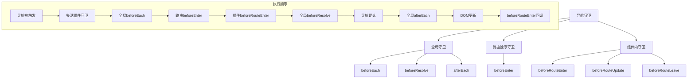

# Vue Router 导航守卫与权限控制

导航守卫是Vue Router提供的路由跳转过程中的钩子函数，可以用来控制路由的跳转、取消或重定向。

## 🛡️ 导航守卫类型



## 🔧 导航守卫详解

### 1. 全局前置守卫

```javascript
const router = createRouter({ ... })

router.beforeEach((to, from, next) => {
  // to: 即将要进入的目标路由对象
  // from: 当前导航正要离开的路由
  // next: 一定要调用该方法来resolve这个钩子
  
  console.log('全局前置守卫')
  console.log('to:', to.path)
  console.log('from:', from.path)
  
  // 必须调用next()
  next()
})

// Vue Router 4 的新写法（推荐）
router.beforeEach(async (to, from) => {
  // 返回 false 以取消导航
  if (to.path === '/forbidden') {
    return false
  }
  
  // 返回一个路由地址来重定向
  if (to.path === '/old-path') {
    return '/new-path'
  }
  
  // 什么都不返回或返回 true 则继续导航
})
```

### 2. 全局解析守卫

```javascript
router.beforeResolve(async (to, from) => {
  console.log('全局解析守卫')
  
  // 在导航被确认之前，同时在所有组件内守卫和异步路由组件被解析之后调用
  // 这是获取数据或执行任何其他操作的理想位置
  
  if (to.meta.requiresAuth && !isAuthenticated()) {
    return '/login'
  }
})
```

### 3. 全局后置钩子

```javascript
router.afterEach((to, from, failure) => {
  console.log('全局后置钩子')
  
  // 这些钩子不会接受 next 函数也不会改变导航本身
  // 对于分析、更改页面标题、声明页面等辅助功能很有用
  
  // 更新页面标题
  document.title = to.meta.title || 'Default Title'
  
  // 发送页面访问统计
  if (!failure) {
    sendAnalytics(to.path)
  }
})
```

### 4. 路由独享守卫

```javascript
const routes = [
  {
    path: '/admin',
    component: AdminPanel,
    beforeEnter: (to, from) => {
      console.log('路由独享守卫')
      
      // 只有管理员可以访问
      if (!hasAdminRole()) {
        return '/unauthorized'
      }
    }
  },
  {
    path: '/users/:id',
    component: UserProfile,
    beforeEnter: [
      // 可以传入多个守卫函数
      checkAuth,
      checkPermission,
      loadUserData
    ]
  }
]

function checkAuth(to, from) {
  if (!isAuthenticated()) {
    return '/login'
  }
}

function checkPermission(to, from) {
  const userId = to.params.id
  if (!canAccessUser(userId)) {
    return '/forbidden'
  }
}

async function loadUserData(to, from) {
  const userId = to.params.id
  try {
    const user = await fetchUser(userId)
    to.meta.user = user
  } catch (error) {
    return '/user-not-found'
  }
}
```

### 5. 组件内守卫

```javascript
export default {
  name: 'UserProfile',
  
  // 在渲染该组件的对应路由被确认前调用
  // 不能获取组件实例 this，因为当守卫执行前，组件实例还没被创建
  beforeRouteEnter(to, from, next) {
    console.log('beforeRouteEnter')
    
    // 可以通过传一个回调给 next 来访问组件实例
    next(vm => {
      // 通过 vm 访问组件实例
      vm.loadUserData(to.params.id)
    })
  },
  
  // 在当前路由改变，但是该组件被复用时调用
  // 举例来说，对于一个带有动态参数的路径 /users/:id，在 /users/1 和 /users/2 之间跳转的时候
  // 由于会渲染同样的 UserProfile 组件，因此组件实例会被复用。而这个钩子就会在这个情况下被调用。
  beforeRouteUpdate(to, from) {
    console.log('beforeRouteUpdate')
    
    // 可以访问组件实例 this
    this.loadUserData(to.params.id)
  },
  
  // 导航离开该组件的对应路由时调用
  beforeRouteLeave(to, from) {
    console.log('beforeRouteLeave')
    
    // 可以访问组件实例 this
    if (this.hasUnsavedChanges) {
      const answer = window.confirm('你有未保存的更改，确定要离开吗？')
      if (!answer) return false
    }
  },
  
  methods: {
    async loadUserData(userId) {
      this.loading = true
      try {
        this.user = await fetchUser(userId)
      } catch (error) {
        this.error = error.message
      } finally {
        this.loading = false
      }
    }
  }
}
```

## 🔐 权限控制实现

### 1. 基于角色的权限控制（RBAC）

```javascript
// 权限管理模块
class PermissionManager {
  constructor() {
    this.user = null
    this.permissions = new Set()
    this.roles = new Set()
  }
  
  setUser(user) {
    this.user = user
    this.roles = new Set(user.roles || [])
    this.permissions = new Set(user.permissions || [])
  }
  
  hasRole(role) {
    return this.roles.has(role)
  }
  
  hasPermission(permission) {
    return this.permissions.has(permission)
  }
  
  hasAnyRole(roles) {
    return roles.some(role => this.hasRole(role))
  }
  
  hasAllRoles(roles) {
    return roles.every(role => this.hasRole(role))
  }
  
  hasAnyPermission(permissions) {
    return permissions.some(permission => this.hasPermission(permission))
  }
  
  canAccess(route) {
    const { meta } = route
    
    // 公开路由
    if (!meta.requiresAuth) {
      return true
    }
    
    // 需要登录
    if (!this.user) {
      return false
    }
    
    // 检查角色
    if (meta.roles && !this.hasAnyRole(meta.roles)) {
      return false
    }
    
    // 检查权限
    if (meta.permissions && !this.hasAnyPermission(meta.permissions)) {
      return false
    }
    
    return true
  }
}

const permissionManager = new PermissionManager()

// 路由配置
const routes = [
  {
    path: '/dashboard',
    component: Dashboard,
    meta: {
      requiresAuth: true,
      title: '仪表板'
    }
  },
  {
    path: '/admin',
    component: AdminPanel,
    meta: {
      requiresAuth: true,
      roles: ['admin', 'super_admin'],
      title: '管理面板'
    }
  },
  {
    path: '/users',
    component: UserManagement,
    meta: {
      requiresAuth: true,
      permissions: ['user.read', 'user.write'],
      title: '用户管理'
    }
  }
]

// 全局守卫
router.beforeEach(async (to, from) => {
  // 检查权限
  if (!permissionManager.canAccess(to)) {
    if (!permissionManager.user) {
      // 未登录，跳转到登录页
      return {
        path: '/login',
        query: { redirect: to.fullPath }
      }
    } else {
      // 已登录但权限不足
      return '/forbidden'
    }
  }
  
  // 设置页面标题
  if (to.meta.title) {
    document.title = to.meta.title
  }
})
```

### 2. 动态路由权限

```javascript
// 动态路由生成
class DynamicRouteManager {
  constructor(router, permissionManager) {
    this.router = router
    this.permissionManager = permissionManager
    this.asyncRoutes = []
  }
  
  // 异步路由配置
  getAsyncRoutes() {
    return [
      {
        path: '/system',
        component: Layout,
        meta: {
          title: '系统管理',
          roles: ['admin']
        },
        children: [
          {
            path: 'users',
            component: () => import('@/views/system/Users.vue'),
            meta: {
              title: '用户管理',
              permissions: ['system.user.read']
            }
          },
          {
            path: 'roles',
            component: () => import('@/views/system/Roles.vue'),
            meta: {
              title: '角色管理',
              permissions: ['system.role.read']
            }
          }
        ]
      },
      {
        path: '/business',
        component: Layout,
        meta: {
          title: '业务管理',
          roles: ['business_admin', 'operator']
        },
        children: [
          {
            path: 'orders',
            component: () => import('@/views/business/Orders.vue'),
            meta: {
              title: '订单管理',
              permissions: ['business.order.read']
            }
          }
        ]
      }
    ]
  }
  
  // 过滤有权限的路由
  filterAsyncRoutes(routes) {
    const accessibleRoutes = []
    
    routes.forEach(route => {
      const tmp = { ...route }
      
      if (this.hasPermission(tmp)) {
        if (tmp.children) {
          tmp.children = this.filterAsyncRoutes(tmp.children)
        }
        accessibleRoutes.push(tmp)
      }
    })
    
    return accessibleRoutes
  }
  
  hasPermission(route) {
    const { meta } = route
    
    if (meta.roles && !this.permissionManager.hasAnyRole(meta.roles)) {
      return false
    }
    
    if (meta.permissions && !this.permissionManager.hasAnyPermission(meta.permissions)) {
      return false
    }
    
    return true
  }
  
  // 生成可访问的路由
  async generateRoutes() {
    const asyncRoutes = this.getAsyncRoutes()
    const accessibleRoutes = this.filterAsyncRoutes(asyncRoutes)
    
    // 添加到路由器
    accessibleRoutes.forEach(route => {
      this.router.addRoute(route)
    })
    
    this.asyncRoutes = accessibleRoutes
    return accessibleRoutes
  }
  
  // 重置路由
  resetRoutes() {
    this.asyncRoutes.forEach(route => {
      if (route.name) {
        this.router.removeRoute(route.name)
      }
    })
    this.asyncRoutes = []
  }
}

// 使用示例
const dynamicRouteManager = new DynamicRouteManager(router, permissionManager)

// 登录后生成路由
async function handleLogin(credentials) {
  try {
    const response = await login(credentials)
    const { user, token } = response.data
    
    // 设置用户信息
    permissionManager.setUser(user)
    
    // 生成动态路由
    await dynamicRouteManager.generateRoutes()
    
    // 跳转到首页或重定向页面
    const redirect = route.query.redirect || '/'
    router.push(redirect)
    
  } catch (error) {
    console.error('登录失败:', error)
  }
}

// 登出时重置路由
function handleLogout() {
  // 重置路由
  dynamicRouteManager.resetRoutes()
  
  // 清除用户信息
  permissionManager.setUser(null)
  
  // 跳转到登录页
  router.push('/login')
}
```

### 3. 页面级权限控制

```javascript
// 权限指令
const permissionDirective = {
  mounted(el, binding) {
    const { value } = binding
    const hasPermission = checkPermission(value)
    
    if (!hasPermission) {
      el.parentNode && el.parentNode.removeChild(el)
    }
  },
  
  updated(el, binding) {
    const { value, oldValue } = binding
    
    if (value !== oldValue) {
      const hasPermission = checkPermission(value)
      
      if (!hasPermission) {
        el.parentNode && el.parentNode.removeChild(el)
      }
    }
  }
}

function checkPermission(value) {
  if (!value) return true
  
  if (Array.isArray(value)) {
    return permissionManager.hasAnyPermission(value)
  } else if (typeof value === 'string') {
    return permissionManager.hasPermission(value)
  } else if (value.roles) {
    return permissionManager.hasAnyRole(value.roles)
  } else if (value.permissions) {
    return permissionManager.hasAnyPermission(value.permissions)
  }
  
  return false
}

// 注册指令
app.directive('permission', permissionDirective)

// 使用示例
<template>
  <div>
    <!-- 只有管理员可以看到 -->
    <button v-permission="['admin']">删除用户</button>
    
    <!-- 有特定权限才能看到 -->
    <button v-permission="'user.delete'">删除</button>
    
    <!-- 复杂权限控制 -->
    <div v-permission="{ roles: ['admin'], permissions: ['system.config'] }">
      系统配置
    </div>
  </div>
</template>
```

### 4. 组件级权限控制

```javascript
// 权限混入
const permissionMixin = {
  methods: {
    hasRole(role) {
      return permissionManager.hasRole(role)
    },
    
    hasPermission(permission) {
      return permissionManager.hasPermission(permission)
    },
    
    hasAnyRole(roles) {
      return permissionManager.hasAnyRole(roles)
    },
    
    hasAnyPermission(permissions) {
      return permissionManager.hasAnyPermission(permissions)
    },
    
    checkAccess(config) {
      if (config.roles && !this.hasAnyRole(config.roles)) {
        return false
      }
      
      if (config.permissions && !this.hasAnyPermission(config.permissions)) {
        return false
      }
      
      return true
    }
  }
}

// 权限组件
const PermissionWrapper = {
  name: 'PermissionWrapper',
  props: {
    roles: Array,
    permissions: Array,
    fallback: {
      type: [String, Object],
      default: null
    }
  },
  
  setup(props, { slots }) {
    const hasAccess = computed(() => {
      if (props.roles && !permissionManager.hasAnyRole(props.roles)) {
        return false
      }
      
      if (props.permissions && !permissionManager.hasAnyPermission(props.permissions)) {
        return false
      }
      
      return true
    })
    
    return () => {
      if (hasAccess.value) {
        return slots.default?.()
      } else if (props.fallback) {
        return h('div', props.fallback)
      } else {
        return null
      }
    }
  }
}

// 使用示例
<template>
  <div>
    <PermissionWrapper :roles="['admin']">
      <AdminPanel />
    </PermissionWrapper>
    
    <PermissionWrapper 
      :permissions="['user.read']"
      fallback="您没有权限查看此内容"
    >
      <UserList />
    </PermissionWrapper>
  </div>
</template>
```

## 🎯 最佳实践

### 1. 守卫执行顺序优化

```javascript
// 优化守卫执行顺序，避免重复检查
router.beforeEach(async (to, from) => {
  // 1. 首先检查是否需要认证
  if (to.meta.requiresAuth && !isAuthenticated()) {
    return '/login'
  }
  
  // 2. 然后检查权限
  if (to.meta.roles || to.meta.permissions) {
    if (!permissionManager.canAccess(to)) {
      return '/forbidden'
    }
  }
  
  // 3. 最后处理其他逻辑
  if (to.meta.title) {
    document.title = to.meta.title
  }
})
```

### 2. 错误处理

```javascript
router.onError((error) => {
  console.error('路由错误:', error)
  
  if (error.name === 'ChunkLoadError') {
    // 处理代码分割加载失败
    window.location.reload()
  }
})

// 导航失败处理
router.afterEach((to, from, failure) => {
  if (failure) {
    console.error('导航失败:', failure)
    
    if (failure.type === NavigationFailureType.aborted) {
      // 导航被中止
    } else if (failure.type === NavigationFailureType.cancelled) {
      // 导航被取消
    } else if (failure.type === NavigationFailureType.duplicated) {
      // 重复导航
    }
  }
})
```

### 3. 性能优化

```javascript
// 路由懒加载
const routes = [
  {
    path: '/admin',
    component: () => import(/* webpackChunkName: "admin" */ '@/views/Admin.vue'),
    meta: { requiresAuth: true, roles: ['admin'] }
  }
]

// 预加载关键路由
router.beforeEach((to, from) => {
  // 预加载用户可能访问的路由
  if (to.path === '/dashboard') {
    import('@/views/Profile.vue')
    import('@/views/Settings.vue')
  }
})
```

Vue Router的导航守卫系统为应用提供了强大的路由控制能力，结合权限管理可以构建安全可靠的前端应用。
