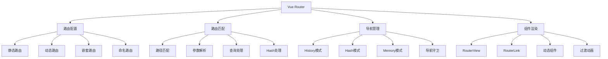

# Vue Router 路由系统深度解析

Vue Router是Vue.js的官方路由管理器，为单页面应用提供了完整的路由解决方案，支持嵌套路由、动态路由、导航守卫等强大功能。

## 🎯 Vue Router架构概览



## 🏗️ 核心特性详解

### 🔧 [核心原理](./core.md)

Vue Router的核心实现基于以下几个关键概念：

**路由匹配器**：
- 将路由配置转换为可匹配的路由记录
- 支持动态路由参数和通配符
- 实现路由优先级和精确匹配

```javascript
// 路由匹配核心逻辑
function createMatcher(routes, router) {
  const { pathList, pathMap, nameMap } = createRouteMap(routes)
  
  function match(raw, currentRoute, redirectedFrom) {
    const location = normalizeLocation(raw, currentRoute, false, router)
    const { name } = location

    if (name) {
      const record = nameMap[name]
      return _createRoute(record, location, redirectedFrom)
    } else if (location.path) {
      for (let i = 0; i < pathList.length; i++) {
        const path = pathList[i]
        const record = pathMap[path]
        if (matchRoute(record.regex, location.path, location.params)) {
          return _createRoute(record, location, redirectedFrom)
        }
      }
    }
    return _createRoute(null, location)
  }
  
  return { match, addRoutes }
}
```

**History管理**：
- HTML5 History API支持
- Hash模式兼容性
- 浏览器前进后退处理

```javascript
// History模式实现
class HTML5History extends History {
  push(location, onComplete, onAbort) {
    const { current: fromRoute } = this
    this.transitionTo(location, route => {
      pushState(cleanPath(this.base + route.fullPath))
      handleScroll(this.router, route, fromRoute, false)
      onComplete && onComplete(route)
    }, onAbort)
  }
  
  setupListeners() {
    const handleRoutingEvent = () => {
      this.transitionTo(getLocation(this.base), route => {
        if (supportsScroll) {
          handleScroll(router, route, current, true)
        }
      })
    }
    window.addEventListener('popstate', handleRoutingEvent)
  }
}
```

### 🛡️ [导航守卫与权限控制](./guards.md)

导航守卫提供了路由跳转过程中的钩子函数，是实现权限控制的核心机制：

**守卫执行顺序**：
1. 失活组件的`beforeRouteLeave`
2. 全局`beforeEach`守卫
3. 路由配置的`beforeEnter`
4. 激活组件的`beforeRouteEnter`
5. 全局`beforeResolve`守卫
6. 导航确认
7. 全局`afterEach`钩子
8. DOM更新
9. `beforeRouteEnter`的`next`回调

```javascript
// 权限控制实现
router.beforeEach(async (to, from) => {
  // 检查认证状态
  if (to.meta.requiresAuth && !isAuthenticated()) {
    return '/login'
  }
  
  // 检查权限
  if (to.meta.roles && !hasAnyRole(to.meta.roles)) {
    return '/forbidden'
  }
  
  // 动态加载路由
  if (to.meta.requiresModule) {
    await loadModule(to.meta.module)
  }
})
```

**权限控制最佳实践**：
- 基于角色的访问控制（RBAC）
- 动态路由生成
- 页面级和组件级权限控制
- 权限指令和组件封装

### 🚀 [动态路由](./dynamic.md)

动态路由是Vue Router的强大特性，支持参数传递和运行时路由管理：

**路径参数模式**：
```javascript
const routes = [
  // 基础参数
  { path: '/user/:id', component: User },
  
  // 可选参数
  { path: '/user/:id?', component: User },
  
  // 参数约束
  { path: '/user/:id(\\d+)', component: User },
  
  // 可重复参数
  { path: '/user/:ids+', component: Users },
  
  // 通配符
  { path: '/user/*', component: UserCatchAll }
]
```

**嵌套路由结构**：
```javascript
const routes = [
  {
    path: '/user/:id',
    component: User,
    children: [
      { path: '', component: UserHome },
      { path: 'profile', component: UserProfile },
      { path: 'posts', component: UserPosts },
      {
        path: 'post/:postId',
        component: UserPost,
        props: true
      }
    ]
  }
]
```

**动态路由管理**：
```javascript
// 运行时添加路由
router.addRoute({
  path: '/dynamic',
  component: DynamicComponent
})

// 添加嵌套路由
router.addRoute('parent', {
  path: 'child',
  component: ChildComponent
})

// 删除路由
router.removeRoute('routeName')
```

## 🎨 高级特性

### 1. 路由懒加载

```javascript
// 基础懒加载
const routes = [
  {
    path: '/about',
    component: () => import('@/views/About.vue')
  }
]

// 命名chunk
const routes = [
  {
    path: '/admin',
    component: () => import(/* webpackChunkName: "admin" */ '@/views/Admin.vue')
  }
]

// 条件懒加载
function createLazyRoute(path, importFn, condition) {
  return {
    path,
    component: () => {
      if (condition()) {
        return importFn()
      } else {
        return import('@/views/Forbidden.vue')
      }
    }
  }
}
```

### 2. 命名视图

```javascript
const routes = [
  {
    path: '/dashboard',
    components: {
      default: Dashboard,
      sidebar: Sidebar,
      header: Header
    }
  }
]

// 模板中使用
<template>
  <div>
    <router-view name="header"></router-view>
    <router-view name="sidebar"></router-view>
    <router-view></router-view>
  </div>
</template>
```

### 3. 路由过渡动画

```javascript
// 基于路由的过渡
<template>
  <router-view v-slot="{ Component, route }">
    <transition :name="route.meta.transition || 'fade'">
      <component :is="Component" :key="route.path" />
    </transition>
  </router-view>
</template>

// 动态过渡
<template>
  <router-view v-slot="{ Component, route }">
    <transition :name="transitionName">
      <component :is="Component" :key="route.path" />
    </transition>
  </router-view>
</template>

<script>
export default {
  computed: {
    transitionName() {
      const { from, to } = this.$route.meta.transition || {}
      return this.isForward ? to : from
    }
  }
}
</script>
```

### 4. 滚动行为

```javascript
const router = createRouter({
  history: createWebHistory(),
  routes,
  scrollBehavior(to, from, savedPosition) {
    // 返回到之前的位置
    if (savedPosition) {
      return savedPosition
    }
    
    // 滚动到锚点
    if (to.hash) {
      return {
        el: to.hash,
        behavior: 'smooth'
      }
    }
    
    // 滚动到顶部
    return { top: 0 }
  }
})
```

## 🔧 实用工具与技巧

### 1. 路由工具函数

```javascript
// 路由工具类
class RouteUtils {
  static isActive(route, currentRoute) {
    return route.path === currentRoute.path
  }
  
  static isExactActive(route, currentRoute) {
    return route.fullPath === currentRoute.fullPath
  }
  
  static buildQuery(params) {
    return Object.keys(params)
      .filter(key => params[key] !== null && params[key] !== undefined)
      .map(key => `${key}=${encodeURIComponent(params[key])}`)
      .join('&')
  }
  
  static parseQuery(queryString) {
    const params = {}
    if (queryString) {
      queryString.split('&').forEach(param => {
        const [key, value] = param.split('=')
        params[decodeURIComponent(key)] = decodeURIComponent(value || '')
      })
    }
    return params
  }
}
```

### 2. 路由状态管理

```javascript
// 路由状态store
export const useRouteStore = defineStore('route', () => {
  const history = ref([])
  const canGoBack = computed(() => history.value.length > 1)
  const canGoForward = ref(false)
  
  function pushHistory(route) {
    history.value.push({
      path: route.path,
      name: route.name,
      params: route.params,
      query: route.query,
      timestamp: Date.now()
    })
  }
  
  function goBack() {
    if (canGoBack.value) {
      history.value.pop()
      const previous = history.value[history.value.length - 1]
      router.push(previous)
    }
  }
  
  return {
    history: readonly(history),
    canGoBack,
    canGoForward,
    pushHistory,
    goBack
  }
})
```

### 3. 路由缓存策略

```javascript
// 路由缓存管理
export const useRouteCache = () => {
  const cachedRoutes = ref(new Set())
  const maxCacheSize = 10
  
  const shouldCache = (route) => {
    return route.meta.keepAlive !== false
  }
  
  const addToCache = (routeName) => {
    if (cachedRoutes.value.size >= maxCacheSize) {
      const firstRoute = cachedRoutes.value.values().next().value
      cachedRoutes.value.delete(firstRoute)
    }
    cachedRoutes.value.add(routeName)
  }
  
  const removeFromCache = (routeName) => {
    cachedRoutes.value.delete(routeName)
  }
  
  const clearCache = () => {
    cachedRoutes.value.clear()
  }
  
  return {
    cachedRoutes: readonly(cachedRoutes),
    shouldCache,
    addToCache,
    removeFromCache,
    clearCache
  }
}
```

## 🎯 性能优化

### 1. 路由预加载

```javascript
// 智能预加载
class RoutePreloader {
  constructor(router) {
    this.router = router
    this.preloadedRoutes = new Set()
  }
  
  async preloadRoute(routeName) {
    if (this.preloadedRoutes.has(routeName)) return
    
    const route = this.router.resolve({ name: routeName })
    const component = route.matched[route.matched.length - 1]?.components?.default
    
    if (typeof component === 'function') {
      try {
        await component()
        this.preloadedRoutes.add(routeName)
      } catch (error) {
        console.error(`预加载路由失败: ${routeName}`, error)
      }
    }
  }
  
  preloadOnHover(routeName) {
    return {
      onMouseenter: () => this.preloadRoute(routeName)
    }
  }
}

const preloader = new RoutePreloader(router)

// 使用
<router-link 
  to="/about" 
  v-on="preloader.preloadOnHover('about')"
>
  关于我们
</router-link>
```

### 2. 路由监控

```javascript
// 路由性能监控
const routeMonitor = {
  navigationStart: null,
  
  beforeEach(to, from) {
    this.navigationStart = performance.now()
  },
  
  afterEach(to, from, failure) {
    if (this.navigationStart) {
      const duration = performance.now() - this.navigationStart
      
      // 记录导航时间
      console.log(`路由导航耗时: ${duration.toFixed(2)}ms`)
      
      // 发送监控数据
      if (duration > 1000) {
        this.reportSlowNavigation(to, duration)
      }
    }
  },
  
  reportSlowNavigation(route, duration) {
    // 发送到监控系统
    analytics.track('slow_navigation', {
      path: route.path,
      duration,
      timestamp: Date.now()
    })
  }
}

router.beforeEach(routeMonitor.beforeEach.bind(routeMonitor))
router.afterEach(routeMonitor.afterEach.bind(routeMonitor))
```

## 🔍 调试与测试

### 1. 路由调试

```javascript
// 开发环境路由调试
if (process.env.NODE_ENV === 'development') {
  router.beforeEach((to, from) => {
    console.group(`🚀 路由导航: ${from.path} -> ${to.path}`)
    console.log('目标路由:', to)
    console.log('匹配记录:', to.matched)
    console.groupEnd()
  })
}
```

### 2. 路由测试

```javascript
// 路由测试工具
import { createRouter, createWebHistory } from 'vue-router'
import { mount } from '@vue/test-utils'

describe('Router', () => {
  let router
  
  beforeEach(() => {
    router = createRouter({
      history: createWebHistory(),
      routes: [
        { path: '/', component: Home },
        { path: '/about', component: About }
      ]
    })
  })
  
  it('navigates to about page', async () => {
    const wrapper = mount(App, {
      global: {
        plugins: [router]
      }
    })
    
    await router.push('/about')
    await wrapper.vm.$nextTick()
    
    expect(wrapper.text()).toContain('About Page')
  })
})
```

Vue Router通过其强大的路由管理能力，为Vue应用提供了完整的单页面应用解决方案。深入理解其核心原理和高级特性，能够帮助开发者构建更加灵活和高效的前端应用。
