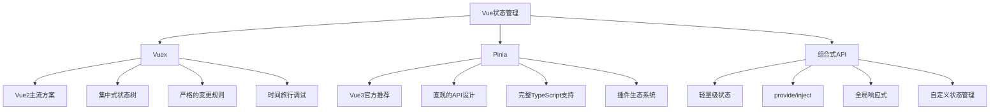
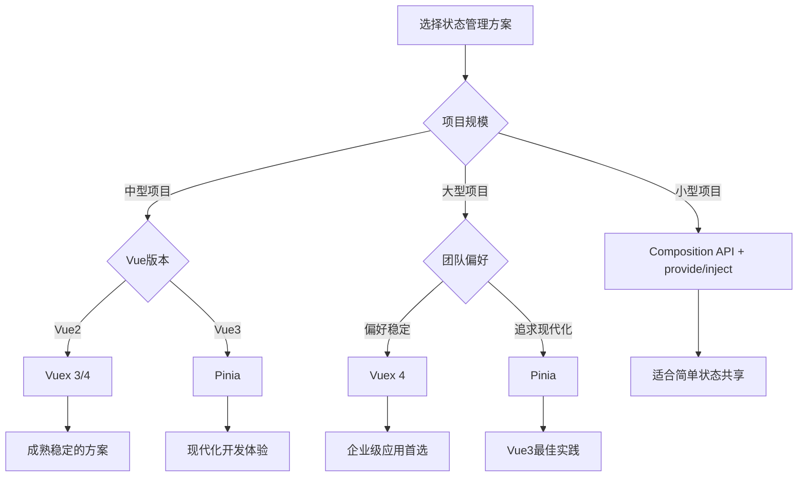

# Vue 状态管理深度解析

状态管理是现代前端应用的核心，Vue生态系统提供了从Vuex到Pinia的完整状态管理解决方案。

## 🎯 状态管理概览



## 📊 技术对比分析

### Vuex vs Pinia 详细对比

| 特性 | Vuex 4 | Pinia |
|------|--------|-------|
| **API设计** | Options API风格 | Composition API风格 |
| **TypeScript** | 需要复杂类型声明 | 原生TypeScript支持 |
| **Mutations** | 必须通过mutations修改 | 直接修改state |
| **模块化** | 嵌套模块，命名空间 | 扁平化store设计 |
| **代码分割** | 手动模块注册 | 自动代码分割 |
| **开发工具** | Vue DevTools支持 | 更好的DevTools集成 |
| **包大小** | ~2.6kb | ~1.3kb |
| **学习曲线** | 相对陡峭 | 更加直观 |

### 使用场景选择



## 🏗️ 架构设计模式

### 1. 单一状态树 vs 多Store模式

```javascript
// Vuex - 单一状态树
const store = new Vuex.Store({
  modules: {
    user: userModule,
    products: productsModule,
    cart: cartModule
  }
})

// 访问嵌套状态
store.state.user.profile
store.getters['user/isLoggedIn']
store.dispatch('user/login', credentials)

// Pinia - 多Store模式
const useUserStore = defineStore('user', () => {
  // user store logic
})

const useProductsStore = defineStore('products', () => {
  // products store logic
})

// 独立使用
const userStore = useUserStore()
const productsStore = useProductsStore()
```

### 2. 状态规范化设计

```javascript
// ❌ 嵌套结构，难以维护
const state = {
  posts: [
    {
      id: 1,
      title: 'Post 1',
      author: {
        id: 1,
        name: 'John',
        posts: [/* 循环引用 */]
      },
      comments: [
        {
          id: 1,
          text: 'Comment 1',
          author: {
            id: 2,
            name: 'Jane'
          }
        }
      ]
    }
  ]
}

// ✅ 规范化结构，易于管理
const state = {
  entities: {
    users: {
      1: { id: 1, name: 'John' },
      2: { id: 2, name: 'Jane' }
    },
    posts: {
      1: { id: 1, title: 'Post 1', authorId: 1, commentIds: [1] }
    },
    comments: {
      1: { id: 1, text: 'Comment 1', authorId: 2, postId: 1 }
    }
  },
  ui: {
    selectedPostId: null,
    loading: false
  }
}
```

### 3. 领域驱动设计

```javascript
// 按业务领域组织store
// stores/auth/
export const useAuthStore = defineStore('auth', () => {
  // 认证相关状态和逻辑
})

// stores/user/
export const useUserStore = defineStore('user', () => {
  // 用户信息相关
})

// stores/product/
export const useProductStore = defineStore('product', () => {
  // 产品相关
})

// stores/order/
export const useOrderStore = defineStore('order', () => {
  const userStore = useUserStore()
  const productStore = useProductStore()
  
  // 订单逻辑，可以依赖其他store
})
```

## 🔧 高级模式与技巧

### 1. 状态持久化

```javascript
// Vuex持久化插件
const persistedState = createPersistedState({
  key: 'vuex',
  paths: ['user', 'settings'],
  storage: window.localStorage
})

const store = new Vuex.Store({
  // ...
  plugins: [persistedState]
})

// Pinia持久化
export const useUserStore = defineStore('user', 
  () => {
    // store logic
  },
  {
    persist: {
      key: 'user-store',
      storage: localStorage,
      paths: ['profile', 'preferences']
    }
  }
)
```

### 2. 乐观更新模式

```javascript
// 乐观更新实现
export const usePostsStore = defineStore('posts', () => {
  const posts = ref([])
  const optimisticUpdates = ref(new Map())
  
  const postsWithOptimistic = computed(() => {
    return posts.value.map(post => {
      const optimistic = optimisticUpdates.value.get(post.id)
      return optimistic ? { ...post, ...optimistic } : post
    })
  })
  
  async function updatePost(id, updates) {
    // 立即应用乐观更新
    optimisticUpdates.value.set(id, updates)
    
    try {
      const response = await api.updatePost(id, updates)
      // 成功后更新真实数据
      const index = posts.value.findIndex(p => p.id === id)
      if (index !== -1) {
        posts.value[index] = response.data
      }
    } catch (error) {
      // 失败时显示错误，保持乐观更新以便用户重试
      console.error('Update failed:', error)
      throw error
    } finally {
      // 清除乐观更新
      optimisticUpdates.value.delete(id)
    }
  }
  
  return {
    posts: postsWithOptimistic,
    updatePost
  }
})
```

### 3. 状态机模式

```javascript
// 使用状态机管理复杂状态
export const useAsyncOperationStore = defineStore('asyncOperation', () => {
  const state = ref('idle') // idle, loading, success, error
  const data = ref(null)
  const error = ref(null)
  
  const isIdle = computed(() => state.value === 'idle')
  const isLoading = computed(() => state.value === 'loading')
  const isSuccess = computed(() => state.value === 'success')
  const isError = computed(() => state.value === 'error')
  
  async function execute(operation) {
    if (state.value === 'loading') return
    
    state.value = 'loading'
    error.value = null
    
    try {
      const result = await operation()
      data.value = result
      state.value = 'success'
      return result
    } catch (err) {
      error.value = err
      state.value = 'error'
      throw err
    }
  }
  
  function reset() {
    state.value = 'idle'
    data.value = null
    error.value = null
  }
  
  return {
    state: readonly(state),
    data: readonly(data),
    error: readonly(error),
    isIdle,
    isLoading,
    isSuccess,
    isError,
    execute,
    reset
  }
})
```

### 4. 事件驱动架构

```javascript
// 事件总线store
export const useEventBusStore = defineStore('eventBus', () => {
  const events = ref(new Map())
  
  function on(event, callback) {
    if (!events.value.has(event)) {
      events.value.set(event, new Set())
    }
    events.value.get(event).add(callback)
    
    // 返回取消订阅函数
    return () => {
      const callbacks = events.value.get(event)
      if (callbacks) {
        callbacks.delete(callback)
        if (callbacks.size === 0) {
          events.value.delete(event)
        }
      }
    }
  }
  
  function emit(event, payload) {
    const callbacks = events.value.get(event)
    if (callbacks) {
      callbacks.forEach(callback => {
        try {
          callback(payload)
        } catch (error) {
          console.error(`Error in event callback for ${event}:`, error)
        }
      })
    }
  }
  
  function off(event, callback) {
    const callbacks = events.value.get(event)
    if (callbacks) {
      callbacks.delete(callback)
    }
  }
  
  return { on, emit, off }
})

// 在其他store中使用事件
export const useUserStore = defineStore('user', () => {
  const eventBus = useEventBusStore()
  
  async function login(credentials) {
    const user = await api.login(credentials)
    profile.value = user
    
    // 发布登录事件
    eventBus.emit('user:login', user)
    
    return user
  }
  
  return { login }
})
```

## 🎯 性能优化策略

### 1. 状态分片

```javascript
// 将大型状态分解为小块
export const useProductsStore = defineStore('products', () => {
  // 分页数据
  const pages = ref(new Map())
  const currentPage = ref(1)
  const pageSize = ref(20)
  
  const currentProducts = computed(() => {
    return pages.value.get(currentPage.value) || []
  })
  
  async function loadPage(page) {
    if (pages.value.has(page)) return
    
    const products = await api.getProducts({ page, size: pageSize.value })
    pages.value.set(page, products)
  }
  
  return {
    currentProducts,
    currentPage,
    loadPage
  }
})
```

### 2. 计算属性缓存

```javascript
// 使用计算属性缓存昂贵计算
export const useAnalyticsStore = defineStore('analytics', () => {
  const rawData = ref([])
  
  // 缓存昂贵的计算
  const processedData = computed(() => {
    console.log('Processing data...') // 只在rawData变化时执行
    return rawData.value.map(item => ({
      ...item,
      processed: expensiveCalculation(item)
    }))
  })
  
  const summary = computed(() => {
    return processedData.value.reduce((acc, item) => {
      acc.total += item.value
      acc.count += 1
      return acc
    }, { total: 0, count: 0 })
  })
  
  return {
    rawData,
    processedData,
    summary
  }
})
```

### 3. 懒加载和代码分割

```javascript
// 动态导入store
const loadUserStore = () => import('@/stores/user').then(m => m.useUserStore)
const loadProductStore = () => import('@/stores/product').then(m => m.useProductStore)

// 路由级别的store加载
const routes = [
  {
    path: '/user',
    component: UserPage,
    beforeEnter: async () => {
      const useUserStore = await loadUserStore()
      const userStore = useUserStore()
      await userStore.initialize()
    }
  }
]
```

## 🔍 调试与测试

### 1. 开发工具集成

```javascript
// Pinia开发工具增强
export const useDebugStore = defineStore('debug', () => {
  const actions = ref([])
  
  function logAction(name, payload) {
    if (process.env.NODE_ENV === 'development') {
      actions.value.push({
        name,
        payload,
        timestamp: Date.now()
      })
    }
  }
  
  return { actions, logAction }
}, {
  // 开发工具配置
  devtools: {
    enabled: process.env.NODE_ENV === 'development'
  }
})
```

### 2. 单元测试

```javascript
// store测试
import { describe, it, expect, beforeEach } from 'vitest'
import { setActivePinia, createPinia } from 'pinia'
import { useCounterStore } from '@/stores/counter'

describe('Counter Store', () => {
  beforeEach(() => {
    setActivePinia(createPinia())
  })
  
  it('increments count', () => {
    const counter = useCounterStore()
    expect(counter.count).toBe(0)
    
    counter.increment()
    expect(counter.count).toBe(1)
  })
  
  it('computes double count', () => {
    const counter = useCounterStore()
    counter.count = 5
    expect(counter.doubleCount).toBe(10)
  })
})
```

Vue的状态管理从Vuex到Pinia的演进，体现了Vue生态系统对开发体验和现代化的不断追求。选择合适的状态管理方案，能够显著提升应用的可维护性和开发效率。
