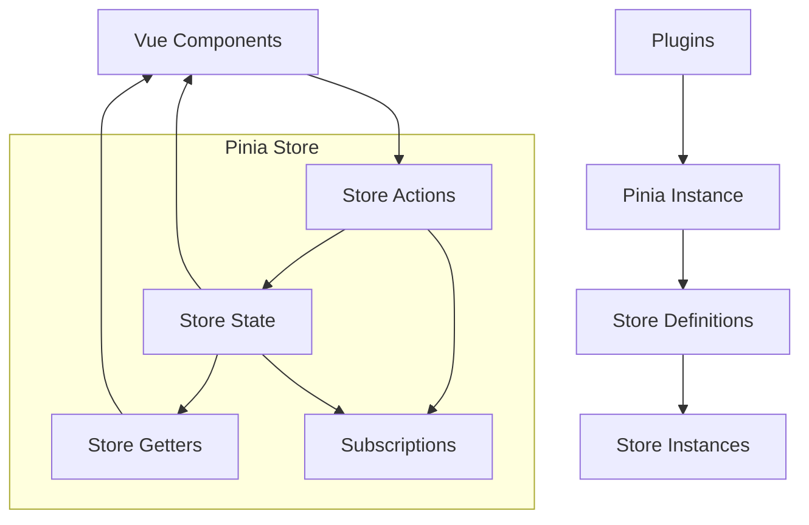

# Pinia 状态管理深度解析

Pinia是Vue3的官方推荐状态管理库，提供了更简洁的API、更好的TypeScript支持和更强的开发体验。

## 🎯 Pinia核心概念



### 核心特性

- **直观的API**：没有mutations，直接修改state
- **TypeScript支持**：完整的类型推导
- **开发工具**：Vue DevTools完美集成
- **插件系统**：可扩展的插件架构
- **服务端渲染**：SSR友好
- **代码分割**：自动代码分割支持

## 🏗️ Pinia源码实现原理

### 1. createPinia核心实现

```javascript
function createPinia() {
  const scope = effectScope(true)
  
  const state = scope.run(() => ref({}))
  
  let _p = []
  let toBeInstalled = []
  
  const pinia = markRaw({
    install(app) {
      setActivePinia(pinia)
      if (!isVue2) {
        pinia._a = app
        app.provide(piniaSymbol, pinia)
        app.config.globalProperties.$pinia = pinia
        
        if (USE_DEVTOOLS) {
          registerPiniaDevtools(app, pinia)
        }
        
        toBeInstalled.forEach((plugin) => _p.push(plugin))
        toBeInstalled = []
      }
    },

    use(plugin) {
      if (!this._a && !isVue2) {
        toBeInstalled.push(plugin)
      } else {
        _p.push(plugin)
      }
      return this
    },

    _p,
    _a: null,
    _e: scope,
    _s: new Map(),
    state
  })

  if (USE_DEVTOOLS && typeof Proxy !== 'undefined') {
    pinia.use(devtoolsPlugin)
  }

  return pinia
}
```

### 2. defineStore实现原理

```javascript
function defineStore(idOrOptions, setup, setupOptions) {
  let id
  let options
  
  const isSetupStore = typeof setup === 'function'
  
  if (typeof idOrOptions === 'string') {
    id = idOrOptions
    options = isSetupStore ? setupOptions : setup
  } else {
    options = idOrOptions
    id = idOrOptions.id
  }

  function useStore(pinia, hot) {
    const currentInstance = getCurrentInstance()
    pinia = pinia || (currentInstance && inject(piniaSymbol, null))
    
    if (pinia) setActivePinia(pinia)
    
    pinia = activePinia
    
    if (!pinia._s.has(id)) {
      if (isSetupStore) {
        createSetupStore(id, setup, options, pinia)
      } else {
        createOptionsStore(id, options, pinia)
      }
    }
    
    const store = pinia._s.get(id)
    
    if (hot) {
      const hotId = '__hot:' + id
      const newStore = isSetupStore
        ? createSetupStore(hotId, setup, options, pinia, true)
        : createOptionsStore(hotId, assign({}, options), pinia, true)
      
      hot._hotUpdate(newStore)
      
      delete pinia.state.value[hotId]
      pinia._s.delete(hotId)
    }
    
    if (IS_CLIENT && currentInstance && currentInstance.proxy && !hot) {
      const vm = currentInstance.proxy
      const cache = '_pStores' in vm ? vm._pStores : (vm._pStores = {})
      cache[id] = store
    }
    
    return store
  }
  
  useStore.$id = id
  
  return useStore
}
```

### 3. createSetupStore实现

```javascript
function createSetupStore($id, setup, options = {}, pinia, hot, isOptionsStore) {
  let scope
  const optionsForPlugin = assign({ actions: {} }, options)
  
  if (!pinia._e.active) {
    throw new Error('Pinia destroyed')
  }
  
  const $subscriptions = []
  const $actionSubscriptions = []
  
  let isListening
  let isSyncListening
  let subscriptions = markRaw([])
  let actionSubscriptions = markRaw([])
  let debuggerEvents
  
  const initialState = pinia.state.value[$id]
  
  if (!isOptionsStore && !initialState && (!hot)) {
    if (isVue2) {
      set(pinia.state.value, $id, {})
    } else {
      pinia.state.value[$id] = {}
    }
  }
  
  const hotState = ref({})
  
  let activeListener
  function $patch(partialStateOrMutator) {
    let subscriptionMutation
    isListening = isSyncListening = false
    
    if (typeof partialStateOrMutator === 'function') {
      partialStateOrMutator(pinia.state.value[$id])
      subscriptionMutation = {
        type: MutationType.patchFunction,
        storeId: $id,
        events: debuggerEvents
      }
    } else {
      mergeReactiveObjects(pinia.state.value[$id], partialStateOrMutator)
      subscriptionMutation = {
        type: MutationType.patchObject,
        payload: partialStateOrMutator,
        storeId: $id,
        events: debuggerEvents
      }
    }
    
    const myListenerId = (activeListener = Symbol())
    nextTick().then(() => {
      if (activeListener === myListenerId) {
        isListening = true
      }
    })
    isSyncListening = true
    
    triggerSubscriptions(subscriptions, subscriptionMutation, pinia.state.value[$id])
  }
  
  const $reset = isOptionsStore
    ? function $reset() {
        const { state } = options
        const newState = state ? state() : {}
        this.$patch(($state) => {
          assign($state, newState)
        })
      }
    : noop
  
  function $dispose() {
    scope.stop()
    subscriptions = []
    actionSubscriptions = []
    pinia._s.delete($id)
  }
  
  function wrapAction(name, action) {
    return function () {
      setActivePinia(pinia)
      const args = Array.from(arguments)
      
      const afterCallbackList = []
      const onErrorCallbackList = []
      
      function after(callback) {
        afterCallbackList.push(callback)
      }
      
      function onError(callback) {
        onErrorCallbackList.push(callback)
      }
      
      triggerSubscriptions(actionSubscriptions, {
        args,
        name,
        store,
        after,
        onError
      })
      
      let ret
      try {
        ret = action.apply(this, args)
      } catch (error) {
        triggerSubscriptions(onErrorCallbackList, error)
        throw error
      }
      
      if (ret instanceof Promise) {
        return ret
          .then((value) => {
            triggerSubscriptions(afterCallbackList, value)
            return value
          })
          .catch((error) => {
            triggerSubscriptions(onErrorCallbackList, error)
            return Promise.reject(error)
          })
      }
      
      triggerSubscriptions(afterCallbackList, ret)
      return ret
    }
  }
  
  const partialStore = {
    _p: pinia,
    $id,
    $onAction: addSubscription.bind(null, actionSubscriptions),
    $patch,
    $reset,
    $subscribe(callback, options = {}) {
      const removeSubscription = addSubscription(subscriptions, callback, options.detached, () => stopWatcher())
      const stopWatcher = scope.run(() =>
        watch(
          () => pinia.state.value[$id],
          (state) => {
            if (options.flush === 'sync' ? isSyncListening : isListening) {
              callback(
                {
                  storeId: $id,
                  type: MutationType.direct,
                  events: debuggerEvents
                },
                state
              )
            }
          },
          assign({}, $subscribeOptions, options)
        )
      )
      
      return removeSubscription
    },
    $dispose
  }
  
  const store = reactive(partialStore)
  
  pinia._s.set($id, store)
  
  const runWithContext = (pinia._a && pinia._a.runWithContext) || fallbackRunWithContext
  
  const setupStore = runWithContext(() =>
    pinia._e.run(() => (scope = effectScope()).run(setup))
  )
  
  for (const key in setupStore) {
    const prop = setupStore[key]
    
    if ((isRef(prop) && !isComputed(prop)) || isReactive(prop)) {
      if (hot) {
        set(hotState.value, key, toRef(setupStore, key))
      } else if (!isOptionsStore) {
        if (initialState && shouldHydrate(prop)) {
          if (isRef(prop)) {
            prop.value = initialState[key]
          } else {
            mergeReactiveObjects(prop, initialState[key])
          }
        }
        
        if (isVue2) {
          set(pinia.state.value[$id], key, prop)
        } else {
          pinia.state.value[$id][key] = prop
        }
      }
    } else if (typeof prop === 'function') {
      const actionValue = hot ? prop : wrapAction(key, prop)
      
      if (isVue2) {
        set(setupStore, key, actionValue)
      } else {
        setupStore[key] = actionValue
      }
      
      optionsForPlugin.actions[key] = prop
    }
  }
  
  if (isVue2) {
    Object.keys(setupStore).forEach((key) => {
      set(store, key, setupStore[key])
    })
  } else {
    assign(store, setupStore)
    assign(toRaw(store), setupStore)
  }
  
  Object.defineProperty(store, '$state', {
    get: () => (hot ? hotState.value : pinia.state.value[$id]),
    set: (state) => {
      if (hot) {
        throw new Error('cannot set hotState')
      }
      $patch(($state) => {
        assign($state, state)
      })
    }
  })
  
  if (USE_DEVTOOLS) {
    store._customProperties = markRaw(new Set())
  }
  
  pinia._p.forEach((extender) => {
    if (USE_DEVTOOLS) {
      const extensions = scope.run(() => extender({
        store,
        app: pinia._a,
        pinia,
        options: optionsForPlugin
      }))
      
      Object.keys(extensions || {}).forEach((key) => {
        store._customProperties.add(key)
      })
      
      assign(store, extensions)
    } else {
      assign(store, scope.run(() => extender({
        store,
        app: pinia._a,
        pinia,
        options: optionsForPlugin
      })))
    }
  })
  
  if (store.$state && typeof store.$state === 'object' && typeof store.$state.constructor === 'function' && !store.$state.constructor.toString().includes('[native code]')) {
    console.warn('The "state" must be a plain object. It cannot be\n' +
      '\t- a class instance\n' +
      '\t- a function\n' +
      '\t- a Date\n' +
      '\t- etc.\n' +
      'If you need complex types, use `markRaw()` to wrap them.')
  }
  
  if (initialState && isOptionsStore && options.hydrate) {
    options.hydrate(store.$state, initialState)
  }
  
  isListening = true
  isSyncListening = true
  
  return store
}
```

## 🎨 高级用法与最佳实践

### 1. Setup Store模式

```javascript
// stores/user.js
export const useUserStore = defineStore('user', () => {
  // State
  const profile = ref(null)
  const permissions = ref([])
  const preferences = ref({})
  
  // Getters
  const isLoggedIn = computed(() => !!profile.value)
  const fullName = computed(() => {
    return profile.value 
      ? `${profile.value.firstName} ${profile.value.lastName}` 
      : ''
  })
  const hasPermission = computed(() => {
    return (permission) => permissions.value.includes(permission)
  })
  
  // Actions
  async function login(credentials) {
    try {
      const response = await api.login(credentials)
      const { user, token, permissions: userPermissions } = response.data
      
      localStorage.setItem('token', token)
      profile.value = user
      permissions.value = userPermissions
      
      await fetchPreferences()
      return user
    } catch (error) {
      throw error
    }
  }
  
  async function logout() {
    try {
      await api.logout()
    } finally {
      localStorage.removeItem('token')
      $reset()
    }
  }
  
  async function fetchPreferences() {
    if (!profile.value) return
    
    try {
      const response = await api.getUserPreferences(profile.value.id)
      preferences.value = response.data
    } catch (error) {
      console.error('Failed to fetch preferences:', error)
    }
  }
  
  function updatePreferences(newPreferences) {
    preferences.value = { ...preferences.value, ...newPreferences }
  }
  
  function $reset() {
    profile.value = null
    permissions.value = []
    preferences.value = {}
  }
  
  return {
    // State
    profile: readonly(profile),
    permissions: readonly(permissions),
    preferences,
    
    // Getters
    isLoggedIn,
    fullName,
    hasPermission,
    
    // Actions
    login,
    logout,
    fetchPreferences,
    updatePreferences,
    $reset
  }
})
```

### 2. Options Store模式

```javascript
// stores/counter.js
export const useCounterStore = defineStore('counter', {
  state: () => ({
    count: 0,
    history: []
  }),
  
  getters: {
    doubleCount: (state) => state.count * 2,
    
    countPlusOne(): number {
      return this.count + 1
    },
    
    historyLength: (state) => state.history.length
  },
  
  actions: {
    increment() {
      this.count++
      this.history.push({ action: 'increment', timestamp: Date.now() })
    },
    
    decrement() {
      this.count--
      this.history.push({ action: 'decrement', timestamp: Date.now() })
    },
    
    async incrementAsync() {
      await new Promise(resolve => setTimeout(resolve, 1000))
      this.increment()
    },
    
    reset() {
      this.count = 0
      this.history = []
    }
  }
})
```

### 3. 组合多个Store

```javascript
// stores/app.js
export const useAppStore = defineStore('app', () => {
  const userStore = useUserStore()
  const settingsStore = useSettingsStore()
  
  const isInitialized = ref(false)
  const loading = ref(false)
  
  async function initialize() {
    if (isInitialized.value) return
    
    loading.value = true
    try {
      // 并行初始化
      await Promise.all([
        userStore.initializeFromToken(),
        settingsStore.loadSettings()
      ])
      
      isInitialized.value = true
    } catch (error) {
      console.error('App initialization failed:', error)
    } finally {
      loading.value = false
    }
  }
  
  function reset() {
    userStore.$reset()
    settingsStore.$reset()
    isInitialized.value = false
  }
  
  return {
    isInitialized: readonly(isInitialized),
    loading: readonly(loading),
    initialize,
    reset
  }
})
```

### 4. 插件开发

```javascript
// plugins/persistence.js
function createPersistedState(options = {}) {
  return ({ store }) => {
    const { key = store.$id, storage = localStorage } = options
    
    // 恢复状态
    const savedState = storage.getItem(key)
    if (savedState) {
      store.$patch(JSON.parse(savedState))
    }
    
    // 监听变化并保存
    store.$subscribe((mutation, state) => {
      storage.setItem(key, JSON.stringify(state))
    })
  }
}

// 使用插件
const pinia = createPinia()
pinia.use(createPersistedState())

// 或者为特定store使用
const useUserStore = defineStore('user', () => {
  // store定义
}, {
  persist: true
})
```

## 🔧 TypeScript集成

### 1. 类型安全的Store

```typescript
interface User {
  id: number
  name: string
  email: string
}

interface UserState {
  profile: User | null
  permissions: string[]
}

export const useUserStore = defineStore('user', {
  state: (): UserState => ({
    profile: null,
    permissions: []
  }),
  
  getters: {
    isLoggedIn: (state): boolean => !!state.profile,
    
    hasPermission: (state) => {
      return (permission: string): boolean => {
        return state.permissions.includes(permission)
      }
    }
  },
  
  actions: {
    async login(credentials: LoginCredentials): Promise<User> {
      const response = await api.login(credentials)
      this.profile = response.data.user
      this.permissions = response.data.permissions
      return this.profile
    }
  }
})
```

### 2. 全局类型声明

```typescript
// types/pinia.d.ts
import 'pinia'

declare module 'pinia' {
  export interface PiniaCustomProperties {
    $router: Router
    $route: RouteLocationNormalizedLoaded
  }
}

// 在插件中使用
pinia.use(({ store }) => {
  store.$router = markRaw(router)
  store.$route = markRaw(route)
})
```

## 🎯 性能优化

### 1. 状态订阅优化

```javascript
export const useOptimizedStore = defineStore('optimized', () => {
  const data = ref([])
  const filters = ref({})
  
  // 使用computed缓存昂贵计算
  const filteredData = computed(() => {
    return data.value.filter(item => {
      return Object.entries(filters.value).every(([key, value]) => {
        return !value || item[key] === value
      })
    })
  })
  
  // 防抖更新
  const debouncedUpdateFilters = debounce((newFilters) => {
    filters.value = newFilters
  }, 300)
  
  return {
    data: readonly(data),
    filteredData,
    updateFilters: debouncedUpdateFilters
  }
})
```

### 2. 懒加载Store

```javascript
// 路由级别的store懒加载
const routes = [
  {
    path: '/admin',
    component: AdminLayout,
    beforeEnter: async () => {
      // 动态导入store
      const { useAdminStore } = await import('@/stores/admin')
      const adminStore = useAdminStore()
      await adminStore.initialize()
    }
  }
]
```

Pinia通过其现代化的API设计和强大的TypeScript支持，为Vue3应用提供了更优雅的状态管理解决方案。
