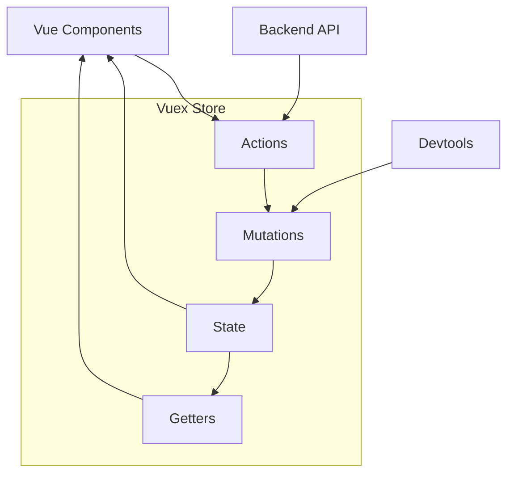

# Vuex 状态管理深度解析

Vuex是Vue.js的官方状态管理库，采用集中式存储管理应用的所有组件状态，并以相应的规则保证状态以可预测的方式发生变化。

## 🎯 Vuex核心概念



### 核心组成部分

- **State**：单一状态树，存储应用的所有状态
- **Getters**：从state派生的状态，类似计算属性
- **Mutations**：同步修改state的唯一方式
- **Actions**：异步操作，提交mutations
- **Modules**：模块化管理，避免单一状态树过于庞大

## 🏗️ Vuex源码实现原理

### 1. Store类核心实现

```javascript
class Store {
  constructor(options = {}) {
    const {
      plugins = [],
      strict = false
    } = options

    // 内部状态
    this._committing = false
    this._actions = Object.create(null)
    this._actionSubscribers = []
    this._mutations = Object.create(null)
    this._wrappedGetters = Object.create(null)
    this._modules = new ModuleCollection(options)
    this._modulesNamespaceMap = Object.create(null)
    this._subscribers = []
    this._watcherVM = new Vue()
    this._makeLocalGettersCache = Object.create(null)

    // 绑定commit和dispatch的this指向
    const store = this
    const { dispatch, commit } = this
    this.dispatch = function boundDispatch(type, payload) {
      return dispatch.call(store, type, payload)
    }
    this.commit = function boundCommit(type, payload) {
      return commit.call(store, type, payload)
    }

    // 严格模式
    this.strict = strict

    const state = this._modules.root.state

    // 初始化根模块，递归注册所有子模块
    installModule(this, state, [], this._modules.root)

    // 初始化store vm，使state和getters响应式
    resetStoreVM(this, state)

    // 应用插件
    plugins.forEach(plugin => plugin(this))
  }

  get state() {
    return this._vm._data.$$state
  }

  set state(v) {
    if (process.env.NODE_ENV !== 'production') {
      assert(false, `use store.replaceState() to explicit replace store state.`)
    }
  }

  commit(_type, _payload, _options) {
    // 统一格式
    const { type, payload, options } = unifyObjectStyle(_type, _payload, _options)

    const mutation = { type, payload }
    const entry = this._mutations[type]
    
    if (!entry) {
      if (process.env.NODE_ENV !== 'production') {
        console.error(`[vuex] unknown mutation type: ${type}`)
      }
      return
    }

    // 执行mutation
    this._withCommit(() => {
      entry.forEach(function commitIterator(handler) {
        handler(payload)
      })
    })

    // 通知订阅者
    this._subscribers
      .slice()
      .forEach(sub => sub(mutation, this.state))

    if (process.env.NODE_ENV !== 'production' && options && options.silent) {
      console.warn(
        `[vuex] mutation type: ${type}. Silent option has been removed. ` +
        'Use the filter functionality in the vue-devtools'
      )
    }
  }

  dispatch(_type, _payload) {
    // 统一格式
    const { type, payload } = unifyObjectStyle(_type, _payload)

    const action = { type, payload }
    const entry = this._actions[type]
    
    if (!entry) {
      if (process.env.NODE_ENV !== 'production') {
        console.error(`[vuex] unknown action type: ${type}`)
      }
      return
    }

    try {
      this._actionSubscribers
        .slice()
        .filter(sub => sub.before)
        .forEach(sub => sub.before(action, this.state))
    } catch (e) {
      if (process.env.NODE_ENV !== 'production') {
        console.warn(`[vuex] error in before action subscribers: `)
        console.error(e)
      }
    }

    const result = entry.length > 1
      ? Promise.all(entry.map(handler => handler(payload)))
      : entry[0](payload)

    return new Promise((resolve, reject) => {
      result.then(res => {
        try {
          this._actionSubscribers
            .filter(sub => sub.after)
            .forEach(sub => sub.after(action, this.state))
        } catch (e) {
          if (process.env.NODE_ENV !== 'production') {
            console.warn(`[vuex] error in after action subscribers: `)
            console.error(e)
          }
        }
        resolve(res)
      }, error => {
        try {
          this._actionSubscribers
            .filter(sub => sub.error)
            .forEach(sub => sub.error(action, this.state, error))
        } catch (e) {
          if (process.env.NODE_ENV !== 'production') {
            console.warn(`[vuex] error in error action subscribers: `)
            console.error(e)
          }
        }
        reject(error)
      })
    })
  }

  // 确保只能通过mutation修改state
  _withCommit(fn) {
    const committing = this._committing
    this._committing = true
    fn()
    this._committing = committing
  }
}
```

### 2. 响应式实现

```javascript
function resetStoreVM(store, state, hot) {
  const oldVm = store._vm

  // 绑定store的getters
  store.getters = {}
  // 重置本地getters缓存
  store._makeLocalGettersCache = Object.create(null)
  const wrappedGetters = store._wrappedGetters
  const computed = {}
  
  forEachValue(wrappedGetters, (fn, key) => {
    // 使用computed来利用其缓存特性
    computed[key] = partial(fn, store)
    Object.defineProperty(store.getters, key, {
      get: () => store._vm[key],
      enumerable: true
    })
  })

  // 使用Vue实例来保存state和getters
  const silent = Vue.config.silent
  Vue.config.silent = true
  store._vm = new Vue({
    data: {
      $$state: state
    },
    computed
  })
  Vue.config.silent = silent

  // 启用严格模式
  if (store.strict) {
    enableStrictMode(store)
  }

  if (oldVm) {
    if (hot) {
      // 热重载时保持现有状态
      store._withCommit(() => {
        oldVm._data.$$state = null
      })
    }
    Vue.nextTick(() => oldVm.$destroy())
  }
}

function enableStrictMode(store) {
  store._vm.$watch(function () { return this._data.$$state }, () => {
    if (process.env.NODE_ENV !== 'production') {
      assert(store._committing, `do not mutate vuex store state outside mutation handlers.`)
    }
  }, { deep: true, sync: true })
}
```

### 3. 模块系统实现

```javascript
class ModuleCollection {
  constructor(rawRootModule) {
    // 注册根模块
    this.register([], rawRootModule, false)
  }

  get(path) {
    return path.reduce((module, key) => {
      return module.getChild(key)
    }, this.root)
  }

  getNamespace(path) {
    let module = this.root
    return path.reduce((namespace, key) => {
      module = module.getChild(key)
      return namespace + (module.namespaced ? key + '/' : '')
    }, '')
  }

  register(path, rawModule, runtime = true) {
    if (process.env.NODE_ENV !== 'production') {
      assertRawModule(path, rawModule)
    }

    const newModule = new Module(rawModule, runtime)
    if (path.length === 0) {
      this.root = newModule
    } else {
      const parent = this.get(path.slice(0, -1))
      parent.addChild(path[path.length - 1], newModule)
    }

    // 注册嵌套模块
    if (rawModule.modules) {
      forEachValue(rawModule.modules, (rawChildModule, key) => {
        this.register(path.concat(key), rawChildModule, runtime)
      })
    }
  }
}

class Module {
  constructor(rawModule, runtime) {
    this.runtime = runtime
    this._children = Object.create(null)
    this._rawModule = rawModule
    const rawState = rawModule.state

    this.state = (typeof rawState === 'function' ? rawState() : rawState) || {}
  }

  get namespaced() {
    return !!this._rawModule.namespaced
  }

  addChild(key, module) {
    this._children[key] = module
  }

  removeChild(key) {
    delete this._children[key]
  }

  getChild(key) {
    return this._children[key]
  }

  hasChild(key) {
    return key in this._children
  }

  update(rawModule) {
    this._rawModule.namespaced = rawModule.namespaced
    if (rawModule.actions) {
      this._rawModule.actions = rawModule.actions
    }
    if (rawModule.mutations) {
      this._rawModule.mutations = rawModule.mutations
    }
    if (rawModule.getters) {
      this._rawModule.getters = rawModule.getters
    }
  }

  forEachChild(fn) {
    forEachValue(this._children, fn)
  }

  forEachGetter(fn) {
    if (this._rawModule.getters) {
      forEachValue(this._rawModule.getters, fn)
    }
  }

  forEachAction(fn) {
    if (this._rawModule.actions) {
      forEachValue(this._rawModule.actions, fn)
    }
  }

  forEachMutation(fn) {
    if (this._rawModule.mutations) {
      forEachValue(this._rawModule.mutations, fn)
    }
  }
}
```

## 🔧 高级用法与最佳实践

### 1. 模块化设计

```javascript
// store/modules/user.js
const state = {
  profile: null,
  permissions: [],
  preferences: {}
}

const getters = {
  isLoggedIn: state => !!state.profile,
  hasPermission: state => permission => {
    return state.permissions.includes(permission)
  },
  fullName: state => {
    return state.profile ? `${state.profile.firstName} ${state.profile.lastName}` : ''
  }
}

const mutations = {
  SET_PROFILE(state, profile) {
    state.profile = profile
  },
  SET_PERMISSIONS(state, permissions) {
    state.permissions = permissions
  },
  UPDATE_PREFERENCES(state, preferences) {
    state.preferences = { ...state.preferences, ...preferences }
  },
  CLEAR_USER_DATA(state) {
    state.profile = null
    state.permissions = []
    state.preferences = {}
  }
}

const actions = {
  async login({ commit, dispatch }, credentials) {
    try {
      const response = await api.login(credentials)
      const { user, token, permissions } = response.data
      
      // 存储token
      localStorage.setItem('token', token)
      
      // 更新状态
      commit('SET_PROFILE', user)
      commit('SET_PERMISSIONS', permissions)
      
      // 获取用户偏好设置
      await dispatch('fetchPreferences')
      
      return user
    } catch (error) {
      throw error
    }
  },

  async logout({ commit }) {
    try {
      await api.logout()
    } finally {
      localStorage.removeItem('token')
      commit('CLEAR_USER_DATA')
    }
  },

  async fetchPreferences({ commit, state }) {
    if (!state.profile) return
    
    try {
      const response = await api.getUserPreferences(state.profile.id)
      commit('UPDATE_PREFERENCES', response.data)
    } catch (error) {
      console.error('Failed to fetch user preferences:', error)
    }
  }
}

export default {
  namespaced: true,
  state,
  getters,
  mutations,
  actions
}
```

### 2. 插件系统

```javascript
// 持久化插件
const persistencePlugin = store => {
  // 初始化时从localStorage恢复状态
  const savedState = localStorage.getItem('vuex-state')
  if (savedState) {
    store.replaceState(JSON.parse(savedState))
  }

  // 监听mutation，保存状态到localStorage
  store.subscribe((mutation, state) => {
    // 只保存特定模块的状态
    const stateToSave = {
      user: state.user,
      settings: state.settings
    }
    localStorage.setItem('vuex-state', JSON.stringify(stateToSave))
  })
}

// 日志插件
const loggerPlugin = store => {
  store.subscribe((mutation, state) => {
    console.group(`Mutation: ${mutation.type}`)
    console.log('Payload:', mutation.payload)
    console.log('State after:', state)
    console.groupEnd()
  })

  store.subscribeAction((action, state) => {
    console.group(`Action: ${action.type}`)
    console.log('Payload:', action.payload)
    console.log('State before:', state)
    console.groupEnd()
  })
}

// 使用插件
const store = new Vuex.Store({
  // ...
  plugins: [persistencePlugin, loggerPlugin]
})
```

### 3. 严格模式与开发工具

```javascript
const store = new Vuex.Store({
  // 开发环境启用严格模式
  strict: process.env.NODE_ENV !== 'production',
  
  // 开发工具支持
  devtools: process.env.NODE_ENV !== 'production',
  
  plugins: process.env.NODE_ENV !== 'production' 
    ? [createLogger()] 
    : []
})
```

## 🎯 性能优化技巧

### 1. 合理使用getters

```javascript
// ❌ 避免在getters中进行昂贵计算
const getters = {
  expensiveGetter: state => {
    // 每次访问都会重新计算
    return state.items.map(item => {
      // 昂贵的计算
      return processItem(item)
    })
  }
}

// ✅ 使用缓存优化
const getters = {
  expensiveGetter: state => {
    // 利用Vue的计算属性缓存
    return state.processedItems
  }
}

const mutations = {
  SET_ITEMS(state, items) {
    state.items = items
    // 预处理数据
    state.processedItems = items.map(processItem)
  }
}
```

### 2. 避免频繁的状态变更

```javascript
// ❌ 频繁的单个mutation
actions: {
  updateMultipleFields({ commit }, data) {
    commit('SET_FIELD_A', data.a)
    commit('SET_FIELD_B', data.b)
    commit('SET_FIELD_C', data.c)
  }
}

// ✅ 批量更新
mutations: {
  UPDATE_MULTIPLE_FIELDS(state, data) {
    Object.assign(state, data)
  }
}

actions: {
  updateMultipleFields({ commit }, data) {
    commit('UPDATE_MULTIPLE_FIELDS', data)
  }
}
```

### 3. 模块懒加载

```javascript
// 动态注册模块
const store = new Vuex.Store({
  modules: {
    // 核心模块
    user: userModule
  }
})

// 路由级别的模块懒加载
router.beforeEach(async (to, from, next) => {
  if (to.matched.some(record => record.meta.requiresAuth)) {
    if (!store.hasModule('admin')) {
      const adminModule = await import('./store/modules/admin')
      store.registerModule('admin', adminModule.default)
    }
  }
  next()
})
```

Vuex通过其严格的状态管理模式和强大的开发工具支持，为大型Vue应用提供了可预测的状态管理解决方案。
