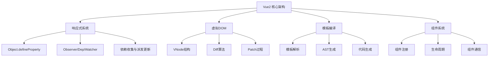

# Vue2 核心原理深度解析

Vue2 作为一个成熟的前端框架，其核心原理包含了响应式系统、虚拟DOM、双向绑定等多个重要概念。深入理解这些原理对于掌握Vue2至关重要。

## 🎯 Vue2 架构概览



## 📚 核心原理详解

### 🔄 [响应式系统](./reactivity.md)

Vue2的响应式系统是其最核心的特性，基于`Object.defineProperty`实现：

- **数据劫持**：通过getter/setter拦截数据访问
- **依赖收集**：在getter中收集依赖关系
- **派发更新**：在setter中通知视图更新
- **异步更新队列**：批量处理更新，提升性能

```javascript
// 响应式原理核心
function defineReactive(obj, key, val) {
  const dep = new Dep()
  Object.defineProperty(obj, key, {
    get() {
      if (Dep.target) {
        dep.depend() // 收集依赖
      }
      return val
    },
    set(newVal) {
      if (newVal === val) return
      val = newVal
      dep.notify() // 通知更新
    }
  })
}
```

**关键特点**：
- ✅ 自动依赖收集，无需手动声明
- ✅ 精确更新，只更新相关组件
- ❌ 无法监听数组索引和对象属性的添加/删除
- ❌ 需要递归遍历所有属性，初始化性能开销大

### 🌳 [虚拟DOM与Diff算法](./virtual-dom.md)

虚拟DOM是Vue2性能优化的核心技术：

- **VNode结构**：JavaScript对象描述DOM结构
- **同层比较**：O(n)时间复杂度的高效算法
- **双端比较**：优化列表更新性能
- **Key的重要性**：提供节点复用的依据

```javascript
// 双端比较核心逻辑
function updateChildren(parentElm, oldCh, newCh) {
  let oldStartIdx = 0, newStartIdx = 0
  let oldEndIdx = oldCh.length - 1
  let newEndIdx = newCh.length - 1
  
  while (oldStartIdx <= oldEndIdx && newStartIdx <= newEndIdx) {
    if (sameVnode(oldStartVnode, newStartVnode)) {
      // 旧开始 vs 新开始
      patchVnode(oldStartVnode, newStartVnode)
    } else if (sameVnode(oldEndVnode, newEndVnode)) {
      // 旧结束 vs 新结束
      patchVnode(oldEndVnode, newEndVnode)
    }
    // ... 其他比较情况
  }
}
```

**优化策略**：
- 🎯 合理使用key提升列表性能
- 🎯 避免不必要的深层嵌套
- 🎯 使用v-show替代频繁切换的v-if

### 🔄 [双向绑定机制](./two-way-binding.md)

v-model是Vue2双向绑定的核心实现：

- **编译时转换**：v-model转换为属性绑定+事件监听
- **不同表单元素**：针对不同input类型的特殊处理
- **修饰符支持**：.lazy、.number、.trim等
- **自定义组件**：通过model选项自定义绑定

```javascript
// v-model编译结果
// <input v-model="message" />
// 等价于：
<input 
  :value="message" 
  @input="message = $event.target.value"
/>
```

**核心特性**：
- 🔄 数据驱动视图更新
- 🔄 视图变化同步数据
- 🎛️ 支持多种修饰符
- 🧩 自定义组件集成

### ⏰ [生命周期机制](./lifecycle.md)

Vue2提供了完整的组件生命周期钩子：

- **创建阶段**：beforeCreate → created
- **挂载阶段**：beforeMount → mounted  
- **更新阶段**：beforeUpdate → updated
- **销毁阶段**：beforeDestroy → destroyed

```javascript
export default {
  // 数据初始化
  created() {
    this.fetchData()
  },
  
  // DOM操作
  mounted() {
    this.initChart()
  },
  
  // 清理工作
  beforeDestroy() {
    clearInterval(this.timer)
  }
}
```

## 🔧 源码架构分析

### 目录结构

```
src/
├── compiler/          # 模板编译相关
├── core/             # 核心代码
│   ├── components/   # 内置组件
│   ├── global-api/   # 全局API
│   ├── instance/     # 实例相关
│   ├── observer/     # 响应式系统
│   └── vdom/         # 虚拟DOM
├── platforms/        # 平台特定代码
├── server/          # 服务端渲染
└── shared/          # 共享工具
```

### 初始化流程

```javascript
function Vue(options) {
  this._init(options)
}

Vue.prototype._init = function(options) {
  // 1. 合并配置
  vm.$options = mergeOptions(...)
  
  // 2. 初始化生命周期
  initLifecycle(vm)
  
  // 3. 初始化事件
  initEvents(vm)
  
  // 4. 初始化渲染
  initRender(vm)
  
  // 5. 调用beforeCreate
  callHook(vm, 'beforeCreate')
  
  // 6. 初始化状态
  initState(vm) // data, props, computed, methods, watch
  
  // 7. 调用created
  callHook(vm, 'created')
  
  // 8. 挂载
  if (vm.$options.el) {
    vm.$mount(vm.$options.el)
  }
}
```

## 🎯 性能优化要点

### 1. 响应式优化

```javascript
// ❌ 避免深层嵌套的响应式数据
data() {
  return {
    deeply: {
      nested: {
        object: {
          value: 'expensive'
        }
      }
    }
  }
}

// ✅ 扁平化数据结构
data() {
  return {
    nestedValue: 'efficient'
  }
}
```

### 2. 虚拟DOM优化

```javascript
// ✅ 使用key优化列表渲染
<li v-for="item in list" :key="item.id">
  {{ item.name }}
</li>

// ✅ 避免在模板中使用复杂表达式
computed: {
  expensiveValue() {
    return this.items.filter(item => item.active)
      .map(item => item.value)
      .reduce((sum, val) => sum + val, 0)
  }
}
```

### 3. 组件优化

```javascript
// ✅ 使用函数式组件
Vue.component('functional-component', {
  functional: true,
  render(h, { props, children }) {
    return h('div', props, children)
  }
})

// ✅ 合理使用keep-alive
<keep-alive>
  <component :is="currentComponent" />
</keep-alive>
```

## 🔍 常见问题与解决方案

### 1. 数组变化检测

```javascript
// ❌ 直接索引赋值无法检测
this.items[0] = newValue

// ✅ 使用Vue.set
Vue.set(this.items, 0, newValue)
// 或
this.$set(this.items, 0, newValue)
```

### 2. 对象属性添加

```javascript
// ❌ 直接添加属性无法检测
this.obj.newProp = 'value'

// ✅ 使用Vue.set
Vue.set(this.obj, 'newProp', 'value')
```

### 3. 异步更新理解

```javascript
// DOM更新是异步的
this.message = 'updated'
console.log(this.$el.textContent) // 还是旧值

// 使用$nextTick等待DOM更新
this.$nextTick(() => {
  console.log(this.$el.textContent) // 新值
})
```

## 📖 学习建议

### 初学者路径
1. **理解响应式原理** → 掌握Vue的核心机制
2. **学习组件生命周期** → 知道何时执行何种操作
3. **掌握虚拟DOM概念** → 理解性能优化原理
4. **实践双向绑定** → 熟练使用v-model

### 进阶开发者
1. **源码阅读** → 深入理解实现细节
2. **性能优化** → 掌握各种优化技巧
3. **自定义指令** → 扩展Vue功能
4. **插件开发** → 构建可复用的功能模块

Vue2的这些核心原理相互配合，构成了一个完整而高效的前端框架。深入理解这些原理，将帮助你更好地使用Vue2，并为学习Vue3打下坚实基础。
