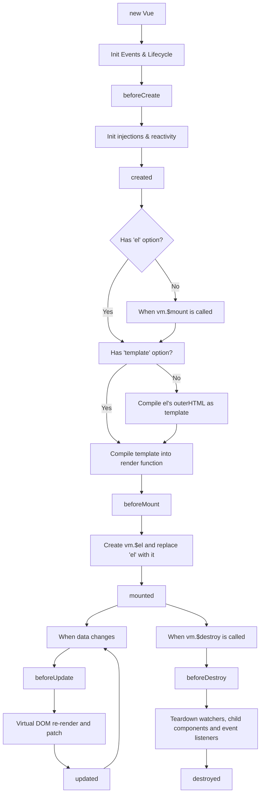

# Vue2 生命周期深度解析

Vue2的生命周期是组件从创建到销毁的完整过程，理解生命周期对于掌握Vue的运行机制至关重要。

## 🔄 生命周期概览



## 🏗️ 生命周期钩子详解

### 1. beforeCreate

组件实例刚被创建，数据观测和事件配置都未开始：

```javascript
export default {
  beforeCreate() {
    console.log('beforeCreate')
    console.log('data:', this.$data) // undefined
    console.log('methods:', this.myMethod) // undefined
    console.log('computed:', this.myComputed) // undefined
    console.log('el:', this.$el) // undefined
  },
  
  data() {
    return {
      message: 'Hello Vue'
    }
  },
  
  methods: {
    myMethod() {
      console.log('method called')
    }
  },
  
  computed: {
    myComputed() {
      return this.message + '!'
    }
  }
}
```

**源码实现**：

```javascript
function initMixin(Vue) {
  Vue.prototype._init = function (options) {
    const vm = this
    vm._uid = uid++
    vm._isVue = true
    
    // 合并选项
    if (options && options._isComponent) {
      initInternalComponent(vm, options)
    } else {
      vm.$options = mergeOptions(
        resolveConstructorOptions(vm.constructor),
        options || {},
        vm
      )
    }
    
    vm._renderProxy = vm
    vm._self = vm
    
    initLifecycle(vm)
    initEvents(vm)
    initRender(vm)
    
    // 调用 beforeCreate 钩子
    callHook(vm, 'beforeCreate')
    
    initInjections(vm)
    initState(vm) // 初始化 data、props、computed、methods、watch
    initProvide(vm)
    
    // 调用 created 钩子
    callHook(vm, 'created')
    
    if (vm.$options.el) {
      vm.$mount(vm.$options.el)
    }
  }
}
```

### 2. created

实例创建完成，数据观测、属性和方法的运算已完成，但DOM未生成：

```javascript
export default {
  created() {
    console.log('created')
    console.log('data:', this.$data) // 可访问
    console.log('methods:', this.myMethod) // 可访问
    console.log('computed:', this.myComputed) // 可访问
    console.log('el:', this.$el) // undefined
    
    // 适合进行数据初始化
    this.fetchData()
  },
  
  methods: {
    fetchData() {
      // 发起API请求
      axios.get('/api/data').then(response => {
        this.data = response.data
      })
    }
  }
}
```

### 3. beforeMount

模板编译完成，即将挂载到DOM，但还未挂载：

```javascript
export default {
  beforeMount() {
    console.log('beforeMount')
    console.log('el:', this.$el) // undefined
    console.log('template compiled') // 模板已编译为渲染函数
  }
}
```

**源码实现**：

```javascript
Vue.prototype.$mount = function (el, hydrating) {
  el = el && query(el)
  
  const options = this.$options
  if (!options.render) {
    let template = options.template
    if (template) {
      if (typeof template === 'string') {
        if (template.charAt(0) === '#') {
          template = idToTemplate(template)
        }
      } else if (template.nodeType) {
        template = template.innerHTML
      } else {
        return this
      }
    } else if (el) {
      template = getOuterHTML(el)
    }
    
    if (template) {
      const { render, staticRenderFns } = compileToFunctions(template, {
        outputSourceRange: process.env.NODE_ENV !== 'production',
        shouldDecodeNewlines,
        shouldDecodeNewlinesForHref,
        delimiters: options.delimiters,
        comments: options.comments
      }, this)
      options.render = render
      options.staticRenderFns = staticRenderFns
    }
  }
  
  return mount.call(this, el, hydrating)
}

const mount = Vue.prototype.$mount
Vue.prototype.$mount = function (el, hydrating) {
  el = el && inBrowser ? query(el) : undefined
  return mountComponent(this, el, hydrating)
}

function mountComponent(vm, el, hydrating) {
  vm.$el = el
  
  if (!vm.$options.render) {
    vm.$options.render = createEmptyVNode
  }
  
  callHook(vm, 'beforeMount')
  
  let updateComponent = () => {
    vm._update(vm._render(), hydrating)
  }
  
  new Watcher(vm, updateComponent, noop, {
    before() {
      if (vm._isMounted && !vm._isDestroyed) {
        callHook(vm, 'beforeUpdate')
      }
    }
  }, true)
  
  hydrating = false
  
  if (vm.$vnode == null) {
    vm._isMounted = true
    callHook(vm, 'mounted')
  }
  
  return vm
}
```

### 4. mounted

组件挂载完成，DOM已生成，可以访问DOM元素：

```javascript
export default {
  mounted() {
    console.log('mounted')
    console.log('el:', this.$el) // 可访问DOM元素
    
    // 适合进行DOM操作
    this.$nextTick(() => {
      // DOM更新完成后执行
      this.initChart()
    })
  },
  
  methods: {
    initChart() {
      // 初始化图表等需要DOM的操作
      const canvas = this.$refs.canvas
      const ctx = canvas.getContext('2d')
      // 绘制图表...
    }
  }
}
```

### 5. beforeUpdate

数据更新时调用，发生在虚拟DOM重新渲染之前：

```javascript
export default {
  data() {
    return {
      count: 0
    }
  },
  
  beforeUpdate() {
    console.log('beforeUpdate')
    console.log('旧的count值:', this.count)
    console.log('DOM还未更新')
  },
  
  methods: {
    increment() {
      this.count++
    }
  }
}
```

### 6. updated

数据更新完成，DOM重新渲染完成：

```javascript
export default {
  updated() {
    console.log('updated')
    console.log('新的count值:', this.count)
    console.log('DOM已更新')
    
    // 注意：避免在此钩子中修改数据，可能导致无限循环
  }
}
```

### 7. beforeDestroy

实例销毁之前调用，实例仍然完全可用：

```javascript
export default {
  beforeDestroy() {
    console.log('beforeDestroy')
    
    // 清理工作
    clearInterval(this.timer)
    window.removeEventListener('resize', this.handleResize)
    
    // 取消网络请求
    if (this.cancelToken) {
      this.cancelToken.cancel('组件销毁')
    }
  },
  
  data() {
    return {
      timer: null
    }
  },
  
  mounted() {
    this.timer = setInterval(() => {
      console.log('定时器执行')
    }, 1000)
    
    window.addEventListener('resize', this.handleResize)
  },
  
  methods: {
    handleResize() {
      // 处理窗口大小变化
    }
  }
}
```

### 8. destroyed

实例销毁后调用，所有指令解绑，事件监听器移除：

```javascript
export default {
  destroyed() {
    console.log('destroyed')
    console.log('组件已完全销毁')
    
    // 此时组件实例已不可用
    // 主要用于确认清理工作完成
  }
}
```

## 🔧 生命周期源码实现

### callHook 函数

```javascript
function callHook(vm, hook) {
  pushTarget()
  const handlers = vm.$options[hook]
  const info = `${hook} hook`
  
  if (handlers) {
    for (let i = 0, j = handlers.length; i < j; i++) {
      invokeWithErrorHandling(handlers[i], vm, null, vm, info)
    }
  }
  
  if (vm._hasHookEvent) {
    vm.$emit('hook:' + hook)
  }
  
  popTarget()
}

function invokeWithErrorHandling(handler, context, args, vm, info) {
  let res
  try {
    res = args ? handler.apply(context, args) : handler.call(context)
    if (res && !res._isVue && isPromise(res) && !res._handled) {
      res.catch(e => handleError(e, vm, info + ` (Promise/async)`))
      res._handled = true
    }
  } catch (e) {
    handleError(e, vm, info)
  }
  return res
}
```

### 销毁过程

```javascript
Vue.prototype.$destroy = function () {
  const vm = this
  if (vm._isBeingDestroyed) {
    return
  }
  
  callHook(vm, 'beforeDestroy')
  vm._isBeingDestroyed = true
  
  // 从父组件中移除
  const parent = vm.$parent
  if (parent && !parent._isBeingDestroyed && !vm.$options.abstract) {
    remove(parent.$children, vm)
  }
  
  // 销毁watcher
  if (vm._watcher) {
    vm._watcher.teardown()
  }
  let i = vm._watchers.length
  while (i--) {
    vm._watchers[i].teardown()
  }
  
  // 移除数据观测的引用计数
  if (vm._data.__ob__) {
    vm._data.__ob__.vmCount--
  }
  
  vm._isDestroyed = true
  
  // 调用当前渲染树上的销毁钩子
  vm.__patch__(vm._vnode, null)
  
  callHook(vm, 'destroyed')
  
  // 关闭所有实例监听器
  vm.$off()
  
  // 移除__vue__引用
  if (vm.$el) {
    vm.$el.__vue__ = null
  }
  
  // 释放循环引用
  if (vm.$vnode) {
    vm.$vnode.parent = null
  }
}
```

## 🎯 最佳实践

### 1. 合理选择生命周期钩子

```javascript
export default {
  // 数据初始化
  created() {
    this.fetchUserData()
  },
  
  // DOM操作
  mounted() {
    this.initEcharts()
    this.bindEvents()
  },
  
  // 清理工作
  beforeDestroy() {
    this.cleanup()
  }
}
```

### 2. 避免在updated中修改数据

```javascript
export default {
  updated() {
    // ❌ 错误：可能导致无限循环
    // this.count++
    
    // ✅ 正确：只进行DOM相关操作
    this.adjustLayout()
  }
}
```

### 3. 异步组件的生命周期

```javascript
const AsyncComponent = () => ({
  component: import('./MyComponent.vue'),
  loading: LoadingComponent,
  error: ErrorComponent,
  delay: 200,
  timeout: 3000
})
```

Vue2的生命周期机制为开发者提供了在组件不同阶段执行代码的能力，是Vue组件系统的重要组成部分。
