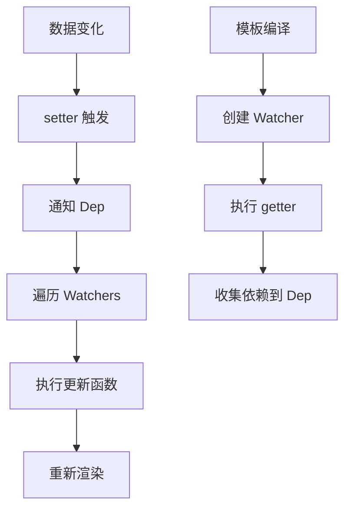

# Vue2 响应式原理深度解析

Vue2 的响应式系统是其核心特性之一，基于 Object.defineProperty 实现数据劫持，结合观察者模式实现数据变化的自动响应。

## 🔍 响应式原理概述

Vue2 响应式系统的核心思想：
- **数据劫持**：通过 Object.defineProperty 劫持对象属性的 getter/setter
- **依赖收集**：在 getter 中收集依赖（Watcher）
- **派发更新**：在 setter 中通知所有依赖进行更新



## 🏗️ 核心实现原理

### 1. Observer 观察者

Observer 负责将普通对象转换为响应式对象：

```javascript
class Observer {
  constructor(value) {
    this.value = value
    this.dep = new Dep() // 为对象本身创建依赖管理器
    
    // 为对象添加 __ob__ 属性，标记为已观察
    def(value, '__ob__', this)
    
    if (Array.isArray(value)) {
      // 数组的特殊处理
      this.observeArray(value)
    } else {
      // 对象的处理
      this.walk(value)
    }
  }
  
  walk(obj) {
    const keys = Object.keys(obj)
    for (let i = 0; i < keys.length; i++) {
      defineReactive(obj, keys[i])
    }
  }
  
  observeArray(items) {
    for (let i = 0, l = items.length; i < l; i++) {
      observe(items[i])
    }
  }
}
```

### 2. defineReactive 核心函数

这是响应式系统的核心，为对象属性定义 getter/setter：

```javascript
function defineReactive(obj, key, val, customSetter, shallow) {
  // 为每个属性创建依赖管理器
  const dep = new Dep()
  
  const property = Object.getOwnPropertyDescriptor(obj, key)
  if (property && property.configurable === false) {
    return
  }
  
  // 保存原有的 getter/setter
  const getter = property && property.get
  const setter = property && property.set
  
  // 递归观察子对象
  let childOb = !shallow && observe(val)
  
  Object.defineProperty(obj, key, {
    enumerable: true,
    configurable: true,
    get: function reactiveGetter() {
      const value = getter ? getter.call(obj) : val
      
      // 依赖收集的关键逻辑
      if (Dep.target) {
        dep.depend() // 收集依赖
        if (childOb) {
          childOb.dep.depend() // 子对象也要收集依赖
          if (Array.isArray(value)) {
            dependArray(value) // 数组特殊处理
          }
        }
      }
      return value
    },
    set: function reactiveSetter(newVal) {
      const value = getter ? getter.call(obj) : val
      
      // 值没有变化则不触发更新
      if (newVal === value || (newVal !== newVal && value !== value)) {
        return
      }
      
      if (setter) {
        setter.call(obj, newVal)
      } else {
        val = newVal
      }
      
      // 新值也要进行观察
      childOb = !shallow && observe(newVal)
      
      // 通知所有依赖进行更新
      dep.notify()
    }
  })
}
```

### 3. Dep 依赖管理器

Dep 负责管理依赖关系，连接数据和视图：

```javascript
let uid = 0

class Dep {
  constructor() {
    this.id = uid++
    this.subs = [] // 存储所有的 Watcher
  }
  
  addSub(sub) {
    this.subs.push(sub)
  }
  
  removeSub(sub) {
    remove(this.subs, sub)
  }
  
  depend() {
    if (Dep.target) {
      Dep.target.addDep(this)
    }
  }
  
  notify() {
    // 通知所有订阅者
    const subs = this.subs.slice()
    for (let i = 0, l = subs.length; i < l; i++) {
      subs[i].update()
    }
  }
}

// 全局唯一的 Watcher，用于依赖收集
Dep.target = null
const targetStack = []

export function pushTarget(target) {
  targetStack.push(target)
  Dep.target = target
}

export function popTarget() {
  targetStack.pop()
  Dep.target = targetStack[targetStack.length - 1]
}
```

### 4. Watcher 观察者

Watcher 是连接数据层和视图层的桥梁：

```javascript
class Watcher {
  constructor(vm, expOrFn, cb, options, isRenderWatcher) {
    this.vm = vm
    if (isRenderWatcher) {
      vm._watcher = this
    }
    vm._watchers.push(this)
    
    // 选项处理
    if (options) {
      this.deep = !!options.deep
      this.user = !!options.user
      this.lazy = !!options.lazy
      this.sync = !!options.sync
    } else {
      this.deep = this.user = this.lazy = this.sync = false
    }
    
    this.cb = cb
    this.id = ++uid
    this.active = true
    this.dirty = this.lazy
    this.deps = []
    this.newDeps = []
    this.depIds = new Set()
    this.newDepIds = new Set()
    this.expression = expOrFn.toString()
    
    // 解析表达式
    if (typeof expOrFn === 'function') {
      this.getter = expOrFn
    } else {
      this.getter = parsePath(expOrFn)
    }
    
    this.value = this.lazy ? undefined : this.get()
  }
  
  get() {
    // 设置当前 Watcher 为全局 target
    pushTarget(this)
    let value
    const vm = this.vm
    try {
      // 执行 getter，触发依赖收集
      value = this.getter.call(vm, vm)
    } catch (e) {
      if (this.user) {
        handleError(e, vm, `getter for watcher "${this.expression}"`)
      } else {
        throw e
      }
    } finally {
      if (this.deep) {
        traverse(value) // 深度监听
      }
      popTarget()
      this.cleanupDeps()
    }
    return value
  }
  
  addDep(dep) {
    const id = dep.id
    if (!this.newDepIds.has(id)) {
      this.newDepIds.add(id)
      this.newDeps.push(dep)
      if (!this.depIds.has(id)) {
        dep.addSub(this)
      }
    }
  }
  
  update() {
    if (this.lazy) {
      this.dirty = true
    } else if (this.sync) {
      this.run()
    } else {
      queueWatcher(this) // 异步更新队列
    }
  }
  
  run() {
    if (this.active) {
      const value = this.get()
      if (value !== this.value || isObject(value) || this.deep) {
        const oldValue = this.value
        this.value = value
        if (this.user) {
          try {
            this.cb.call(this.vm, value, oldValue)
          } catch (e) {
            handleError(e, this.vm, `callback for watcher "${this.expression}"`)
          }
        } else {
          this.cb.call(this.vm, value, oldValue)
        }
      }
    }
  }
}
```

## 🔄 数组响应式处理

Vue2 对数组的响应式处理比较特殊，因为 Object.defineProperty 无法监听数组索引的变化：

```javascript
const arrayProto = Array.prototype
const arrayMethods = Object.create(arrayProto)

const methodsToPatch = [
  'push', 'pop', 'shift', 'unshift', 'splice', 'sort', 'reverse'
]

methodsToPatch.forEach(function (method) {
  const original = arrayProto[method]
  def(arrayMethods, method, function mutator(...args) {
    const result = original.apply(this, args)
    const ob = this.__ob__
    let inserted
    switch (method) {
      case 'push':
      case 'unshift':
        inserted = args
        break
      case 'splice':
        inserted = args.slice(2)
        break
    }
    // 新增元素也要进行观察
    if (inserted) ob.observeArray(inserted)
    // 通知更新
    ob.dep.notify()
    return result
  })
})
```

## ⚡ 异步更新机制

Vue2 使用异步更新队列来优化性能，避免同一个 tick 内的重复更新：

```javascript
const queue = []
let has = {}
let waiting = false
let flushing = false
let index = 0

function queueWatcher(watcher) {
  const id = watcher.id
  if (has[id] == null) {
    has[id] = true
    if (!flushing) {
      queue.push(watcher)
    } else {
      // 如果已经在刷新，插入到正确位置
      let i = queue.length - 1
      while (i > index && queue[i].id > watcher.id) {
        i--
      }
      queue.splice(i + 1, 0, watcher)
    }
    
    if (!waiting) {
      waiting = true
      nextTick(flushSchedulerQueue)
    }
  }
}

function flushSchedulerQueue() {
  flushing = true
  let watcher, id
  
  // 按 id 排序，确保父组件先于子组件更新
  queue.sort((a, b) => a.id - b.id)
  
  for (index = 0; index < queue.length; index++) {
    watcher = queue[index]
    if (watcher.before) {
      watcher.before()
    }
    id = watcher.id
    has[id] = null
    watcher.run()
  }
  
  // 重置状态
  resetSchedulerState()
}
```

## 🎯 核心特点总结

### 优势
1. **自动依赖收集**：无需手动声明依赖关系
2. **精确更新**：只更新真正依赖数据的组件
3. **异步更新**：批量处理更新，提高性能

### 局限性
1. **Object.defineProperty 限制**：
   - 无法监听数组索引变化
   - 无法监听对象属性的添加/删除
   - 需要递归遍历所有属性

2. **初始化性能**：需要递归遍历所有数据进行劫持

### 解决方案
```javascript
// 动态添加响应式属性
Vue.set(vm.obj, 'newProp', value)
// 或
vm.$set(vm.obj, 'newProp', value)

// 动态删除响应式属性
Vue.delete(vm.obj, 'prop')
// 或
vm.$delete(vm.obj, 'prop')
```

这套响应式系统是 Vue2 的核心，理解其原理对于深入掌握 Vue2 至关重要。
