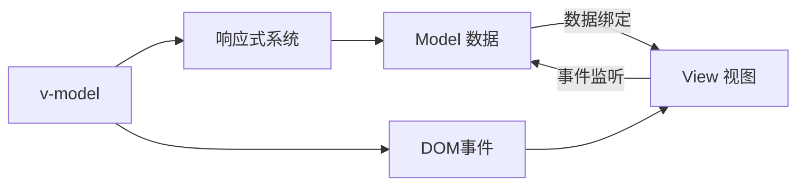

# Vue2 双向绑定机制深度解析

Vue2的双向绑定是通过v-model指令实现的，它是响应式系统和事件系统的完美结合，让数据和视图保持同步。

## 🎯 双向绑定原理概述

双向绑定 = 数据绑定 + 事件监听



## 🏗️ v-model 实现原理

### 1. 模板编译阶段

v-model在编译时会被转换为对应的属性绑定和事件监听：

```javascript
// 模板
<input v-model="message" />

// 编译后等价于
<input 
  :value="message" 
  @input="message = $event.target.value"
/>
```

编译器处理v-model的核心代码：

```javascript
function genDefaultModel(el, value, modifiers) {
  const type = el.attrsMap.type
  
  // 开发环境警告
  if (process.env.NODE_ENV !== 'production') {
    const value = el.attrsMap['v-bind:value'] || el.attrsMap[':value']
    const typeBinding = el.attrsMap['v-bind:type'] || el.attrsMap[':type']
    if (value && !typeBinding) {
      const binding = el.attrsMap['v-bind:value'] ? 'v-bind:value' : ':value'
      warn(
        `${binding}="${value}" conflicts with v-model on the same element ` +
        'because the latter already expands to a value binding internally',
        el.rawAttrsMap[binding]
      )
    }
  }

  const { lazy, number, trim } = modifiers || {}
  const needCompositionGuard = !lazy && type !== 'range'
  const event = lazy ? 'change' : type === 'range' ? RANGE_TOKEN : 'input'

  let valueExpression = '$event.target.value'
  if (trim) {
    valueExpression = `$event.target.value.trim()`
  }
  if (number) {
    valueExpression = `_n(${valueExpression})`
  }

  let code = genAssignmentCode(value, valueExpression)
  if (needCompositionGuard) {
    code = `if($event.target.composing)return;${code}`
  }

  addProp(el, 'value', `(${value})`)
  addHandler(el, event, code, null, true)
  if (trim || number) {
    addHandler(el, 'blur', '$forceUpdate()')
  }
}
```

### 2. 不同表单元素的处理

#### input[type="text"] 和 textarea

```javascript
function genDefaultModel(el, value, modifiers) {
  // 绑定value属性
  addProp(el, 'value', `(${value})`)
  // 监听input事件
  addHandler(el, 'input', `${value}=$event.target.value`)
}

// 生成的渲染函数
function render() {
  return h('input', {
    domProps: {
      value: this.message
    },
    on: {
      input: ($event) => {
        if ($event.target.composing) return
        this.message = $event.target.value
      }
    }
  })
}
```

#### input[type="checkbox"]

```javascript
function genCheckboxModel(el, value, modifiers) {
  const number = modifiers && modifiers.number
  const valueBinding = getBindingAttr(el, 'value') || 'null'
  const trueValueBinding = getBindingAttr(el, 'true-value') || 'true'
  const falseValueBinding = getBindingAttr(el, 'false-value') || 'false'

  addProp(el, 'checked',
    `Array.isArray(${value})` +
    `?_i(${value},${valueBinding})>-1` + (
      trueValueBinding === 'true'
        ? `:(${value})`
        : `:_q(${value},${trueValueBinding})`
    )
  )

  addHandler(el, 'change',
    `var $$a=${value},` +
        '$$el=$event.target,' +
        `$$c=$$el.checked?(${trueValueBinding}):(${falseValueBinding});` +
    'if(Array.isArray($$a)){' +
      `var $$v=${number ? '_n(' + valueBinding + ')' : valueBinding},` +
          '$$i=_i($$a,$$v);' +
      `if($$el.checked){$$i<0&&(${genAssignmentCode(value, '$$a.concat([$$v])')})}` +
      `else{$$i>-1&&(${genAssignmentCode(value, '$$a.slice(0,$$i).concat($$a.slice($$i+1))')})}` +
    `}else{${genAssignmentCode(value, '$$c')}}`
  )
}
```

#### input[type="radio"]

```javascript
function genRadioModel(el, value, modifiers) {
  const number = modifiers && modifiers.number
  let valueBinding = getBindingAttr(el, 'value') || 'null'
  valueBinding = number ? `_n(${valueBinding})` : valueBinding
  
  addProp(el, 'checked', `_q(${value},${valueBinding})`)
  addHandler(el, 'change', genAssignmentCode(value, valueBinding))
}
```

#### select

```javascript
function genSelect(el, value, modifiers) {
  const number = modifiers && modifiers.number
  const selectedVal = `Array.prototype.filter` +
    `.call($event.target.options,function(o){return o.selected})` +
    `.map(function(o){var val = "_value" in o ? o._value : o.value;` +
    `return ${number ? '_n(val)' : 'val'}})`

  const assignment = '$event.target.multiple ? $$selectedVal : $$selectedVal[0]'
  let code = `var $$selectedVal = ${selectedVal};`
  code = `${code} ${genAssignmentCode(value, assignment)}`
  addHandler(el, 'change', code)
}
```

## 🔄 修饰符处理

### .lazy 修饰符

```javascript
// v-model.lazy="message"
// 使用change事件替代input事件
<input 
  :value="message" 
  @change="message = $event.target.value"
/>
```

### .number 修饰符

```javascript
// v-model.number="age"
// 自动将输入值转换为数字
<input 
  :value="age" 
  @input="age = _n($event.target.value)"
/>

// _n 函数的实现
function toNumber(val) {
  const n = parseFloat(val)
  return isNaN(n) ? val : n
}
```

### .trim 修饰符

```javascript
// v-model.trim="message"
// 自动过滤首尾空白字符
<input 
  :value="message" 
  @input="message = $event.target.value.trim()"
  @blur="$forceUpdate()"
/>
```

## 🎨 自定义组件的v-model

### 默认实现

```javascript
// 父组件
<custom-input v-model="searchText" />

// 等价于
<custom-input
  :value="searchText"
  @input="searchText = $event"
/>

// 子组件
Vue.component('custom-input', {
  props: ['value'],
  template: `
    <input
      :value="value"
      @input="$emit('input', $event.target.value)"
    >
  `
})
```

### 自定义prop和event

```javascript
Vue.component('base-checkbox', {
  model: {
    prop: 'checked',
    event: 'change'
  },
  props: {
    checked: Boolean
  },
  template: `
    <input
      type="checkbox"
      :checked="checked"
      @change="$emit('change', $event.target.checked)"
    >
  `
})

// 使用时
<base-checkbox v-model="lovingVue"></base-checkbox>

// 等价于
<base-checkbox
  :checked="lovingVue"
  @change="lovingVue = $event"
></base-checkbox>
```

## 🔧 实现原理深入

### 1. 编译时处理

```javascript
// 编译器中的processModel函数
function processModel(el) {
  const value = getBindingAttr(el, 'v-model')
  if (!value) return
  
  const modifiers = parseModifiers(el.attrsMap['v-model'])
  
  if (el.tag === 'input') {
    const type = el.attrsMap.type
    if (type === 'checkbox') {
      genCheckboxModel(el, value, modifiers)
    } else if (type === 'radio') {
      genRadioModel(el, value, modifiers)
    } else {
      genDefaultModel(el, value, modifiers)
    }
  } else if (el.tag === 'select') {
    genSelect(el, value, modifiers)
  } else if (el.tag === 'textarea') {
    genDefaultModel(el, value, modifiers)
  } else {
    // 自定义组件
    genComponentModel(el, value, modifiers)
  }
}
```

### 2. 运行时处理

```javascript
// 组件实例化时处理model选项
function initModel(vm, model) {
  const { prop = 'value', event = 'input' } = model
  
  // 将model的prop添加到props中
  if (!vm.$options.props[prop]) {
    vm.$options.props[prop] = { type: null }
  }
  
  // 处理model事件
  vm.$on(event, (val) => {
    vm.$emit('input', val)
  })
}
```

### 3. 中文输入法处理

Vue2特别处理了中文输入法的composing状态：

```javascript
function onCompositionStart(e) {
  e.target.composing = true
}

function onCompositionEnd(e) {
  if (!e.target.composing) return
  e.target.composing = false
  trigger(e.target, 'input')
}

function trigger(el, type) {
  const e = document.createEvent('HTMLEvents')
  e.initEvent(type, true, true)
  el.dispatchEvent(e)
}

// 在input事件中检查composing状态
function onInput(e) {
  if (e.target.composing) return
  // 执行v-model的更新逻辑
}
```

## 🎯 最佳实践

### 1. 表单验证结合

```javascript
// 结合表单验证
<template>
  <div>
    <input 
      v-model.trim="email"
      @blur="validateEmail"
      :class="{ error: emailError }"
    />
    <span v-if="emailError" class="error-msg">{{ emailError }}</span>
  </div>
</template>

<script>
export default {
  data() {
    return {
      email: '',
      emailError: ''
    }
  },
  methods: {
    validateEmail() {
      const emailRegex = /^[^\s@]+@[^\s@]+\.[^\s@]+$/
      if (!emailRegex.test(this.email)) {
        this.emailError = '请输入有效的邮箱地址'
      } else {
        this.emailError = ''
      }
    }
  }
}
</script>
```

### 2. 防抖处理

```javascript
// 结合防抖优化性能
<template>
  <input v-model="searchQuery" @input="debouncedSearch" />
</template>

<script>
import { debounce } from 'lodash'

export default {
  data() {
    return {
      searchQuery: ''
    }
  },
  created() {
    this.debouncedSearch = debounce(this.performSearch, 300)
  },
  methods: {
    performSearch() {
      // 执行搜索逻辑
      console.log('搜索:', this.searchQuery)
    }
  }
}
</script>
```

## 🔍 常见问题

### 1. v-model与:value冲突

```javascript
// 错误：不能同时使用
<input v-model="message" :value="message" />

// 正确：选择其中一种
<input v-model="message" />
// 或
<input :value="message" @input="message = $event.target.value" />
```

### 2. 数组/对象的深度监听

```javascript
// 对于复杂数据结构，需要深度监听
watch: {
  formData: {
    handler(newVal) {
      // 处理变化
    },
    deep: true
  }
}
```

Vue2的双向绑定机制通过巧妙的编译时转换和运行时处理，实现了数据和视图的无缝同步，是Vue响应式系统的重要组成部分。
