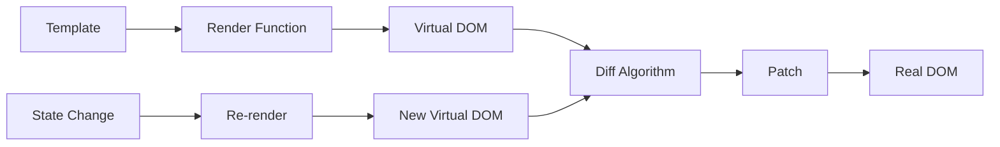

# Vue2 虚拟DOM与Diff算法深度解析

虚拟DOM是Vue2性能优化的核心技术，通过JavaScript对象描述DOM结构，结合高效的diff算法实现最小化DOM操作。

## 🎯 虚拟DOM概述

虚拟DOM（Virtual DOM）是对真实DOM的抽象表示，具有以下优势：
- **性能优化**：减少直接操作DOM的次数
- **跨平台**：可以渲染到不同平台
- **可预测性**：函数式的更新方式



## 🏗️ VNode 结构

VNode（Virtual Node）是虚拟DOM的基本单元：

```javascript
class VNode {
  constructor(
    tag,        // 标签名
    data,       // 节点数据（属性、事件等）
    children,   // 子节点
    text,       // 文本内容
    elm,        // 对应的真实DOM节点
    context,    // 组件实例
    componentOptions, // 组件选项
    asyncFactory // 异步组件工厂函数
  ) {
    this.tag = tag
    this.data = data
    this.children = children
    this.text = text
    this.elm = elm
    this.ns = undefined
    this.context = context
    this.fnContext = undefined
    this.fnOptions = undefined
    this.fnScopeId = undefined
    this.key = data && data.key
    this.componentOptions = componentOptions
    this.componentInstance = undefined
    this.parent = undefined
    this.raw = false
    this.isStatic = false
    this.isRootInsert = true
    this.isComment = false
    this.isCloned = false
    this.isOnce = false
    this.asyncFactory = asyncFactory
    this.asyncMeta = undefined
    this.isAsyncPlaceholder = false
  }
}

// 创建不同类型的VNode
function createEmptyVNode(text = '') {
  const node = new VNode()
  node.text = text
  node.isComment = true
  return node
}

function createTextVNode(val) {
  return new VNode(undefined, undefined, undefined, String(val))
}

function createComponent(Ctor, data, context, children, tag) {
  // 组件VNode创建逻辑
  const baseCtor = context.$options._base
  if (isObject(Ctor)) {
    Ctor = baseCtor.extend(Ctor)
  }
  
  data = data || {}
  
  // 安装组件钩子函数
  installComponentHooks(data)
  
  const name = Ctor.options.name || tag
  const vnode = new VNode(
    `vue-component-${Ctor.cid}${name ? `-${name}` : ''}`,
    data, undefined, undefined, undefined, context,
    { Ctor, propsData, listeners, tag, children },
    asyncFactory
  )
  
  return vnode
}
```

## ⚡ Diff算法核心

Vue2的diff算法采用**同层比较**策略，时间复杂度为O(n)：

### 1. patch 函数

patch是diff算法的入口函数：

```javascript
function patch(oldVnode, vnode, hydrating, removeOnly) {
  // 新节点不存在，删除旧节点
  if (isUndef(vnode)) {
    if (isDef(oldVnode)) invokeDestroyHook(oldVnode)
    return
  }

  let isInitialPatch = false
  const insertedVnodeQueue = []

  // 旧节点不存在，创建新节点
  if (isUndef(oldVnode)) {
    isInitialPatch = true
    createElm(vnode, insertedVnodeQueue)
  } else {
    const isRealElement = isDef(oldVnode.nodeType)
    
    // 相同节点，进行patchVnode
    if (!isRealElement && sameVnode(oldVnode, vnode)) {
      patchVnode(oldVnode, vnode, insertedVnodeQueue, null, null, removeOnly)
    } else {
      // 不同节点，替换
      if (isRealElement) {
        oldVnode = emptyNodeAt(oldVnode)
      }

      const oldElm = oldVnode.elm
      const parentElm = nodeOps.parentNode(oldElm)

      // 创建新节点
      createElm(
        vnode,
        insertedVnodeQueue,
        oldElm._leaveCb ? null : parentElm,
        nodeOps.nextSibling(oldElm)
      )

      // 递归更新父占位符节点
      if (isDef(vnode.parent)) {
        let ancestor = vnode.parent
        const patchable = isPatchable(vnode)
        while (ancestor) {
          for (let i = 0; i < cbs.destroy.length; ++i) {
            cbs.destroy[i](ancestor)
          }
          ancestor.elm = vnode.elm
          if (patchable) {
            for (let i = 0; i < cbs.create.length; ++i) {
              cbs.create[i](emptyNode, ancestor)
            }
          }
          ancestor = ancestor.parent
        }
      }

      // 删除旧节点
      if (isDef(parentElm)) {
        removeVnodes([oldVnode], 0, 0)
      } else if (isDef(oldVnode.tag)) {
        invokeDestroyHook(oldVnode)
      }
    }
  }

  invokeInsertHook(vnode, insertedVnodeQueue, isInitialPatch)
  return vnode.elm
}
```

### 2. sameVnode 判断

判断两个节点是否相同的关键函数：

```javascript
function sameVnode(a, b) {
  return (
    a.key === b.key && (
      (
        a.tag === b.tag &&
        a.isComment === b.isComment &&
        isDef(a.data) === isDef(b.data) &&
        sameInputType(a, b)
      ) || (
        isTrue(a.isAsyncPlaceholder) &&
        a.asyncFactory === b.asyncFactory &&
        isUndef(b.asyncFactory.error)
      )
    )
  )
}

function sameInputType(a, b) {
  if (a.tag !== 'input') return true
  let i
  const typeA = isDef(i = a.data) && isDef(i = i.attrs) && i.type
  const typeB = isDef(i = b.data) && isDef(i = i.attrs) && i.type
  return typeA === typeB || isTextInputType(typeA) && isTextInputType(typeB)
}
```

### 3. patchVnode 核心逻辑

对相同节点进行详细比较：

```javascript
function patchVnode(
  oldVnode,
  vnode,
  insertedVnodeQueue,
  ownerArray,
  index,
  removeOnly
) {
  // 完全相同的节点，直接返回
  if (oldVnode === vnode) {
    return
  }

  if (isDef(vnode.elm) && isDef(ownerArray)) {
    vnode = ownerArray[index] = cloneVNode(vnode)
  }

  const elm = vnode.elm = oldVnode.elm

  // 异步占位符处理
  if (isTrue(oldVnode.isAsyncPlaceholder)) {
    if (isDef(vnode.asyncFactory.resolved)) {
      hydrate(oldVnode.elm, vnode, insertedVnodeQueue)
    } else {
      vnode.isAsyncPlaceholder = true
    }
    return
  }

  // 静态节点处理
  if (isTrue(vnode.isStatic) &&
      isTrue(oldVnode.isStatic) &&
      vnode.key === oldVnode.key &&
      (isTrue(vnode.isCloned) || isTrue(vnode.isOnce))) {
    vnode.componentInstance = oldVnode.componentInstance
    return
  }

  let i
  const data = vnode.data
  if (isDef(data) && isDef(i = data.hook) && isDef(i = i.prepatch)) {
    i(oldVnode, vnode)
  }

  const oldCh = oldVnode.children
  const ch = vnode.children

  // 更新属性
  if (isDef(data) && isPatchable(vnode)) {
    for (i = 0; i < cbs.update.length; ++i) cbs.update[i](oldVnode, vnode)
    if (isDef(i = data.hook) && isDef(i = i.update)) i(oldVnode, vnode)
  }

  // 文本节点处理
  if (isUndef(vnode.text)) {
    if (isDef(oldCh) && isDef(ch)) {
      // 都有子节点，进行子节点diff
      if (oldCh !== ch) updateChildren(elm, oldCh, ch, insertedVnodeQueue, removeOnly)
    } else if (isDef(ch)) {
      // 只有新节点有子节点
      if (isDef(oldVnode.text)) nodeOps.setTextContent(elm, '')
      addVnodes(elm, null, ch, 0, ch.length - 1, insertedVnodeQueue)
    } else if (isDef(oldCh)) {
      // 只有旧节点有子节点
      removeVnodes(oldCh, 0, oldCh.length - 1)
    } else if (isDef(oldVnode.text)) {
      // 都没有子节点，清空文本
      nodeOps.setTextContent(elm, '')
    }
  } else if (oldVnode.text !== vnode.text) {
    // 文本不同，更新文本
    nodeOps.setTextContent(elm, vnode.text)
  }

  if (isDef(data)) {
    if (isDef(i = data.hook) && isDef(i = i.postpatch)) i(oldVnode, vnode)
  }
}
```

### 4. updateChildren 双端比较

这是diff算法的核心，使用双端比较策略：

```javascript
function updateChildren(parentElm, oldCh, newCh, insertedVnodeQueue, removeOnly) {
  let oldStartIdx = 0
  let newStartIdx = 0
  let oldEndIdx = oldCh.length - 1
  let oldStartVnode = oldCh[0]
  let oldEndVnode = oldCh[oldEndIdx]
  let newEndIdx = newCh.length - 1
  let newStartVnode = newCh[0]
  let newEndVnode = newCh[newEndIdx]
  let oldKeyToIdx, idxInOld, vnodeToMove, refElm

  const canMove = !removeOnly

  while (oldStartIdx <= oldEndIdx && newStartIdx <= newEndIdx) {
    if (isUndef(oldStartVnode)) {
      oldStartVnode = oldCh[++oldStartIdx] // 跳过已处理的节点
    } else if (isUndef(oldEndVnode)) {
      oldEndVnode = oldCh[--oldEndIdx]
    } else if (sameVnode(oldStartVnode, newStartVnode)) {
      // 旧开始 vs 新开始
      patchVnode(oldStartVnode, newStartVnode, insertedVnodeQueue, newCh, newStartIdx)
      oldStartVnode = oldCh[++oldStartIdx]
      newStartVnode = newCh[++newStartIdx]
    } else if (sameVnode(oldEndVnode, newEndVnode)) {
      // 旧结束 vs 新结束
      patchVnode(oldEndVnode, newEndVnode, insertedVnodeQueue, newCh, newEndIdx)
      oldEndVnode = oldCh[--oldEndIdx]
      newEndVnode = newCh[--newEndIdx]
    } else if (sameVnode(oldStartVnode, newEndVnode)) {
      // 旧开始 vs 新结束
      patchVnode(oldStartVnode, newEndVnode, insertedVnodeQueue, newCh, newEndIdx)
      canMove && nodeOps.insertBefore(parentElm, oldStartVnode.elm, nodeOps.nextSibling(oldEndVnode.elm))
      oldStartVnode = oldCh[++oldStartIdx]
      newEndVnode = newCh[--newEndIdx]
    } else if (sameVnode(oldEndVnode, newStartVnode)) {
      // 旧结束 vs 新开始
      patchVnode(oldEndVnode, newStartVnode, insertedVnodeQueue, newCh, newStartIdx)
      canMove && nodeOps.insertBefore(parentElm, oldEndVnode.elm, oldStartVnode.elm)
      oldEndVnode = oldCh[--oldEndIdx]
      newStartVnode = newCh[++newStartIdx]
    } else {
      // 四种情况都不匹配，通过key查找
      if (isUndef(oldKeyToIdx)) oldKeyToIdx = createKeyToOldIdx(oldCh, oldStartIdx, oldEndIdx)
      idxInOld = isDef(newStartVnode.key)
        ? oldKeyToIdx[newStartVnode.key]
        : findIdxInOld(newStartVnode, oldCh, oldStartIdx, oldEndIdx)
      
      if (isUndef(idxInOld)) {
        // 新节点，创建
        createElm(newStartVnode, insertedVnodeQueue, parentElm, oldStartVnode.elm, false, newCh, newStartIdx)
      } else {
        // 找到相同key的节点
        vnodeToMove = oldCh[idxInOld]
        if (sameVnode(vnodeToMove, newStartVnode)) {
          patchVnode(vnodeToMove, newStartVnode, insertedVnodeQueue, newCh, newStartIdx)
          oldCh[idxInOld] = undefined
          canMove && nodeOps.insertBefore(parentElm, vnodeToMove.elm, oldStartVnode.elm)
        } else {
          // key相同但节点不同，创建新节点
          createElm(newStartVnode, insertedVnodeQueue, parentElm, oldStartVnode.elm, false, newCh, newStartIdx)
        }
      }
      newStartVnode = newCh[++newStartIdx]
    }
  }

  // 处理剩余节点
  if (oldStartIdx > oldEndIdx) {
    // 添加新节点
    refElm = isUndef(newCh[newEndIdx + 1]) ? null : newCh[newEndIdx + 1].elm
    addVnodes(parentElm, refElm, newCh, newStartIdx, newEndIdx, insertedVnodeQueue)
  } else if (newStartIdx > newEndIdx) {
    // 删除旧节点
    removeVnodes(oldCh, oldStartIdx, oldEndIdx)
  }
}
```

## 🔑 Key的重要性

Key是Vue进行节点识别的重要标识：

```javascript
// 不使用key的问题
<ul>
  <li>A</li>
  <li>B</li>
  <li>C</li>
</ul>

// 插入D后变成
<ul>
  <li>D</li>  <!-- 复用原来的A，内容改为D -->
  <li>A</li>  <!-- 复用原来的B，内容改为A -->
  <li>B</li>  <!-- 复用原来的C，内容改为B -->
  <li>C</li>  <!-- 新创建 -->
</ul>

// 使用key后
<ul>
  <li key="A">A</li>
  <li key="B">B</li>
  <li key="C">C</li>
</ul>

// 插入D后
<ul>
  <li key="D">D</li>  <!-- 新创建 -->
  <li key="A">A</li>  <!-- 移动位置 -->
  <li key="B">B</li>  <!-- 移动位置 -->
  <li key="C">C</li>  <!-- 移动位置 -->
</ul>
```

## 🎯 性能优化策略

1. **合理使用key**：为列表项提供唯一标识
2. **避免不必要的嵌套**：减少VNode树的深度
3. **使用v-show替代v-if**：频繁切换的场景
4. **组件级别的优化**：shouldComponentUpdate等

Vue2的虚拟DOM和diff算法通过巧妙的设计，在保证功能完整性的同时，实现了高效的DOM更新机制。
