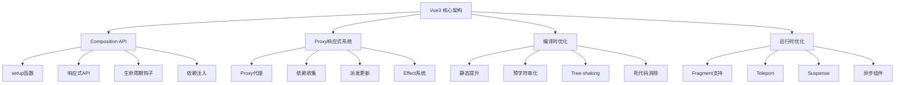

# Vue3 核心特性与原理深度解析

Vue3 是Vue.js的重大版本升级，带来了全新的Composition API、更强大的响应式系统和显著的性能提升。

## 🎯 Vue3 核心架构



## 🚀 核心特性详解

### 🔄 [Proxy响应式系统](./reactivity.md)

Vue3采用Proxy重写了响应式系统，解决了Vue2的诸多限制：

**核心优势**：
- **完整的对象监听**：支持属性添加/删除、数组索引变化
- **更好的性能**：懒响应式，按需代理
- **原生数据结构支持**：Map、Set、WeakMap、WeakSet
- **更少的内存占用**：不需要为每个属性创建闭包

```javascript
// Vue3 响应式核心实现
function reactive(target) {
  return new Proxy(target, {
    get(target, key, receiver) {
      // 依赖收集
      track(target, 'get', key)
      return Reflect.get(target, key, receiver)
    },
    set(target, key, value, receiver) {
      const result = Reflect.set(target, key, value, receiver)
      // 触发更新
      trigger(target, 'set', key, value)
      return result
    },
    has(target, key) {
      track(target, 'has', key)
      return Reflect.has(target, key)
    },
    deleteProperty(target, key) {
      const result = Reflect.deleteProperty(target, key)
      trigger(target, 'delete', key)
      return result
    }
  })
}
```

**与Vue2对比**：

| 特性 | Vue2 | Vue3 |
|------|------|------|
| 实现方式 | Object.defineProperty | Proxy |
| 数组索引 | ❌ 不支持 | ✅ 原生支持 |
| 对象属性添加 | ❌ 需要$set | ✅ 原生支持 |
| Map/Set | ❌ 不支持 | ✅ 完整支持 |
| 性能 | 初始化时递归 | 懒代理，按需响应式 |

### 🎨 [Composition API](./composition-api.md)

Composition API是Vue3的核心特性，提供了更灵活的逻辑组织方式：

**核心概念**：
- **setup函数**：组件的入口点
- **响应式API**：ref、reactive、computed、watch
- **生命周期钩子**：onMounted、onUpdated等
- **依赖注入**：provide/inject

```javascript
// Composition API 示例
<script setup>
import { ref, computed, watch, onMounted } from 'vue'

// 响应式数据
const count = ref(0)
const message = ref('Hello Vue3')

// 计算属性
const doubleCount = computed(() => count.value * 2)

// 监听器
watch(count, (newVal, oldVal) => {
  console.log(`count changed from ${oldVal} to ${newVal}`)
})

// 生命周期
onMounted(() => {
  console.log('Component mounted')
})

// 方法
const increment = () => {
  count.value++
}
</script>
```

**优势对比**：

```javascript
// Options API - 按选项类型组织
export default {
  data() { return { count: 0 } },
  computed: { doubleCount() { return this.count * 2 } },
  methods: { increment() { this.count++ } },
  mounted() { console.log('mounted') }
}

// Composition API - 按逻辑功能组织
export default {
  setup() {
    const { count, doubleCount, increment } = useCounter()
    const { data, loading, error } = useAsyncData()
    
    return { count, doubleCount, increment, data, loading, error }
  }
}
```

### ⚡ [性能优化](./performance.md)

Vue3在性能方面实现了显著提升：

**编译时优化**：
- **静态提升**：静态元素提升到渲染函数外部
- **预字符串化**：大量静态元素预字符串化
- **死代码消除**：编译时移除永不执行的代码
- **Tree-shaking**：按需打包，减少包体积

```javascript
// 静态提升示例
// 源码
<template>
  <div>
    <h1>Static Title</h1>
    <p>{{ message }}</p>
  </div>
</template>

// 编译结果
const _hoisted_1 = h('h1', 'Static Title')

function render() {
  return h('div', [
    _hoisted_1,              // 复用静态节点
    h('p', this.message)
  ])
}
```

**运行时优化**：
- **Fragment支持**：无需根元素包装
- **更高效的diff算法**：最长递增子序列算法
- **组件级别的优化**：v-memo、异步组件等

**性能提升数据**：
- 包体积减少 **41%**
- 初始渲染快 **55%**
- 更新性能提升 **133%**
- 内存使用减少 **54%**

## 🔧 高级特性

### 1. Fragment 多根节点

```vue
<template>
  <!-- Vue3 支持多个根节点 -->
  <header>Header</header>
  <main>Main Content</main>
  <footer>Footer</footer>
</template>
```

### 2. Teleport 传送门

```vue
<template>
  <div>
    <h3>Tooltips with Vue 3 Teleport</h3>
    <div>
      <MyModal />
    </div>
  </div>
</template>

<script setup>
// MyModal.vue
<template>
  <teleport to="body">
    <div class="modal">
      <p>This will be rendered in body</p>
    </div>
  </teleport>
</template>
</script>
```

### 3. Suspense 异步组件

```vue
<template>
  <Suspense>
    <template #default>
      <AsyncComponent />
    </template>
    <template #fallback>
      <div>Loading...</div>
    </template>
  </Suspense>
</template>

<script setup>
const AsyncComponent = defineAsyncComponent(() => import('./AsyncComponent.vue'))
</script>
```

### 4. 自定义渲染器

```javascript
import { createRenderer } from '@vue/runtime-core'

const { render } = createRenderer({
  createElement(tag) {
    return { tag }
  },
  setElementText(el, text) {
    el.text = text
  },
  insert(el, parent) {
    parent.children = parent.children || []
    parent.children.push(el)
  }
})

// 可以渲染到任何平台
render(h('div', 'hello'), { children: [] })
```

## 🎯 最佳实践

### 1. 响应式数据选择

```javascript
// 基本类型使用 ref
const count = ref(0)
const message = ref('hello')

// 对象类型使用 reactive
const state = reactive({
  user: { name: 'Alice', age: 25 },
  settings: { theme: 'dark' }
})

// 大型不可变数据使用 shallowRef
const largeData = shallowRef({ /* 大量数据 */ })

// 不需要响应式的对象使用 markRaw
const chart = markRaw(new Chart())
```

### 2. 组合式函数设计

```javascript
// 可复用的组合式函数
function useCounter(initialValue = 0) {
  const count = ref(initialValue)
  const increment = () => count.value++
  const decrement = () => count.value--
  const reset = () => count.value = initialValue
  
  return {
    count: readonly(count),
    increment,
    decrement,
    reset
  }
}

// 异步数据获取
function useAsyncData(url) {
  const data = ref(null)
  const loading = ref(false)
  const error = ref(null)
  
  const fetchData = async () => {
    loading.value = true
    error.value = null
    try {
      const response = await fetch(url)
      data.value = await response.json()
    } catch (err) {
      error.value = err
    } finally {
      loading.value = false
    }
  }
  
  return { data, loading, error, fetchData }
}
```

### 3. 性能优化技巧

```javascript
// 使用 v-memo 缓存昂贵的子树
<template>
  <div v-memo="[valueA, valueB]">
    <ExpensiveChild :value="valueA" />
    <AnotherChild :value="valueB" />
  </div>
</template>

// 异步组件代码分割
const AsyncComponent = defineAsyncComponent({
  loader: () => import('./HeavyComponent.vue'),
  loadingComponent: LoadingComponent,
  errorComponent: ErrorComponent,
  delay: 200,
  timeout: 3000
})

// 合理使用 watchEffect
watchEffect((onInvalidate) => {
  const token = performAsyncOperation()
  
  onInvalidate(() => {
    token.cancel()
  })
})
```

## 🔄 迁移指南

### 从Vue2到Vue3的关键变化

1. **全局API变化**：
```javascript
// Vue2
import Vue from 'vue'
Vue.use(plugin)

// Vue3
import { createApp } from 'vue'
const app = createApp({})
app.use(plugin)
```

2. **生命周期钩子**：
```javascript
// Vue2 → Vue3
beforeCreate → setup()
created → setup()
beforeMount → onBeforeMount
mounted → onMounted
beforeUpdate → onBeforeUpdate
updated → onUpdated
beforeDestroy → onBeforeUnmount
destroyed → onUnmounted
```

3. **响应式API**：
```javascript
// Vue2
data() {
  return { count: 0 }
}

// Vue3
setup() {
  const count = ref(0)
  return { count }
}
```

Vue3通过Composition API、Proxy响应式系统和编译时优化，为现代前端开发提供了更强大、更灵活的解决方案。深入理解这些核心特性，将帮助你构建出高性能、可维护的Vue3应用。
