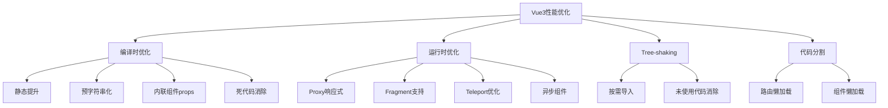

# Vue3 性能优化深度解析

Vue3在性能方面相比Vue2有了显著提升，本文深入解析Vue3的性能优化原理和实践技巧。

## 🚀 Vue3性能提升概览

Vue3相比Vue2的性能提升：
- **包体积减少41%**：Tree-shaking支持
- **初始渲染快55%**：优化的创建过程
- **更新性能提升133%**：更高效的diff算法
- **内存使用减少54%**：更好的内存管理



## 🔧 编译时优化

### 1. 静态提升（Static Hoisting）

Vue3编译器会将静态元素提升到渲染函数外部：

```javascript
// 源码
<template>
  <div>
    <h1>Static Title</h1>
    <p>{{ message }}</p>
    <span>Another static text</span>
  </div>
</template>

// Vue2编译结果
function render() {
  return h('div', [
    h('h1', 'Static Title'),        // 每次都创建
    h('p', this.message),
    h('span', 'Another static text') // 每次都创建
  ])
}

// Vue3编译结果（静态提升）
const _hoisted_1 = h('h1', 'Static Title')
const _hoisted_2 = h('span', 'Another static text')

function render() {
  return h('div', [
    _hoisted_1,                     // 复用静态节点
    h('p', this.message),
    _hoisted_2                      // 复用静态节点
  ])
}
```

### 2. 预字符串化（Pre-stringification）

大量连续静态元素会被预字符串化：

```javascript
// 源码
<template>
  <div>
    <h1>Title 1</h1>
    <h2>Title 2</h2>
    <h3>Title 3</h3>
    <h4>Title 4</h4>
    <h5>Title 5</h5>
    <p>{{ message }}</p>
  </div>
</template>

// 编译结果
const _hoisted_1 = createStaticVNode(
  "<h1>Title 1</h1><h2>Title 2</h2><h3>Title 3</h3><h4>Title 4</h4><h5>Title 5</h5>",
  5
)

function render() {
  return h('div', [
    _hoisted_1,
    h('p', this.message)
  ])
}
```

### 3. 内联组件Props优化

```javascript
// 源码
<template>
  <Comp :foo="bar" baz="qux" />
</template>

// Vue2编译结果
function render() {
  return h(Comp, {
    foo: this.bar,
    baz: 'qux'
  })
}

// Vue3编译结果（内联优化）
function render() {
  return h(Comp, {
    foo: this.bar,
    baz: 'qux'
  }, null, 8 /* PROPS */, ['foo']) // 标记动态props
}
```

### 4. 死代码消除

```javascript
// 条件编译优化
<template>
  <div>
    <div v-if="false">Never rendered</div>
    <div v-if="true">Always rendered</div>
  </div>
</template>

// 编译结果直接消除永远不会执行的分支
function render() {
  return h('div', [
    h('div', 'Always rendered')
  ])
}
```

## ⚡ 运行时优化

### 1. Proxy响应式系统

```javascript
// Vue2 - Object.defineProperty
function defineReactive(obj, key, val) {
  const dep = new Dep()
  Object.defineProperty(obj, key, {
    get() {
      dep.depend()
      return val
    },
    set(newVal) {
      val = newVal
      dep.notify()
    }
  })
}

// Vue3 - Proxy
function reactive(target) {
  return new Proxy(target, {
    get(target, key, receiver) {
      track(target, 'get', key)
      return Reflect.get(target, key, receiver)
    },
    set(target, key, value, receiver) {
      const result = Reflect.set(target, key, value, receiver)
      trigger(target, 'set', key, value)
      return result
    }
  })
}
```

**性能优势**：
- 懒响应式：只有被访问的属性才会被代理
- 更好的数组支持：原生支持数组索引变化
- 更少的内存占用：不需要为每个属性创建闭包

### 2. Fragment支持

```javascript
// Vue2 - 必须有根元素
<template>
  <div> <!-- 额外的包装元素 -->
    <header>Header</header>
    <main>Main</main>
    <footer>Footer</footer>
  </div>
</template>

// Vue3 - 支持Fragment
<template>
  <header>Header</header>
  <main>Main</main>
  <footer>Footer</footer>
</template>
```

### 3. 更高效的Diff算法

Vue3的diff算法采用了最长递增子序列算法：

```javascript
// Vue3 patchKeyedChildren 核心逻辑
function patchKeyedChildren(
  c1: VNode[],
  c2: VNode[],
  container: RendererElement,
  parentAnchor: RendererNode | null,
  parentComponent: ComponentInternalInstance | null,
  parentSuspense: SuspenseBoundary | null,
  isSVG: boolean,
  slotScopeIds: string[] | null,
  optimized: boolean
) {
  let i = 0
  const l2 = c2.length
  let e1 = c1.length - 1
  let e2 = l2 - 1

  // 1. 从头开始同步
  while (i <= e1 && i <= e2) {
    const n1 = c1[i]
    const n2 = c2[i]
    if (isSameVNodeType(n1, n2)) {
      patch(n1, n2, container, null, parentComponent, parentSuspense, isSVG, slotScopeIds, optimized)
    } else {
      break
    }
    i++
  }

  // 2. 从尾开始同步
  while (i <= e1 && i <= e2) {
    const n1 = c1[e1]
    const n2 = c2[e2]
    if (isSameVNodeType(n1, n2)) {
      patch(n1, n2, container, null, parentComponent, parentSuspense, isSVG, slotScopeIds, optimized)
    } else {
      break
    }
    e1--
    e2--
  }

  // 3. 处理新增节点
  if (i > e1) {
    if (i <= e2) {
      const nextPos = e2 + 1
      const anchor = nextPos < l2 ? c2[nextPos].el : parentAnchor
      while (i <= e2) {
        patch(null, c2[i], container, anchor, parentComponent, parentSuspense, isSVG, slotScopeIds, optimized)
        i++
      }
    }
  }
  // 4. 处理删除节点
  else if (i > e2) {
    while (i <= e1) {
      unmount(c1[i], parentComponent, parentSuspense, true)
      i++
    }
  }
  // 5. 处理复杂情况 - 使用最长递增子序列
  else {
    const s1 = i
    const s2 = i
    
    // 构建新节点的key映射
    const keyToNewIndexMap: Map<string | number | symbol, number> = new Map()
    for (i = s2; i <= e2; i++) {
      const nextChild = c2[i]
      if (nextChild.key != null) {
        keyToNewIndexMap.set(nextChild.key, i)
      }
    }

    // 计算最长递增子序列
    const increasingNewIndexSequence = moved
      ? getSequence(newIndexToOldIndexMap)
      : EMPTY_ARR
    
    // 移动和挂载节点
    for (i = toBePatched - 1; i >= 0; i--) {
      const nextIndex = s2 + i
      const nextChild = c2[nextIndex]
      const anchor = nextIndex + 1 < l2 ? c2[nextIndex + 1].el : parentAnchor
      
      if (newIndexToOldIndexMap[i] === 0) {
        // 新节点，挂载
        patch(null, nextChild, container, anchor, parentComponent, parentSuspense, isSVG, slotScopeIds, optimized)
      } else if (moved) {
        // 需要移动
        if (j < 0 || i !== increasingNewIndexSequence[j]) {
          move(nextChild, container, anchor, MoveType.REORDER)
        } else {
          j--
        }
      }
    }
  }
}
```

## 🌳 Tree-shaking优化

### 1. 按需导入

```javascript
// ❌ 全量导入
import Vue from 'vue'

// ✅ 按需导入
import { createApp, ref, computed } from 'vue'

// 只有使用的API会被打包
const app = createApp({
  setup() {
    const count = ref(0)
    const doubled = computed(() => count.value * 2)
    return { count, doubled }
  }
})
```

### 2. 编译器优化标记

```javascript
// Vue3使用PatchFlags标记动态内容
export const enum PatchFlags {
  TEXT = 1,                    // 动态文本
  CLASS = 1 << 1,             // 动态class
  STYLE = 1 << 2,             // 动态style
  PROPS = 1 << 3,             // 动态props
  FULL_PROPS = 1 << 4,        // 有key的props
  HYDRATE_EVENTS = 1 << 5,    // 事件监听器
  STABLE_FRAGMENT = 1 << 6,   // 稳定的fragment
  KEYED_FRAGMENT = 1 << 7,    // 有key的fragment
  UNKEYED_FRAGMENT = 1 << 8,  // 无key的fragment
  NEED_PATCH = 1 << 9,        // 需要patch
  DYNAMIC_SLOTS = 1 << 10,    // 动态插槽
  DEV_ROOT_FRAGMENT = 1 << 11, // 开发模式根fragment
  HOISTED = -1,               // 静态提升
  BAIL = -2                   // 退出优化
}

// 编译结果示例
function render() {
  return h('div', [
    h('p', this.message, 1 /* TEXT */),           // 只有文本是动态的
    h('div', { class: this.cls }, null, 2 /* CLASS */), // 只有class是动态的
  ])
}
```

## 🎯 实际优化技巧

### 1. 组件优化

```javascript
// ✅ 使用defineAsyncComponent进行代码分割
const AsyncComponent = defineAsyncComponent(() => import('./HeavyComponent.vue'))

// ✅ 使用shallowRef优化大型不可变数据
const largeList = shallowRef([...])

// ✅ 使用markRaw标记不需要响应式的对象
const chart = markRaw(new Chart(canvas, config))

// ✅ 合理使用v-memo缓存子树
<template>
  <div v-memo="[valueA, valueB]">
    <!-- 只有valueA或valueB改变时才重新渲染 -->
    <ExpensiveChild :value="valueA" />
    <AnotherChild :value="valueB" />
  </div>
</template>
```

### 2. 列表渲染优化

```javascript
// ✅ 使用key优化列表更新
<template>
  <div v-for="item in list" :key="item.id">
    {{ item.name }}
  </div>
</template>

// ✅ 虚拟滚动处理大列表
<template>
  <VirtualList
    :items="largeList"
    :item-height="50"
    :container-height="400"
  >
    <template #default="{ item }">
      <div>{{ item.name }}</div>
    </template>
  </VirtualList>
</template>
```

### 3. 计算属性优化

```javascript
// ✅ 避免在计算属性中进行副作用操作
const processedData = computed(() => {
  // 纯函数，无副作用
  return data.value.map(item => ({
    ...item,
    processed: true
  }))
})

// ✅ 使用缓存优化昂贵计算
const expensiveValue = computed(() => {
  const cache = new Map()
  return items.value.map(item => {
    if (cache.has(item.id)) {
      return cache.get(item.id)
    }
    const result = expensiveCalculation(item)
    cache.set(item.id, result)
    return result
  })
})
```

### 4. 事件处理优化

```javascript
// ✅ 使用事件委托
<template>
  <div @click="handleClick">
    <button data-action="save">保存</button>
    <button data-action="cancel">取消</button>
    <button data-action="delete">删除</button>
  </div>
</template>

<script setup>
const handleClick = (event) => {
  const action = event.target.dataset.action
  switch (action) {
    case 'save':
      save()
      break
    case 'cancel':
      cancel()
      break
    case 'delete':
      deleteItem()
      break
  }
}
</script>
```

## 📊 性能监控

### 1. 使用Vue DevTools

```javascript
// 开发环境启用性能追踪
app.config.performance = true
```

### 2. 自定义性能监控

```javascript
// 组件渲染时间监控
const RenderTimePlugin = {
  install(app) {
    app.mixin({
      beforeCreate() {
        this._renderStart = performance.now()
      },
      mounted() {
        const renderTime = performance.now() - this._renderStart
        console.log(`${this.$options.name} render time: ${renderTime}ms`)
      }
    })
  }
}
```

### 3. 内存泄漏检测

```javascript
// 监控组件实例数量
let componentCount = 0

export default {
  setup() {
    componentCount++
    console.log(`Component instances: ${componentCount}`)
    
    onUnmounted(() => {
      componentCount--
      console.log(`Component instances: ${componentCount}`)
    })
  }
}
```

Vue3通过编译时和运行时的双重优化，实现了显著的性能提升。合理运用这些优化技巧，能够构建出高性能的Vue3应用。
