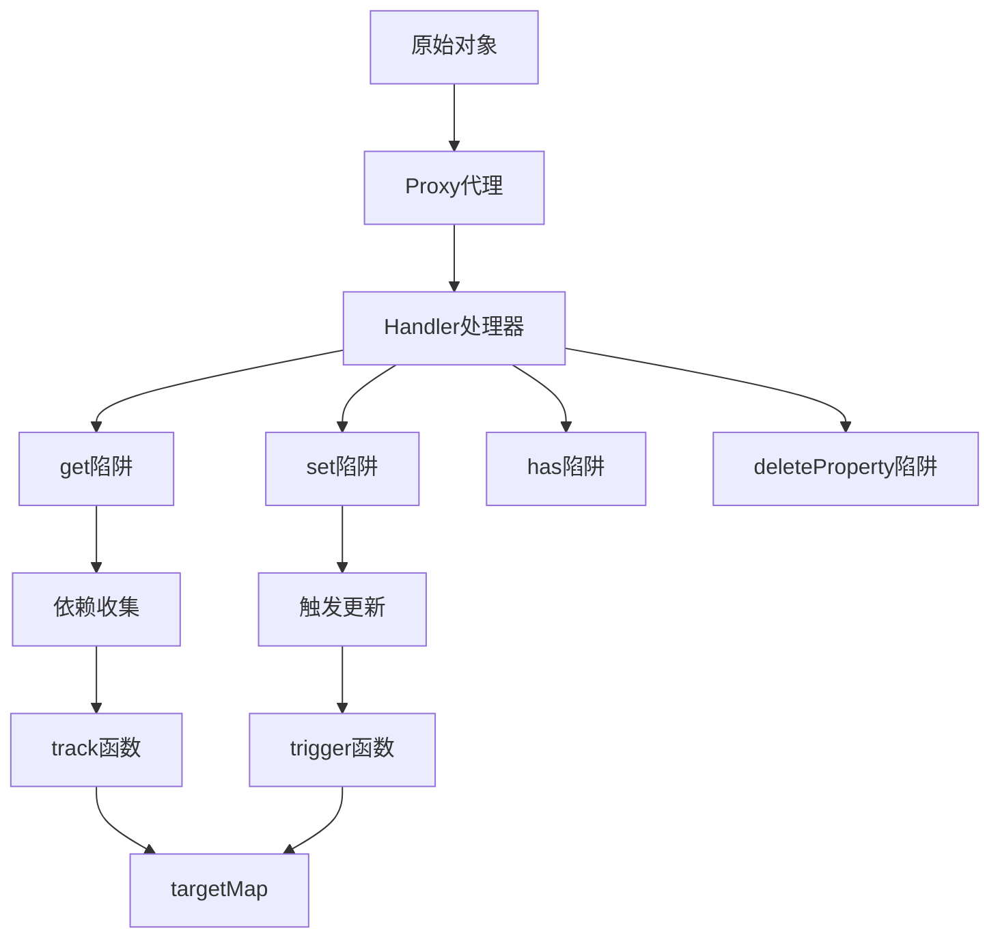

# Vue3 Proxy响应式系统深度解析

Vue3采用Proxy重写了响应式系统，解决了Vue2中Object.defineProperty的诸多限制，提供了更强大和灵活的响应式能力。

## 🎯 Proxy响应式系统概述

Vue3响应式系统的核心改进：
- **Proxy代理**：可以拦截对象的所有操作
- **懒响应式**：只有被访问的属性才会被代理
- **更好的数组支持**：原生支持数组索引和length变化
- **Map/Set支持**：支持更多数据结构



## 🏗️ 核心实现原理

### 1. reactive 函数

创建响应式对象的核心函数：

```javascript
// 响应式对象的WeakMap缓存
const reactiveMap = new WeakMap()
const readonlyMap = new WeakMap()

function reactive(target) {
  // 如果target是只读对象，直接返回
  if (isReadonly(target)) {
    return target
  }
  
  return createReactiveObject(
    target,
    false,
    mutableHandlers,
    mutableCollectionHandlers,
    reactiveMap
  )
}

function createReactiveObject(
  target,
  isReadonly,
  baseHandlers,
  collectionHandlers,
  proxyMap
) {
  // 只能代理对象类型
  if (!isObject(target)) {
    return target
  }
  
  // 如果已经是代理对象，直接返回
  if (target[ReactiveFlags.RAW] && 
      !(isReadonly && target[ReactiveFlags.IS_REACTIVE])) {
    return target
  }
  
  // 检查缓存
  const existingProxy = proxyMap.get(target)
  if (existingProxy) {
    return existingProxy
  }
  
  // 只有白名单内的对象类型才能被代理
  const targetType = getTargetType(target)
  if (targetType === TargetType.INVALID) {
    return target
  }
  
  // 创建Proxy
  const proxy = new Proxy(
    target,
    targetType === TargetType.COLLECTION ? collectionHandlers : baseHandlers
  )
  
  // 缓存代理对象
  proxyMap.set(target, proxy)
  return proxy
}
```

### 2. Proxy处理器

#### 基础对象处理器

```javascript
const mutableHandlers = {
  get(target, key, receiver) {
    // 处理特殊key
    if (key === ReactiveFlags.IS_REACTIVE) {
      return !isReadonly
    } else if (key === ReactiveFlags.IS_READONLY) {
      return isReadonly
    } else if (key === ReactiveFlags.RAW) {
      return target
    }
    
    const targetIsArray = isArray(target)
    
    // 数组的特殊方法处理
    if (!isReadonly && targetIsArray && hasOwn(arrayInstrumentations, key)) {
      return Reflect.get(arrayInstrumentations, key, receiver)
    }
    
    const res = Reflect.get(target, key, receiver)
    
    // 内置Symbol和非字符串key不进行依赖收集
    if (isSymbol(key) ? builtInSymbols.has(key) : isNonTrackableKeys(key)) {
      return res
    }
    
    // 依赖收集
    if (!isReadonly) {
      track(target, TrackOpTypes.GET, key)
    }
    
    // 浅响应式直接返回
    if (shallow) {
      return res
    }
    
    // ref自动解包
    if (isRef(res)) {
      const shouldUnwrap = !targetIsArray || !isIntegerKey(key)
      return shouldUnwrap ? res.value : res
    }
    
    // 深度响应式：递归代理子对象
    if (isObject(res)) {
      return isReadonly ? readonly(res) : reactive(res)
    }
    
    return res
  },
  
  set(target, key, value, receiver) {
    let oldValue = target[key]
    
    // 处理只读和ref
    if (isReadonly(oldValue) && isRef(oldValue) && !isRef(value)) {
      return false
    }
    
    if (!shallow) {
      if (!isShallow(value) && !isReadonly(value)) {
        oldValue = toRaw(oldValue)
        value = toRaw(value)
      }
      if (!isArray(target) && isRef(oldValue) && !isRef(value)) {
        oldValue.value = value
        return true
      }
    }
    
    const hadKey = isArray(target) && isIntegerKey(key) 
      ? Number(key) < target.length 
      : hasOwn(target, key)
    
    const result = Reflect.set(target, key, value, receiver)
    
    // 如果target是原始对象（不是原型链上的）
    if (target === toRaw(receiver)) {
      if (!hadKey) {
        // 新增属性
        trigger(target, TriggerOpTypes.ADD, key, value)
      } else if (hasChanged(value, oldValue)) {
        // 修改属性
        trigger(target, TriggerOpTypes.SET, key, value, oldValue)
      }
    }
    
    return result
  },
  
  has(target, key) {
    const result = Reflect.has(target, key)
    if (!isSymbol(key) || !builtInSymbols.has(key)) {
      track(target, TrackOpTypes.HAS, key)
    }
    return result
  },
  
  deleteProperty(target, key) {
    const hadKey = hasOwn(target, key)
    const oldValue = target[key]
    const result = Reflect.deleteProperty(target, key)
    
    if (result && hadKey) {
      trigger(target, TriggerOpTypes.DELETE, key, undefined, oldValue)
    }
    
    return result
  },
  
  ownKeys(target) {
    track(target, TrackOpTypes.ITERATE, isArray(target) ? 'length' : ITERATE_KEY)
    return Reflect.ownKeys(target)
  }
}
```

#### 集合类型处理器

```javascript
const mutableCollectionHandlers = {
  get: createInstrumentationGetter(false, false)
}

function createInstrumentationGetter(isReadonly, shallow) {
  const instrumentations = shallow
    ? shallowInstrumentations
    : isReadonly
      ? readonlyInstrumentations
      : mutableInstrumentations
      
  return (target, key, receiver) => {
    if (key === ReactiveFlags.IS_REACTIVE) {
      return !isReadonly
    } else if (key === ReactiveFlags.IS_READONLY) {
      return isReadonly
    } else if (key === ReactiveFlags.RAW) {
      return target
    }
    
    return Reflect.get(
      hasOwn(instrumentations, key) && key in target
        ? instrumentations
        : target,
      key,
      receiver
    )
  }
}

// Map/Set的方法重写
const mutableInstrumentations = {
  get(key) {
    return get(this, key)
  },
  
  get size() {
    return size(this)
  },
  
  has,
  add,
  set,
  delete: deleteEntry,
  clear,
  forEach: createForEach(false, false)
}

function get(target, key) {
  target = toRaw(target)
  const rawKey = toRaw(key)
  
  if (key !== rawKey) {
    track(target, TrackOpTypes.GET, key)
  }
  track(target, TrackOpTypes.GET, rawKey)
  
  const { has } = getProto(target)
  const wrap = isShallow ? toShallow : isReadonly ? toReadonly : toReactive
  
  if (has.call(target, key)) {
    return wrap(target.get(key))
  } else if (has.call(target, rawKey)) {
    return wrap(target.get(rawKey))
  } else if (target !== toRaw(receiver)) {
    target.get(key)
  }
}
```

### 3. 依赖收集系统

#### track 函数

```javascript
// 全局依赖映射表
type KeyToDepMap = Map<any, Dep>
const targetMap = new WeakMap<any, KeyToDepMap>()

// 当前活跃的effect
let activeEffect: ReactiveEffect | undefined

function track(target: object, type: TrackOpTypes, key: unknown) {
  if (shouldTrack && activeEffect) {
    let depsMap = targetMap.get(target)
    if (!depsMap) {
      targetMap.set(target, (depsMap = new Map()))
    }
    
    let dep = depsMap.get(key)
    if (!dep) {
      depsMap.set(key, (dep = createDep()))
    }
    
    trackEffects(dep)
  }
}

function trackEffects(dep: Dep) {
  let shouldTrack = false
  if (effectTrackDepth <= maxMarkerBits) {
    if (!newTracked(dep)) {
      dep.n |= trackOpBit
      shouldTrack = !wasTracked(dep)
    }
  } else {
    shouldTrack = !dep.has(activeEffect!)
  }
  
  if (shouldTrack) {
    dep.add(activeEffect!)
    activeEffect!.deps.push(dep)
  }
}
```

#### trigger 函数

```javascript
function trigger(
  target: object,
  type: TriggerOpTypes,
  key?: unknown,
  newValue?: unknown,
  oldValue?: unknown,
  oldTarget?: Map<unknown, unknown> | Set<unknown>
) {
  const depsMap = targetMap.get(target)
  if (!depsMap) {
    return
  }
  
  let deps: (Dep | undefined)[] = []
  
  if (type === TriggerOpTypes.CLEAR) {
    // 清空操作，触发所有依赖
    deps = [...depsMap.values()]
  } else if (key === 'length' && isArray(target)) {
    // 数组length变化
    depsMap.forEach((dep, key) => {
      if (key === 'length' || key >= (newValue as number)) {
        deps.push(dep)
      }
    })
  } else {
    // 普通SET操作
    if (key !== void 0) {
      deps.push(depsMap.get(key))
    }
    
    // 添加操作的特殊处理
    switch (type) {
      case TriggerOpTypes.ADD:
        if (!isArray(target)) {
          deps.push(depsMap.get(ITERATE_KEY))
          if (isMap(target)) {
            deps.push(depsMap.get(MAP_KEY_ITERATE_KEY))
          }
        } else if (isIntegerKey(key)) {
          deps.push(depsMap.get('length'))
        }
        break
      case TriggerOpTypes.DELETE:
        if (!isArray(target)) {
          deps.push(depsMap.get(ITERATE_KEY))
          if (isMap(target)) {
            deps.push(depsMap.get(MAP_KEY_ITERATE_KEY))
          }
        }
        break
      case TriggerOpTypes.SET:
        if (isMap(target)) {
          deps.push(depsMap.get(ITERATE_KEY))
        }
        break
    }
  }
  
  if (deps.length === 1) {
    if (deps[0]) {
      triggerEffects(deps[0])
    }
  } else {
    const effects: ReactiveEffect[] = []
    for (const dep of deps) {
      if (dep) {
        effects.push(...dep)
      }
    }
    triggerEffects(createDep(effects))
  }
}
```

### 4. ReactiveEffect 类

```javascript
export class ReactiveEffect<T = any> {
  active = true
  deps: Dep[] = []
  parent: ReactiveEffect | undefined = undefined
  
  constructor(
    public fn: () => T,
    public scheduler?: EffectScheduler | null,
    scope?: EffectScope
  ) {
    recordEffectScope(this, scope)
  }
  
  run() {
    if (!this.active) {
      return this.fn()
    }
    
    let parent: ReactiveEffect | undefined = activeEffect
    let lastShouldTrack = shouldTrack
    
    while (parent) {
      if (parent === this) {
        return
      }
      parent = parent.parent
    }
    
    try {
      this.parent = activeEffect
      activeEffect = this
      shouldTrack = true
      
      trackOpBit = 1 << ++effectTrackDepth
      
      if (effectTrackDepth <= maxMarkerBits) {
        initDepMarkers(this)
      } else {
        cleanupEffect(this)
      }
      
      return this.fn()
    } finally {
      if (effectTrackDepth <= maxMarkerBits) {
        finalizeDepMarkers(this)
      }
      
      trackOpBit = 1 << --effectTrackDepth
      activeEffect = this.parent
      shouldTrack = lastShouldTrack
      this.parent = undefined
      
      if (this.deferStop) {
        this.stop()
      }
    }
  }
  
  stop() {
    if (activeEffect === this) {
      this.deferStop = true
    } else if (this.active) {
      cleanupEffect(this)
      if (this.onStop) {
        this.onStop()
      }
      this.active = false
    }
  }
}
```

## 🔄 数组响应式处理

Vue3对数组的响应式处理更加完善：

```javascript
const arrayInstrumentations = createArrayInstrumentations()

function createArrayInstrumentations() {
  const instrumentations: Record<string, Function> = {}
  
  // 会改变数组长度的方法
  ;(['push', 'pop', 'shift', 'unshift', 'splice'] as const).forEach(key => {
    instrumentations[key] = function (this: unknown[], ...args: unknown[]) {
      pauseTracking()
      const res = (toRaw(this) as any)[key].apply(this, args)
      resetTracking()
      return res
    }
  })
  
  // 查找方法的特殊处理
  ;(['includes', 'indexOf', 'lastIndexOf'] as const).forEach(key => {
    instrumentations[key] = function (this: unknown[], ...args: unknown[]) {
      const arr = toRaw(this) as any
      for (let i = 0, l = this.length; i < l; i++) {
        track(arr, TrackOpTypes.GET, i + '')
      }
      
      const res = arr[key](...args)
      if (res === -1 || res === false) {
        return arr[key](...args.map(toRaw))
      } else {
        return res
      }
    }
  })
  
  return instrumentations
}
```

## 🎯 性能优化特性

### 1. 懒响应式

```javascript
// 只有被访问的属性才会被代理
const state = reactive({
  a: 1,
  b: {
    c: 2,
    d: {
      e: 3
    }
  }
})

// 只有访问 state.b 时，b对象才会被代理
console.log(state.b.c) // 此时 b 和 b.d 都被代理
```

### 2. 依赖优化

```javascript
// 使用位运算优化依赖标记
const maxMarkerBits = 30
let effectTrackDepth = 0
let trackOpBit = 1

// 新依赖标记
const newTracked = (dep: Dep): boolean => (dep.n & trackOpBit) > 0
// 已跟踪标记  
const wasTracked = (dep: Dep): boolean => (dep.w & trackOpBit) > 0
```

## 🔍 与Vue2对比

| 特性 | Vue2 | Vue3 |
|------|------|------|
| 实现方式 | Object.defineProperty | Proxy |
| 数组索引 | ❌ 不支持 | ✅ 原生支持 |
| 对象属性添加 | ❌ 需要$set | ✅ 原生支持 |
| Map/Set | ❌ 不支持 | ✅ 完整支持 |
| 性能 | 初始化时递归 | 懒代理，按需响应式 |
| 内存占用 | 每个属性都有闭包 | 更少的内存开销 |

Vue3的Proxy响应式系统解决了Vue2的诸多限制，提供了更强大、更灵活的响应式能力。
