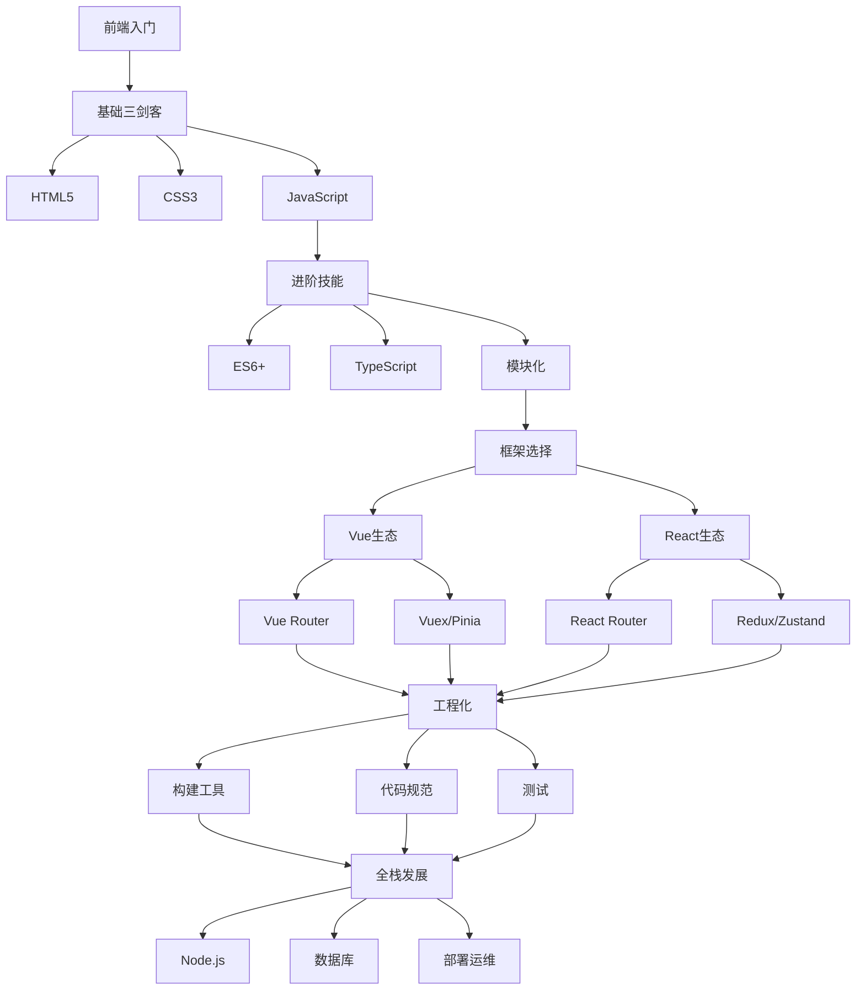
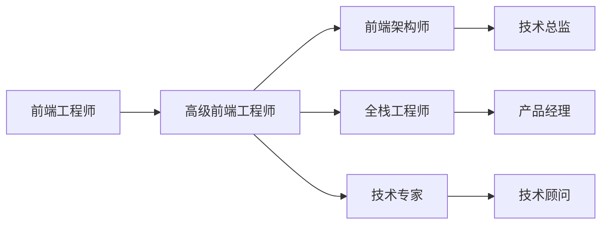

# 学习指南

欢迎来到前端学习指南！这里为你提供系统化的学习路径和职业发展建议。

## 🗺️ 前端学习路线图



## 📚 学习阶段规划

### 🌱 入门阶段 (0-3个月)

**目标**：掌握前端基础技能，能够制作静态网页

**学习内容**：
- HTML5 语义化标签和表单
- CSS3 布局（Flexbox、Grid）
- JavaScript 基础语法和 DOM 操作
- 响应式设计原理
- Git 版本控制基础

**实战项目**：
- 个人简历页面
- 响应式企业官网
- 简单的计算器应用

**时间分配**：
```
HTML/CSS: 40%
JavaScript: 50%
工具使用: 10%
```

### 🚀 进阶阶段 (3-8个月)

**目标**：掌握现代前端开发技能，能够开发交互式应用

**学习内容**：
- ES6+ 新特性（箭头函数、Promise、async/await）
- 选择一个主流框架（Vue 或 React）
- 状态管理和路由系统
- 前端工程化工具（Webpack/Vite）
- API 调用和数据处理

**实战项目**：
- Todo 应用
- 天气查询应用
- 简单的博客系统
- 电商产品展示页

**时间分配**：
```
框架学习: 50%
工程化: 20%
项目实战: 30%
```

### 💼 专业阶段 (8个月+)

**目标**：具备企业级开发能力，能够独立负责项目

**学习内容**：
- TypeScript 类型系统
- 性能优化技巧
- 测试驱动开发
- 微前端架构
- 全栈开发技能

**实战项目**：
- 完整的后台管理系统
- 移动端 H5 应用
- 小程序开发
- 开源项目贡献

**时间分配**：
```
深度学习: 40%
项目实战: 40%
技术分享: 20%
```

## 🎯 技术栈选择建议

### Vue vs React 选择指南

| 对比维度 | Vue | React |
|----------|-----|-------|
| 学习曲线 | 平缓，容易上手 | 较陡，需要 JSX 基础 |
| 生态系统 | 官方维护，统一性好 | 社区驱动，选择丰富 |
| 性能表现 | 优秀的响应式系统 | 虚拟 DOM 优化 |
| 企业应用 | 国内企业广泛使用 | 国外企业主流选择 |
| 发展趋势 | 稳步发展 | 持续创新 |

### 推荐学习路径

**如果你是初学者**：
- 推荐从 Vue 开始，语法更接近传统 HTML/CSS
- 官方文档完善，中文资源丰富
- 渐进式框架，可以逐步引入

**如果你有编程基础**：
- 可以直接学习 React，生态更丰富
- 函数式编程思想，有助于提升编程能力
- 就业机会相对更多

## 📖 学习资源推荐

### 📚 在线教程

**免费资源**：
- [MDN Web 文档](https://developer.mozilla.org/) - 权威的 Web 技术文档
- [菜鸟教程](https://www.runoob.com/) - 适合初学者的中文教程
- [慕课网](https://www.imooc.com/) - 实战项目课程
- [B站前端视频](https://www.bilibili.com/) - 丰富的免费视频教程

**付费课程**：
- [极客时间](https://time.geekbang.org/) - 深度技术课程
- [拉勾教育](https://kaiwu.lagou.com/) - 就业导向课程
- [掘金小册](https://juejin.cn/books) - 精品技术小册

### 🛠️ 实践平台

- [CodePen](https://codepen.io/) - 在线代码编辑器
- [JSFiddle](https://jsfiddle.net/) - 快速原型开发
- [GitHub](https://github.com/) - 代码托管和开源项目
- [Netlify](https://www.netlify.com/) - 静态网站部署

### 📰 技术资讯

- [掘金](https://juejin.cn/) - 中文技术社区
- [SegmentFault](https://segmentfault.com/) - 问答社区
- [知乎前端话题](https://www.zhihu.com/topic/19550901) - 深度讨论
- [前端早读课](https://mp.weixin.qq.com/s) - 每日技术资讯

## 💡 学习方法建议

### 🎯 高效学习策略

1. **理论与实践结合**
   - 学习新概念后立即动手实践
   - 通过项目巩固理论知识
   - 遇到问题主动查阅文档

2. **循序渐进**
   - 不要急于求成，扎实基础
   - 每个阶段都要有明确目标
   - 定期回顾和总结学习成果

3. **主动输出**
   - 写技术博客记录学习过程
   - 参与开源项目贡献代码
   - 在社区分享经验和心得

### 📝 学习计划模板

```markdown
## 本周学习计划 (第X周)

### 学习目标
- [ ] 掌握 React Hooks 基础用法
- [ ] 完成 Todo 应用开发
- [ ] 学习 CSS Grid 布局

### 时间安排
- 周一-周三：React Hooks 理论学习 (3小时/天)
- 周四-周五：Todo 应用实战开发 (4小时/天)
- 周末：CSS Grid 布局练习 (2小时/天)

### 学习资源
- React 官方文档 Hooks 章节
- 《React 进阶实践指南》
- CSS Grid 完全指南

### 输出成果
- React Hooks 学习笔记
- Todo 应用源码和演示
- CSS Grid 布局案例
```

## 🚀 职业发展路径

### 技术发展方向



### 能力模型

**初级前端工程师 (0-2年)**
- 熟练掌握 HTML/CSS/JavaScript
- 能够使用主流框架开发应用
- 具备基本的调试和问题解决能力

**中级前端工程师 (2-5年)**
- 深入理解框架原理和最佳实践
- 具备性能优化和工程化经验
- 能够独立负责模块或小型项目

**高级前端工程师 (5年+)**
- 具备架构设计和技术选型能力
- 能够指导团队和制定技术规范
- 对业务有深入理解，能够提供技术解决方案

## 🎯 学习建议总结

1. **制定明确的学习计划**，分阶段设定目标
2. **注重基础知识**，不要急于学习高级特性
3. **多做项目实践**，理论结合实际应用
4. **保持学习热情**，前端技术更新快速
5. **建立技术社交**，参与社区讨论和分享
6. **关注行业动态**，了解技术发展趋势

---

记住：**学习是一个持续的过程，保持好奇心和耐心，你一定能成为优秀的前端工程师！**
