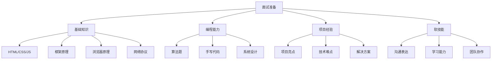

# 面试宝典

前端面试全方位指南，助你在技术面试中脱颖而出！

## 🎯 面试准备策略



## 📚 知识体系

### 🔰 基础面试题

掌握前端核心技术的常见问题：

- **HTML/CSS**：语义化、布局、响应式设计
- **JavaScript**：闭包、原型链、异步编程
- **Vue 框架**：响应式原理、生命周期、组件通信
- **React 框架**：虚拟 DOM、Hooks、状态管理
- **浏览器原理**：渲染流程、性能优化
- **网络协议**：HTTP/HTTPS、缓存策略

### 💻 手写代码题

提升编程实现能力：

- **JavaScript 实现**：防抖节流、深拷贝、Promise
- **数据结构**：栈、队列、链表、树
- **设计模式**：单例、观察者、发布订阅
- **工具函数**：类型判断、数组操作、字符串处理

### 🏗️ 项目实战

展示项目经验和解决问题的能力：

- **项目架构设计**：技术选型、模块划分
- **技术难点攻克**：性能优化、兼容性处理
- **团队协作经验**：代码规范、版本控制
- **问题解决方案**：Bug 定位、优化策略

### 🧮 算法与数据结构

计算机基础能力考察：

- **数组与字符串**：双指针、滑动窗口
- **链表与树**：遍历、递归、动态规划
- **排序与搜索**：时间复杂度分析
- **动态规划**：状态转移、最优子结构

## 🎪 面试类型分析

### 技术面试 (60-70%)

```javascript
// 常见考察点
const interviewTopics = {
  基础知识: ['HTML5', 'CSS3', 'ES6+', 'TypeScript'],
  框架原理: ['Vue响应式', 'React虚拟DOM', '状态管理'],
  工程化: ['Webpack', 'Vite', '代码规范', '性能优化'],
  算法题: ['数组操作', '字符串处理', '树的遍历'],
  手写代码: ['防抖节流', 'Promise实现', '深拷贝']
};
```

### 项目面试 (20-30%)

重点考察：
- 项目背景和业务理解
- 技术选型和架构设计
- 遇到的技术难点
- 性能优化实践
- 团队协作经验

### 行为面试 (10-20%)

软技能评估：
- 学习能力和成长经历
- 沟通表达和团队合作
- 问题解决思路
- 职业规划和发展目标

## 📊 不同级别面试重点

| 级别 | 基础知识 | 编程能力 | 项目经验 | 架构设计 |
|------|----------|----------|----------|----------|
| 初级 (0-2年) | ⭐⭐⭐⭐⭐ | ⭐⭐⭐ | ⭐⭐ | ⭐ |
| 中级 (2-5年) | ⭐⭐⭐⭐ | ⭐⭐⭐⭐ | ⭐⭐⭐⭐ | ⭐⭐⭐ |
| 高级 (5年+) | ⭐⭐⭐ | ⭐⭐⭐⭐ | ⭐⭐⭐⭐⭐ | ⭐⭐⭐⭐⭐ |

## 🎯 备考时间规划

### 短期冲刺 (1-2周)
- 复习基础知识点
- 刷高频面试题
- 准备项目介绍
- 模拟面试练习

### 中期准备 (1-2个月)
- 系统学习框架原理
- 练习算法和手写代码
- 整理项目亮点
- 提升编程能力

### 长期规划 (3-6个月)
- 深入学习新技术
- 参与开源项目
- 积累项目经验
- 建立技术博客

## 💡 面试技巧

### 回答问题的 STAR 法则
- **Situation**：描述情况背景
- **Task**：说明任务目标
- **Action**：详述采取的行动
- **Result**：总结最终结果

### 技术问题回答策略
1. **理解题意**：确认问题的具体要求
2. **分析思路**：说明解决问题的思路
3. **编写代码**：逐步实现解决方案
4. **测试验证**：考虑边界情况和测试用例
5. **优化改进**：讨论时间复杂度和优化方案

## 🔗 推荐资源

### 在线刷题平台
- [LeetCode](https://leetcode.cn/)
- [牛客网](https://www.nowcoder.com/)
- [CodeTop](https://codetop.cc/)

### 面试题库
- [前端面试题汇总](https://github.com/haizlin/fe-interview)
- [JavaScript 面试题](https://github.com/lydiahallie/javascript-questions)
- [React 面试题](https://github.com/sudheerj/reactjs-interview-questions)

### 技术博客
- [阮一峰的网络日志](http://www.ruanyifeng.com/blog/)
- [张鑫旭的博客](https://www.zhangxinxu.com/)
- [掘金前端](https://juejin.cn/frontend)

---

选择左侧导航开始你的面试准备之旅！记住：**机会总是留给有准备的人**！
